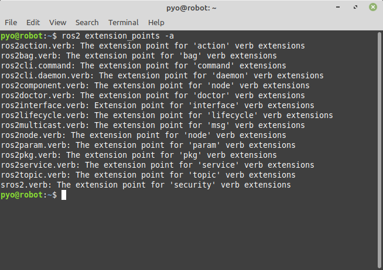
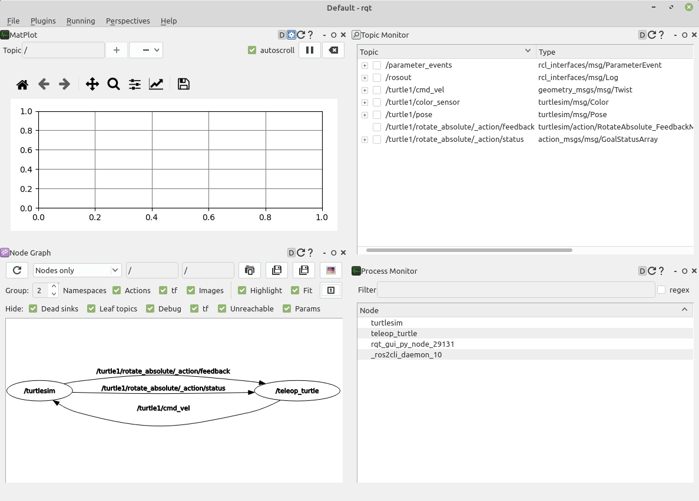
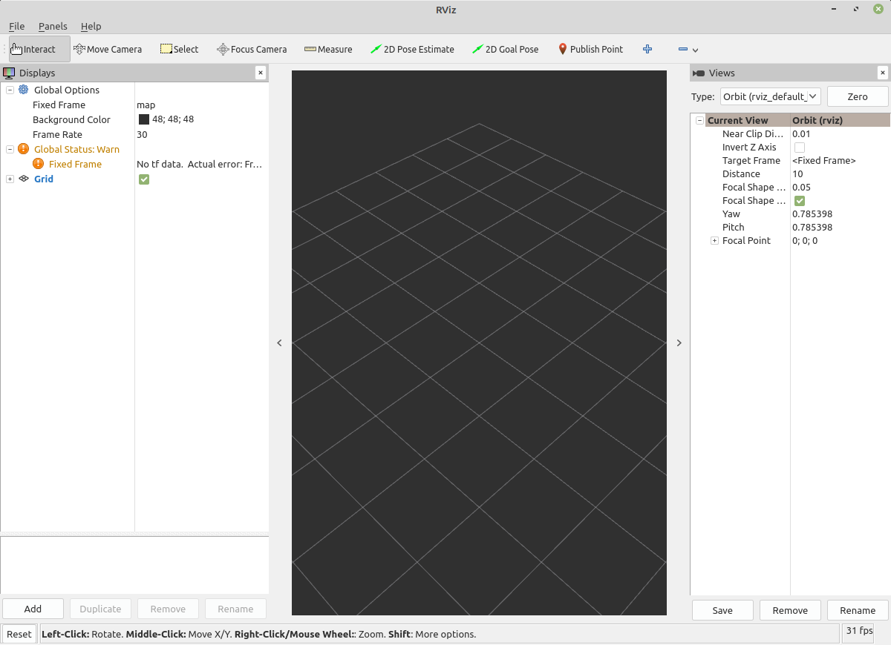
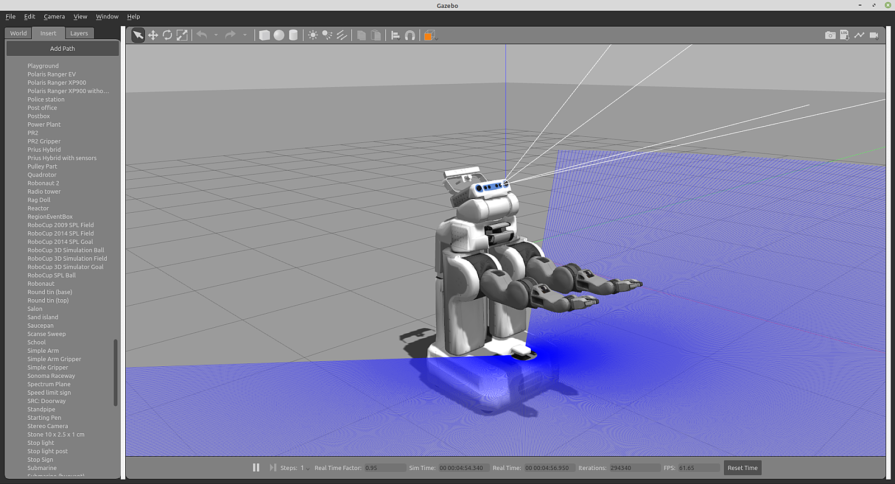

# Chapter 14: ROS 2 도구와 CLI 명령어
## 01. ROS 도구
- ROS를 사용하는 목적으로 Ch05 에서 다룬 특징들을 나열하겠지만 개인적으로 그 중에서 1가지를 최우선으로 선정하자면 로봇 개발에 필요한 다양한 개발 도구가 있기 때문이라고 말할 수 있다.
- ROS의 도구들은 ROS 커뮤니티에서 다년간의 의견과 경험이 녹아져 만들어진 필수 도구들이라고 볼 수 있다.
- ROS 1에서 2에 이르기 까지 ROS에서는 로봇 개발에 필요한 다양한 개발 도구를 제공하기에 이를 이용하여 자신의 로봇 프로젝트의 코드들을 쉽게 빌드하고 패키징하고 패키지와 노드를 관리하고 데이터들을 기록, 재생, 관리하고 CLI 형태, GUI 형태의 프로그램을 만들고 3차원 시뮬레이터안에서 자유자재로 디버깅하고 테스트할 수 있었다.
- 또한 필요하다면 이 툴들을 이용하는 것뿐만이 아니라 이 툴들을 기반으로 처음부터 만들 필요 없이 개선 또는 신규 툴 자성이 가능하여 로봇 개발의 효율성 향상에 크게 도움이 되고 있다.
- ROS 도구에는 그 형태에 따라 아래와 같이 4가지로 분류할 수 있다.
- CLI 형태의 Command-Line Tools, GUI 형태의 RQt, 3차원 시각화툴인 RViz, 3차원 시뮬레이터 Gazebo이다.
- 이들의 각 사용법 및 응용 방법은 앞서서 일부 다루었으며 이어지는 강좌에서 하나씩 실습을 통해 익혀가도록 하겠다.

### 1-1. CLI 기반 Command-Line Tools
- 명령어 기반의 툴로 로봇 억세스 및 거의 모든 ROS 기능을 다룬다.
- 개발환경 및 빌드, 테스트 툴(colcon)
- 데이터를 기록, 재생, 관리하는 툴(ros2bag)
- colcon, ros2bag 외 20여 가지



### 1-2. GUI 기반 RQt
- 그래픽 인터페이스 개발을 위한 Qt 기반 프레임워크 제공
- 노드와 그들 사이의 연결 정보 표시(rqt_graph)
- 속도, 전압 또는 시간이 지남에 따라 변화하는 데이터를 플로팅(rqt_plot)
- rqt_graph, rqt_plot 외 30여 가지



### 1-3. RViz
- 3차원 시각화툴
- 레이저, 카메라 등의 센서 데이터를 시각화
- 로봇 외형과 계획된 동작을 표현



### 1-4. Gazebo
- 3차원 시뮬레이터
- 물리 엔진을 탑재, 로봇, 센서, 환경 모델 등을 지원
- 타 시뮬레이터 대비 ROS와의 높은 호환성



## 02. ROS 2 CLI 명령어
- ROS 2 CLI는 Command Line Interface이라는 약자로 터미널창에서 지정 텍스트를 입력하여 사용하는 명령어를 말한다.
- ROS 2 CLI 명령어는 ROS 2 Foxy 기준으로 20여개가 제공되고 있다.
- 참고로 ros2cli 개발 작업은 Ubuntu의 개발사인 Canonical와 TSC 멤버이자 ROS 2 Tooling Working Group의 리딩 역할을 맡고 있는 AWS RoboMaker의 개발자들이 참여하고 있다.
```
> action
> bag
> component
> daemon
> doctor
> extension_points
> extensions
> interface
> launch
> lifecycle
> multicast
> node
> param
> pkg
> run
> security
> service
> topic
> wtf
```

## 03. ROS 2 CLI 사용법
- ROS 2 CLI 사용법에 대해서는 지난 강좌에서 이미 다루었다.
- 기본적으로는 터미널 창에서 각 명령어가 하나씩 수행되는 방식이며 터미널창에 다음과 같이 `ros2`를 시작으로 verbs와 sub-verbs 그리고 options, arguments 들을 입력하는 방식이다.
```
ros2 [verbs] [sub-verbs] [options] [arguments]
```
- 여기서 `ros2` 라는 것은 `ros2cli`만의 고유한 `entry-point`으로 다른 명령어들과 구분을 해주기 위해 존재한다.
- 그 뒤 `run`, `launch`, `node` 와 같이 verbs가 그 뒤를 이어 특정 툴을 선택하게 되고 그 뒤에 sub-verbs(예: `node`인 경우 `info`, `list`)를 지정하게 된다.
- 그 뒤에는 선택적으로 옵션 및 매개변수를 입력하여 특정 명령을 수행하게 된다.
- 윈도우즈와 같은 GUI 중심의 운영체제를 사용하다가 리눅스와 같은 CLI 중심의 운영체제를 처음접하고 사용할 때에는 이 명령어가 어색하고 어렵게 느껴지지만 사용하다보면 GUI보다 간결하고 빨라서 곧 CLI 명령어에 익숙하게 될 것이다.
- 특히, 터미널에서 auto-completion을 지원하기에 탭(tab) 키를 적절히 사용하면 외우지 않고도 빠르게 명령어들을 찾고 실행할 수 있다.
- 예를 들어 노드 목록 확인 명령어인 `ros2 node list`를 사용한다는 것은 3개의 단어를 하나의 셋트로 외우는 사람은 거의 드물다.
- 터미널 창에서 `ros2cli`만의 고유한 `entry-point`인 `ros2`를 입력하고 한 칸의 스페이스를 입력한 후 탭(tab)키를 눌러 그 뒤에 이어서 사용할 수 있는 명령어를 하나 선정하여 입력한다.
- 이 때에도 `n`을 누른 후 탭(tab)을 눌러 자동완성을 통하여 모든 명령어를 다 타이핑할 필요없이 입력 가능하다.
- 그 뒤 다시 한 칸의 스페이스를 입력한 후 탭(tab)키를 눌러 마지막 명령어 옵션을 완성하면 된다.
- 앞으로 이어지는 강좌에서도 `ros2cli`를 자주 언급하고 실습에 포함시킬 것이다.
- `ros2cli` 사용법에 익숙해졌을 때 여러분은 비로서 ROS 2에 빠져들었다고 볼 수 있다.
```
$ ros2 [tab] [tab] [tab] [tab] ...
```
- 그리고 사용 방법이 어렵다면 구글링하기 전에 아래 예제와 같이 -h(--help) 옵션을 사용하면 간단한 사용법이 나오므로 참고하도록 하자.
```
$ ros2 -h
$ ros2 node -h
$ ros2 node info -h
```

## 04. ROS 2 CLI 종류와 각 sub-verbs의 기능
- 20여가지의 ROS 2 CLI 툴을 익히는 방법은 모두 나열하고 외우는 것이 아닌 필요할 때 적절히 사용하면서 체득하는 것이라고 생각한다.
- 그래서 본 강좌에서는 각 챕터별로 필요시 CLI 툴을 이용한 실습을 포함시키고 있다.
- 아래 20여개의 ROS 2 CLI 툴은 이미 몇몇 강좌에서 다룬적도 있고 다루지 않은 명령어도 있다.
- 현재 강좌가 014편까지 진행하면서 기본적인 ROS 2 CLI 툴은 설명하였고 아래의 부가적인 명령어들은 앞으로 진행할 강좌에서 필요시 하나씩 추가할 예정이다.
- 일단 아래에는 필요할 때 찾아보기 편하도록 모두 담았다.
- 다시 한번 강조하지만 모두 외울 필요 없이 필요시 체득하도록 하자.

### 4-1. ROS 2 실행 명령어

|ros2cli + [verbs]|[arguments]|기능|
|:---:|:---:|:---:|
|`ros2 run`|`<package> <executable>`|특정 패키지의 특정 노드 실행 (1개 노드)|
|`ros2 launch`|`<package> <launch-file>`|특정 패키지의 특정 런치 파일 실행 (0~복수 개 노드)|

#### 참고 예제
```
$ ros2 run turtlesim turtlesim_node

$ ros2 launch demo_nodes_cpp talker_listener.launch.py
```

### 4-2. ROS 2 정보 명령어
|ros2cli + [verbs]|[sub-verbs]|기능|
|:---:|:---:|:---:|
|ros2 pkg|create|새로운 ROS 2 패키지 생성|
|ros2 pkg|executables|지정 패키지의 실행 파일 목록 출력|
|ros2 pkg|list|사용 가능한 패키지 목록 출력|
|ros2 pkg|prefix|지정 패키지의 저장 위치 출력|
|ros2 pkg|xml|지정 패키지의 패키지 정보 파일(xml) 출력|
|ros2 node|info|실행 중인 노드 중 지정한 노드의 정보 출력|
|ros2 node|list|실행 중인 모든 노드의 목록 출력|
|ros2 topic|bw|지정 토픽의 대역폭 측정|
|ros2 topic|delay|지정 초픽의 지연시간 측정|
|ros2 topic|echo|지정 토픽의 데이터 출력|
|ros2 topic|find|지정 타입을 사용하는 토픽 이름 출력|
|ros2 topic|hz|지정 토픽의 주기 측정|
|ros2 topic|info|지정 토픽의 정보 출력|
|ros2 topic|list|사용 가능한 토픽 목록 출력|
|ros2 topic|pub|지정 토픽의 토픽 발행|
|ros2 topic|type|지정 토픽의 토픽 타입 출력|
|ros2 service|call|지정 서비스의 서비스 요청 전달|
|ros2 service|find|지정 서비스 타입의 서비스 출력|
|ros2 service|list|사용 가능한 서비스 목록 출력|
|ros2 service|type|지정 서비스의 타입 출력|
|ros2 action|info|지정 액션의 정보 출력|
|ros2 action|list|사용 가능한 액션 목록 출력|
|ros2 action|senf_goal|지정 액션의 액션 목표 전송|
|ros2 interface|list|사용 가능한 모든 인터페이스 목록 출력|
|ros2 interface|package|특정 패키지에서 사용 가능한 인터페이스 목록|
|ros2 interface|packages|인터페이스 패키지들의 목록 출력|
|ros2 interface|proto|지정 패키지의 프로토타입 출력|
|ros2 interface|show|지정 인터페이스의 데이터 형태 출력|
|ros2 param|delete|지정 파라미터 삭제|
|ros2 param|describe|지정 파라미터 정보 출력|
|ros2 param|dump|지정 파라미터 저장|
|ros2 param|get|지정 파라미터 읽기|
|ros2 param|list|사용 가능한 파라미터 목록 출력|
|ros2 param|set|지정 파라미터 쓰기|
|ros2 bag|info|저장된 rosbag 정보 출력|
|ros2 bag|play|rosbag 기록|
|ros2 bag|record|rosbag 재생|

#### 참고 예제
```
$ ros2 pkg executables turtlesim

$ ros2 node info /turtlesim

$ ros2 topic echo /turtle1/cmd_vel

$ ros2 service call /turtle1/set_pen turtlesim/srv/SetPen "{r: 255, g: 255, b: 255, width: 10}"

$ ros2 action send_goal /turtle1/rotate_absolute turtlesim/action/RotateAbsolute "{theta: 1.5708}"

$ ros2 interface show turtlesim/srv/Spawn.srv

$ ros2 param set /turtlesim background_r 148

$ ros2 bag record /turtle1/cmd_vel
```

### 4-3. ROS 2 기능 보조 명령어

|ros2cli + [verb]|[sub-verbs] (options)|기능|
|:---:|:---:|:---:|
|ros2 extensions|(-a) <br> (-v)|ros2cli의 extension 목록 출력|
|ros2 extension_points|(-a) <br> (-v)|ros2cli의 extension point 목록 출력|
|ros2 daemon|start <br> status <br> stop|daemon 시작 <br> daemon 상태 보기 <br> daemon 정지|
|ros2 multicast|receive <br> send|multicast 수신 <br> multicast 전송|
|ros2 doctor|hello <br> (-r) <br> (-rf) <br> (-iw)|ROS 설정 및 네트워크ㅡ 패키지 버전, rmw 미들웨어 등과 같은 잠재적 문제를 확인하는 도구|
|ros2 wtf|hello <br> (-r) <br> (-rf) <br> (-iw)|doctor와 동일함 <br> (WTF: Where's The Fire)|
|ros2 lifecycle|get <br> list <br> nodes <br> set|라이브사이클 정보 출력 <br> 지정 노드의 사용 가능한 상태천이 목록 출력 <br> 라이프사이클을 사용하는 노드 목록 출력 <br> 라이프사이클 상태 전환 트리거|
|ros2 component|list <br> load <br> standalone <br> types <br> unload|실행 중인 컨테이너와 컴포넌트 목록 출력 <br> 지정 컨테이너 노드의 특정 컴포넌트 실행 <br> 표준 컨테이너 노드로 특정 컴포넌트 실행 <br> 사용 가능한 컴포넌트들의 목록 출력 <br> 지정 컴포넌트의 실행 중지|
|ros2 security|create_key <br> create_keystore <br> create_permission <br> generate_artifacts <br> generate_policy <br> list_keys|보안키 생성 <br> 보안키 저장소 생성 <br> 보안 허가 파일 생성 <br>보안 정책 파일을 이용하여 보안키 및 보안 허가 파일 생성 <br> 보안 정책 파일(policy.xml) 생성 <br> 보안키 목록 출력|

#### 참고 예제
```
$ ros2 extensions -a 

$ ros2 extension_points -a

$ ros2 daemon start

$ ros2 multicast send

$ ros2 doctor -r

$ ros2 wtf -r

$ ros2 lifecycle list lc_talker

$ ros2 component load /ComponentManager composition composition::Talker

$ ros2 security create_key demo_keys /talker_listener/listener
```

## 05. 지속 개발되고 있는 ROS 2 CLI
- ROS 2 CLI는 해를 거듭 할 수록 툴의 안정성이 높아지고 있으며 커뮤니티의 의견을 수용하여 그 종류가 다양해지고 있다.
- 현재까지 개발된 ROS 2 CLI 관련 정보는 리포지토리를 확인하기 바라며 Ubuntu의 개발사인 Canonical가 공개한 CLI Cheats Sheet 자료도 사용법을 익히는데에 도움이되니 참고하도록 하자.

[출처] 014 ROS 2 도구와 CLI 명령어 (오픈소스 소프트웨어 & 하드웨어: 로봇 기술 공유 카페 (오로카)) | 작성자 표윤석
