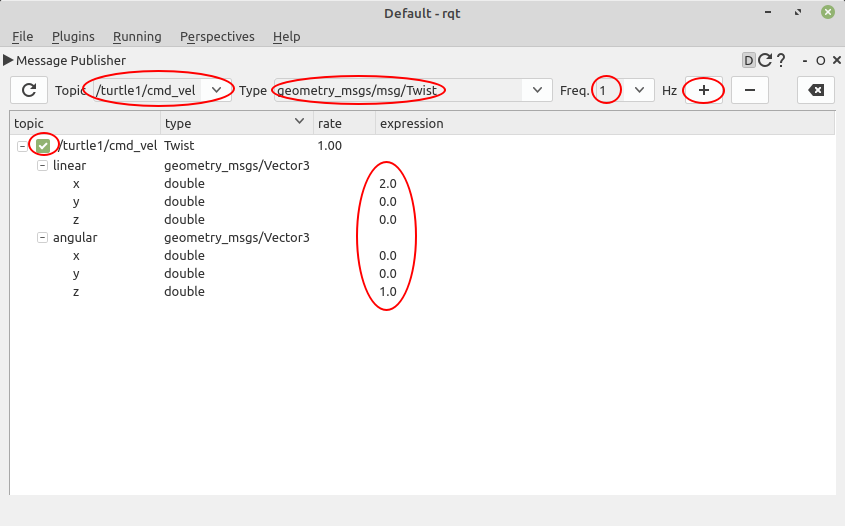

# Chapter 15: ROS의 종합 GUI 툴 RQt
## 01. ROS의 종합 GUI 툴 RQt
- RQt는 플러그인 형태로 다양한 도구와 인터페이스를 구현할 수 있는 그래픽 사용자 인터페이스(GUI, Graphical User Interface) 프레임 워크이며 다양한 목적의 GUI 툴을 모아둔 ROS의 종합 GUI 툴박스이다.
- ROS 1 개발 초기에는 rxbag, rxplot, rxgraph와 같이 토픽을 저장하거나, 시간축 계열의 데이터를 2차 플롯 창에 표시하거나, 노드들 간의 상관 관계를 그래프로 표시하는 등 다양한 목적으로 GUI 툴이 개발되어 사용되었다.
- 그 이후 GUI 툴들이 많아지고 비슷한 기능을 수행하는 경우도 많아 공통의 API를 사용하여 개발 편의성을 높이고자 ROS 1의 Fuerte 버전부터는 RQt이라는 이름으로 기존의 rxbag, rxplot, rxgraph 과 같은 GUI 프로그램들이 rqt_bag, rqt_plot, rqt_graph 등의 이름의 플러그인 형태로 ROS의 종합 GUI 툴로 통합되어 사용 가능해졌다.
- 현재의 RQt는 그림과 같이 기존의 모든 ROS의 GUI 도구를 RQt 내에서 도킹 가능한 창으로 실행할 수 있기도 하고 각 GUI 툴들은 독립 실행 방법으로 사용할 수도 있다.
- 참고로 RQt의 플러그인은 ROS 1 Noetic 기준으로 30개가 디폴트로 설치되는데 ROS 2 Foxy 기준으로는 14개가 디폴트로 설치되고 Robot Tools의 2가지를 추가로 설치 가능하다.
- ROS 2 포팅 작업은 현재 진행형(PickNik사를 시작으로 현재는 Amazon이 주도함)으로 ROS 2 Foxy 기준으로 사용 가능한 RQt 플러그인 종류는 다음과 같다.
- 이전에 다룬 ROS의 CLI 툴과 비슷한 기능이 꾀 많은데 CLI툴과 GUI 툴은 각기 목적에 따라 편한 것을 사용하면 된다.

- Topics:
    - Message Publisher
    - Message Type Browser
    - Topic Monitor
- Services:
    - Service Caller
    - Service Type Browser
- Actions:
    - Action Type Browser
- Introspection:
    - Node Graph
    - Process Monitor
- Configuration:
    - Dynamic Reconfigure
- Logging:
    - Console
- Miscellaneous Tools:
    - Python Console
    - Shell
- Visualization:
    - Image View
    - Plot
- Robot Tools:
    - Dianostics Viewer
    - Robot Steering


## 02. RQt 프레임워크
- 위에서 설명하였듯이 RQt는 프레임워크라고 정의할 수 있다.
- 즉, ROS 환경에서 사용할 수 있는 GUI 개발에 있어서 공통으로 필요한 부분들을 API형태로 제공하기 때문에 ROS와 연동하는 GUI 툴을 쉽게 개발할 수 있고 RQt 플러그인 형태의 개발이 되기 때문에 개발된 각 플러그인은 RQt에서 통합하여 사용할 수도 있게 된다.
- 예를 들어 GUI에서 흔히 사용되는 실행과 종료시 필요한 API 기능은 어느 GUI 프로그램이나 비슷할 것이고 ROS의 노드들과 연동 및 토픽 사용등은 모두 비슷할 것이다.
- 이러한 부분들을 RQt에서는 API 형태로 제공하기 때문에 편하고 빠르게 GUI 툴을 만들 수 있다.
- 그리고 RQt라는 것은 ROS + Qt의 합성어로 Qt가 이용됨을 알 수 있다.
- RQt는 Qt를 기반으로 하고 있기에 Qt의 특징인 크로스 플랫폼과 다양한 프로그래밍 언어 지원이라는 특징을 그대로 반영하고 있다.
- 즉, Linux, macOS, Windows 에서 사용 가능하며 C++ 및 Python(PyQt, PySide)를 이용하여 프로그래밍할 수 있다.

## 03. RQt 설치 및 실행
- 일반적인 설치 방법으로 ROS 2를 설치하였다면 RQt는 이미 포함되어 설치되었을 것이다.
- 만약 최소 설치 등 다른 방법으로 설치를 하였다면 아래와 같이 추가적으로 설치를 하면된다.
- 참고로 기본 설치에서는 robot-monitor나 robot-steering, 디버그 심볼 패티지(dbgsym)가 미포함 상태인데 이것들마져 함께 설치된다.
- 필요시 설치해주자.
```
$ sudo apt install ros-foxy-rqt*

ros-foxy-rqt
ros-foxy-rqt-action
ros-foxy-rqt-common-plugins
ros-foxy-rqt-console
ros-foxy-rqt-graph
ros-foxy-rqt-gui
ros-foxy-rqt-gui-cpp
ros-foxy-rqt-gui-cpp-dbgsym
ros-foxy-rqt-gui-py
ros-foxy-rqt-image-view
ros-foxy-rqt-image-view-dbgsym
ros-foxy-rqt-msg
ros-foxy-rqt-plot
ros-foxy-rqt-publisher
ros-foxy-rqt-py-common
ros-foxy-rqt-py-common-dbgsym
ros-foxy-rqt-py-console
ros-foxy-rqt-reconfigure
ros-foxy-rqt-robot-monitor
ros-foxy-rqt-robot-steering
ros-foxy-rqt-service-caller
ros-foxy-rqt-shell
ros-foxy-rqt-srv
ros-foxy-rqt-top
ros-foxy-rqt-topic
```
- RQt의 실행은 3가지 방법이 있다.

#### 첫번째 실행 방법
- RQt를 실행하여 메뉴에서 원하는 플러그인을 골라서 실행하는 것이다.
- 간단히 설명하면 아래와 같이 터미널 창에서 `rqt`로 RQt를 실행하면 하나의 GUI 툴이 실행되는데 아래 그림과 같이 `Plugins` 메뉴에서 원하는 플러그인을 선택하면 해당 플러그가 화면에 표시될 것이다.
- 예를 들어 `Plugins` -> `Topics` -> `Topic Monitor`를 선택하면 그 아래 그림과 같이 현재 개발환경에서 실행된 노드들의 토픽 데이터를 확인 가능하게 된다.
- 추가로 다른 플러그인을 불러오면 위의 그림과 같이 같은 창의 새로운 도커 형태로 추가하고 위치를 변경하거나 크기를 조절하거나 실행한 플러그인을 삭제할 수도 있다.
- 첫번째 실행 방법은 `Main Window`를 불러와서 `Dock Widget` 형태로 플러그인(plugin)들을 실행시키는 방법이기에 가장 RQt 답게 사용하는 방법이라고 생각한다.
```
$ rqt
```


#### 두번재 실행 방법
- `ros2 run` 명령어를 이용하여 각 rqt 관련 패키지들의 노드들을 하나씩 실행시키는 방법이다.
- RQt 플러그인이 상당히 많아서 자주 쓰는 한두개의 플러그인을 사용할 때 이용하고 alias로 설정하여 쓸 때 사용된다.
```
$ ros2 run rqt_msg rqt_msg
```

#### 세번째 실행 방법
- 단축 명령어를 이용하는 것이다.
- 아래와 같이 미리 지정된 명령어가 있는데 이전 강좌들에서 소개되었던 방법이다.
- 단 많지는 않다.
- 비슷한 단축 명령어가 필요하다면 2번 실행 방법을 alias 단축하여 만들어 두면 동일한 효과를 가져올 수 있다.
```
$ rqt_graph
```
```
$ rqt_topic
```

## 04. RQt 플러그인의 종류
- RQt 플러그인의 종류는 아래와 같이 10종류에 30여개의 플러그인으로 구성되어 있다.
- 아래의 각 설명은 ROS 1을 기준으로 하고 있고 현재는 이중 16개만 사용 가능하고 나머지 플러그인은 추후 하나씩 포팅되어 포함될 것이라고 생각된다.
- 물론 사용 빈도가 떨어지거나 기능 중복이 있는 몇개의 플러그인은 통폐합될 예정이다.

1. 액션 (Actions)
    - Action Type Browser: Action 타입의 데이터 구조를 확인

2. 구성 (Configuration)
    - Dynamic Reconfigure: 노드들에서 제공하는 파라미터 값 확인 및 변경
    - Launch: roslaunch 의 GUI 버전

3. 내성 (Introspection)
    - Node Graph: 실행 중인 노드들의 관계 및 토픽을 확인 가능한 그래프 뷰
    - Package Graph: 노드의 의존 관계를 표시하는 그래프 뷰
    - Process Monitor: 실행 중인 노드들의 CPU 사용률, 메모리 사용율, 스레드 수 등을 확인

4. 로깅 (Logging)
    - Bag: ROS 데이터 로깅
    - Console: 노드들에서 발생되는 경고(Warning), 에러(Error) 등의 메시지를 확인
    - Logger Level: ROS의 Debug, Info, Warn, Error, Fatal 로거 정보를 선택하여 표시

5. 다양한 툴 (Miscellaneous Tools)
    - Python Console: 파이썬 콘솔 화면
    - Shell: 쉘(shell)을 구동
    - Web: 웹 브라우저를 구동

6. 로봇 (Robot)
    - 사용하는 로봇에 따라 계기판(dashboard) 등의 플러그인을 이곳에 추가

7. 로봇툴 (Robot Tools)
    - Controller Manager: 컨트롤러 관리에 필요한 플러그인
    - Diagnostic Viewer: 로봇 디바이스의 경고 및 에러 확인
    - Moveit! Monitor: 로봇 매니퓰레이터 툴인 Moveit! 데이터 확인
    - Robot Steering: 로봇에게 병진 속도와 회전 속도를 토픽으로 발행하는 GUI 툴
    - Runtime Monitor: 실시간으로 노드들에서 발생되는 에러 및 경고를 확인

8. 서비스 (Services)
    - Service Caller: 실행 중인 서비스 서버에 접속하여 서비스를 요청
    - Service Type Browser: 서비스 타입의 데이터 구조를 확인

9. 토픽 (Topics)
    - Message Publisher: 메시지 발행
    - Message Type Browser: 메시지 타입의 데이터 구조 확인
    - Topic Monitor: 토픽 목록 확인 및 사용자가 선택한 토픽의 정보를 확인

10. 시각화 (Visualization)
    - Image View: 카메라의 영상 데이터를 확인
    - Navigation Viewer: 로봇 네비게이션의 위치 및 목표지점 확인
    - Plot: 2차원 데이터 플롯 GUI 플러그인, 2차원 데이터의 도식화
    - Pose View: 현재 TF의 위치 및 모델의 위치 표시
    - RViz: 3차원 시각화 툴인 RViz 플러그인
    - TF Tree: tf 관계를 트리로 나타내는 그래프 뷰

## 05. RQt 사용 예시
- 위에서 다양한 RQt의 플러그인 종류에 대해 알아봤다.
- 이 강좌에서 모든 플러그인을 알아보기에는 내용이 많으니 사용 빈도가 높은 중요 플러그인의 사용 방법을 예로 실습을 해보도록 하겠다.
- 지난 `014 ROS 2 도구와 CLI 명령어` 강좌에서 다룬 CLI 툴의 사용 방법을 참고하여 CLI 툴과 GUI 툴을 비교하며 실습해보는 것을 추천한다.

### 5-1. Node Graph
```
메뉴: [Plugin] -> [Introspection] -> [Node Graph]
```
- 현재 개발 환경에서 실행한 노드들의 관계를 그래프 형태로 표시하는 RQt 플러그인이다.
- 메뉴에서 골라서 실행하기보다는 터미널 창에서 `rqt_graph`라고 입력하여 실행하는 사용하는게 더 빠르다.
- 실행하게 되면 그림과 같이 노드는 타원 형태로 토픽은 네모로 표시되면 `teleop_turtle` 노드에서 발행된 `/turtle1/cmd_vel` 토픽을 `/turtlesim` 노드에서 구독하는 상태를 그래프로 확인할 수 있다.


### 5-2. Topic Monitor
```
메뉴: [Plugin] -> [Topics] -> [Topic Monitor]
```
- 현재 개발 환경에서 실행한 노드가 사용하는 토픽의 목록 확인 및 사용자가 선택한 토픽의 토픽 이름, 타입, 대역폭, 발행 주기, 값과 같은 토픽 정보를 확인 가능한 RQt 플러그인이다.
- ROS 2 CLI 명령어 중 하나인 `ros2 topic` 명령어의 GUI 버전이라고 생각하면 된다.
- 아래 그림은 `turtlesim` 노드와 `teleop_turtle` 노드를 실행한 상태에서 Topic Monitor를 통해 알아본 현재 토픽 목록이며 그 중 `/turtle1/pose`와 `/turtle1/cmd_vel` 의 토픽 정보를 확인한 모습이다.


### 5-3. Message Publisher
```
메뉴: [Plugin] -> [Topics] -> [Message Publisher]
```
- 특정 토픽 이름으로 특정 타입의 토픽을 발행하는 토픽 퍼블리셔 역할의 RQt 플러그인이다.
- ROS 2 CLI 명령어 중 하나인 `ros2 topic pub` 명령어의 GUI 버전이라고 생각하면 된다.
- 사용 방법의 예로 그림처럼 해보자.
- 우선 토픽 이름으로 `/turtle1/cmd_vel` 지정한 후 데이터 타입으로 `geometry_msgs/msg/Twist`로 지정하고 발행 주기는 `1`Hz으로 수정 후 오른쪽 상단의 `+`를 크릭하면 퍼블리셔 창에 발행한 메시지의 내용을 수정할 수 있는 테이블이 보인다.
- 여기서는 linear.x 로 `2.0`, angular.z로 `1.0`을 입력해보았다.
- 그리고 마지막으로 메시지 내용을 입력한 창의 토픽 이름(/turtle1/cmd_vel) 옆에 있는 체크 박스를 클릭하여 체크(`v`)하게 되면 정해진 토픽을 1Hz 주기로 발행하게 된다.
- 그러면 그 아래의 그림과 같이 병진속도 2.0 m/s, 회전속도 1.0 rad/s 의 속도로 동그라미를 그리며 이동하는 거북이의 모습을 볼 수 있다.




### 5-4. Message Type Browser
```
메뉴: [Plugin] -> [Topics] -> [Message Type Browser]
```
- Message Type Browser 플러그인은 특정 토픽의 타입을 확인하는 RQt 플러그인이다.
- ROS 2 CLI 명령어 중 하나인 `ros2 interface` 명령어의 GUI 버전이라고 생각하면 된다.
- 사용 방법의 예로 아래 그림처럼 메시지 타입으로 `nav_msgs`이라고 인터페이스 패키지 이름과 타입으로 `OccupancyGrid`로 지정하게 되면 하위 데이터 구조 및 이름, 타입 형태가 모두 표시된다.
- 이 툴에서는 Topic 만 검색할 수 있는데 Message Type Browser 이외에도 Service Type Browser, Action Type Browser 플러그인을 이용하면 Service 및 Action 인터페이스의 메시지 타입도 확인할 수 있다.


### 5-5. Service Caller
```
메뉴: [Plugin] -> [Services] -> [Service Caller]
```
- 현재 개발 환경에서 실행 중인 서비스 서버에 접속하여 서비스를 요청하는 RQt 플러그인이다.
- ROS 2 CLI 명령어 중 하나인 `ros2 service call` 명령어의 GUI 버전이라고 생각하면 된다.
- 사용 방법은 아래 그림과 같이 GUI 화면에서 service 라는 항목에 서비스 요청을 하려는 서비스 이름을 입력하고, 하단의 Request 테이블에서 서비스 요청 값을 지정한 후, 우측 상단의 Call 버튼을 클릭하면 된다.
- 두번재 그림은 이 Service Caller RQt 플러그인을 이용하여 거북이의 경로의 색을 보라색으로 바꾸고 선의 크기를 10으로 설정한 결과이다.


### 5-6. Parameter Reconfigure
```
메뉴: [Plugin] -> [Configuration] -> [Dynamic Reconfigure]
```
- Parameter Reconfigure (Dynamic Reconfigure)는 노드들에서 제공하는 파라미터 값을 확인하고 변경할 수 있는 RQt 플러그인이다.
- ROS 2 CLI 명령어 중 하나인 `ros2 param` 명령어의 GUI 버전이라고 생각하면 된다.
- 사용 방법은 아래 그림과 같이 상단 왼쪽 창에서 노드 이름 고르면 상단 오른쪽 창에 그 노드에서 제공하는 파라미터들을 확인할 수 있다.
- 이 중 /turtlesim 노드의 background_r, g, b 값을 변경해보면 두번째 그림과 같이 배경색이 변경됨을 확인할 수 있다.


### 5-7. Plot
```
메뉴: [Plugin] -> [Visualization] -> [Plot]
```
- Plot 플러그인은 2차원 데이터 플롯 기능을 갖춘 RQt 플러그인으로 2차원 데이터의 도식화를 해준다.
- 예를 들어 그림과 같이 상단 왼쪽의 Topic 입력 창에 `/turtle1/cmd_vel/linear/x`을 입력하고 `+` 추가 버튼을 클릭하고 다시 `/turtle1/cmd_vel/angular/z`를 입력하고 `+` 추가 버튼을 클릭하면 `teleop_turtle` 노드에서 발행하는 `/turtle1/cmd_vel` 토픽의 linear x 값과 angular z 값을 시간축을 x축으로 값을 y축으로 도식화 시켜준다.
- 속도, 온도, 배터리 용량 등 시간축으로 표현하기 좋은 데이터를 그래프로 볼 때 유용한 GUI 프로그램이다.


- 참고로 이 플러그인은 플롯 형태를 바꿀 수 있는 설정도 있는데 이를 위해서는 상단 오른쪽의 파란색 기어 모양의 `Configuration` 아이콘을 클릭하여 변경하면 된다.
- 그림과 같이 기본으로 PyQtGraph를 사용하고 있고 사용자의 목적에 따라 MatPlot이나 QwtPlot으로도 변경할 수 있다.
- 그리고 플롯의 마커를 찍을 수 있는 옵션도 있다.
- 또한 두번째 그림과 같이 사용하는 그래프 창에서 오른쪽 마우스 클릭으로 나오는 그래프 옵션을 이용하여 그래프의 x, y 축의 크기를 조정한다든지 현재의 그래프를 png 파일로 저장하거나, csv 형태로 데이터를 저장하는 등 그래프의 다양한 기능을 사용할 수도 있다.


### 5-8. Image View
```
메뉴: [Plugin] -> [Visualization] -> [Image View]
```
- Image View 플러그인은 카메라의 영상 데이터를 확인할 수 있는 RQt 플러그인이다.
- 사용 방법은 그림과 같이 상단 왼쪽 토픽 이름만 적어주면 되는데(예: `/image`) 이를 위해서는 이미지 데이터를 `sensor_msgs/msg/Image` 형태의 토픽으로 발행하고 있어야 한다.
- 이를 테스트하기 위해서 RQt 플러그인 이외에 이미지 발행을 위해 터미널창에서 하기 예제처럼 image_tools 패키지의 cam2image 노드를 이용하자.
- 만약 설치되어 있지 않다면 `sudo apt install ros-foxy-image-tools` 명령어로 설치하면 된다.
- 참고로 카메라가 없는 데스크탑이나 카메라 인식에 문제가 있을 경우, 아래 2번째 명령어 처럼 `-b` 옵션을 이용하여 버거 테스트 이미지를 발행하여 테스트하도록 하자.
```
$ ros2 run image_tools cam2image
```
- 카메라가 장착된 노트북을 이용하거나 데스크탑에서는 카메라를 장착해야 한다.
```
$ ros2 run image_tools cam2image --ros-args -p burger_mode:=true
```
- 카메라가 없는 경우 위의 버거모드 옵션을 이용하면 움직이는 버거 이미지로 테스트가 가능하다.


### 5-9. Console
```
메뉴: [Plugin] -> [Logging] -> [Console]
```
- Console 플러그인은 노드들에서 발생되는 정보(Info), 경고(Warning), 에러(Error) 등의 `rosout` 데이터를 확인할 수 있는 RQt 플러그인이다.
- 그림은 이 플러그인을 실행하고 teleop_turtle 노드를 이용하여 turtlesim의 거북이를 제어하였을 때 벽에 부딛치는 상태에서 나오는 Warn의 메시지를 Console에서 확인해본 결과이다.
- 각 터미널창에서 확인할 수 있는 `rosout`의 콘솔출력 메시지를 하나의 GUI 화면에서 모든 노드들의 콘솔 출력을 한번에 확인하 수 있는 기능을 가지고 있다.
- 터미널 창에서 확인 가능한 콘솔출력 기능과는 달리 `rosout` 메시지 총 갯수, 메시지와 종류(DEBUG, INFO, WARN, ERROR, FATAL), 출력 노드, 타임스탬프, 위치 등의 정보를 나누어 볼 수 있다.
- 더불어 Exclude Message 설정을 통해 모든 콘솔 출력을 다 볼 수도 있고 콘솔 종류에 따라 선별하여 볼 수도 있으며 Highlight Messages 설정을 통해 특정 문구가 포함된 로그 기록이나 발행 노드, 발행 시간 등의 옵션을 통해 지정한 로그만 따로 볼수도 있게 되어 있다.


- 참고로 ROS에서의 로깅은 ROS Client libraries (rclcpp, rclpy 등)에서 제공하는 공통 로깅 라이브러리를 사용하고 있다.
- 이를 사용하여 각종 상황을 로그로써 남기는데 그 토픽을 `rosout` 이라고 하며 모든 노드가 기본적으로 이를 토픽으로 발행한다.
- 그리고 로그의 기록 목적에 따라서 DEBUG, INFO, WARN, ERROR, FATAL 이라고 5가지로 나누어 이용하고 있다.
- 이 데이터는 콘솔창에 출력하는 표준 에러(stderr)를 이용하고 있다.

## 06. ROS의 CLI 툴 & GUI 툴
- 지난 `014 ROS 2 도구와 CLI 명령어` 강좌에서 ros2cli 라는 CLI 툴을 다루었고 이번 강좌에서는 RQt라는 GUI 툴을 다루었다.
- 강좌 서두에서 언급하였듯이 ROS의 CLI 툴 & GUI 툴은 각기 목적에 따라 사용하면 될듯 싶으며 각 플러그인 설명에서 추가로 넣어둔 관련 강좌를 다시 보며 CLI 툴과 GUI 툴을 비교하며 실습해보는 것을 추천한다.
- 무슨 툴이던 자신에게 맞는게 제일 좋기 때문이며 지금 당장은 사용하지 않더라도 모든 툴들의 사용법을 익혀둔다면 필요시 적절한 시기에 쉽게 사용할 수 있기 때문이다.
- 한가지 더 언급하고 싶은 포인트가 있다면 Re-inventing에 대한 것이다.
- ROS에서의 재사용성과 코드 공유에 대한 철학은 매우 중요하여 ROS의 기본 컨셉 깊숙이 반영되어 있고 로봇 연구/개발에 있어서 Re-inventing을 줄이는 역할을 하고 있다.
- 예를 들어 ROS에서의 노드처럼 프로세스의 목적에 따라 프로그램을 잘게 쪼개서 다른 프로젝트에서 쉽게 다시 사용하게 만들거나 ROS 도구 설명할 때 언급된 ROS CLI 툴(ros2cli), GUI 툴(RQt), 시각화 툴(RViz), 3차원 시뮬레이터(Gazebo)와 같은 툴처럼 로봇 개발에서 많이 사용되는 툴들을 플러그인과 개방성 중심으로 설계/개발하여 공개하고 있다.
- 이러한 ROS의 기본 철학은 그림처럼 로보틱스에서 지금껏 하던 연구/개발 방식을 벗어나게 해주었다.
- 자신의 연구/개발 부분에서 소모적으로 개선없이 Re-inventing되고 있는 부분이 없는지 점검하고 더 고민해보자.


[출처] 015 ROS의 종합 GUI 툴 RQt (오픈소스 소프트웨어 & 하드웨어: 로봇 기술 공유 카페 (오로카)) | 작성자 표윤석
