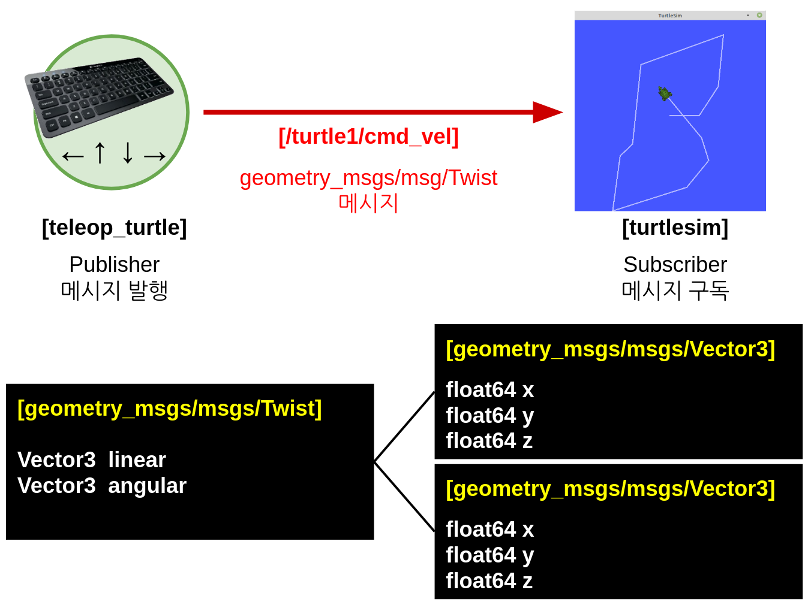

# Chapter 16: ROS 2 인터페이스 (interface)
## 01. ROS 2 인터페이스 (interface)
- ROS의 노드 간에 데이터를 주고받을 때에는 토픽, 서비스, 액션이 사용되는데 이 때 사용되는 데이터의 형태를 ROS 2 인터페이스(interface)라고 한다.
- ROS 인터페이스에는 ROS 2에 새롭게 추가된 IDL(interface definition language)과 ROS 1부터 ROS 2까지 널리 사용 중인 msg, srv, action 이 있다.
- 토픽, 서비스, 액션은 각각 msg, srv, action interface를 사용하고 있으며 정수, 부동 소수점, 불리언과 같은 단순 자료형을 기본으로 하여 메시지 안에 메시지를 품고 있는 간단한 데이터 구조 및 메시지들이 나열된 배열과 같은 구조도 사용할 수 있다.

#### 단순 자료형
- 예) 정수(integer), 부동 소수점(floating point), 불(boolean)
- https://github.com/ros2/common_interfaces/tree/foxy/std_msgs

#### 메시지 안에 메시지를 품고 있는 간단한 데이터 구조
- 예) geometry_msgs/msgs/Twist의 `Vector3 linear`
- https://github.com/ros2/common_interfaces/blob/foxy/geometry_msgs/msg/Twist.msg
- https://github.com/ros2/common_interfaces/blob/foxy/geometry_msgs/msg/Vector3.msg

#### 메시지들이 나열된 배열과 같은 구조
- 예) sensor_msgs/msgs/LaserScan 의 `float32[] ranges`
- https://github.com/ros2/common_interfaces/blob/foxy/sensor_msgs/msg/LaserScan.msg

---
- 메시지 안에 메시지를 품고 있는 간단한 데이터 구조 및 메시지들이 나열된 배열 형태는 단순 자료형을 기반으로 하고 있다.
- 이를 각 인터페이스 파일(msg, service, action)에서 정의할 때에는 아래와 같이 기술한다.
- 여기서 `fieldtype`이 메시지 자료형이고 `fieldname`이 메시지 이름에 해당된다.
```
fieldtype1 fieldname1
fieldtype2 fieldname2
fieldtype3 fieldname3
```
- 예를 들어 `Vector3.msg`은 하기와 같이 `float64` 자료형에 `x`, `y`, `z` 이라는 이름으로 선언되어 있다.
```
float64 x
float64 y
float64 z
```
- ROS에서 사용 가능한 자료형은 위에서 언급한 단순 자료형이 사용되는데 더 자세하게 설명하자면 다음 표와 같다.
- 사용하는 언어별(C++, Python, DDS type)로 약간씩 차이가 있으니 참고하여 ROS 2 프로그래밍시에 문제가 없도록 하자.

|Type name|C++|Python|DDS type|
|:---:|:---:|:---:|:---:|
|bool|bool|builtins.bool|boolean|
|byte|uni8_t|builtins.butes*|octet|
|char|char|builtins.str*|char|
|float32|floa|builtins.float*|float|
|float64|double|builtins.float*|double|
|int8|int8_t|builtins.int*|octet|
|uint8|uint8_t|builtins.int*|octet|
|int16|int16_t|builtins.int*|short|
|uint16|uint16_t|builtins.int*|unsigned short|
|int32|int32_t|builtins.int*|long|
|uint32|uint32_t|builtins.int*|unsigned long|
|int64|int64_t|builtins.int*|long long|
|uint64|uint64_t|builtins.int*|unsigned long|
|string std::string|buiiltins.str|string|
|wstring|std::u16string|builtins.str|wstring|

|Type name|C++|Python|DDS type|
|:---:|:---:|:---:|:---:|
|static array|std::array<T, N>|builtins.list*|T[N]|
|unbounded dynamic array|std::vector|builtins.list|sequence|
|bounded dynamic array|custom_class<T, N>|builtins.list*|sequence<T, N>|
|bounded string|std::string|builtins.str*|string|

## 02. 메시지 인터페이스 (message interface, msg)
- 지금까지 다양한 강좌를 통해 다루었던 turtlesim 패키지를 예를 들어 설명하겠다.
- 그림의 /turtle1/cmd_vel 토픽은 geometry_msgs/msgs/Twist 형태이다.
- 이름이 좀 긴데 풀어서 설명하면 기하학 관련 메시지를 모아둔 geometry_msgs 패키지의 msgs 분류의 Twist 데이터 형태라는 것이다.
- Twist 데이터 형태를 자세히 보면 Vector3 linear과 Vector3 angular 이라고 되어 있다.
- 이는 메시지 안에 메시지를 품고 있는 것으로 Vector3 형태에 linear 이라는 이름의 메시지와 Vector3 형태에 angular 이라는 이름의 메시지, 즉 2개의 메시지가 있다는 것이며 Vector3는 다시 float64 형태에 x, y, z 값이 존재한다.
- 다시 말해 geometry_msgs/msgs/Twist 메시지 형태는 float64 자료형의 linear.x, linear.y, linear.z, angular.x, angular.y, angular.z 라는 이름의 메시지인 것이다.
- 이를 통해 병진 속도 3개, 회전 속도 3개를 표현할 수 있게 된다.



- 이 메시지들을 살펴보는 방법으로는 직접 코드를 보는 방법과 `ros2 interface show` 명령어를 이용하는 방법이 있다.
- 아래 명령어와 같이 알아보고자 하는 메시지를 매개변수로 추가를 하면 다음과 같이 각 메시지 형태 및 메시지 이름을 확인할 수 있다.
```
$ ros2 interface show geometry_msgs/msg/Twist
Vector3 linear
Vector3 angular
```
```
$ ros2 interface show geometry_msgs/msg/Vector3
float64 x
float64 y
float64 z
```
- `ros2 interface` 에는 show 이외에도 list, package, packages, proto가 있는데 list는 현재 개발 환경의 모든 msg, srv, action 메시지를 보여주며, packages는 msg, srv, action 인터페이스를 담고 있는 패키지의 목록을 보여준다.
- package 옵션에 패키지명을 입력하면 지정한 패키지에 포함된 인터페이스들을 보여주고 proto에 특정 인터페이스 형태를 입력하면 그 인터페이스의 기본 형태를 표시해준다.
```
$ ros2 interface list
Messages:
    action_msgs/msg/GoalInfo
    action_msgs/msg/GoalStatus
    action_msgs/msg/GoalStatusArray
(생략)
Services:
    action_msgs/srv/CancelGoal
    composition_interfaces/srv/ListNodes
(생략)
Actions:
    action_tutorials_interfaces/action/Fibonacci
    example_interfaces/action/Fibonacc
(생략)
```
```
$ ros2 interface packages
action_msgs
action_tutorials_interfaces
actionlib_msgs
builtin_interfaces
(생략)
```
```
$ ros2 interface package turtlesim
turtlesim/srv/TeleportAbsolute
turtlesim/srv/SetPen
turtlesim/msg/Color
turtlesim/action/RotateAbsolute
turtlesim/msg/Pose
turtlesim/srv/Spawn
turtlesim/srv/TeleportRelative
turtlesim/srv/Kill
```
```
$ ros2 interface proto geometry_msgs/msg/Twist
"linear:
  x: 0.0
  y: 0.0
  z: 0.0
angular:
  x: 0.0
  y: 0.0
  z: 0.0
"
```
- 지금까지 설명한 메시지는 토픽에 해당되는 msg 인터페이스이다.
- 토픽의 msg 인터페이스 이외에 서비스, 액션 메시지가 또 있으며 각각 srv, action 인터페이스라 부르며 그 형태가 약간씩 차이가 있다.
- 이어지는 설명에서 다시 정리해보자.

## 03. 서비스 인터페이스 (service interface, srv)
- 서비스 또한 토픽과 마찬가지로 별도의 인터페이스를 가지고 있는데 이를 서비스 인터페이스라 부르며, 파일로는 srv 파일을 가르킨다.
- 서비스 인터페이스는 메시지 인터페이스의 확장형이라고 볼 수 있는데 `010 ROS 2 서비스 (service)` 강좌에서 서비스 요청 때 실습으로 사용하였던 /spawn 서비스를 예를 들어 설명하겠다.
- /spawn 서비스에 사용된 Spawn.srv 인터페이스를 알아보기 위해서는 원본 파일을 참고해도 되고, `ros2 interface show` 명령어를 이용하여 확인할 수 있다.
- 이 명령어를 이용하면 아래의 결괏값과 같이 `turtlesim/srv/Spawn.srv`은 float32 형태의 x, y, theta 그리고 string 형태로 name 이라고 두개의 데이터가 있음을 알 수 있다.
- 여기서 특이한 것은 `---` 이다.
- 이는 구분자라 부른다.
- 서비스 인터페이스는 메시지 인터페이스와는 달리 서비스 요청 및 응답(Request/Response) 형태로 구분되는데 요청(Request)과 응답(Response)을 나누어 사용하기 위해서 `---`를 사용하게 된다.
- 즉 x, y, theta, name 은 서비스 요청에 해당되고 서비스 클라이언트 단에서 서비스 서버단에 전송하는 값이 된다.
- 그리고 서비스 서버단은 지정된 서비스를 수행하고 name 데이터를 서비스 클라이언트단에 전송하게 된다.
```
$ ros2 interface show turtlesim/srv/Spawn.srv
float32 x
float32 y
float32 theta
string name
---
string name
```
- 실제로 우리는 /spawn 서비스를 사용할 때 신규 거북이를 생성하기 위하여 x, y, theta 로 위치와 자세를 지정하고, name에 신규 거북이의 이름을 지정하였다.
- 그 뒤 거북이가 추가되면서 추가된 거북이의 이름을 반환 받았었다.

## 04. 액션 인터페이스 (action interface, action)
- 마지막으로 서비스 인터페이스(service interface, srv)에 대해 알아보았다.
- 액션 또한 토픽, 서비스와 마찬가지로 별도의 인터페이스를 가지고 있는데 이를 액션 인터페이스라 부르며, 파일로는 action 파일을 가르킨다.
- 액션 인터페이스는 메시지 및 서비스 인터페이스의 확장형이라고 볼 수 있는데 `011 ROS 2 액션 (action)` 강좌에서 액션 목표를 전달할 때 실습으로 사용하였던 /turtle1/rotate_absolute 서비스를 예를 들어 설명하겠다.
- /turtle1/rotate_absolute 액션에 사용된 RotateAbsolute.action 인터페이스를 알아보기 위해서는 원본 파일을 참고해도 되고, `ros2 interface show` 명령어를 이용하여 확인할 수 있다.
- 이 명령어를 이용하면 아래의 결괏값과 같이 `turtlesim/action/RotateAbsolute.action`은 float32 형태의 theta, delta, remaining 라는 세개의 데이터가 있음을 알 수 있다.
- 여기서 서비스와 마찬가지로 `---` 이라는 구분자를 사용하여 액션 목표(goal), 액션 결과(result), 액션 피드백(feedback)으로 나누어 사용하게 된다.
- 즉 theta는 액션 목표, delta는 액션 결과, remaining는 액션 피드백에 해당된다.
- 참고로 각 데이터는 각도의 SI 단위인 라디안(radian)을 사용한다.
```
$ ros2 interface show turtlesim/action/RotateAbsolute.action
float32 theta
---
float32 delta
---
float32 remaining
```
- 이상으로 액션 인터페이스에 대해 알아보았다.
- 이렇게 ROS 2 인터페이스에는 메시지 인터페이스(msg), 서비스 인터페이스(srv), 액션 인터페이스(action)이 있고 각 목적에 따라 사용하게 되어 있다.

[출처] 016 ROS 2 인터페이스 (interface) (오픈소스 소프트웨어 & 하드웨어: 로봇 기술 공유 카페 (오로카)) | 작성자 표윤석
