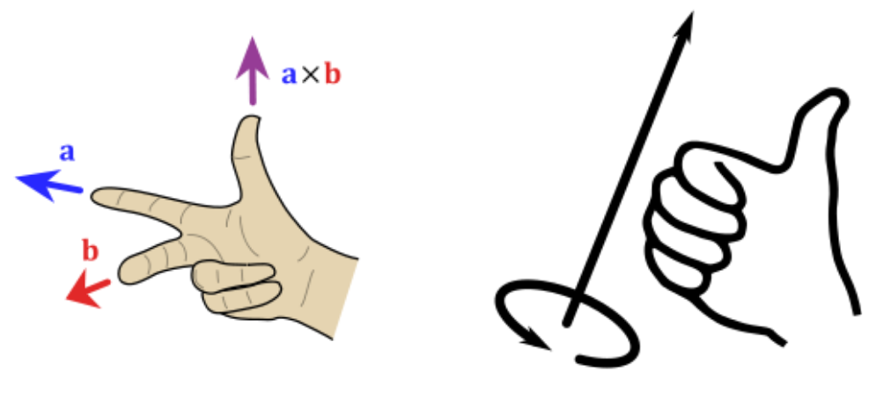
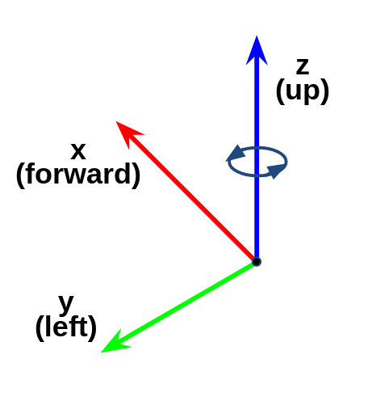

# Chapter 18: 좌표 표현
## 01. ROS 2의 좌표 표현 통일의 필요성
- 이전 강좌에서 다루었던 `017 ROS 2의 물리량 표준 단위`가 ROS 프로그래밍에서의 단위 불일치를 사전에 막기위한 규칙이였다면 이번 강좌에서 다룰 내용은 서로 다른 좌표 표현 방식을 사용할 경우 발생하는 좌표계(coordinate system) 불일치를 사전에 막기위한 규칙이다.
- 예를 들어 로봇의 센서로서 널리 사용되는 카메라의 경우, 컴퓨터 비전 분야에서 널리 사용되는 z forward, x right, y down를 기본 좌표계로 사용하고 있는데 로봇은 기본적으로 x forward, y left, z up를 기본 좌표계로 사용한다.
- 이러한 상황에서 한쪽 좌표계를 기준으로 맞추어 지지 않는다면 두 좌표계를 사용함에 따른 논리적 문제에 빠지게 된다.
- 이 문제 이외에도 로봇에서 사용하는 LiDAR 및 IMU, Torque 센서들도 제조사별로 서로 다른 좌표계를 사용할 수도 있으며 좌표 변환 API가 있더라도 기본 출력을 무엇인가를 미리 알아볼 필요가 있다.
- 예를 들어 IMU가 NED 타입(x north, y east, z down, relative to magnetic north) 이냐 ENU 타입(x-east, y-north, z-up, relative to magnetic north)이냐를 잘 살펴봐야하고 각 센서의 값을 사용하기에 전에 각 센서들의 좌표를 로봇 좌표에 맞추어 적절한 좌표 변환이 필요하다.
- 앞선 강좌에서 단위의 불일치가 개발자와 사용자 간의 불편을 겪게하고 치명적인 소프트웨어 버그로 이어질 수도 있다고 하였는데 좌표 표현 또한 마찬가지로 통일된 좌표 표현을 사용하지 않으면 불편을 겪게 하고 소프트웨어 버그로 유발시킬 수 있다.
- 이에 ROS 커뮤니티에서는 ROS 개발 초기(2010년)부터 이러한 문제를 줄이기 위해 표준 단위에 대한 규칙과 함께 좌표 표현에 규칙을 세워 ROS 프로그래밍에 대한 가이드를 제공하고 있다.

## 02. ROS 2 좌표 표현의 기본 규칙
- ROS 커뮤니티에서는 모든 좌표계를 삼차원 벡터 표기관습을 이해하기 위한 일반적인 기억법인 오른손 법칙에 따라 표현한다.
- 기본적으로 회전 축의 경우에는 그림과 같이 검지, 중지, 엄지를 축을 사용하며 오른손의 손가락을 감는 방향이 정회전 + 방향이다.

- 예를 들어, 표준 단위와 함께 설명하자면 회전 각은 라디안(radian)단위를 이용하고 있고, 로봇이 제자리에서 시계 12시 방향에서 9시 방향으로 회전하였다면 로봇은 정방향 +1.5708 rad 만큼 회전하였다고 이야기한다.

## 03. ROS 2의 좌표 표현의 축 방향 (Axis Orientation) 규칙
### 3-1. 기본 3축
- ROS 커뮤니티에서는 그림과 같이 축 방향 (Axis Orientation)으로 x forward, y left, z up 을 사용한다.
- 시각화 툴 RViz나 3차원 시뮬레이터 Gazebo에서 이러한 기본 3축의 표현에 있어서 헤깔리지 않도록 RGB의 원색으로 표현하는데 순서대로 Red는 x 축, Green은 y축, Blue는 z축을 의미한다.

### 3-2. ENU 좌표
- 지리적 위치(geographic locations)의 단거리 데카르트 표현의 경우 ENU(east north up) 규칙을 사용한다.
- 실내 로봇에서는 잘 다루지 않는 좌표이긴 하지만 비교적 큰 맵을 다루는 드론, 실외 자율주행 로봇에서 사용하는 좌표라고 생각하면 된다.

### 3-3. 접미사 프레임 사용 (Suffix Frames)
- 위에서 언급한 x forward, y left, z up의 기본 3축 및 ENU 좌표에서 벗어나는 경우 접미사 프레임을 사용하여 기본 좌표계와 구별하여 사용한다.
- 자주 사용되는 접미사로 프레임으로는 `_optical` 접미사와 `_ned` 접미사가 있으며 필요시 좌표 변환을 통해 사용하고 있다.

#### 1) `_optical` 접미사
- 컴퓨터 비전 분야의 경우, 카메라 좌표계로 많이 사용되는 z forward, x right, y down를 사용하게 되는데 이럴 경우에는 카메라 센서의 메시지에 `_optical` 접미사를 붙여 구분한다.
- 이때에는 z forward, x right, y down의 카메라 좌표계와 x forward, y left, z up의 로봇 좌표계 간의 TF(transform)가 필요하다.

#### 2) `_ned` 접미사
- 실외에서 동작하는 시스템의 경우, 사용하는 센서 및 지도에 따라 ENU가 아닌 NED (north east down) 좌표계를 사용해야 할 때가 있다.
- 이때에는 `_ned` 접미사를 붙여 구분한다.

## 04. ROS 2의 좌표 표현의 회전 표현(Rotation Representation) 규칙
- 회전의 경우 좌표계는 같아도 목적 및 계산 방법에 따라 표현하는 방법이 다양한데 대표적으로 사용하는 회전 표현 방식에는 아래와 같으며 ROS 커뮤니티에서는 1~3번의 경우를 권장하고 있으며 특이점이 있는 4번의 경우 ROS 커뮤니티에서는 사용을 권장하지 않고 있다.

### 4-1. 쿼터니언 (quaternion)
- 간결한 표현방식으로 가장 널리 사용됨 (x, y, z, w)
- 특이점 없음 (No singularities)

### 4-2. 회전 매트릭스 (rotation matrix)
- 특이점 없음 (No singularities)

### 4-3. 고정축 roll, pitch, yaw (fixed axis roll, pitch, yaw about X, Y, Z axes respectively)
- 각속도에 사용

### 4-4. 오일러 각도 yaw, pitch, roll (euler angles yaw, pitch, and roll about Z, Y, X axes respectively)
- 전역 좌표계에서 회전이 발생하기 때문에 한 축의 회전이 다른 축의 회전과 겹체는 문제(일명 짐벌락)로 인해 사용을 권장하지 않는다.

## 05. ROS 2의 좌표 표현 사용
- 앞선 강좌에서 다룬 단위의 불일치로 인한 피해를 방지하는 표준 단위 사용과 마찬가지로 좌표 표현에 있어서도 ROS 커뮤니티레서 정한 좌표 표현 규칙을 잘 숙지하고 올바르게 사용하여 좌표 표현 불일치로 인한 소프트웨어 버그로 유발시킬 수 있수 상황을 미연에 막도록 하자.

[출처] 018 ROS 2의 좌표 표현 (오픈소스 소프트웨어 & 하드웨어: 로봇 기술 공유 카페 (오로카)) | 작성자 표윤석
