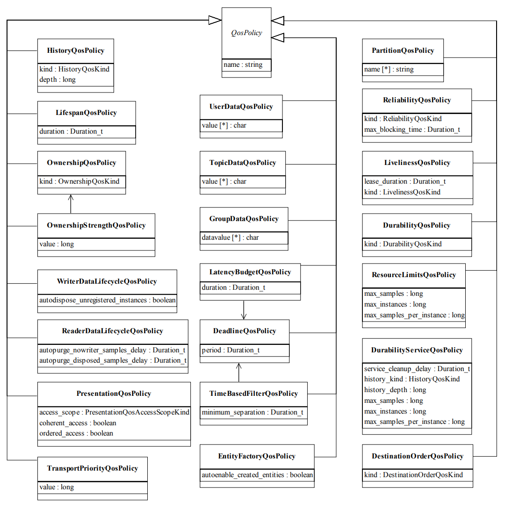

# Chapter 19: DDS의 QoS (Quality of Service)
## 01. DDS의 서비스 품질 (QoS, Quality of Service)
- DDS(Data Distribution Service)의 서비스 품질 (QoS, Quality of Service)에 대한 내용에 들어가기 전에 선행 학습에 해당하는 `006 ROS 2와 DDS (Data Distribution Service)` 강좌를 다시 한 번 더 읽어 보기를 추천한다.
- 이번 강좌의 선행 학습으로 DDS에 대한 이해가 우선적으로 이루어져야 하기 때문이다.
- 참고로 관련 강좌 이외에 더 자세한 정보가 필요한 경우에는 OMG에서 제공하고 있는 DDS 사양서 및 DDS와 관련된 ROS 2의 디자인 문서, ROS 2 컨셉 및 튜토리얼 문서를 탐독하는 것도 추천한다.
- 선행 학습을 마쳤다면 본격적으로 DDS의 서비스 품질 (QoS, Quality of Service)에 대해 알아보자.
- QoS라는 용어가 조금 낯설게 느껴져 어려울 수 있을텐데 쉽게 말해서 "데이터 통신의 옵션"이라고 생각하면 된다.
- TCPROS라는 자체 프로토콜을 사용했던 기존 ROS 1과는 달리 ROS 2에서는 TCP처럼 신뢰성을 중시여기는 통신 방식과 UDP처럼 통신 속도에 포커스를 맞춘 통신 방식을 선택적으로 사용할 수 있다.
- 이를 위해 ROS 2에서는 이 DDS의 QoS를 도입하였고 퍼블리셔나 서브스크라이브 등을 선언할 때 QoS를 매개 변수형태로 지정할 수 있어서 원하는 데이터 통신의 옵션 설정을 유저가 직접할 수 있게 되어 있다.
- 이 QoS로 바꿀 수 있는 것은 데이터 전송시의 실시간성 설정과 관련된 부분과 대역폭에 영향을 미치는 옵션, 데이터의 지속성과 관련한 옵션, 중복성에 관련한 옵션 등이 있다.
- 이 옵션을 어떤 상황에서 어떻게 설정하냐가 중요한데 이는 이어지는 설명에서 하나씩 알아가도록 하겠다.

## 02. QoS의 종류
- 현재의 DDS 사양서[3]에서 설정 가능한 QoS 항목으로는 그림과 같이 22가지인데 ROS 2에서는 TCP처럼 데이터 손실을 방지함으로써 신뢰도를 우선시하거나 (reliable), UDP처럼 통신 속도를 최우선시하여 사용(best effort)할 수 있게 하는 Reliability 기능이 대표적으로 사용되고 있다.
- 그 이외에 통신 상태에 따라 정해진 사이즈만큼의 데이터를 보관하는 History 기능, 데이터를 수신하는 서브스크라이버가 생성되기 전의 데이터를 사용할지 폐기할지에 대한 설정인 Durability 기능, 정해진 주기 안에 데이터가 발신 및 수신되지 않을 경우 이벤트 함수를 실행시키는 Deadline 기능, 정해진 주기 안에서 수신되는 데이터만 유효 판정하고 그렇지 않은 데이터는 삭제하는 Lifespan 기능, 정해진 주기 안에서 노드 혹은 토픽의 생사 확인하는 Liveliness도 옵션으로 설정할 수 있다.



- 이러한 다양한 QoS 설정을 통해 DDS는 적시성, 트래픽 우선순위, 안정성 및 리소스 사용과 같은 데이터를 주고받는 모든 측면을 사용자가 제어할 수 있게 되었고 특정 상황, 예를 들어 매우 빠른 속도 데이터를 주고 받거나 매우 역동적이고 까다롭고 예측할 수 없는 통신 환경에서 데이터 송/수신에 다양한 통신 옵션 설정으로 이를 달성하거나 장애를 극복할 수 있게 되었다.

> - 이 QoS 관련 부분은 실제 코딩에서 어떻게 설정하느냐가 매우 중요하다.
> - ROS 2에서는 Reliability, History, Durability, Deadline, Lifespan, Liveliness 를 중요 QoS로 사용하고 있는데 이 강좌에서는 각 옵션의 값에 따른 변화, RxO (requested by offered) 특성, 간단한 예제에 대해 알아보고 자세한 사용 방법은 추후에 실습과 함께 강좌로 따로 정리할 예정이다.

## 03. ROS 2에서 사용되는 QoS 옵션
- ROS 2에서 사용되는 QoS에는 위에서 언급한 DDS의 22개 중 History, Reliability, Durability, Deadline, Lifespan, Liveliness와 같이 중요 6가지 QoS가 사용되고 있다.

### 3-1. History
#### (1) Values

|History|데이터를 몇 개나 보관할지를 결정하는 QoS 옵션|
|:---:|:---:|
|KEEP_LAST|정해진 메시지 큐 사이즈 만큼의 데이터를 보관 <br> depth: 메시지 큐의 사이즈|
|KEEP_ALL|모든 데이터를 보관 (메시지 큐의 사이즈는 DDS 벤더마다 다름)|

#### (2) RxO (requested by offered)
- : 해당 사항 없음

#### (3) Examples
```
[RCLCPP]
rclcpp::QoS(rclcpp::KeepLast(10)).reliable().durability_volatile();
```
```
[RCLPY]
qos_profile = QoSProfile(history=QoSHistoryPolicy.KEEP_LAST, depth=10)
```

### 3-2. Reliability
#### (1) Values

|Reliability|데이터 전송에 있어 속도를 우선시 하는지 신뢰성을 우선시 하는지를 결정하는 QoS 옵션|
|:---:|:---:|
|BEST_EFFORT|데이터 송신에 집중. 전송 속도를 중시하며 네트워크 상태에 따라 유실이 발생할 수 있음|
|RELIABLE|데이터 수신에 집중. 신뢰성을 중시하며 유실이 발생하면 재전송을 통해 수신을 보장함|

#### (2) RxO (requested by offered)

|Pub(↓) / Sub (→)|BEST_EFFORT|RELIABLE|
|:---:|:---:|:---:|
|BEST_EFFORT|BEST_EFFORT|불가|
|RELIABLE|BEST_EFFORT|RELIABLE|

#### (3) Examples
```
[RCLCPP]
rclcpp::QoS(rclcpp::KeepAll).best_effort().transient_local();
```
```
[RCLPY]
qos_profile = QoSProfile(reliability=QoSReliabilityPolicy.BEST_EFFORT)
```

### 3-3. Durability
#### (1) Values

|Durability|데이터를 수신하는 서브스크라이버가 생성되기 전의 데이터를 사용할지 폐기할지에 대한 QoS 옵션|
|:---:|:---:|
|TRANSIENT_LOCAL|Subscription이 생성되기 전의 데이터도 보관 (Publisher에만 적용 가능)|
|VOLATILE|Subscription이 생성되기 전의 데이터는 무효|

#### (2) RxO (requested by offered)

|Pub(↓) / Sub (→)|TRANSIENT_LOCAL|VOLATILE|
|:---:|:---:|:---:|
|TRANSIENT_LOCAL|TRANSIENT_LOCAL|VOLATILE|
|VOLATILE|불가|VOLATILE|

#### (3) Examples
```
[RCLCPP]
rclcpp::QoS(rclcpp::KeepAll).best_effort().transient_local()
```
```
[RCLPY]
qos_profile = QoSProfile(durability=QoSDurabilityPolicy.TRANSIENT_LOCAL)
```

### 3-4. Deadline
#### (1) Values

|Deadline|정해진 주기 안에 데이터가 발신 및 수신되지 않을 경우 EventCallback를 실행시키는 QoS 옵션|
|:---:|:---:|
|deadline_duration|Deadline을 확인하는 주기|

#### (2) RxO (requested by offered)

|Pub(↓) / Sub (→)|1000ms|2000ms|
|:---:|:---:|:---:|
|1000ms|가능|가능|
|2000ms|불가|가능|

#### (3) Examples
```
[RCLCPP]
rclcpp::QoS(10).deadline(100ms);
```
```
[RCLPY]
qos_profile = QoSProfile(depth=10, deadline=Duration(0.1))
```

### 3-5. Lifespan
#### (1) Values
|Lifespan|정해진 주기 안에서 수신되는 데이터만 유효 판정하고 그렇지 않은 데이터는 삭제하는 QoS 옵션|
|:---:|:---:|
|lifespan_duration|Lifespan을 확인하는 주기|

#### (2) RxO (requested by offered)
- : 해당 사항 없음

#### (3) Examples
```
[RCLCPP]
rclcpp::QoS(10).reliable().transient_local().lifespan(10ms);
```
```
[RCLPY]
qos_profile = QoSProfile(lifespan=Duration(0.01))
```

### 3-6. Liveliness
#### (1) Values

|Liveliness|정해진 주기 안에서 노드 혹은 토픽의 생사 확인하는 QoS 옵션|
|:---:|:---:|
|liveliness|자동 또는 매뉴얼로 확인할지를 지정하는 옵션, 하기 3가지 중 선택 <br> * AUTOMATIC, MANUAL_BY_NODE, MANUAL_BY_TOPIC 중 선택|
|lease_duration|Liveliness을 확인하는 주기|

#### (2) RxO (requested by offered)

|Pub(↓) / Sub (→)|AUTOMATIC|MANUAL_BY_NODE|MANUAL_BY_TOPIC|
|:---:|:---:|:---:|:---:|
|AUTOMATIC|가능|불가|불가|
|MANUAL_BY_NODE|가능|가능|불가|
|MANUAL_BY_TOPIC|가능|가능|가능|

- automatic: 생존성을 관리하는 주체가 DDS 미들웨어
- manual: 생존성을 관리하는 주체가 사용자

#### (3) Examples
```
[RCLCPP]
rclcpp::QoS qos_profile(10);
  qos_profile
  .liveliness(RMW_QOS_POLICY_LIVELINESS_AUTOMATIC)
  .liveliness_lease_duration(1000ms);
```
```
[RCLPY]
qos_profile = QoSProfile(
    liveliness=AUTOMATIC,
    liveliness_lease_duration=Duration(1.0))
```

## 04. rmw_qos_profile 사용과 유저 QoS 프로파일 사용
### 4-1. rmw_qos_profile
- ROS 2의 RMW에서 QoS 설정을 쉽게 사용할 수 있도록 가장 많이 사용하는 QoS 설정을 세트로 표현해둔 것이 있는데 이를 RMW QoS Profile이라고 한다.
- 그 목적에 따라 Default, Sensor Data, Service, Action Status, Parameters, Parameter Events와 같이 6가지로 구분하며 Reliability, History, Depth(History Depth), Durability 를 설정하게 된다.

|\|Default|Sensor Data|Service|Action Status|Parameters|Parameter Events|
|:---:|:---:|:---:|:---:|:---:|:---:|:---:|
|Reliability|RELIABLE|BEST_EFFORT|RELIABLE|RELIABLE|RELIABLE|RELIABLE|
|History|KEEP_LAST|KEEP_LAST|KEEP_LAST|KEEP_LAST|KEEP_LAST|KEEP_LAST|
|Depth <br> (History Depth)|10|5|10|1|1000|1000|
|Durability|VOLATILE|VOLATILE|VOLATILE|TRANSIENT LOCAL|VOLATILE|VOLATILE|

- 이 중 센서와 같이 지속성이 높으며 데이터 유실의 문제보다는 순간적인 데이터를 가장 빠르게 전달해야하는 sensor data의 경우에는 아래와 같이 설정되어 있다.
- 그 이외의 설정은 qos_profiles 파일을 참고하도록 하자.
```py
static const rmw_qos_profile_t rmw_qos_profile_sensor_data =
  {
    RMW_QOS_POLICY_HISTORY_KEEP_LAST,
    5,
    RMW_QOS_POLICY_RELIABILITY_BEST_EFFORT,
    RMW_QOS_POLICY_DURABILITY_VOLATILE,
    RMW_QOS_DEADLINE_DEFAULT,
    RMW_QOS_LIFESPAN_DEFAULT,
    RMW_QOS_POLICY_LIVELINESS_SYSTEM_DEFAULT,
    RMW_QOS_LIVELINESS_LEASE_DURATION_DEFAULT,
    false
};
```
- 이를 실제 코드에서 사용하려면 하기와 같이 `qos_profile_sensor_data` 모듈을 임포트해야한다.
- 참고로 이하의 예제는 Python 코드를 중심으로 설명하였다.
```py
from rclpy.qos import qos_profile_sensor_data
```
- 그 뒤 아래와 같이 퍼블리셔를 선언하는 `create_publisher` 함수를 사용할 때 `qos_profile_sensor_data`을 매개변수로 사용하면 된다.
```py
self.sensor_publisher = self.create_publisher(Int8MultiArray, 'sensor', qos_profile_sensor_data)
```

### 4-2. 유저 QoS 프로파일
- 위 4.1에서 사용한 방식 이외에도 유저가 직접 설정하여 새로운 프로파일을 만들어 사용할 수 있는데 이를 위해서는 아래와 같이 QoS 모듈들을 임포트한다.
```py
from rclpy.qos import QoSDurabilityPolicy
from rclpy.qos import QoSHistoryPolicy
from rclpy.qos import QoSProfile
from rclpy.qos import QoSReliabilityPolicy
```
- 그 뒤 실제 코드에서 `QoSProfile`을 선언하며 reliability, history, durability, depth를 아래와 같이 원하는 옵션으로 커스텀하게 설정할 수 있다.
```py
QOS_RKL10V = QoSProfile(
    reliability=QoSReliabilityPolicy.RELIABLE,
    history=QoSHistoryPolicy.KEEP_LAST,
    depth=10,
    durability=QoSDurabilityPolicy.VOLATILE)
```
- 그 뒤 아래와 같이 퍼블리셔를 선언하는 `create_publisher` 함수를 사용할 때 `rmw_qos_profile` 대신에 사용자가 정의한 유저 QoS 프로파일 매개변수로 사용하면 된다.
```py
self.sensor_publisher = self.create_publisher(Int8MultiArray, 'sensor', QOS_RKL10V)
```

## 05. QoS 테스트
- QoS 테스트는 `006 ROS 2와 DDS (Data Distribution Service)` 강좌의 5번 항목인 `5.5 QoS 테스트`에서 Reliability가 RELIABLE 로 되어 있을 때의 예제와 Reliability가 BEST_EFFORT 로 되어 있을 때의 예제를 참고하도록 하자.
- 그리고 더 자세한 각 QoS별 테스트를 원한다면 데모 코드를 이용하여 Deadline, Lifespan, Liveliness 등에 대한 테스트를 진행해보기를 추천한다.

[출처] 019 DDS의 QoS(Quality of Service) (오픈소스 소프트웨어 & 하드웨어: 로봇 기술 공유 카페 (오로카)) | 작성자 표윤석
