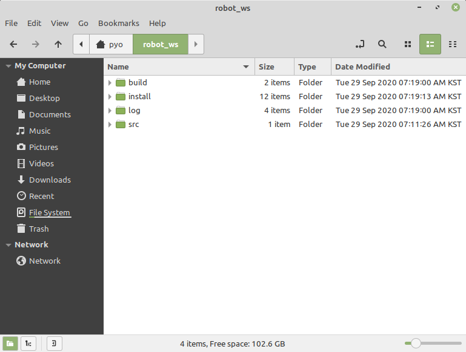

# Chapter 20: ROS 2의 파일 시스템
## 01. 파일 시스템 (filesystem)
- ROS 2의 파일시스템은 ROS 패키지 및 소스 코드를 검색하거나 메시지 파일, 실행 파일, 파라미터 설정 및 환경 설정 파일 등을 이용할 때 사용자에게 일관된 경험을 제공하기 위해 동일 구조를 가지고 있다.
- ROS 2의 파일시스템을 설명하기 위하여 기본적인 폴더 및 파일 구성과 설치 폴더, 사용자 패키지에 대해 알아보도록 하자.

## 02. 패키지와 메타패키지
- ROS 2의 기본적인 폴더 및 파일 구성에 대해서 알아보자.
- ROS 2에서 소프트웨어 구성을 위한 기본 단위가 패키지(package)로써 ROS의 응용 프로그램은 패키지 단위로 개발되고 관리된다.
- 패키지는 ROS의 최소 단위의 실행 프로세서인 노드(node)를 하나 이상 포함하거나 다른 노드를 실행하기 위한 런치(launch)와 같은 실행 및 설정 파일들을 포함하게 된다.
- 2020년 9월 기준으로 REP-2005으로 등록된 ROS 2 Common Packages 문서를 기준으로 보았을 때 450여개가 기본 패키지이며 ROS Index에 기술된 정보에 의하면 총 624개의 패키지가 존재한다.
- `sudo apt install` 명령어로 설치 가능한 패키지를 기준으로 했을 때에는 900개의 패키지가 있다.
- ROS 1의 Kinetic 기준으로 3,700여개를 돌파했다는 점과 비교하여 아직 턱없이 부족한 수이긴 하지만 ROS 2의 개발 속도 및 보급률의 상승세로 인해 앞으로 더 많은 패키지가 등록될 것으로 보인다.
- 이러한 패키지는 메타패키지(metapackage)라는 공통된 목적을 지닌 패키지들을 모아둔 패키지들의 집합 단위로 관리되기도 한다.
- 예를 들어 Navigation2 메타패키지는 nav2_amcl, nav2_bt_navigator, nav2_costmap_2d, nav2_core, nav2_dwb_controller 등 20여 개의 패키지로 구성되어 있다.
- 각 패키지는 package.xml이라는 파일을 포함하고 있는데 이는 패키지의 정보를 담은 XML 파일로서 패키지의 이름, 저작자, 라이선스, 의존성 패키지 등을 기술하고 있다. 또한 ROS 2의 빌드 시스템인 `ament`는 기본적으로 CMake를 이용하고 있어서 패키지 폴더에 CMakeLists.txt라는 파일에 빌드 설정을 기술하고 있다.
- 이외에 노드의 소스 코드 및 노드 간의 메시지 통신을 위한 msg, srv, action 인터페이스 파일 등으로 구성되어 있다.

## 03. 바이너리 설치와 소스 코드 설치
- ROS 패키지 설치는 바이너리 형태로 제공되어 별도의 빌드과정 없이 바로 실행하는 방법과 해당 패키지의 소스 코드를 직접 다운로드 한 후 사용자가 빌드하여 사용하는 방법이 있다.
- 이는 패키지 사용 목적에 따라 달리 사용된다.
- 만약, 해당 패키지를 수정하여 사용하고자 할 경우나 소스 코드 내용을 확인할 필요가 있다면 후자의 설치 방법을 이용하면 된다.
- 다음은 teleop_twist_joy 패키지를 예로 들어 두 설치 방법의 차이를 기술한다.

### 3-1. 바이너리 설치
- 바이너리 설치 방법은 아래와 같이 해당 패키지 명으로만으로도 설치를 할 수 있으며 설치된 파일은 `/opt/ros/foxy` 에 저장되어 `ros2 run` 이나 `ros2 launch`로 해당 패키지내의 실행 가능한 노드를 실행시킬 수 있다.
```
$ sudo apt install ros-foxy-teleop-twist-joy
```

### 3-2. 소스 코드 설치
- 소스 코드 설치 방법은 사용자 작업폴더 (예: '~/robot_ws/src')에 `git clone` 명령어를 통해 원격의 리포지토리를 복사 후 빌드하는 방법이다.
```
$ cd ~/robot_ws/src
$ git clone https://github.com/ros2/teleop_twist_joy.git
$ cd ~/robot_ws/
$ colcon build --symlink-install --packages-select teleop_twist_joy
```

## 04. 기본 설치 폴더와 사용자 작업 폴더
- ROS 2의 파일 시스템은 설치 폴더와 사용자 작업 폴더로 구분되어 사용 된다.
- ROS 2 설치 폴더는 ROS의 데스크톱 버전(예: ros-foxy-desktop)을 설치하면 `/opt` 폴더에 `ros` 라는 이름의 폴더가 생성되고 그 안에 ROS 버전별로 또 다시 폴더가 있다.
- 예를 들어 ROS 2 Foxy 버전을 설치하였으면 `/opt/ros/foxy` 에 핵심 유틸리티와 rqt, RViz, 로봇 관련 라이브러리, 시뮬레이션, 내비게이션 패키지 등이 설치된다. 일반 사용자가 이 부분의 파일들을 손댈 일은 거의 없다.
- 만약에 바이너리 파일로 공식 배포되는 패키지를 수정하고자 하는 경우는 `sudo apt install ros-foxy-xxx`의 패키지 설치 명령어가 아닌 직접 원본 소스가 있는 리포지토리를 확인한 다음 '~/robot_ws/src'에 'git clone [리포지토리 주소]'와 같이 직접 소스를 복사하여 사용하면 된다.
- 사용자 작업 폴더는 사용자가 원하는 곳에 폴더명으로 생성할 수 있는데 이 강좌에서는 리눅스 사용자 폴더인 '~/ robot_ws/('~/'은 리눅스에서 '/home/사용자명/'에 해당하는 폴더를 의미함)'를 사용하도록 하겠다.
- 이어서 ROS 2 설치 폴더와 사용자 작업 폴더에 대해서 더 자세히 알아보자.

### 4-1. 기본 설치 폴더
- ROS 2는 '/opt/ros/[버전이름]' 폴더에 설치된다.
- 예를 들어 ROS 2 Foxy Fitzroy 버전을 설치했다면 ROS가 설치된 경로는 다음과 같다.
    - 기본 설치 폴더 경로: /opt/ros/foxy

#### (1) 폴더 및 파일 구성
- 다음 그림처럼 '/opt/ros/foxy'의 폴더 아래에 bin, cmake, include, lib, opt, share, src 폴더와 몇 가지 환경설정 파일들로 구성되어 있다.


#### (2) 세부 내용
- ROS 폴더에는 ROS를 설치할 때 선택했던 패키지와 ROS 구동 프로그램이 포함되고 있다.
- 세부 내용은 아래와 같다.
```
▪ /bin 실행 가능한 바이너리 파일
▪ /cmake 빌드 설정 파일
▪ /include 헤더 파일
▪ /lib 라이브러리 파일
▪ /opt 기타 의존 패키지
▪ /share 패키지의 빌드, 환경 설정 파일
▪ local_setup.* 환경 설정 파일
▪ setup.* 환경 설정 파일
```

### 4-2. 사용자 작업 폴더
- 사용자 작업 폴더는 사용자가 원하는 곳에 생성할 수 있으나 이 강좌에서는 원활한 진행을 위하여 리눅스 사용자 폴더인 '~/robot_ws/'를 사용하도록 하자.
- 즉 '/home/사용자이름/robot_ws'를 사용할 것이다.
- 예를 들어, 사용자 이름이 'oroca'이고 workspace 폴더 이름은 'robot_ws'라고 설정하였다면 경로는 다음과 같다.
    - 사용자 작업 폴더 경로: /home/oroca/robot_ws/
    
#### (1) 폴더 및 파일 구성
- 그림처럼 '/home/사용자이름/' 폴더 아래에 robot_ws라는 폴더가 있고, build, install, log, src 폴더로 구성되어 있다.
- 참고로 build, install, log 폴더는 colcon build 후에 생성된다.



#### (2) 세부 내용
- 사용자 작업 폴더는 사용자가 작성한 패키지와 공개된 다른 개발자의 패키지를 저장하고 빌드하는 공간이다.
- 사용자는 ROS와 관련된 대부분 작업을 이 폴더에서 수행한다.
- 세부 내용은 다음과 같다.
```
▪ /build 빌드 설정 파일용 폴더
▪ /install msg, srv 헤더 파일과 사용자 패키지 라이브러리, 실행 파일용 폴더
▪ /log 빌드 로깅 파일용 폴더
▪ /src 사용자 패키지용 폴더
```
- '~/robot_ws/src' 폴더는 사용자 패키지의 공간이다.
- '~/robot_ws/src' 내의 패키지는 하기와 같이 다양한 폴더와 파일로 구성되어 있다.
```
▪ /src C/C++ 코드용 폴더
▪ /include C/C++ 헤더 파일용 폴더 (폴더 안에는 각 패키지 이름별 폴더로 패키지별 헤더를 구분함)
▪ /param 파라미터 파일용 폴더
▪ /launch roslaunch에 사용되는 launch 파일용 폴더
▪ /패키지_이름_폴더 Python 코드용 폴더
▪ /test 테스트 코드 및 테스트 데이터용 폴더
▪ /msg 메시지 파일용 폴더
▪ /srv 서비스 파일용 폴더
▪ /action 액션 파일용 폴더
▪ /doc 문서용 폴더
▪ package.xml: 패키지 설정 파일 (REP-0140, REP-0149 참고)
▪ CMakeLists.txt: C/C++ 빌드 설정 파일
▪ setup.py: 파이썬 코드 환결 설정 파일
▪ README: 사용자 문서, github 리포지토리의 메인에 표시된다.
▪ CONTRIBUTING: 해당 패키지 개발에 공헌하는 방법을 기술하는 파일
▪ LICENSE: 이 패키지의 라이선스를 기술하는 파일
▪ CHANGELOG.rst: 이 패키지의 버전별 변경 사항 모음 파일 (REP-0132 참고)
```

## 05. ROS 1과 ROS 2 파일 시스템의 차이점
### 5-1. Multiple workspace
- ROS 1에서는 `catkin_ws`와 같이 특정 워크스페이스를 확보하고 하나의 워크스페이스에서 모든 작업을 다 했는데 ROS 2에서는 복수의 독릭된 워크스페이스를 사용할 수 있어서 작업 목적 및 패키지 종류별로 관리할 수 있게 되었다.

### 5-2. No devel space
- ROS 1에서의 catkin은 패키지를 빌드 한 후 devel 이라는 폴더에 코드를 저장한다.
- 이 폴더는 패키지를 설치할 필요없이 패키지를 사용할 수 있는 환경을 제공한다.
- 이를 통해 파일 복사를 피하면서 사용자는 파이썬 코드를 편집하고 즉시 코드 실행할 수 있었다.
- 단 이러한 기능은 매우 편리한 기능이지만 패키지를 관리하는 측면에서 복잡성을 크게 증가시켰다.
- 이에 ROS 2에서는 패키지를 빌드 한 후 설치해야 패키지를 사용할 수 있도록 바뀌었다.
- 단 쉬운 사용성도 고려하여 colcon 사용시에 `colcon build --symlink-install` 와 같은 옵션을 사용하여 심볼릭 링크 설치의 선택적 기능을 사용하여 동일한 이점을 제공하고 있다.

[출처] 020 ROS 2의 파일 시스템 (오픈소스 소프트웨어 & 하드웨어: 로봇 기술 공유 카페 (오로카)) | 작성자 표윤석
