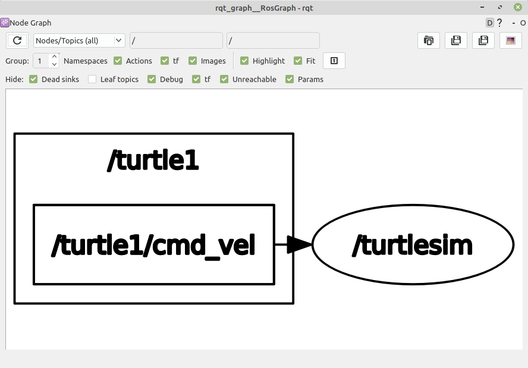
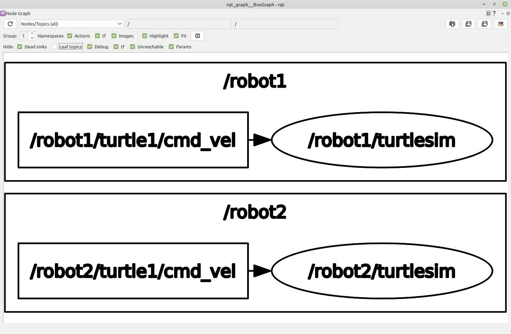

# Chapter 26: ROS 2 Tips
## 01. 설정 스크립트 (setup script)
- 처음 ROS 2를 사용함에 있어어 가장 놓칠 수 있는 실수는 ROS 2의 설정 스크립트를 사용하지 않고 ROS 2패키지를 찾는다거나 노드를 실행시키는 것이다.
- 새로운 패키지를 빌드하였다면 잊지말고 아래의 설정 스크립트를 터미널 창에서 실행시키자.
- 또는 ROS 2 개발 환경 구축 강좌에서 언급한 것처럼 ~/.bashrc에 저장한 후 사용하도록 하자.
```
source ~/robot_ws/install/local_setup.bash
```

## 02. setup.bash vs local_setup.bash
### 2-1. underlay와 overlay
- 우선 underlay와 overlay 개념을 알고 넘어가자.
- 우리가 ROS 2를 바이너리로 설치(binary installation)하게 된다면 /opt/ros/foxy/ 라는 설치 폴더에 모든 구성 파일들이 위치하게 될 것이다.
- 혹은 소스로 빌드하여 설치(source installation)한다면 colcon 워크스페이스를 설정하기 나름이겠지만 ~/ros2_foxy/ 으로 사용할 것이다.
- 이 개발 환경을 ROS 에서는 underlay 라고 한다.
- 그리고 개발자가 사용하는 워크스페이스가 있다.
- 예를 들어 ~/robot_ws/ 이라고 로봇 개발용 워크스페이스 하나 사용하고 ~/test_ws 이라고 테스트용 워크스페이스를 지정하여 사용하고 있다고 가정한다면 이 둘의 개발 환경을 ROS에서는 overlay이라고 한다.
- 즉, overlay 개발 환경은 설치된 ROS 패키지들에 의존하기에 underlay 개발 환경에 종속적이게 된다.
- 그렇기에 설정 스크립트(setup script)라고 하는 setup.bash의 호출 순서 및 사용 방법이 조금씩 달라지게 된다.

### 2-2. setup.bash 및 local_setup.bash 사용 방법
- setup.bash 및 local_setup.bash 파일은 설정 스크립트(setup script)라고 부르며 underlay와 overlay 구분없이 모든 워크스페이스에 존재하며 각 설정 스크립트마다 사용 목적이 조금씩 다르다.
- local_setup.bash 스크립트는 이 스크립트가 위치해 있는 접두사(prefix) 경로(예: ~/robot_ws/install/)의 모든 패키지에 대한 환경을 설정한다.
- 이는 상위 작업 공간에 대한 설정은 포함되어 있지 않는다.
- setup.bash 스크립트는 현재 작업 공간이 빌드될 때 환경에 제공된 다른 모든 작업 공간에 대한 local_setup.bash 스크립트를 포함하고 있다.
- 즉, underlay 개발 환경의 설정 정보까지 포함한다.
- 워크스페이스가 하나라면 local_setup.bash 이나 setup.bash 스크립트에는 차이가 없으나 둘 이상이라면 각 목적에 맞게 사용되어야 한다.
- 예를 들어 유저가 지정한 워크스페이스(예: ~/robot_ws/install) 뿐만 아니라 ROS가 설치된 개발 환경 (예: /opt/ros/foxy) 경로를 포함하도록 환경을 설정하려면 유저가 지정한 워크스페이스의 setup.bash (예: ~/robot_ws/install/setup.bash)를 이용하자.
- 이것은 /opt/ros/foxy/(local_)setup.bash 을 먼저 소싱한 후, ~/robot_ws/install/local_setup.bash 한것과 동일한 효과이다.
- 즉, 간단히 말하면 하기와 같이 underlay 개발 환경의 setup.bash를 우선 소싱한 후 자신의 워크스페이스인 overlay 개발 환경의 local_setup.bash를 소싱하는게 정석이다.
- 이 두 구문을 ./bashrc 에 넣어두고 사용하면 편하다.
```
source /opt/ros/foxy/setup.bash
source ~/robot_ws/install/local_setup.bash
```

## 03. colcon_cd
- 터미널창에서 colcon_cd 명령을 사용하면 쉘의 현재 작업 디렉토리를 패키지 디렉토리로 빠르게 변경할 수 있다.
- ROS 1의 roscd와 비슷한 역할을 하는 ROS 2의 쉘 명령어라고 생각하면 된다.
```
$ colcon_cd 패키지이름
```
- 이를 사용하기 위해서는 다음과 같은 설정을 ./bashrc에 추가하면 된다.
- 작업 폴더는 환경마다 다를 수 있는데 기본 작업 폴더를 ~/robot_ws 으로 했던 분들이라면 아래와 같이 _colcon_cd_root 를 지정하는 것도 잊지말자.
```
source /usr/share/colcon_cd/function/colcon_cd.sh
export _colcon_cd_root=-/robot_ws
```

## 04. ROS_DOMAIN_ID vs Namespae
- ROS를 사용하면서 동일 네트워크를 다른 사람들과 함께 사용하고 있다면 다른 연구원들이 사용하고 있는 노드에 쉽게 접근 가능하여 데이터를 공유할 수 있게 된다.
- 이런 기능은 멀티 로봇 제어 및 협업 작업시 매우 편한데 독립적인 작업을 해야할 때에는 이 기능이 역으로 불편할 수 있다.
- 이를 방지하려면 아래 3가지 방법이 있을 수 있다.
    1. 물리적으로 다른 네트워크를 사용한다.
    2. ROS_DOMAIN_ID를 이용하여 DDS의 domain을 변경한다.
    3. 각 노드 및 토픽/서비스/액션의 이름을 Namespace를 통해 변경한다.
    
### 4-1. 물리적으로 다른 네트워크를 사용한다.
- 독립적인 스위치 허브 및 라우터를 사용하는 것으로 원천적인 해결방법이다.
- 때론 이 방법이 가장 속 편하다.

### 4-2. ROS_DOMAIN_ID를 이용하여 DDS의 domain을 변경한다.
- ROS 2에서는 DDS의 도입으로 멀티캐스트의 방식을 사용하고 있고 전역 공간이라 불리는 DDS Global Space이라는 공간에 있는 토픽들에 대해 구독 및 발행을 할 수 있게 된다.
- ROS 2에서는 이 DDS Global Space를 손쉽게 변경하는 방법으로 ROS_DOMAIN_ID 라는 환경 변수를 두고 있고 각 RMW에서는 이 환경 변수를 참조하여 도메인을 바꾸게 된다.
- 예를 들어 하기와 같이 각 터미널상에서 각 노드를 실행시켜 보자.
- `ROS_DOMAIN_ID`을 서로 동일하게 맞춘 talker 노드와 listener 노드만이 연결되어 서로 통신 됨을 확인할 수 있을 것이다.
- 참고로 `ROS_DOMAIN_ID`은 RMW마다 다르고 기본 운영체제에 따라 다르지만 기본적으로 0에서 101까지의 정수를 사용할 수 있다.
- 동일 네트워크를 다른 사람과 쓰고 있다면 이 `ROS_DOMAIN_ID`를 각 멤버들과 상의하여 지정하여 쓰면 된다.
- 단, 특정 번호 예를들어 행운의 7을 쓰기 위해서 싸우지는 말자!
- ROS_DOMAIN_ID=7 를 쓴다고 안 돌던 ROS 프로그램이 갑자기 동작하지는 않는다.
```
$ export ROS_DOMAIN_ID=11
$ ros2 run demo_nodes_cpp talker
[INFO]: Publishing: 'Hello World: 1'
[INFO]: Publishing: 'Hello World: 2'
[INFO]: Publishing: 'Hello World: 3'
(생략)
```
```
$ export ROS_DOMAIN_ID=12
$ ros2 run demo_nodes_cpp listener
(서로 다른 도메인을 사용하고 있기에 아무런 반응이 없을 것이다.)
```
```
$ export ROS_DOMAIN_ID=11
$ ros2 run demo_nodes_cpp listener
[INFO]: I heard: [Hello World: 13]
[INFO]: I heard: [Hello World: 14]
[INFO]: I heard: [Hello World: 15]
(생략)
```

### 4-3. 각 노드 및 토픽/서비스/액션의 이름을 Namespace를 통해 변경한다.
- ROS 2의 노드는 각 노드별 고유의 이름이 존재한다.
- 그리고 각 노드에서 사용하는 토픽, 서비스, 액션, 파라미터 또한 고유의 이름이 존재한다.
- 이러한 고유의 이름을 Namespace를 통해 바꾸면 독립적으로 자신만의 네트워크 그루핑을 할 수 있다.
- 이는 각 노드를 실행시킬 때 ROS 변수 중 하나인 ns(namespace)를 입력하여 변경하는 방법도 있고 launch 파일로 실행시킬 때 node_namespace 라는 항목을 변경하는 방법이 있다.
- 오늘은 노드를 실행시킬 때 ROS 변수 중 하나인 ns(namespace)를 입력하는 방법에 대해 알아보자.
```
$ ros2 run turtlesim turtlesim_node
```
- 위와 같이 실행하고 rqt_graph를 통해 각 노드 및 토픽명을 확인해보면 하기와 같다.



- 이번에는 ns를 변경하여 동일 노드를 두개 실행시켜보자.
- 하나는 robot1, 다른 하나는 robot2로 ns를 지정하였더니 rqt_graph에서 보이는 토픽과 노드명 앞에 ns가 붙여져 있는 것을 확인할 수 있다.
- 이런식으로 노드를 유저가 지정한 namespace로 묶는 방법도 유용할 때가 있다.
- 단, ns만 바꾼다면 그룹핑만 할뿐 rqt_graph나 node, topic, service, action, parameter 등을 볼때 다른 사람이 사용하고 있는 정보가 모두 보인다는 점을 잊지 말자.
```
$ ros2 run turtlesim turtlesim_node --ros-args -r __ns:=/robot1
```
```
$ ros2 run turtlesim turtlesim_node --ros-args -r __ns:=/robot2
```



## 05. ROS 1과 2를 한 컴퓨터에서 사용하기
- 만약 ROS 1과 ROS 2 모두 사용하신다면 아래와 같이 홈폴더(~/)의 .bashrc 파일에 ROS_V 라는 환경 변수를 두어 경우에 맞추어 변경하셔서 사용하시면 된다.
- ROS_V 이외에도 ROS 2를 사용하면서 자주 사용되는 alias 문구도 함께 공유하니 참고하면 좋을 듯싶다.
```bash
ROS_V=2 # Select ROS Version 1 or 2

if [ $ROS_V -eq 1 ]; then
  alias cw='cd ~/catkin_ws'
  alias cs='cd ~/catkin_ws/src'
  alias cm='cd ~/catkin_ws && catkin_make'

  source /opt/ros/melodic/setup.bash
  source ~/catkin_ws/devel/setup.bash

  export ROS_MASTER_URI=http://localhost:11311
  export ROS_HOSTNAME=localhost

elif [ $ROS_V -eq 2 ]; then
  source /opt/ros/foxy/setup.bash
  source ~/robot_ws/install/local_setup.bash
  source /usr/share/colcon_argcomplete/hook/colcon-argcomplete.bash
  source /usr/share/vcstool-completion/vcs.bash

  export ROS_DOMAIN_ID=7
  export ROS_NAMESPACE=robot1
  export RMW_IMPLEMENTATION=rmw_fastrtps_cpp
  # export RMW_IMPLEMENTATION=rmw_connext_cpp
  # export RMW_IMPLEMENTATION=rmw_cyclonedds_cpp
  # export RMW_IMPLEMENTATION=rmw_gurumdds_cpp

  # export RCUTILS_CONSOLE_OUTPUT_FORMAT='[{severity} {time}] [{name}]: {message} ({function_name}() at {file_name}:{line_number})'
  export RCUTILS_CONSOLE_OUTPUT_FORMAT='[{severity}]: {message}'
  export RCUTILS_COLORIZED_OUTPUT=1
  export RCUTILS_LOGGING_USE_STDOUT=0
  export RCUTILS_LOGGING_BUFFERED_STREAM=1

  alias cw='cd ~/robot_ws'
  alias cs='cd ~/robot_ws/src'
  alias cb='cd ~/robot_ws && colcon build --symlink-install'
  alias cbs='colcon build --symlink-install'
  alias cbp='colcon build --symlink-install --packages-select'
  alias cbu='colcon build --symlink-install --packages-up-to'

  alias rt='ros2 topic list'
  alias re='ros2 topic echo'
  alias rn='ros2 node list'

  alias af='ament_flake8'
  alias ac='ament_cpplint'

  alias testpub='ros2 run demo_nodes_cpp talker'
  alias testsub='ros2 run demo_nodes_cpp listener'
  alias testpubimg='ros2 run image_tools cam2image'
  alias testsubimg='ros2 run image_tools showimage'
fi
```

## 06. colcon과 vcstool 명령어 자동 완성 기능 추가
- `021 ROS 2의 빌드 시스템과 빌드 툴` 강좌에서 소개하였던 빌드 툴(build tools)인 colcon과 버전 컨트롤 시스템 툴인 vcstool은 다양한 기능을 수행할 수 있는 [verbs]와 [sub-verbs]의 옵션이 있는데 기본 설정으로는 이러한 옵션이 터미널창에서 탭(tab)등의 키(key)로는 자동 완성(auto-completion)되지 않는다.
- 이 두개의 툴의 자동완성 기능을 사용하려면 홈폴더(~/)의 .bashrc 파일에 아래와 같은 설정을 미리 해두면 매우 편하다.
```
source /usr/share/colcon_argcomplete/hook/colcon-argcomplete.bash
source /usr/share/vcstool-completion/vcs.bash
```

[출처] 026 ROS 2 Tips (오픈소스 소프트웨어 & 하드웨어: 로봇 기술 공유 카페 (오로카)) | 작성자 표윤석
