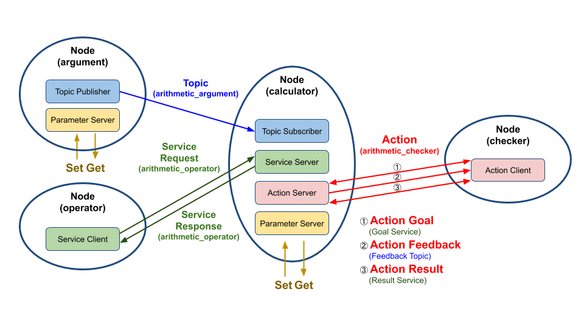

# Chapter 28: ROS 2 패키지 설계 (Python)
## 01. ROS 패키지 설계
- ROS와 연동되는 로봇 프로그램과 일반적인 로봇 프로그램과의 차이는 프로세스를 목적별로 나누어 노드(node) 단위의 프로그램을 작성하고 노드와 노드간의 데이터 통신을 고려하여 설계해야 한다는 것이다.
- 이번 강좌에서는 ROS 2의 토픽, 서비스, 액션 프로그래밍(Python)의 예제이면서 하나의 패키지로 토픽, 서비스, 액션이 따로 구동하는 것이 아닌 연동되어 구동하는 방식으로 설계하였다.
- 이를 위해 그림과 같이 4개의 노드에 토픽, 서비스, 액션 각각 1개씩을 사용하고 있다.
- 각 노드에서는 1개 이상의 토픽 퍼블리셔, 토픽 서브스크라이브, 서비스 서버, 서비스 클라이언트, 액션 서버, 액션 클라이언트를 포함하고 있다.
- 특히 중앙에 있는 노드는 다른 노드들과의 연동에 있어서 가장 핵심적인 역할을 하도록 설계하였고 추후 강좌를 위해서 파라미터(parameter) 및 실행 인자(argument), 런치(launch) 파일이 추가되어 있다.


- 이렇게 설계한 패키지는 topic_service_action_rclpy_example 이라는 이름으로 패키지 명을 명명하였다.
- 이 패키지에서 각각의 노드와 토픽, 서비스, 액션도 고유의 이름을 가지고 있는데 이는 아래 그림과 같다.
- 그림에서의 프로세스를 설명하자면 다음과 같다.

#### 1) argument node
- arithmetic_argument 이라는 토픽 이름으로 현재 시간과 변수 a와 b를 퍼블리시한다.

#### 2) calculator node
- 토픽이 생성된 시간과 변수 a와 b를 서브스크라이브한다.

#### 3) operator node
- arithmetic_operator 이라는 서비스 이름으로 calculator 노드에게 연산자(+, -, *, /)를 서비스 요청값으로 보낸다.

#### 4) calculator node
- 서브스크라이브하여 저장하고 있는 변수 a와 b를 operator 노드로부터 요청 값으로 받은 연산자를 이용하여 계산(a 연산자 b)하고 operator 노드에게 연산의 결괏값을 서비스 응답값으로 보낸다.

#### 5) checker node
- 연산값의 합계의 한계치를 액션 목표값으로 전달한 후, calculator 노드는 이를 받은 후 부터의 연산 값을 합하고 액션 피드백으로 각 연산 계산식을 보낸다.
- 지정한 연산값의 목표 합계를 넘기면 액션 결괏값으로 최종 연산 합계를 보낸다.



## 02. 노드 작성
- 위에서 설명한 topic_service_action_rclpy_example 패키지는 argument 노드, operator 노드, calculator 노드, checker 노드와 같이 4개의 노드로 구성되어 있다.
- 해당 노드의 원본 코드는 참고자료로 올린 리포지토리에서 미리 확인하실 수 있으며 자세한 내용은 아래와 같이 이어지는 강좌에서 자세히 설명할 예정이다.
- 이 강좌에서는 패키지 및 노드 설계 및 빌드, 실행에 대한 내용만을 다룰 예정이다.
    - 029 토픽 프로그래밍 (Python)
    - 030 서비스 프로그래밍 (Python)
    - 031 액션 프로그래밍 (Python)
    - 032 파라미터 프로그래밍 (Python)
    - 033 실행 인자 프로그래밍 (Python)
    - 040 런치 프로그래밍 (Python, C++)
    
## 03. 패키지 설정 파일 (package.xml)
- topic_service_action_rclpy_example 패키지의 설정 파일(package.xml)은 아래와 같이 작성해주자.
```xml
<?xml version="1.0"?>
<?xml-model href="http://download.ros.org/schema/package_format3.xsd" schematypens="http://www.w3.org/2001/XMLSchema"?>
<package format="3">
  <name>topic_service_action_rclpy_example</name>
  <version>0.2.0</version>
  <description>ROS 2 rclpy example package for the topic, service, action</description>
  <maintainer email="passionvirus@gmail.com">Pyo</maintainer>
  <license>Apache License 2.0</license>
  <author email="passionvirus@gmail.com">Pyo</author>
  <author email="routiful@gmail.com">Darby Lim</author>
  <depend>rclpy</depend>
  <depend>std_msgs</depend>
  <depend>msg_srv_action_interface_example</depend>
  <test_depend>ament_copyright</test_depend>
  <test_depend>ament_flake8</test_depend>
  <test_depend>ament_pep257</test_depend>
  <test_depend>python3-pytest</test_depend>
  <export>
    <build_type>ament_python</build_type>
  </export>
</package>
```
- 대부분 이전 강좌에서 설명한 부분인데 이 패키지만의 특별한 설정은 `027 토픽, 서비스, 액션 인터페이스` 강좌에서 작성한 토픽, 서비스, 액션 인터페이스(패키지명: msg_srv_action_interface_example)를 사용할 예정이기에 의존성을 걸어두는 것이다.
- 그 이외에는 특별한 설정은 없다.
```xml
  <depend>msg_srv_action_interface_example</depend>
```

## 04. 파이썬 패키지 설정 파일 (setup.py)
- topic_service_action_rclpy_example 패키지의 파이썬 패키지 설정 파일 (setup.py)의 전문은 다음과 같다.
```py
#!/usr/bin/env python3

import glob
import os

from setuptools import find_packages
from setuptools import setup

package_name = 'topic_service_action_rclpy_example'
share_dir = 'share/' + package_name

setup(
    name=package_name,
    version='0.2.0',
    packages=find_packages(exclude=['test']),
    data_files=[
        ('share/ament_index/resource_index/packages', ['resource/' + package_name]),
        (share_dir, ['package.xml']),
        (share_dir + '/launch', glob.glob(os.path.join('launch', '*.launch.py'))),
        (share_dir + '/param', glob.glob(os.path.join('param', '*.yaml'))),
    ],
    install_requires=['setuptools'],
    zip_safe=True,
    author='Pyo, Darby Lim',
    author_email='passionvirus@gmail.com, routiful@gmail.com',
    maintainer='Pyo',
    maintainer_email='passionvirus@gmail.com',
    keywords=['ROS'],
    classifiers=[
        'Intended Audience :: Developers',
        'License :: OSI Approved :: Apache Software License',
        'Programming Language :: Python',
        'Topic :: Software Development',
    ],
    description='ROS 2 rclpy example package for the topic, service, action',
    license='Apache License, Version 2.0',
    tests_require=['pytest'],
    entry_points={
        'console_scripts': [
            'argument = topic_service_action_rclpy_example.arithmetic.argument:main',
            'operator = topic_service_action_rclpy_example.arithmetic.operator:main',
            'calculator = topic_service_action_rclpy_example.calculator.main:main',
            'checker = topic_service_action_rclpy_example.checker.main:main',
        ],
    },
)
```
- 이 패키지는 여느 다른 파이썬 ROS 패키지와 다를 바 없는데 헤깔일 수 있는 두 가지만 집고 넘어가도록 하자.

### 4-1. data_files
- 첫번째는 `data_files` 설정이다.
- 이 패키지에서 사용되는 파일들을 기입하여 함께 배포하는데 `ROS`에서는 주로 `resource` 폴더 내에 있는 `ament_index`를 위한 패키지의 이름의 빈 파일이나 `package.xml`, `*.launch.py`, `*.yaml` 등을 기입한다.
- 이를 통해 빌드 후에 해당 파일들이 설치 폴더에 추가되게 된다.
- 흔히 "파이썬 ROS 패키지는 빌드하지 않아도 되지 않나?" 생각하기 쉬운데 파이썬 코드 이외에도 해당 패키지의 다양한 파일들을 설치 폴더에 담아야 하기에 빌드 후 심볼링크나 원본이 복사되어 사용된다.
- 즉, 파이썬 ROS 패키지가 파이썬 코드로 구성되어 있기는 하지만 빌드는 해야한다는 점을 잊지 않도록 하자.
- 이 패키지에서도 `arithmetic.launch.py` 이라는 런치 파일과 `arithmetic_config.yaml` 파라미터 파일이 사용된다.
- 이에 하기와 같이 해당 파일들의 설정도 필요한 것이다.
```py
    data_files=[
        ('share/ament_index/resource_index/packages', ['resource/' + package_name]),
        (share_dir, ['package.xml']),
        (share_dir + '/launch', glob.glob(os.path.join('launch', '*.launch.py'))),
        (share_dir + '/param', glob.glob(os.path.join('param', '*.yaml'))),
    ],
```

### 4-2. entry_points
- `entry_points`는 설치하여 사용할 실행 가능한 콘솔 스크립트의 이름과 호출 함수를 기입하도록 되어 있다.
- 우리는 4개의 노드를 작성하고 `ros2 run` 과 같은 노드 실행 명령어를 통하여 각각의 노드를 실행할 예정이기에 하기와 같이 `entry_points`를 추가하도록 하자.
```py
    entry_points={
        'console_scripts': [
            'argument = topic_service_action_rclpy_example.arithmetic.argument:main',
            'operator = topic_service_action_rclpy_example.arithmetic.operator:main',
            'calculator = topic_service_action_rclpy_example.calculator.main:main',
            'checker = topic_service_action_rclpy_example.checker.main:main',
        ],
    },
```

## 05. 소스 코드 다운로드 및 빌드
- 소스 코드 다운로드 및 빌드는 하기와 같은 명령어로 진행하면 된다.
```
$ cd ~/robot_ws/src
$ git clone https://github.com/robotpilot/ros2-seminar-examples.git
$ cd ~/robot_ws && colcon build --symlink-install
```
- 또는 아래와 같이 미리 지정한 alias를 사용하면 매우 편하다.
```
$ cw
$ cbp topic_service_action_rclpy_example
```
- `cw`는 `cd ~/robot_ws`의 alias이다.
- `cbp`는 `colcon build --symlink-install --packages-select`의 alias이다.
- 이 강좌에서 사용되는 alias 설정에 대해서는 `026 ROS 2 Tip`를 참고하자.
- 빌드한 후 빌드에 문제가 없다면 `~/robot_ws/install/topic_service_action_rclpy_example` 폴더 안에 우리가 작성한 ROS 인터페이스를 사욯하기 위한 파일들이 저장되게 된다.
- 예를 들어 하기 폴더에는 argument, operator, calculator, checker와 같은 실행 스크립트가 위치하게 된다. (lib)
```
~/robot_ws/install/topic_service_action_rclpy_example/lib/topic_service_action_rclpy_example
```
- 그리고 하기 폴더에는 launch 폴더와 param 폴더가 생성되고 각각 런치파일 arithmetic.launch.py 파일과 파라미터 파일인arithmetic_config.yaml 파일이 위치하게 된다. (share)
```~/robot_ws/install/topic_service_action_rclpy_example/share/topic_service_action_rclpy_example
```

## 06. 실행
### 6-1. 토픽 서브스크라이버, 서비스 서버, 액션 서버 실행
- 제일 먼저 calculator 노드를 실행해보자.
- 이 노드는 이 패키지에서 토픽 서브스크라이버, 서비스 서버, 액션 서버 역할을 수행하는 노드로 실행 후 아무런 동작은 하고 있지 않은 대기 상태가 된다.
```
$ ros2 run topic_service_action_rclpy_example calculator
```

### 6-2. 토픽 퍼블리셔 실행
- 다음으로 토픽 퍼블리셔 역할을 하는 argument 노드를 실행해보자.
- 그러면 터미널 창에 퍼블리시하고 있는 argument a, argument b가 표시된다.
- 더불어 calculator 노드를 실행 시킨 터미널 창에서는 수신 받은 시간 정보와 argument a, argument b가 표시된다.
```
$ ros2 run topic_service_action_rclpy_example argument
[INFO]: Published argument a: 5.0
[INFO]: Published argument b: 0.0
[INFO]: Published argument a: 1.0
[INFO]: Published argument b: 5.0
```
```
$ ros2 run topic_service_action_rclpy_example calculator
[INFO]: Subscribed at: builtin_interfaces.msg.Time(sec=1607301572, nanosec=687669256)
[INFO]: Subscribed argument a: 5.0
[INFO]: Subscribed argument b: 0.0
[INFO]: Subscribed at: builtin_interfaces.msg.Time(sec=1607301573, nanosec=687576780)
[INFO]: Subscribed argument a: 1.0
[INFO]: Subscribed argument b: 5.0
```

### 6-3. 서비스 클라이언트 실행
- 다음으로 서비스 클라이언트 역할을 하는 operator 노드를 실행해보자.
- 그러면 calculator 노드에게 랜덤으로 선택한 연산자(+, -, *, /)를 서비스 요청값으로 보내고 연산된 결과값을 받아 터미널 창에 표시한다.
- 실제 계산식은 calculator 노드가 실행 중인 창에서 확인할 수 있다.
- 예를 들어 calculator는 변수 a, b로 9와 6을 받았고 연산자로 곱셉(*)을 받았을 때 9.0 * 6.0 = 54.0 이므로 operator는 54.0를 표시하게 된다.
```
$ ros2 run topic_service_action_rclpy_example operator
[INFO]: Result: 54.0
[INFO]: Result: 0.625
```
```
[INFO]: Subscribed at: builtin_interfaces.msg.Time(sec=1607379440, nanosec=275268255)
[INFO]: Subscribed argument a: 9.0
[INFO]: Subscribed argument b: 6.0
[INFO]: 9.0 * 6.0 = 54.0
[INFO]: Subscribed at: builtin_interfaces.msg.Time(sec=1607379441, nanosec=275234062)
[INFO]: Subscribed argument a: 5.0
[INFO]: Subscribed argument b: 8.0
[INFO]: 5.0 / 8.0 = 0.625
```

### 6-4. 액션 클라이언트 실행
- 마지막으로 checker 노드는 연산값의 합계의 한계치를 액션 목표값으로 전달한 후, calculator 노드는 이를 받은 후 부터의 연산 값을 합하고 액션 피드백으로 각 연산 계산식을 보낸다.
- 지정한 연산값의 목표 합계를 넘기면 액션 결괏값으로 최종 연산 합계를 보낸다.
```
$ ros2 run topic_service_action_rclpy_example checker
[INFO]: Action goal accepted.
[INFO]: Action feedback: ['7.0 + 3.0 = 10.0']
[INFO]: Action feedback: ['7.0 + 3.0 = 10.0', '8.0 + 1.0 = 9.0']
[INFO]: Action feedback: ['7.0 + 3.0 = 10.0', '8.0 + 1.0 = 9.0', '6.0 / 1.0 = 6.0']
[INFO]: Action feedback: ['7.0 + 3.0 = 10.0', '8.0 + 1.0 = 9.0', '6.0 / 1.0 = 6.0', '8.0 - 6.0 = 2.0']
[INFO]: Action feedback: ['7.0 + 3.0 = 10.0', '8.0 + 1.0 = 9.0', '6.0 / 1.0 = 6.0', '8.0 - 6.0 = 2.0', '6.0 * 6.0 = 36.0']
[INFO]: Action succeeded!
[INFO]: Action result(all formula): ['7.0 + 3.0 = 10.0', '8.0 + 1.0 = 9.0', '6.0 / 1.0 = 6.0', '8.0 - 6.0 = 2.0', '6.0 * 6.0 = 36.0']
[INFO]: Action result(total sum): 63.0
```
- 합계의 한계치는 기본으로 50으로 설정되어 있다.
- 이를 수정하여 실행하고 싶으면 아래와 같이 checker 노드를 실행시키면서 실행 인자로 `-g 100` 이라고 입력하면 GOAL_TOTAL_SUM 이라는 인자로 100을 할당할 수 있다.
- 여기서 실행인자에 대한 이해가 필요한데 이는 `033 실행 인자 프로그래밍 (Python)` 강좌에서 다룰 예정이다.
```
$ ros2 run topic_service_action_rclpy_example checker -g 100
```

### 6-5. 런치 파일 실행
- 참고로 argument 노드와 calculator 노드를 한번에 실행시키고자 한다면 아래와 같이 launch 파일인 arithmetic.launch.py를 실행하는 방법으로 두개의 노드를 동시에 실행 시킬 수 있다.
- launch 파일에 대한 자세한 설명은 추후 `040 런치 프로그래밍 (Python, C++)` 강좌에서 더 자세히 알아볼 예정이기에 여기서는 실행 방법만 알아보았다.
```
$ ros2 launch topic_service_action_rclpy_example arithmetic.launch.py
```

[출처] 028 ROS 2 패키지 설계 (Python) (오픈소스 소프트웨어 & 하드웨어: 로봇 기술 공유 카페 (오로카)) | 작성자 표윤석
