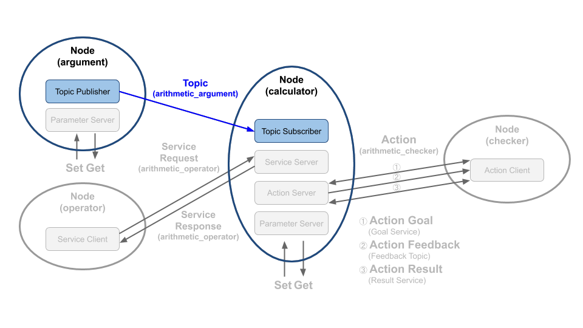

# Chapter 29: 토픽 프로그래밍 (Python)
## 01. 토픽(topic)
- 토픽(topic)은 비동기식 단방향 메시지 송수신 방식으로 msg 메시지 형태의 메시지를 발행하는 퍼블리셔(publisher)와 메시지를 구독하는 서브스크라이버(Subscriber) 간의 통신이라고 볼 수 있다.
- 이는 1:1 통신을 기본으로 하지만 복수의 노드에서 하나의 토픽을 송수신하는 1:N도 가능하고 그 구성 방식에 따라 N:1, N:N 통신도 가능하며 ROS 메시지 통신에서 가장 널리 사용되는 통신 방법이다.
- 우리는 이 강좌에서 그림과 같이 토픽을 생성한 시간과 연산에 사용할 변수 a와 변수 b를 퍼블리시하는 토픽 퍼블리셔와 이를 서브스크라이브하는 토픽 서브스크라이버를 작성해 볼 것이다.
- 이 강좌는 코드를 집중적으로 볼 예정이기에 토픽에 대한 개념에 대한 자세한 내용은 '009 ROS 2 토픽 (topic)' 강좌를 참고하도록 하자.



## 02. 토픽 퍼블리셔 코드
- 토픽 퍼블리셔 역할을 하는 argument 노드의 소스 코드는 깃허브 리포지토리에 위치해놓았다.
- 해당 리포지토리에서 하기의 장소에 관련 코드가 있기에 참고하도록 하자.
```
topic_service_action_rclpy_example/topic_service_action_rclpy_example/arithmetic/argument.py
```
- 토픽 퍼블리셔 역할을 argument 노드의 전체 소스 코드는 아래와 같다.
```py
import random

from msg_srv_action_interface_example.msg import ArithmeticArgument
from rcl_interfaces.msg import SetParametersResult
import rclpy
from rclpy.node import Node
from rclpy.parameter import Parameter
from rclpy.qos import QoSDurabilityPolicy
from rclpy.qos import QoSHistoryPolicy
from rclpy.qos import QoSProfile
from rclpy.qos import QoSReliabilityPolicy


class Argument(Node):

    def __init__(self):
        super().__init__('argument')
        self.declare_parameter('qos_depth', 10)
        qos_depth = self.get_parameter('qos_depth').value
        self.declare_parameter('min_random_num', 0)
        self.min_random_num = self.get_parameter('min_random_num').value
        self.declare_parameter('max_random_num', 9)
        self.max_random_num = self.get_parameter('max_random_num').value
        self.add_on_set_parameters_callback(self.update_parameter)

        QOS_RKL10V = QoSProfile(
            reliability=QoSReliabilityPolicy.RELIABLE,
            history=QoSHistoryPolicy.KEEP_LAST,
            depth=qos_depth,
            durability=QoSDurabilityPolicy.VOLATILE)

        self.arithmetic_argument_publisher = self.create_publisher(
            ArithmeticArgument,
            'arithmetic_argument',
            QOS_RKL10V)

        self.timer = self.create_timer(1.0, self.publish_random_arithmetic_arguments)

    def publish_random_arithmetic_arguments(self):
        msg = ArithmeticArgument()
        msg.stamp = self.get_clock().now().to_msg()
        msg.argument_a = float(random.randint(self.min_random_num, self.max_random_num))
        msg.argument_b = float(random.randint(self.min_random_num, self.max_random_num))
        self.arithmetic_argument_publisher.publish(msg)
        self.get_logger().info('Published argument a: {0}'.format(msg.argument_a))
        self.get_logger().info('Published argument b: {0}'.format(msg.argument_b))

    def update_parameter(self, params):
        for param in params:
            if param.name == 'min_random_num' and param.type_ == Parameter.Type.INTEGER:
                self.min_random_num = param.value
            elif param.name == 'max_random_num' and param.type_ == Parameter.Type.INTEGER:
                self.max_random_num = param.value
        return SetParametersResult(successful=True)


def main(args=None):
    rclpy.init(args=args)
    try:
        argument = Argument()
        try:
            rclpy.spin(argument)
        except KeyboardInterrupt:
            argument.get_logger().info('Keyboard Interrupt (SIGINT)')
        finally:
            argument.destroy_node()
    finally:
        rclpy.shutdown()


if __name__ == '__main__':
    main()
```
- 이 중 토픽 퍼블리셔와 관련한 코드는 아래에 간추려 놓았다.
- 우선 Argument 클래스인데 rclpy.node 모듈의 Node 클래스를 상속하고 있으며 생성자에서 'argument' 이라는 노드 이름으로 초기화되었다.
- 그 뒤 rclpy.qos 모듈의 QoSProfile 클래스를 이용하여 토픽 퍼블리셔에서 사용할 QoS 설정을 해주었다.
- 여기서 QoS는 RELIABLE, KEEP_LAST, DEPTH 10, VOLATILE로 설정하였다.
- QoS에 대한 자세한 설명은 '019 DDS의 QoS(Quality of Service)' 강좌를 참고하자.
```py
class Argument(Node):

    def __init__(self):
        super().__init__('argument')

        (일부 코드 생략)

        QOS_RKL10V = QoSProfile(
            reliability=QoSReliabilityPolicy.RELIABLE,
            history=QoSHistoryPolicy.KEEP_LAST,
            depth=qos_depth,
            durability=QoSDurabilityPolicy.VOLATILE)
```
- 제일 중요한 설정은 arithmetic_argument_publisher 선언이다.
- 이는 Node 클래스의 create_publisher 함수를 이용하여 퍼블리셔를 선언하는 부분으로 토픽의 타입으로 ArithmeticArgument으로 선언하였고, 토픽 이름으로는 'arithmetic_argument', QoS는 위에서 설정한 QOS_RKL10V를 사용하였다.
```py
        self.arithmetic_argument_publisher = self.create_publisher(
            ArithmeticArgument,
            'arithmetic_argument',
            QOS_RKL10V)
```
- 그리고 마지막 줄에서 create_timer 함수를 이용하여 1초마다 publish_random_arithmetic_arguments 이라는 함수를 실행시키도록 설정하였다.
- 이전 설정들은 퍼블리시를 위한 기본 설정이고 실제 토픽 발행이 이루어지는 부분은 publish_random_arithmetic_arguments 함수임을 알아두자.
```py
        self.timer = self.create_timer(1.0, self.publish_random_arithmetic_arguments)
```
- 다음으로 publish_random_arithmetic_arguments 함수의 내용을 보도록 하자.
- 이 함수는 지정 타이머로 동작하는 콜백함수이며 1초마다 실행되며 매번 실행될 때 마다 msg 이라는 변수를 우리가 지난 `027 토픽, 서비스, 액션 인터페이스` 강좌에서 작성한 msg 인터페이스의 ArithmeticArgument() 클래스로 생성해주었고 get_clock().now().to_msg() 함수를 통하여 토픽이 생성된 시간을 msg.stamp에 기록해두었다.
- 그 뒤 랜덤 함수를 통해 0~9까지의 숫자를 float로 변환하여 msg.argument_a와 msg.argument_b에 저장하였다.
- 그 뒤 이어지는 arithmetic_argument_publisher.publish(msg) 함수가 실제로 토픽 발행이 이루어지는 함수로 우리가 발행 시간 및 변수 a, b를 저장한 msg 메시지를 퍼블리쉬한다는 의미이다.
- 마지막으로 get_logger().info()는 주로 디버깅에 사용되는 함수로 노드를 실행한 터미널 창에 특정 값을 표시하게 된다.
- 여기서는 토픽으로 보낸 변수 a, b 값을 화면에 표시하고 있다.
```py
    def publish_random_arithmetic_arguments(self):
        msg = ArithmeticArgument()
        msg.stamp = self.get_clock().now().to_msg()
        msg.argument_a = float(random.randint(self.min_random_num, self.max_random_num))
        msg.argument_b = float(random.randint(self.min_random_num, self.max_random_num))
        self.arithmetic_argument_publisher.publish(msg)
        self.get_logger().info('Published argument a: {0}'.format(msg.argument_a))
        self.get_logger().info('Published argument b: {0}'.format(msg.argument_b))
```

## 03. 토픽 서브스크라이버 코드
- 토픽 서브스크라이버 역할을 하는 calculator 노드의 소스 코드는 위와 마찬가지로 깃허브 리포지토리에 위치해 놓았다.
- 해당 리포지토리에서 하기의 장소에 관련 코드가 있기에 참고하도록 하자.
```
topic_service_action_rclpy_example/topic_service_action_rclpy_example/calculator/calculator.py
```
- 이 소스 코드는 토픽 서브스크라이버, 서비스 서버, 액션 서버를 모두 포함하고 있어서 매우 길기 때문에 전체 코드를 강좌 글에 담는 것은 생략하도록 하고 전체 소스 코드 중 토픽 서브스크라이버와 관련한 코드는 아래와 같다.
- 우선 Calculator 클래스인데 토픽 퍼블리셔 노드와 마찬가지로 rclpy.node 모듈의 Node 클래스를 상속하고 있으며 생성자에서 'calculator' 이라는 노드 이름으로 초기화되었다.
- 그 뒤 위에서와 마찬가지로 rclpy.qos 모듈의 QoSProfile 클래스를 이용하여 토픽 서브스크라버에서 사용할 QoS 설정을 해주었다.
- 여기서 QoS는 앞서 설명한 토픽 퍼블리셔 노드와 동일하게 RELIABLE, KEEP_LAST, DEPTH 10, VOLATILE로 설정하였다.
- QoS에 대한 자세한 설명은 '019 DDS의 QoS(Quality of Service)' 강좌를 참고하자.
```py
class Calculator(Node):

    def __init__(self):
        super().__init__('calculator')
        self.argument_a = 0.0
        self.argument_b = 0.0
        self.callback_group = ReentrantCallbackGroup()

        (일부 코드 생략)

        QOS_RKL10V = QoSProfile(
            reliability=QoSReliabilityPolicy.RELIABLE,
            history=QoSHistoryPolicy.KEEP_LAST,
            depth=qos_depth,
            durability=QoSDurabilityPolicy.VOLATILE)
```
- 제일 중요한 설정은 arithmetic_argument_subscriber 선언이다.
- 이는 Node 클래스의 create_subscription 함수를 이용하여 서브스크라이버로 선언하는 부분으로 토픽의 타입으로 퍼블리셔와 동일하게 ArithmeticArgument으로 선언하였고, 토픽 이름으로는 'arithmetic_argument', QoS는 위에서 설정한 QOS_RKL10V를 사용하였다.
- 여기까지는 퍼블리셔와 비슷한데 퍼블리셔와 다른점은 get_arithmetic_argument 라는 콜백함수를 두어 퍼블리셔로부터 메시지를 서브스크라이브할 때 마다 실행되는 함수를 지정한 것이다.
- 그리고 callback_group을 ReentrantCallbackGroup으로 지정했는데 콜백함수를 병렬로 실행할 수 있게 해주며 뒤에서 설명할 MultiThreadedExecutor와 함께 사용되곤 한다.
- 좀 더 자세히 callback_group을 설명하자면 원래 callback_group은 지정하지 않아도 되는데 지정하지 않게 되면 MutuallyExclusiveCallbackGroup이 기본 설정으로 사용된다.
- MutuallyExclusiveCallbackGroup은 한 번에 하나의 콜백함수만 실행하도록 허용하는 것이고, 다른 하나의 설정은 ReentrantCallbackGroup으로써 제한없이 콜백함수를 병렬로 실행할 수 있게 해준다.
- 이러한 callback_group 설정은 create_subscription(), create_service(), ActionServer(), create_timer()에서 사용됨을 알아두도록 하자.
```py
        self.arithmetic_argument_subscriber = self.create_subscription(
            ArithmeticArgument,
            'arithmetic_argument',
            self.get_arithmetic_argument,
            QOS_RKL10V,
            callback_group=self.callback_group)
```
- 하기의 get_arithmetic_argument 함수는 앞서서 콜백함수라 설명하였다.
- 이 함수는 `arithmetic_argument`이라는 토픽 이름에 ArithmeticArgument 타입의 메시지를 서브스크라이브하게 되면 실행되는 함수이다.
- 서브스크라이브한 msg의 argument_a와 argument_b를 멤버 변수에 저장하고 get_logger().info() 함수를 이용하여 토픽으로 받은 시간, 변수 a, b 값을 화면에 표시하고 있다.
```py
    def get_arithmetic_argument(self, msg):
        self.argument_a = msg.argument_a
        self.argument_b = msg.argument_b
        self.get_logger().info('Subscribed at: {0}'.format(msg.stamp))
        self.get_logger().info('Subscribed argument a: {0}'.format(self.argument_a))
        self.get_logger().info('Subscribed argument b: {0}'.format(self.argument_b))
```

## 04. 토픽 퍼블리셔, 서브스크라이버 복습!
- 설명이 좀 길었으니 여기서 정리하고 넘어가자.
- 토픽은 아래와 같이 설정하여 사용하면 된다!

### 4-1. 토픽 퍼블리셔 (데이터를 송신하는 프로그램)
1. Node 설정
2. QoS 설정
3. create_publisher 설정
4. 퍼블리시 함수 작성

### 4-2. 토픽 서브스크라이버 (데이터를 수신하는 프로그램)
1. Node 설정
2. QoS 설정
3. create_subscription 설정
4. 서브스크라이브 함수 작성

## 05. 노드 실행 코드
- 지난 강좌에서 소스 코드를 집중적으로 보기전에 빌드하여 노드들을 실행해보는 실습시간을 가졌다.
- 이번에는 이 실행 노드를 어떻게 설정해야 사용 가능하게 되는지 알아보도록 하자.
- 우선 이전 강의에서 익힌 관련된 두 가지의 노드 실행 명령어는 다음과 같다.
- calculator가 이 강좌에서 다룬 토픽 서브스크라이버 노드이고, argument는 토픽 퍼블리셔 노드이다.
```
$ ros2 run topic_service_action_rclpy_example calculator
```
```
$ ros2 run topic_service_action_rclpy_example argument
```
- 이 두 개의 노드는 지난 강좌의 "3. 파이썬 패키지 설정 파일 (setup.py)" 의 "3.2 entry_points" 부분에서 이미 설명하였던 부분이다.
- `entry_points`는 설치하여 사용할 실행 가능한 콘솔 스크립트의 이름과 호출 함수를 기입하도록 되어 있는데 우리는 4개의 노드를 작성하고 `ros2 run` 과 같은 노드 실행 명령어를 통하여 각각의 노드를 실행할 예정이기에 하기와 같이 `entry_points`를 추가했었다.
- argument 노드는 topic_service_action_rclpy_example 패키지의 arithmetic 폴더에 argument.py의 main문에 실행 코드가 담겨져 있고, calculator 노드는 topic_service_action_rclpy_example 패키지의 calculator 폴더에 main.py의 main문에 실행 코드가 담겨져있다.
```py
    entry_points={
        'console_scripts': [
            'argument = topic_service_action_rclpy_example.arithmetic.argument:main',
            'operator = topic_service_action_rclpy_example.arithmetic.operator:main',
            'calculator = topic_service_action_rclpy_example.calculator.main:main',
            'checker = topic_service_action_rclpy_example.checker.main:main',
        ],
    },
```
- 우선 argument 노드부터 살펴보자.
- main 함수로 rclpy.init를 이용하여 초기화하고 위에서 작성한 Argument 클래스를 argument라는 이름으로 생성한 다음 rclpy.spin 함수를 이용하여 생성한 노드를 spin시켜 지정된 콜백함수가 실행될 수 있도록 하고 있다.
- 그리고 종료 `Ctrl + c`와 같은 인터럽트 시그널 예외 상황에서는 argument를 소멸시키고 rclpy.shutdown 함수로 노드를 종료하게 된다.
```py
def main(args=None):
    rclpy.init(args=args)
    try:
        argument = Argument()
        try:
            rclpy.spin(argument)
        except KeyboardInterrupt:
            argument.get_logger().info('Keyboard Interrupt (SIGINT)')
        finally:
            argument.destroy_node()
    finally:
        rclpy.shutdown()


if __name__ == '__main__':
    main()
```
- 다음으로 아래의 calculator 노드를 살펴보자.
- main 함수로 rclpy.init를 이용하여 초기화하고 위에서 작성한 Calculator 클래스를 calculator라는 이름으로 생성한 다음 MultiThreadedExecutor로 스레드 4개를 사용하는 executor를 생성하였다.
- 여기서 생소한 MultiThreadedExecutor이 나왔는데 MultiThreadedExecutor는 스레드 풀(thread pool)을 사용하여 콜백을 실행하는 것이다.
- num_threads로 스레드 수를 지정 가능하며 이를 지정되지 않은 경우 multiprocessing.cpu_count()를 통해 시스템에서 가용한 스레드 수를 지정받게 된다.
- 이 둘 모두 해당되지 않는다면 단일 스레드를 사용하게 된다. 이 Executor는 콜백이 병렬로 발생하도록 허용하여 앞서 설명한 ReentrantCallbackGroup와 함께 사용하면 콜백함수를 병렬로 실행할 수 있게된다.
- 그 말인즉슨 create_subscription(), create_service(), ActionServer(), create_timer() 등의 함수를 이용하여 설정한 토픽 퍼블리셔의 콜백함수, 서비스 서버의 콜백함수, 액션 서버의 콜백함수, 특정 타이머의 콜백함수 등의 병렬 처리를 설정하는 방법이라고 보면 된다.
- 이어서 설명하면 MultiThreadedExecutor으로 선언된 executor에 calculator 노드를 추가하고 executor.spin() 이용하여 생성한 노드를 spin시켜 지정된 콜백함수가 실행될 수 있도록 하고 있다.
- 그리고 종료 `Ctrl + c`와 같은 인터럽트 시그널 예외 상황에서는 executor, calculator의 액션 서버(액션 서버는 별도로 소멸시켜야함), calculator를 소멸시키고 rclpy.shutdown 함수로 노드를 종료하게 된다.
```py
import rclpy
from rclpy.executors import MultiThreadedExecutor

from topic_service_action_rclpy_example.calculator.calculator import Calculator


def main(args=None):
    rclpy.init(args=args)
    try:
        calculator = Calculator()
        executor = MultiThreadedExecutor(num_threads=4)
        executor.add_node(calculator)
        try:
            executor.spin()
        except KeyboardInterrupt:
            calculator.get_logger().info('Keyboard Interrupt (SIGINT)')
        finally:
            executor.shutdown()
            calculator.arithmetic_action_server.destroy()
            calculator.destroy_node()
    finally:
        rclpy.shutdown()


if __name__ == '__main__':
    main()
```

[출처] 029 토픽 프로그래밍 (Python) (오픈소스 소프트웨어 & 하드웨어: 로봇 기술 공유 카페 (오로카)) | 작성자 표윤석
