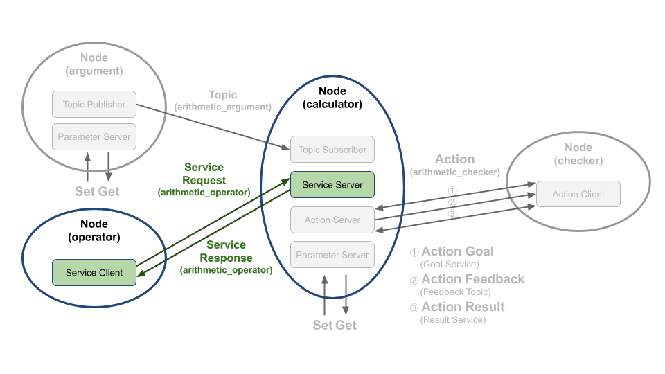

# Chapter 30: 서비스 프로그래밍 (Python)
## 01. 서비스(service)
- 서비스(service)는 동기식 양방향 메시지 송수신 방식으로 서비스의 요청(Request)을 하는 쪽을 서비스 클라이언트(Service Client)라고 하며 요청받은 서비스를 수행한 후 서비스의 응답(Response)을 하는 쪽을 서비스 서버(Service Server)라고 한다.
- 결국 서비스는 특정 요청을 하는 클라이언트 단과 요청받은 일을 수행한 후에 결괏값을 전달하는 서버 단과의 통신이라고 볼 수 있다.
- 우리는 이 강좌에서 그림 1과 같은 서비스 요청을 하는 서비스 클라이언트와 서비스 응답을 하는 서비스 서버를 작성해 볼 것이다.
- 여기서 서비스 요청 값으로는 연산자(+, -, *, /)를 임의로 선택 후에 보낼 것이고 기존에 저장한 변수 a, b를 요청 값으로 받은 연산자로 계산하여 결괏값을 서비스 응답 값으로 보내는 프로그램을 짜볼 것이다.
- 강좌 진행에 앞서서 서비스에 대한 자세한 내용은 '010 ROS 2 서비스 (service)' 강좌를 참고하도록 하자.

### 1-1. operator node
- arithmetic_operator 이라는 서비스 이름으로 calculator 노드에게 연산자(+, -, *, /)를 서비스 요청(Request)값으로 보낸다.

### 1-2. calculator node
- 서브스크라이브하여 저장하고 있는 변수 a와 b와 operator 노드로부터 요청 값으로 받은 연산자를 이용하여 계산(a 연산자 b)하고 operator 노드에게 연산의 결괏값을 서비스 응답(Response)값으로 보낸다.



## 02. 서비스 서버 코드
- 서비스 서버 역할을 하는 calculator 노드의 소스 코드는 깃허브 리포지토리에 위치해놓았다.
- 해당 리포지토리에서 하기의 장소에 관련 코드가 있기에 참고하도록 하자.
```
topic_service_action_rclpy_example/topic_service_action_rclpy_example/calculator/calculator.py
```
- 이 코드는 이전 강좌에서 토픽 서브스크라이버를 설명하였을 때 소개하였던 노드로써 서비스 서버, 액션 서버를 모두 포함하고 있어서 매우 길기 때문에 전체 코드를 강좌 글에 담는 것은 생략하도록 하고 전체 소스 코드 중 서비스 서버와 관련한 코드에 대한 설명한 하기로 하자.
- calculator 노드는 서브스크라이브하여 저장하고 있는 변수 a와 b와 operator 노드로부터 요청 값으로 받은 연산자를 이용하여 계산(a 연산자 b)하고 operator 노드에게 연산의 결괏값을 서비스 응답값으로 보낸다.
- 이 중 서비스 서버와 관련한 코드는 아래와 같다.
- 서버 관련 코드는 서비스 서버로 선언하는 부분과 콜백함수를 지정하는 것이다.
- arithmetic_service_server이 서비스 서버로 이는 Node 클래스의 create_service 함수를 이용하여 서비스 서버로 선언되었으며 서비스의 타입으로 ArithmeticOperator으로 선언하였고, 서비스 이름으로는 'arithmetic_operator', 서비스 클라이언트로부터 서비스 요청이 있으면 실행되는 콜백함수는 get_arithmetic_operator 으로 지정했으며 멀티 스레드 병렬 콜백함수 실행을 위해 지난번 강좌에서 설명한 callback_group 설정을 하였다.
- 이러한 설정들은 서비스 서버를 위한 기본 설정이고 실제 서비스 요청에 해당되는 특정 수행 코드가 수행되는 부분은 get_arithmetic_operator 이라는 콜백함수임을 알아두자.
```py
        self.arithmetic_service_server = self.create_service(
            ArithmeticOperator,
            'arithmetic_operator',
            self.get_arithmetic_operator,
            callback_group=self.callback_group)
```
- 자 그러면 get_arithmetic_operator 함수의 내용을 보도록 하자.
- 우선 제일 먼저 request와 response 이라는 매개 변수가 보이는데 이는 ArithmeticOperator() 클래스로 생성된 인터페이스로 서비스 요청에 해당되는 request 부분과 응답에 해당되는 response으로 구분된다.
- get_arithmetic_operator 함수는 서비스 요청이 있을 때 실행되는 콜백함수인데 여기서는 서비스 요청시 요청값으로 받은 연산자와 이전에 토픽 서브스크라이버가 토픽 값으로 전달받아 저장해둔 변수 a, b를 전달받은 연산자로 연산 후에 결괏값을 서비스 응답값으로 반환한다.
- 이 함수의 첫 줄에서 request.arithmetic_operator를 받아와서 calculate_given_formula 함수에서 서비스 요청값으로 받은 연산자에 따라 연산하는 코드를 볼 수 있을 것이다.
- calculate_given_formula 함수로부터 받은 연산 결괏값은 response.arithmetic_result에 저장하고 끝으로 관련 수식을 문자열로 표현하여 get_logger().info() 함수를 통해 화면에 표시하고 있다.
```py
    def get_arithmetic_operator(self, request, response):
        self.argument_operator = request.arithmetic_operator
        self.argument_result = self.calculate_given_formula(
            self.argument_a,
            self.argument_b,
            self.argument_operator)
        response.arithmetic_result = self.argument_result
        self.argument_formula = '{0} {1} {2} = {3}'.format(
                self.argument_a,
                self.operator[self.argument_operator-1],
                self.argument_b,
                self.argument_result)
        self.get_logger().info(self.argument_formula)
        return response
```
- 하기 함수는 calculate_given_formula 함수로 앞서 설명한 것과 같이 인수 a, b를 가지고 주어진 연산자 operator에 따라 사칙연산을 하여 결괏값을 반한다.
```py
    def calculate_given_formula(self, a, b, operator):
        if operator == ArithmeticOperator.Request.PLUS:
            self.argument_result = a + b
        elif operator == ArithmeticOperator.Request.MINUS:
            self.argument_result = a - b
        elif operator == ArithmeticOperator.Request.MULTIPLY:
            self.argument_result = a * b
        elif operator == ArithmeticOperator.Request.DIVISION:
            try:
                self.argument_result = a / b
            except ZeroDivisionError:
                self.get_logger().error('ZeroDivisionError!')
                self.argument_result = 0.0
                return self.argument_result
        else:
            self.get_logger().error(
                'Please make sure arithmetic operator(plus, minus, multiply, division).')
            self.argument_result = 0.0
        return self.argument_result
```

## 03. 서비스 서버 실행 코드
- 서비스 서버인 calculator 노드는 토픽 서브스크라이버, 서비스 서버, 액션 서버를 역할을 하는 복합 기능의 노드로 실행 코드에 대한 설명은 '029 토픽 프로그래밍 (Python)'에서 이미 다루었기에 아래 코드에 대한 설명은 해당 강좌를 다시 보도록 하자.
```py
import rclpy
from rclpy.executors import MultiThreadedExecutor

from topic_service_action_rclpy_example.calculator.calculator import Calculator


def main(args=None):
    rclpy.init(args=args)
    try:
        calculator = Calculator()
        executor = MultiThreadedExecutor(num_threads=4)
        executor.add_node(calculator)
        try:
            executor.spin()
        except KeyboardInterrupt:
            calculator.get_logger().info('Keyboard Interrupt (SIGINT)')
        finally:
            executor.shutdown()
            calculator.arithmetic_action_server.destroy()
            calculator.destroy_node()
    finally:
        rclpy.shutdown()


if __name__ == '__main__':
    main()
```

## 04. 서비스 클라이언트 코드
- 서비스 클라이언트 역할을 하는 operator 노드의 소스 코드는 깃허브 리포지토리에 위치해놓았다.
- 해당 리포지토리에서 하기의 장소에 관련 코드가 있기에 참고하도록 하자.
```topic_service_action_rclpy_example/topic_service_action_rclpy_example/arithmetic/operator.py
```
- 서비스 클라이언트의 전체 코드는 아래와 같다.
```py
import random

from msg_srv_action_interface_example.srv import ArithmeticOperator
import rclpy
from rclpy.node import Node


class Operator(Node):

    def __init__(self):
        super().__init__('operator')

        self.arithmetic_service_client = self.create_client(
            ArithmeticOperator,
            'arithmetic_operator')

        while not self.arithmetic_service_client.wait_for_service(timeout_sec=0.1):
            self.get_logger().warning('The arithmetic_operator service not available.')

    def send_request(self):
        service_request = ArithmeticOperator.Request()
        service_request.arithmetic_operator = random.randint(1, 4)
        futures = self.arithmetic_service_client.call_async(service_request)
        return futures


def main(args=None):
    rclpy.init(args=args)
    operator = Operator()
    future = operator.send_request()
    user_trigger = True
    try:
        while rclpy.ok():
            if user_trigger is True:
                rclpy.spin_once(operator)
                if future.done():
                    try:
                        service_response = future.result()
                    except Exception as e:  # noqa: B902
                        operator.get_logger().warn('Service call failed: {}'.format(str(e)))
                    else:
                        operator.get_logger().info(
                            'Result: {}'.format(service_response.arithmetic_result))
                        user_trigger = False
            else:
                input('Press Enter for next service call.')
                future = operator.send_request()
                user_trigger = True

    except KeyboardInterrupt:
        operator.get_logger().info('Keyboard Interrupt (SIGINT)')

    operator.destroy_node()
    rclpy.shutdown()


if __name__ == '__main__':
    main()
```
- 우선 Operator 클래스인데 rclpy.node 모듈의 Node 클래스를 상속하고 있으며 생성자에서 'operator' 이라는 노드 이름으로 초기화되었다.
- 그 뒤 arithmetic_service_client이라는 이름으로 서비스 클라이언트를 선언해주는데 이는 Node 클래스의 create_client 함수를 이용하여 서비스 클라이언트로 선언하는 부분으로 서비스의 타입으로 서비스 서버와 동일하게 ArithmeticOperator으로 선언하였고, 서비스 이름으로는 'arithmetic_operator'으로 선언하였다.
- arithmetic_service_client 의 wait_for_service 함수는 서비스 요청을 할 수 있는 상태인지 알아보기 위해 서비스 서버가 실행되어 있는지 확인하는 함수로 0.1초 간격으로 서비스 서버가 실행되어 있는지 확인하게 된다.
```py
class Operator(Node):

    def __init__(self):
        super().__init__('operator')

        self.arithmetic_service_client = self.create_client(
            ArithmeticOperator,
            'arithmetic_operator')

        while not self.arithmetic_service_client.wait_for_service(timeout_sec=0.1):
            self.get_logger().warning('The arithmetic_operator service not available.')
```
- 우리가 작성하고 있는 서비스 클라이언트의 목적은 서비스 서버에게 연산에 필요한 연산자를 보내는 것이라고 했다.
- 이 send_request 함수가 실질적인 서비스 클라이언트의 실행 코드로 서비스 서버에게 서비스 요청값을 보내고 응답값을 받게 된다.
- 서비스 요청값을 보내기 위하여 제일 먼저 우리가 미리 작성해둔 서비스 인터페이스 ArithmeticOperator.Request() 클래스로 service_request를 선언하였고 서비스 요청값으로 random.randint() 함수를 이용하여 특정 연산자를 self.request의 arithmetic_operator 변수에 저장하였다.
- 그 뒤 'call_async(self.request)' 함수로 서비스 요청을 수행하게 설정하였다.
- 끝으로 서비스 상태 및 응답값을 담은 futures를 반환하게 된다.
```py
    def send_request(self):
        service_request = ArithmeticOperator.Request()
        service_request.arithmetic_operator = random.randint(1, 4)
        futures = self.arithmetic_service_client.call_async(service_request)
        return futures
```

## 05. 서비스 클라이언트 노드 실행 코드
- 서비스 클라이언트 노드인 operator 노드는 'topic_service_action_rclpy_example' 패키지의 일부로 패키지 설정 파일에 'entry_points'로 실행 가능한 콘솔 스크립트의 이름과 호출 함수를 기입하도록 되어 있는데 우리는 하기와 같이 4개의 노드를 작성하고 'ros2 run' 과 같은 노드 실행 명령어를 통하여 각각의 노드를 실행시키고 있다.
- operator 노드는 topic_service_action_rclpy_example 패키지의 arithmetic 폴더에 operator.py의 main문에 실행 코드가 담겨져 있다.
```py
    entry_points={
        'console_scripts': [
            'argument = topic_service_action_rclpy_example.arithmetic.argument:main',
            'operator = topic_service_action_rclpy_example.arithmetic.operator:main',
            'calculator = topic_service_action_rclpy_example.calculator.main:main',
            'checker = topic_service_action_rclpy_example.checker.main:main',
        ],
    },
```
- 즉, 하기와 같은 main함수가 실행 코드인데 rclpy.init를 이용하여 초기화하고 위에서 작성한 Operator 클래스를 operator라는 이름으로 생성한 다음 future = operator.send_request() 와 같이 서비스 요청을 보내고 응답값을 받게된다.
- 그 뒤 rclpy.spin_once 함수를 이용하여 생성한 노드를 주기적으로 spin시켜 지정된 콜백함수가 실행될 수 있도록 하고 있다.
- 이때 매 spin마다 노드의 콜백함수가 실행되고 서비스 응답값을 받았을 때 future의 done 함수를 이용해 요청값을 제대로 받았는지 확인 후 결괏값은 service_response = future.result() 같이 service_response라는 변수에 저장하여 사용하게 된다.
- 서비스 응답값은 get_logger().info() 함수를 이용하여 화면에 서비스 응답값에 해당되는 연산 결괏값을 표시하는 것이다.
- 그리고 종료 `Ctrl + c`와 같은 인터럽트 시그널 예외 상황에서는 operator를 소멸시키고 rclpy.shutdown 함수로 노드를 종료하게 된다.
```py
def main(args=None):
    rclpy.init(args=args)
    operator = Operator()
    future = operator.send_request()
    user_trigger = True
    try:
        while rclpy.ok():
            if user_trigger is True:
                rclpy.spin_once(operator)
                if future.done():
                    try:
                        service_response = future.result()
                    except Exception as e:  # noqa: B902
                        operator.get_logger().warn('Service call failed: {}'.format(str(e)))
                    else:
                        operator.get_logger().info(
                            'Result: {}'.format(service_response.arithmetic_result))
                        user_trigger = False
            else:
                input('Press Enter for next service call.')
                future = operator.send_request()
                user_trigger = True

    except KeyboardInterrupt:
        operator.get_logger().info('Keyboard Interrupt (SIGINT)')

    operator.destroy_node()
    rclpy.shutdown()


if __name__ == '__main__':
    main()
```
- 참고로 서비스 클라이언트는 실행한 후 종료되는 컨셉으로 전 강좌에서 설명한 토픽과 같은 지속적인 수행은 하지는 않는다.
- 하지만 예제 작성을 위해 원하는 시점에 서비스 요청을 다시 전송하기 위하여 여기서는 user_trigger 변수와 input('xxxxx') 를 이용하여 처음 노드가 실행되면 최초 1회에 한해서는 바로 임의의 연산자를 서비스 요청값으로 서비스 서버에게 전달한 후 노드가 종료되기 전까지 사용자의 입력값을 받아 다시 임의의 연산자를 랜덤으로 골라 해당 연산자를 서비스 요청값으로 보내게 된다.
- 즉. 최초 서비스 요청값 전달 이후 서비스 요청을 다시하려면 operator 노드를 실행시킨 터미널 창에 엔터키를 누르면된다.
- 그러면 연산자 가 사칙연사자(+, -, * , /)  중 랜덤으로 골라져 연산 결과값이 달라짐을 확인할 수 있다.
```py
    future = operator.send_request()
    user_trigger = True

    try:
        while rclpy.ok():
            if user_trigger is True:

                # 서비스 응답값 확인 코드

            else:
                input('Press Enter for next service call.')
                future = operator.send_request()  # 서비스 요청값 전송
                user_trigger = True
```

[출처] 030 서비스 프로그래밍 (Python) (오픈소스 소프트웨어 & 하드웨어: 로봇 기술 공유 카페 (오로카)) | 작성자 표윤석
