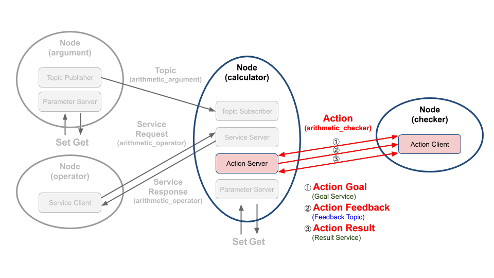

# Chapter 31: 액션 프로그래밍 (Python)
## 01. 액션(action)
- 액션(action)은 비동기식+동기식 양방향 메시지 송수신 방식으로 액션 목표 (goal)를 지정하는 액션 클라이언트(Action Client)와 액션 목표를 받아 특정 태스크를 수행하면서 중간 결괏값에 해당되는 액션 피드백(feedback)과 최종 결괏값에 해당되는 액션 결과(result)를 전송하는 액션 서버(Action Server) 간의 통신이라고 볼 수 있다.
- 우리는 이 강좌에서 그림과 같은 액션 목표(action goal)를 지정하는 액션 클라이언트와 액션 목표를 받아 특정 태스크를 수행하면서 중간 결괏값에 해당되는 액션 피드백(action feedback)과 최종 결괏값에 해당되는 액션 결과(action result)를 전송하는 액션 서버를 작성해 볼 것이다.
- 강좌 진행에 앞서서 액션에 대한 자세한 내용은 '011 ROS 2 액션 (action)' 강좌를 참고하도록 하자.



- 좀 더 세부 설명을 덧붙이자면 이 코드에서의 액션 목표로는 이전 강좌에서 설명하였던 매회 계산 값 합계의 최댓값이고 액션 피드백은 계산 공식의 문자열 값, 액션 결과는 매회 계산 값 합계가 지정된 액션 목표값에 도달하였을 때의 값이다.
- 예를 들어 액션 서버 클라이언트 역할을 하는 topic_service_action_rclpy_example 패키지의 checker 노드를 실행하면 하기와 같이 기본 액션 목표값으로 50으로 지정되고 매회 계산된 값이 10, 9, 6, 2, 36 일 때 지정된 50을 넘는 63이기에 63이 나오기 까지의 계산식을 피드백으로 받을 수 있고 최종 결괏값으로 모든 계산식을 받아 표시하고 있다.
```
$ ros2 run topic_service_action_rclpy_example checker
[INFO]: Action goal accepted.
[INFO]: Action feedback: ['7.0 + 3.0 = 10.0']
[INFO]: Action feedback: ['7.0 + 3.0 = 10.0', '8.0 + 1.0 = 9.0']
[INFO]: Action feedback: ['7.0 + 3.0 = 10.0', '8.0 + 1.0 = 9.0', '6.0 / 1.0 = 6.0']
[INFO]: Action feedback: ['7.0 + 3.0 = 10.0', '8.0 + 1.0 = 9.0', '6.0 / 1.0 = 6.0', '8.0 - 6.0 = 2.0']
[INFO]: Action feedback: ['7.0 + 3.0 = 10.0', '8.0 + 1.0 = 9.0', '6.0 / 1.0 = 6.0', '8.0 - 6.0 = 2.0', '6.0 * 6.0 = 36.0']
[INFO]: Action succeeded!
[INFO]: Action result(all formula): ['7.0 + 3.0 = 10.0', '8.0 + 1.0 = 9.0', '6.0 / 1.0 = 6.0', '8.0 - 6.0 = 2.0', '6.0 * 6.0 = 36.0']
[INFO]: Action result(total sum): 63.0
```

## 02. 액션 서버 코드
- 액션 서버 역할을 하는 calculator 노드의 소스 코드는 깃허브 리포지토리에 위치해놓았다.
- 해당 리포지토리에서 하기의 장소에 관련 코드가 있기에 참고하도록 하자.
```
topic_service_action_rclpy_example/topic_service_action_rclpy_example/calculator/calculator.py
```
- 이 코드는 이전 강좌에서 토픽 서브스크라이버, 서비스 서버를 설명하였을 때 소개하였던 노드로써 토픽 서브스크라이버, 서비스 서버, 액션 서버를 모두 포함하고 있어서 매우 길기 때문에 전체 코드를 강좌 글에 담는 것은 생략하도록 하고 전체 소스 코드 중 액션 서버와 관련한 코드에 대한 설명한 하기로 하자.
- calculator 노드는 서브스크라이브하여 저장하고 있는 변수 a와 b와 operator 노드로부터 요청 값으로 받은 연산자를 이용하여 계산(a 연산자 b)하고 operator 노드에게 연산의 결괏값을 서비스 응답값으로 보낸다는 것은 이전 강좌에서 설명하였다.
- 여기에 각 연산을 기록하고 액션 서버로 동작하는 부분에 대해 추가 설명을 하도록 하겠다.
- 액션 서버와 관련한 코드는 아래와 같다.
- 서버 관련 코드는 액션 서버로 선언하는 부분과 콜백함수를 지정하는 것이다.
- arithmetic_action_server이 액션 서버로 이는 rclpy.action 모듈의 ActionServer 클래스를 이용하여 액션 서버로 선언되었으며 액션의 타입으로 ArithmeticChecker으로 선언하였고, 액션 이름으로는 'arithmetic_checker', 액션 클라이언트로부터 액션 목표를 받으면 실행되는 콜백함수는 execute_checker으로 지정했으며 멀티 스레드 병렬 콜백함수 실행을 위해 지난 번 강좌에서 설명한 callback_group 설정을 하였다.
- 이러한 설정들은 액션 서버를 위한 기본 설정이고 실제 액션 목표를 받은 후에 실행되는 콜백함수는 execute_checker 함수임을 알아두자.
```py
        self.arithmetic_action_server = ActionServer(
            self,
            ArithmeticChecker,
            'arithmetic_checker',
            self.execute_checker,
            callback_group=self.callback_group)
```
- 자 그러면 execute_checker 함수의 내용을 보도록 하자.
- 우선 제일 먼저 goal_handle 이라는 매개 변수가 보이는데 이는 rclpy.action 모듈의 ServerGoalHandle 클래스로 생성된 액션 상태 처리용으로 execute, succeed, abort, canceled 등과 같이 액션 상태에 따른 관련 함수 호출이 가능하며 publish_feedback와 같이 피드백을 퍼블리시할 수도 있다.
- 이어서 함수 내용을 더 자세히 알아보도록 하자.
- 첫 줄에서는 get_logger().info() 함수를 이용해 터미널창에 액션 서버가 시작됨을 표시하고, 다음 줄에서 ArithmeticChecker.Feedback()으로 액션 피드백을 보낼 feedback_msg 변수를 선언하였다.
- 이어서 실제 피드백에 해당되는 feedback_msg.formula와 연산 합계값을 담을 total_sum 변수를 초기화하였다.
- 그 뒤 앞서 설명한 goal_handle를 이용하여 goal_handle.request.goal_sum에서 액션 목표값을 불러왔다.
```py
    def execute_checker(self, goal_handle):
        self.get_logger().info('Execute arithmetic_checker action!')
        feedback_msg = ArithmeticChecker.Feedback()
        feedback_msg.formula = []
        total_sum = 0.0
        goal_sum = goal_handle.request.goal_sum
        while total_sum < goal_sum:
            total_sum += self.argument_result
            feedback_msg.formula.append(self.argument_formula)
            self.get_logger().info('Feedback: {0}'.format(feedback_msg.formula))
            goal_handle.publish_feedback(feedback_msg)
            time.sleep(1)
        goal_handle.succeed()
        result = ArithmeticChecker.Result()
        result.all_formula = feedback_msg.formula
        result.total_sum = total_sum
        return result
```
- 다음 while 반복 구문은 액션 목표값(goal_sum)과 get_arithmetic_operator를 통해 매해 계산되는 연산 결괏값인 argument_result를 누적한 합계(total_sum)값을 비교하여 액션 목표값을 넘을 때까지의 연산식(argument_formula)을 액션 피드백(feedback_msg.formula)에 저장하는 구문을 볼 수 있다.
- 이 피드백 값은 디버깅을 위해 get_logger().info()을 통해 터미널창에 출력하고 goal_handle.publish_feedback() 함수를 통해 액션 클라이언트에서 전송하게 된다.
```py
        while total_sum < goal_sum:
            total_sum += self.argument_result
            feedback_msg.formula.append(self.argument_formula)
            self.get_logger().info('Feedback: {0}'.format(feedback_msg.formula))
            goal_handle.publish_feedback(feedback_msg)
            time.sleep(1)
```
- 마지막으로 아래 구문들을 통해 액션 목표를 달성했다는 상태 전환 함수인 goal_handle.succeed()를 실행시켜 액션 클라이언트에게 현재의 액션 상태를 알리고 액션 결괏값인 all_formula에 계산식 전체를 저장하고 total_sum에 연산 합계를 저장하여 액션 결괏값인 result은 리턴하는 것으로 액션 서버의 역할을 마치게 된다.
```py
        goal_handle.succeed()
        result = ArithmeticChecker.Result()
        result.all_formula = feedback_msg.formula
        result.total_sum = total_sum
        return result
```

## 03. 액션 서버 실행 코드
- 액션 서버인 calculator 노드는 토픽 서브스크라이버, 서비스 서버, 액션 서버를 역할을 하는 복합 기능의 노드로 실행 코드에 대한 설명은 '029 토픽 프로그래밍 (Python)'에서 이미 다루었기에 아래 코드에 대한 설명은 해당 강좌를 다시 보도록 하자.
```py
import rclpy
from rclpy.executors import MultiThreadedExecutor

from topic_service_action_rclpy_example.calculator.calculator import Calculator


def main(args=None):
    rclpy.init(args=args)
    try:
        calculator = Calculator()
        executor = MultiThreadedExecutor(num_threads=4)
        executor.add_node(calculator)
        try:
            executor.spin()
        except KeyboardInterrupt:
            calculator.get_logger().info('Keyboard Interrupt (SIGINT)')
        finally:
            executor.shutdown()
            calculator.arithmetic_action_server.destroy()
            calculator.destroy_node()
    finally:
        rclpy.shutdown()


if __name__ == '__main__':
    main()
```

## 04. 액션 클라이언트 코드
- 액션 클라이언트 역할을 하는 checker 노드의 소스 코드는 깃허브 리포지토리에 위치해놓았다. 해당 리포지토리에서 하기의 장소에 관련 코드가 있기에 참고하도록 하자.
```
topic_service_action_rclpy_example/topic_service_action_rclpy_example/checker/checker.py
```
- 전체 코드는 아래와 같다.
```py
from action_msgs.msg import GoalStatus
from msg_srv_action_interface_example.action import ArithmeticChecker
from rclpy.action import ActionClient
from rclpy.node import Node


class Checker(Node):

    def __init__(self):
        super().__init__('checker')
        self.arithmetic_action_client = ActionClient(
          self,
          ArithmeticChecker,
          'arithmetic_checker')

    def send_goal_total_sum(self, goal_sum):
        wait_count = 1
        while not self.arithmetic_action_client.wait_for_server(timeout_sec=0.1):
            if wait_count > 3:
                self.get_logger().warning('Arithmetic action server is not available.')
                return False
            wait_count += 1
        goal_msg = ArithmeticChecker.Goal()
        goal_msg.goal_sum = (float)(goal_sum)
        self.send_goal_future = self.arithmetic_action_client.send_goal_async(
            goal_msg,
            feedback_callback=self.get_arithmetic_action_feedback)
        self.send_goal_future.add_done_callback(self.get_arithmetic_action_goal)
        return True

    def get_arithmetic_action_goal(self, future):
        goal_handle = future.result()
        if not goal_handle.accepted:
            self.get_logger().warning('Action goal rejected.')
            return
        self.get_logger().info('Action goal accepted.')
        self.action_result_future = goal_handle.get_result_async()
        self.action_result_future.add_done_callback(self.get_arithmetic_action_result)

    def get_arithmetic_action_feedback(self, feedback_msg):
        action_feedback = feedback_msg.feedback.formula
        self.get_logger().info('Action feedback: {0}'.format(action_feedback))

    def get_arithmetic_action_result(self, future):
        action_status = future.result().status
        action_result = future.result().result
        if action_status == GoalStatus.STATUS_SUCCEEDED:
            self.get_logger().info('Action succeeded!')
            self.get_logger().info(
                'Action result(all formula): {0}'.format(action_result.all_formula))
            self.get_logger().info(
                'Action result(total sum): {0}'.format(action_result.total_sum))
        else:
            self.get_logger().warning(
                'Action failed with status: {0}'.format(action_status))
```
- 우선 Checker 클래스인데 rclpy.node 모듈의 Node 클래스를 상속하고 있으며 생성자에서 'checker' 이라는 노드 이름으로 초기화되었다.
- 그 뒤 arithmetic_action_client이라는 이름으로 액션 클라이언트를 선언해주는데 이는 rclpy.action 모듈의 ActionClient 클래스 이용하여 액션 클라이언트로 선언하는 부분으로 액션의 타입으로 액션 서버와 동일하게 ArithmeticChecker으로 선언하였고, 서비스 이름으로는 'arithmetic_checker'으로 선언하였다.
- 액션 클라이언트에서 수행하는 액션 목표는 항시 퍼블리시하고 서브스크라이브하는 토픽과는 달리 필요시 비정기적으로 수행하는 것이다.
- 여기서는 예시를 위해 액션 목표를 main 함수에서 한번 실행하게 된다.
- 이 부분은 이어지는 설명에서 다루겠다.
- 우선 액션 목표 전송, 액션 상태 파악, 피드백 및 결괏값 받기를 위한 함수를 우선 알아보자.
```py
class Checker(Node):

    def __init__(self):
        super().__init__('checker')
        self.arithmetic_action_client = ActionClient(
          self,
          ArithmeticChecker,
          'arithmetic_checker')
```
- send_goal_total_sum 함수는 액션 목표를 액션 서버에게 전송하고 액션 피드백 및 결괏값을 받기 위한 콜백함수를 지정하는 함수로 사용하고 있다.
```py
    def send_goal_total_sum(self, goal_sum):
        wait_count = 1
        while not self.arithmetic_action_client.wait_for_server(timeout_sec=0.1):
            if wait_count > 3:
                self.get_logger().warning('Arithmetic action server is not available.')
                return False
            wait_count += 1
        goal_msg = ArithmeticChecker.Goal()
        goal_msg.goal_sum = (float)(goal_sum)
        self.send_goal_future = self.arithmetic_action_client.send_goal_async(
            goal_msg,
            feedback_callback=self.get_arithmetic_action_feedback)
        self.send_goal_future.add_done_callback(self.get_arithmetic_action_goal)
        return True
```
- 하기 내용은 이전 강좌에서 다룬 서비스 프로그램에서 다룬 내용과 비슷한데 액션 클라이언트가 액션 서버에 연결시도를 하는 것으로 연결에 문제가 있을 때에 하기의 while문을 반복하게 되고 문제 없이 연결되었을 때에는 다음 구문으로 넘어가게 된다.
```py
        wait_count = 1
        while not self.arithmetic_action_client.wait_for_server(timeout_sec=0.1):
            if wait_count > 3:
                self.get_logger().warning('Arithmetic action server is not available.')
                return False
            wait_count += 1
```
- 그 뒤 ArithmeticChecker.Goal() 클래스로 액션 메시지 goal_msg을 선언하고, goal_msg.goal_sum과 같이 액션 목표값을 설정하게 된다.
- 그리고 ActionClient 클래스의 send_goal_async 함수를 이용하여 미리 설정해둔 액션 메시지를 매개변수로 넣고 피드백을 전달 받기 위한 콜백함수로 get_arithmetic_action_feedback 함수를 지정하였다.
- 마지막으로 send_goal_async를 통해 선언된 비동기 future task로 선언된 send_goal_future의 add_done_callback 함수를 통해 액션 결괏값을 받을 때 사용할 콜백함수로 get_arithmetic_action_goal를 선언하였다.
```py
        goal_msg = ArithmeticChecker.Goal()
        goal_msg.goal_sum = (float)(goal_sum)
        self.send_goal_future = self.arithmetic_action_client.send_goal_async(
            goal_msg,
            feedback_callback=self.get_arithmetic_action_feedback)
        self.send_goal_future.add_done_callback(self.get_arithmetic_action_goal)
```
- 액션 처리 과정이 좀 복잡하기에 다시 복기를 하자면 다음과 같다.
- 지금까지 앞의 2단계를 했기에 남은 3가지 함수를 더 알아보도록 하자.
    1. 액션 클라이언트 선언
    2. 액션 목표값 전달 함수 선언
    3. 액션 피드값 콜백 함수 선언
    4. 액션 상태 콜백 함수 선언
    5. 액션 결괏값 콜백 함수 선언
- "액션 피드값 콜백 함수"는 다음과 같다.
- 액션 피드백을 액션 서버로부터 전달 받으면 아래 콜백함수가 실행되는데 피드백인 feedback_msg.feedback.formula 값을 받아 get_logger().info() 함수를 이용해 터미널창에 출력하는 것이다.
```py
    def get_arithmetic_action_feedback(self, feedback_msg):
        action_feedback = feedback_msg.feedback.formula
        self.get_logger().info('Action feedback: {0}'.format(action_feedback))
```
- 다음은 "액션 상태 콜백 함수" 이다.
- 이 함수는 비동기 future task로 선언된 send_goal_future의 add_done_callback 함수를 통해 콜백함수로 선언된 함수로 액션 서버가 액션 목표값을 전달 받고 '011 ROS 2 액션 (action)' 강좌에서 설명하였던 Goal State Machine의 accepted 상태일 때를 확인하여 처리하는 구문이다.
- 액션 목표값을 문제없이 전달하였다면 액션 결괏값 콜백 함수를 선언하게 된다.
- 여기서 콜백 함수는 후술할 get_arithmetic_action_result 함수이다.
```py
    def get_arithmetic_action_goal(self, future):
        goal_handle = future.result()
        if not goal_handle.accepted:
            self.get_logger().warning('Action goal rejected.')
            return
        self.get_logger().info('Action goal accepted.')
        self.action_result_future = goal_handle.get_result_async()
        self.action_result_future.add_done_callback(self.get_arithmetic_action_result)
```
- 앞서 지정한 "액션 결괏값 콜백 함수"는 아래와 같다.
- 비동기 future task로 현재의 상태값(status)과 결괏값(result)을 받고 상태 값이 STATUS_SUCCEEDED 일 때 액션 서버로부터 전달 받은 액션 결괏값인 계산식(action_result.all_formula)과 연산 합계(action_result.total_sum)를 터미널 창에 출력하게 된다.
```py
    def get_arithmetic_action_result(self, future):
        action_status = future.result().status
        action_result = future.result().result
        if action_status == GoalStatus.STATUS_SUCCEEDED:
            self.get_logger().info('Action succeeded!')
            self.get_logger().info(
                'Action result(all formula): {0}'.format(action_result.all_formula))
            self.get_logger().info(
                'Action result(total sum): {0}'.format(action_result.total_sum))
        else:
            self.get_logger().warning(
                'Action failed with status: {0}'.format(action_status))
```

## 05. 액션 클라이언트 노드 실행 코드
- 액션 클라이언트 노드인 checker 노드는 `topic_service_action_rclpy_example` 패키지의 일부로 패키지 설정 파일에 `entry_points`로 실행 가능한 콘솔 스크립트의 이름과 호출 함수를 기입하도록 되어 있는데 우리는 하기와 같이 4개의 노드를 작성하고 `ros2 run` 과 같은 노드 실행 명령어를 통하여 각각의 노드를 실행시키고 있다.
- checker 노드는 topic_service_action_rclpy_example 패키지의 checker 폴더에 main.py의 main문에 실행 코드가 담겨져 있다.
```py
    entry_points={
        'console_scripts': [
            'argument = topic_service_action_rclpy_example.arithmetic.argument:main',
            'operator = topic_service_action_rclpy_example.arithmetic.operator:main',
            'calculator = topic_service_action_rclpy_example.calculator.main:main',
            'checker = topic_service_action_rclpy_example.checker.main:main',
        ],
    },
```
- 즉, 하기와 같은 main함수가 실행 코드인데 rclpy.init를 이용하여 초기화하고 위에서 작성한 Checker 클래스를 checker라는 이름으로 생성한 다음 액션 목표값을 전달하는 send_goal_total_sum 함수를 실행시키고 있다.
- 여기서 args.goal_total_sum와 같이 프로그램의 실행 인자를 사용하는 부분이 있는데 이는 추후 강좌에서 자세히 다루도록 하겠다.
- 우선 실행 인자로 사용자가 노드를 실행시킬 때 액션 목표값을 설정할 수 있고 지정하지 않았을 때에는 50이라는 초깃값이 입력된다는 것만 알아두자.
- 목표값 전달 이후에는 rclpy.spin 함수를 이용하여 rclpy의 콜백함수가 실행될 수 있도록 하고 있다.
- 그 이외에는 지금까지 다른 강좌에서 설명한 바와 같이 종료 `Ctrl + c`와 같은 인터럽트 시그널 예외 상황에서는 checker를 소멸시키고 rclpy.shutdown 함수로 노드를 종료하게 된다.
- 약간의 차이점이 있다면 다른 토픽과 서비스와는 달리 액션은 별도로 `checker.arithmetic_action_client.destroy()` 와 같이 소멸시켜야 한다는 것이다.
```py
import argparse
import sys

import rclpy

from topic_service_action_rclpy_example.checker.checker import Checker


def main(argv=sys.argv[1:]):
    parser = argparse.ArgumentParser(formatter_class=argparse.ArgumentDefaultsHelpFormatter)
    parser.add_argument(
        '-g',
        '--goal_total_sum',
        type=int,
        default=50,
        help='Target goal value of total sum')
    parser.add_argument(
        'argv', nargs=argparse.REMAINDER,
        help='Pass arbitrary arguments to the executable')
    args = parser.parse_args()

    rclpy.init(args=args.argv)
    try:
        checker = Checker()
        checker.send_goal_total_sum(args.goal_total_sum)
        try:
            rclpy.spin(checker)
        except KeyboardInterrupt:
            checker.get_logger().info('Keyboard Interrupt (SIGINT)')
        finally:
            checker.arithmetic_action_client.destroy()
            checker.destroy_node()
    finally:
        rclpy.shutdown()


if __name__ == '__main__':
    main()
```

[출처] 031 액션 프로그래밍 (Python) (오픈소스 소프트웨어 & 하드웨어: 로봇 기술 공유 카페 (오로카)) | 작성자 표윤석
