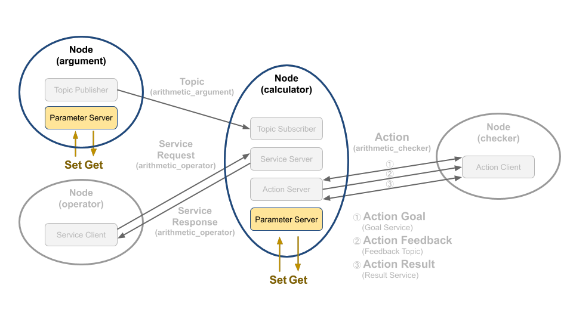

# Chapter 32: 파라미터 프로그래밍 (Python)
## 01. 파라미터 (parameter)
- 파라미터(parameter)는 노드에서 파라미터 서버(parameter server)를 실행시켜 외부의 파라미터 클라이언트(parameter client)와 통신으로 파라미터를 변경하는 것으로 `010 ROS 2 서비스 (service)` 강좌에서 다루었던 서비스(service)와 목적은 다르지만 데이터 처리 자체는 동일하다고 볼 수 있다.
- 서비스가 서비스 요청과 응답이라는 RPC(remote procedure call)에 가까운 목적이었다면 파라미터는 노드 내 매개변수를 서비스 통신 방법을 사용하여 노드 내부 또는 외부에서 쉽게 지정(Set) 하거나 변경할 수 있고, 쉽게 가져(Get)와서 사용할 수 있게 하는 점에서 그 사용 목적이 다르다고 볼 수 있다.
- 여기서는 파라미터 관련 코드를 중심을 볼 것이기에 파라미터와 관련한 자세한 내용은 이전 강좌인 `013 ROS 2 파라미터 (Parameter)` 강좌를 참고하도록 하자.
- 우리는 이전 강좌에서 토픽, 서비스, 액션 관련 프로그래밍을 익히기 위하여 argument, operator, calculator, checker 노드를 작성해 보았다.
- 이들 노드 중에서 그림 1과 같이 argument 노드와 calculator 노드는 파라미터를 사용하고 있다.
- argument 노드는 QoS 설정과 랜덤으로 생성되는 변수 a, b의 램덤 생성 범위를 파라미터를 이용했었고 calculator 노드는 QoS 설정을 사용하였다.
- 우리는 여기서 argument 노드에서 사용되는 파라미터에 대해 자세히 알아볼 것이다.



## 02. 파라미터 설정
- argument 노드에서 파라미터를 선언하고 파라미터 값이 변경되는 함수에 대해 자세히 알아보도록 하자.
- Argument 클래스의 생성자 부분에서 다음과 같은 코드가 있다.
- ROS 2에서 파라미터를 사용하려면 하기와 같이 크게 3가지의 요소가 필요하다.
    1. declare_parameter 함수
    2. get_parameter 함수
    3. add_on_set_parameters_callback 함수
- 1번의 declare_parameter 함수는 노드에서 사용할 파라미터의 고유 이름을 지정하고 초깃값을 설정한다.
- 파라미터를 설명하는 descriptor를 추가하기도 하는데 여기서는 생략했다.
- 2번의 get_parameter 함수는 노드에서 사용할 파라미터의 값을 불러오는 것으로 선언된 파라미터 고유 이름을 이용하여 지정된 파라미터 값을 불러온다.
- 이는 주로 launch 파일에서 선언된 *.yaml 형태의 파라미터 파일의 값을 불러오는데 사용된다.
- 3번의 add_on_set_parameters_callback 함수는 서비스 형태로 파라미터 변경 요청이 있을 때 사용되는 함수로 지정된 콜백 함수를 호출하게 된다.
```py
class Argument(Node):

    def __init__(self):
        super().__init__('argument')
        self.declare_parameter('qos_depth', 10)
        qos_depth = self.get_parameter('qos_depth').value
        self.declare_parameter('min_random_num', 0)
        self.min_random_num = self.get_parameter('min_random_num').value
        self.declare_parameter('max_random_num', 9)
        self.max_random_num = self.get_parameter('max_random_num').value
        self.add_on_set_parameters_callback(self.update_parameter)
```
```py
    def update_parameter(self, params):
        for param in params:
            if param.name == 'min_random_num' and param.type_ == Parameter.Type.INTEGER:
                self.min_random_num = param.value
            elif param.name == 'max_random_num' and param.type_ == Parameter.Type.INTEGER:
                self.max_random_num = param.value
        return SetParametersResult(successful=True)
```
- 예를 들어, 하기와 같이 declare_parameter 함수로 'max_random_num'와 같은 파라미터를 선언하였을 때, 노드 실행시 get_parameter 함수로 지정된 파라미터 파일로부터 파라미터 초깃값을 가져와 설정하게 된다.
- 그 뒤 파라미터 변경 요청이 있을 때에 add_on_set_parameters_callback 로부터 지정된 콜백 함수인 update_parameter 함수를 실행하게 된다.
- update_parameter 콜백 함수에서는 변경하려는 파라미터의 이름과 파라미터 타입이 같을 때에 해당 파라미터 값을 변경하게 된다.
```py
        self.declare_parameter('max_random_num', 9)
        self.max_random_num = self.get_parameter('max_random_num').value
```
- 이 argument 노드에서는 파라미터 값으로 QoS 설정과 랜덤으로 생성되는 변수 a, b의 램덤 생성 범위를 파라미터를 이용했는데 하기와 같이 파라미터 min_random_num 값과 max_random_num 값을 이용하여 퍼블리시할 때 변수 a, b의 램덤 생성 범위를 바꾸는 함수를 넣어 줬다.
```py
    def publish_random_arithmetic_arguments(self):
        msg = ArithmeticArgument()
        msg.stamp = self.get_clock().now().to_msg()
        msg.argument_a = float(random.randint(self.min_random_num, self.max_random_num))
        msg.argument_b = float(random.randint(self.min_random_num, self.max_random_num))
        self.arithmetic_argument_publisher.publish(msg)
        self.get_logger().info('Published argument a: {0}'.format(msg.argument_a))
        self.get_logger().info('Published argument b: {0}'.format(msg.argument_b))
```

## 03. 파라미터 사용 방법 (CLI)
- 파라미터 관련 설정을 모두 마쳤기에 argument 노드를 실행시키고 `ros2 param`와 같은 CLI를 이용하여 파라미터를 조회하고, 변경하고 읽어보는 실습 시간을 가져보자.
- 우선 하기와 같이 argument 노드를 실행하면 변수 a, b는 0과 9사이의 값으로 퍼블리시되는 것을 확인할 수 있다.
```
$ ros2 run topic_service_action_rclpy_example argument
[INFO]: Published argument a: 8.0
[INFO]: Published argument b: 6.0
[INFO]: Published argument a: 9.0
[INFO]: Published argument b: 4.0
...
```
- 현재 파라미터들의 목록을 확인하는 방법은 `ros2 param list` 명령어를 이용하는 것으로 결과는 하기와 같다.
- argument 노드에 max_random_num, min_random_num, qos_depth 파라미터가 있음을 확인할 수 있다.
- 이는 위 코드에서 declare_parameter으로 선언한 3가지 파라미터와 동일함을 알 수 있다.
- use_sim_time 파라미터는 모든 노드의 기본 파라미티이기에 함께 표시되고 있다.
```
$ ros2 param list
/argument:
  max_random_num
  min_random_num
  qos_depth
  use_sim_time
```
- 현재의 파라미터의 값을 확인하는 방법은 하기와 같이 `ros2 param get` 명령어를 이용하여 특정 노드 이름와 파라미터 이름을 지정하면 된다.
- `max_random_num` 파라미터의 값은 9임을 알 수 있다.
```
$ ros2 param get /argument max_random_num
Integer value is: 9
```
- 다음으로 `max_random_num` 파라미터 값을 100으로 변경해보자.
- 현재의 파라미터의 값을 변경하는 방법은 하기와 같이 `ros2 param set` 명령어를 이용하여 특정 노드 이름와 파라미터 이름을 지정하고 마지막에 해당 값을 입력하면 된다.
```
$ ros2 param set /argument max_random_num 100
Set parameter successful
```
- 이 변경이 완료되면 하기와 같이 argument 노드가 실행된 창에 로깅 출력값을 통해 랜덤으로 생성되는 변수 a, b의 램덤 생성 범위가 변경되었음을 확인해 볼 수 있다.
```
[INFO]: Published argument a: 42.0
[INFO]: Published argument b: 52.0
[INFO]: Published argument a: 51.0
[INFO]: Published argument b: 65.0
...
```

## 04. 파라미터 사용 방법 (서비스 클라이언트)
- 위 설명에서는 CLI를 이용하여 파라미터를 조회하고, 변경하고 읽어보는 실습을 해보았다.
- 파라미터는 CLI 이외에도 다른 노드의 소스 코드내에서도 파라미터를 읽고 변경할 수 있다.
- 예를 들어 하기의 코드는 SetParameters 이라는 인터페이스를 이용하여 서비스 클라이언트와 비슷한 설정으로 서비스 클라이언트로 서비스 요청을 통해 파라미터를 변경하게 된다.
- 여기서 클라이언트 선언 부분 및 서비스를 요청하는 부분은 서비스 클라이언트와 완전히 동일하다.
- 다른 부분을 꼽자면 서비스 요청 값으로 파라미터의 이름과 형태, 값을 지정하는게 다르다.
- 이 부분은 set_max_random_num_parameter 함수에 자세히 기술되어 있는데 Parameter 클래스를 선언하여 매개변수로 name, type, integer_value 등이 설정하게 되어 있다.
- 이를 통해 A 노드에서 B 노드의 파라미터를 변경할 수 있게 된다.
```py
from rcl_interfaces.msg import Parameter
from rcl_interfaces.msg import ParameterType
from rcl_interfaces.msg import ParameterValue
from rcl_interfaces.srv import SetParameters
```
```py
    self.random_num_parameter_client = self.create_client(
        SetParameters,
        'argument/set_parameters')
```
```py
    def set_max_random_num_parameter(self, max_value):
        request = SetParameters.Request()
        parameter = ParameterValue(type=ParameterType.PARAMETER_INTEGER, integer_value=max_value)
        request.parameters = [Parameter(name='max_random_num', value=parameter)]
        service_client = self.random_num_parameter_client
        return self.call_service(service_client, request, 'max_random_num parameter')

    def call_service(self, service_client, request, service_name):
        wait_count = 1
        while not service_client.wait_for_service(timeout_sec=0.1):
            if wait_count > 3:
                self.get_logger().warn(service_name + ' service is not available.')
                return False
            wait_count += 1
        service_client.call_async(request)
        return True
```

## 05. 기본 파라미터 설정 방법
- 위와 같이 파라미터를 선언하고 파라미터를 읽어(get)오고, 파라미터를 변경(set)하는 방법으로 파라미터를 사용할 수 있는데 이는 한 두개의 파라미터의 경우에는 어려움 없이 사용 가능하다.
- 하지만 하나의 노드에 수 십개의 파라미터, 그리고 수 십개의 노드가 실행되고 모두 파라미터를 이용한다면 관리 해야할 파라미터가 많아져서 매번 설정하기도 힘들다.
- 이에 파라미터를 저장하고 노드 실행 시 지정된 파라미터로 초깃값을 주고 싶을 때에는 파라미터 파일(*.yaml)을 미리 작성하고 이를 launch 파일에서 불러오는 방법이 있어서 소개한다.
- 우선 하기와 같은 파라미터 파일을 `arithmetic_config.yaml` 이라는 이름으로 지정 후에 패키지의 `param` 폴더에 넣어준다.
- 위 설명해서 익히 본 3개의 파라미터 이름과 초깃값이 기재되어 있음을 확인할 수 있다.
```
/**: # namespace and node name
  ros__parameters:
    qos_depth: 30
    min_random_num: 0
    max_random_num: 9
```
- 참고로 정석대로라면 아래와 같이 네임스페이스와 노드 이름으로도 구분을 해줘야하는데 경험상 네임스페이스와 노드 이름은 변경의 가능성이 높기에 위에서 언급한 것과 같이 /** 을 사용하는게 편하다.
```
namespace:
  node_name:
    ros__parameters:
      qos_depth: 30
      min_random_num: 0
      max_random_num: 9
```
- 그 뒤 하기와 같이 launch 파일에서 LaunchConfiguration 함수로 파라미터 파일을 지정하고 LaunchDescription에서 Node 함수를 이용하여 parameters를 지정하면 끝이다.
- 파라미터 설명을 위해 launch 파일이 갑자기 등장하였는데 launch에 대한 자세한 강의는 다음 강의에서 더 자세히 설명할 예정이다.
```py
def generate_launch_description():
    param_dir = LaunchConfiguration(
        'param_dir',
        default=os.path.join(
            get_package_share_directory('topic_service_action_rclpy_example'),
            'param',
            'arithmetic_config.yaml'))

    return LaunchDescription([
        DeclareLaunchArgument(
            'param_dir',
            default_value=param_dir,
            description='Full path of parameter file'),

        Node(
            package='topic_service_action_rclpy_example',
            executable='argument',
            name='argument',
            parameters=[param_dir],
            output='screen'),

        Node(
            package='topic_service_action_rclpy_example',
            executable='calculator',
            name='calculator',
            parameters=[param_dir],
            output='screen'),
    ])
```
- 참고로 새롭게 지정된 *.yaml 파일 및 *.launch.py 파일을 ROS 파일 시스템에 맞추어 설치하게 하려면 하기와 같이 파이썬 패키지 설정 파일 `setup.py`에 옵션을 추가해야한다.
```py
        (share_dir + '/launch', glob.glob(os.path.join('launch', '*.launch.py'))),
        (share_dir + '/param', glob.glob(os.path.join('param', '*.yaml'))),
```
- 위와 같이 launch 파일에 특정 파라미터 파일을 추가해주면 해당 launch 파일로 노드를 실행할 때에는 지정 파라미터 파일의 파라미터 이름과 파라미터 값을 확인하여 해당 노드의 파라미터를 초기화하여 사용할 수 있다.

[출처] 032 파라미터 프로그래밍 (Python) (오픈소스 소프트웨어 & 하드웨어: 로봇 기술 공유 카페 (오로카)) | 작성자 표윤석
