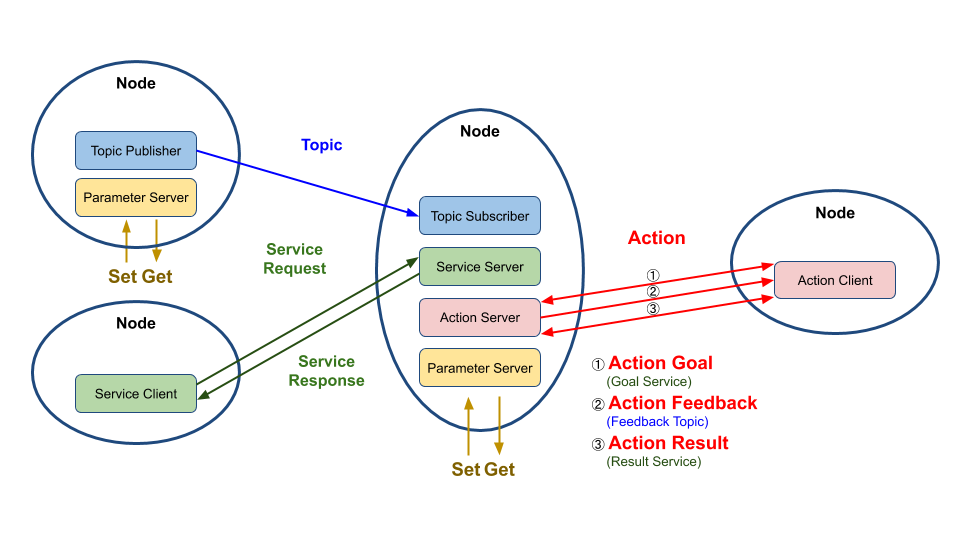
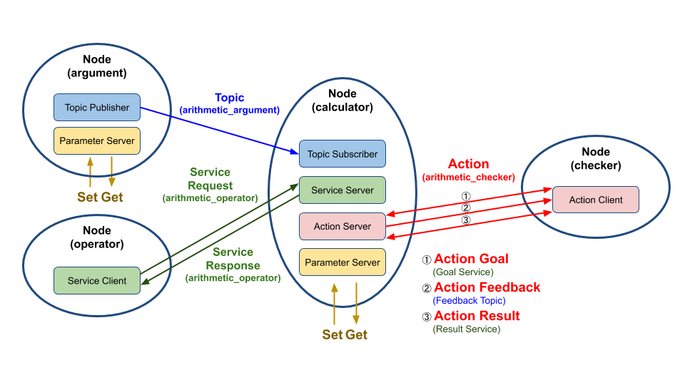

# Chapter 34: ROS 2 패키지 설계 (C++)
## 01. ROS 패키지 설계
- ROS와 연동되는 로봇 프로그램과 일반적인 로봇 프로그램과의 차이는 프로세스를 목적별로 나누어 노드 단위의 프로그램을 작성하고 노드와 노드간의 데이터 통신을 고려하여 설계해야 한다는 것이다.
- 이번 강좌에서는 ROS 2의 토픽, 서비스, 액션 프로그래밍(C++)의 예제이면서 토픽, 서비스, 액션이 서로 연동되어 구동되는 방식으로 설계된 단일 패키지를 소개하겠다.
- 예제 패키지는 총 4개의 노드로 구성되어 있다.
- 아래 그림과 같이 각 노드에서는 1개 이상의 토픽 퍼블리셔, 토픽 서브스크라이브, 서비스 서버, 서비스 클라이언트, 액션 서버, 액션 클라이언트를 포함하고 있다.
- 특히 중앙에 있는 노드는 다른 노드들과의 연동에 있어서 가장 핵심적인 역할을 하도록 설계하였고 추후 강좌를 위해서 실행 인자(argument), 파라미터(parameter), 런치(launch) 파일이 추가되어 있다.



- 이렇게 설계한 패키지는 topic_service_action_rclcpp_example 이라는 이름으로 패키지 명을 명명하였다.
- 이 패키지에서 각각의 노드와 토픽, 서비스, 액션도 고유의 이름을 가지고 있는데 이는 아래 그림과 같다.
- 그림에서의 프로세스를 설명하자면 다음과 같다.
- argument 노드에서 arithmetic_argument 토픽 이름으로 현재 시간(POSIX time)과 변수 a와 b를 퍼블리시한다.
- calculator 노드는 토픽이 생성된 시간과 변수 a와 b를 arithmetic_argument 이름으로 ​​서브스크라이브한다.
- operator 노드는 arithmetic_operator 서비스 이름으로 calculator 노드에게 연산자(+,-,*,/)를 서비스 요청값으로 보낸다.
- calculator 노드는 서브스크라이브하여 저장하고 있는 변수 a와 b와, operator 노드로부터 요청값으로 받은 연산자를 이용하여 계산(a 연산자 b)하고 operator 노드에게 연산의 결괏값을 arithmetic_operator 이름으로 서비스 응답값을 보낸다.
- checker 노드는 연산값의 합계의 한계치를 arithmetic_checker 액션 이름으로 액션 목표값으로 전달한다.
- calculator 노드는 checker 노드로 부터 액션 목표값을 받은 후 부터 저장된 변수(a, b, 연산자)를 가지고 연산한 값을 합한다.
- 그리고 연산이 끝난 계산식을 arithmetic_checker 이름으로 액션 피드백을 checker 노드로 보낸다.
- 연산값의 합이 액션 목표값을 넘기면 최종 연산 합계를 arithmetic_checker 이름으로 액션 결괏값을 checker 노드로 보낸다.



## 02. 노드 작성
- 위에서 설명한 topic_service_action_rclcpp_example 패키지는 argument 노드, operator 노드, calculator 노드, checker 노드와 같이 4개의 노드로 구성되어 있다.
- 해당 노드의 원본 코드는 참고자료로 올린 리포지토리에서 미리 확인하실 수 있으며 자세한 내용은 아래와 같이 이어지는 강좌에서 자세히 설명할 예정이다.
- 이 강좌에서는 패키지 및 노드 설계 및 빌드, 실행에 대한 내용만을 다룰 예정이다.
    - 035 토픽 프로그래밍 (C++)
    - 036 서비스 프로그래밍 (C++)
    - 037 액션 프로그래밍 (C++)
    - 038 파라미터 프로그래밍 (C++)
    - 039 실행 인자 프로그래밍 (C++)
    - 040 런치 프로그래밍 (C++)

## 03. 패키지 설정 파일 (package.xml)
- topic_service_action_rclcpp_example 패키지의 설정 파일(package.xml)은 아래와 같이 작성해주자.
```xml
<?xml version="1.0"?>
<?xml-model href="http://download.ros.org/schema/package_format3.xsd" schematypens="http://www.w3.org/2001/XMLSchema"?>
<package format="3">
  <name>topic_service_action_rclcpp_example</name>
  <version>0.2.0</version>
  <description>ROS 2 rclcpp example package for the topic, service, action</description>
  <maintainer email="passionvirus@gmail.com">Pyo</maintainer>
  <license>Apache License 2.0</license>
  <author email="passionvirus@gmail.com">Pyo</author>
  <author email="routiful@gmail.com">Darby Lim</author>
  <buildtool_depend>ament_cmake</buildtool_depend>
  <depend>rclcpp</depend>
  <depend>rclcpp_action</depend>
  <depend>msg_srv_action_interface_example</depend>
  <test_depend>ament_lint_auto</test_depend>
  <test_depend>ament_lint_common</test_depend>
  <export>
    <build_type>ament_cmake</build_type>
  </export>
</package>
```
- ROS 2의 패키지 설정 파일의 package format은 세번째 버전이다. (ROS 에서는 두번째 버전을 사용한다.)
```xml
<package format="3">
```
- 빌드툴은 ament_cmake를 사용하도록 하였고,
```xml
<buildtool_depend>ament_cmake</buildtool_depend>
```
- dependency로 rclcpp와 rclcpp_action 그리고 `027 토픽, 서비스, 액션 인터페이스` 강좌에서 작성한 토픽, 서비스, 액션 인터페이스(패키지명: msg_srv_action_interface_example)를 적어준다.
```xml
<depend>rclcpp</depend>
<depend>rclcpp_action</depend>
<depend>msg_srv_action_interface_example</depend>
```
- test_depend 태그에는 사용하고자 하는 Lint 패키지를 명시한다.
- 해당 태그에 테스트 코드를 위한 의존성 패키지도 명시해줄 수 있다.
```xml
<test_depend>ament_lint_auto</test_depend>
<test_depend>ament_lint_common</test_depend>
```
- export 태그 아래의 build_type에는 ament_cmake를 적어준다.(Python 패키지는 ament_python 이다.)
```xml
  <export>
    <build_type>ament_cmake</build_type>
  </export>
```

## 04. 빌드 설정 파일 (CMakeLists.txt)
- topic_service_action_rclcpp_example 패키지의 빌드 설정 파일 (CMakeLists.txt)의 전문은 다음과 같다.
```cpp
# Set minimum required version of cmake, project name and compile options
cmake_minimum_required(VERSION 3.5)
project(topic_service_action_rclcpp_example)

if(NOT CMAKE_C_STANDARD)
  set(CMAKE_C_STANDARD 99)
endif()

if(NOT CMAKE_CXX_STANDARD)
  set(CMAKE_CXX_STANDARD 14)
endif()

if(CMAKE_COMPILER_IS_GNUCXX OR CMAKE_CXX_COMPILER_ID MATCHES "Clang")
  add_compile_options(-Wall -Wextra -Wpedantic)
endif()

# Find dependencies
find_package(ament_cmake REQUIRED)
find_package(msg_srv_action_interface_example REQUIRED)
find_package(rclcpp REQUIRED)
find_package(rclcpp_action REQUIRED)

include_directories(include)

# Build
add_executable(argument src/arithmetic/argument.cpp)
ament_target_dependencies(argument
  msg_srv_action_interface_example
  rclcpp
)

add_executable(calculator src/calculator/main.cpp src/calculator/calculator.cpp)
ament_target_dependencies(calculator
  msg_srv_action_interface_example
  rclcpp
  rclcpp_action
)

add_executable(checker src/checker/main.cpp src/checker/checker.cpp)
ament_target_dependencies(checker
  msg_srv_action_interface_example
  rclcpp
  rclcpp_action
)

add_executable(operator src/arithmetic/operator.cpp)
ament_target_dependencies(operator
  msg_srv_action_interface_example
  rclcpp
)

# Install
install(TARGETS
  argument
  calculator
  checker
  operator
  DESTINATION lib/${PROJECT_NAME}
)

install(DIRECTORY launch param
  DESTINATION share/${PROJECT_NAME}
)

# Test
if(BUILD_TESTING)
  find_package(ament_lint_auto REQUIRED)
  ament_lint_auto_find_test_dependencies()
endif()

# Macro for ament package
ament_package()
```
- ROS 2 빌드를 위한 CMakeList 파일은 크게 cmake 설정, 의존성 명시, 빌드, 설치, 테스트, ament package 매크로 설정 으로 나눌 수 있다.
- cmake는 최소 3.5 버전 이상을 사용해야 하며, 별다른 명시가 없다면 C99와 C++14를 기본으로 사용하게 된다.
- GNU 컴파일러를 기본으로 사용하지만 Clang 컴파일러을 사용할 수도 있다.
```cpp
cmake_minimum_required(VERSION 3.5)
project(topic_service_action_rclcpp_example)

if(NOT CMAKE_C_STANDARD)
  set(CMAKE_C_STANDARD 99)
endif()

if(NOT CMAKE_CXX_STANDARD)
  set(CMAKE_CXX_STANDARD 14)
endif()

if(CMAKE_COMPILER_IS_GNUCXX OR CMAKE_CXX_COMPILER_ID MATCHES "Clang")
  add_compile_options(-Wall -Wextra -Wpedantic)
endif()
```
- ament_target_dependencies 에는 프로그램 실행을 위해 필요한 의존성 패키지들을 모두 적어준다.
```cpp
ament_target_dependencies(argument
  msg_srv_action_interface_example
  rclcpp
)
```
- launch 와 param 폴더는 share 폴더 아래에 저장해야만 하는것 기억하자.
```cpp
install(DIRECTORY launch param
  DESTINATION share/${PROJECT_NAME}
)
```
- Lint와 Test 코드를 위한 의존성 패키지는 아래와 같이 적어준다.
- 이는 colcon test 명령어를 통해 실행할 수 있다.
```cpp
if(BUILD_TESTING)
  find_package(ament_lint_auto REQUIRED)
  ament_lint_auto_find_test_dependencies()
endif()
```
- 가장 아래에는 ament 패키지를 위한 매크로 함수를 적어주게 되는데 ament_package는 꼭 적어주어야 한다.
```cpp
ament_package()
```
- 언급하지 않은 명령어들이 궁금하다면 CMake 3.5를 확인해보기 바란다.

## 05. 소스 코드 다운로드 및 빌드
- 소스 코드 다운로드 및 빌드는 하기와 같은 명령어로 진행하면 된다.
```
$ cd ~/robot_ws/src
$ git clone https://github.com/robotpilot/ros2-seminar-examples.git
$ cd ~/robot_ws && colcon build --symlink-install
$ echo 'source ~/robot_ws/install/local_setup.bash' >> ~/.bashrc
$ source ~/.bashrc
```
- 또는 아래와 같이 미리 지정한 alias를 사용하면 매우 편하다.
```
$ cw 
$ cbp topic_service_action_rclcpp_example
```
- `cw`는 `cd ~/robot_ws`의 alias이다.
- `cbp`는 `colcon build --symlink-install --packages-select`의 alias이다.
- 빌드한 후 빌드에 문제가 없다면 `~/robot_ws/install/topic_service_action_rclcpp_example` 폴더 안에 우리가 작성한 ROS 인터페이스를 사용하기 위한 파일들이 저장되게 된다.
- 예를 들어 하기 폴더에는 argument, operator, calculator, checker와 같은 실행 스크립트가 위치하게 된다.
```
~/robot_ws/install/topic_service_action_rclcpp_example/lib/topic_service_action_rclcpp_example
```
- 그리고 하기 폴더에는 launch 폴더와 param 폴더가 생성되고 각각 런치파일 arithmetic.launch.py 파일과 파라미터 파일인arithmetic_config.yaml 파일이 위치하게 된다.
```
~/robot_ws/install/topic_service_action_rclcpp_example/share/topic_service_action_rclcpp_example
```

## 06. 실행
### 6-1. 토픽 서브스크라이버, 서비스 서버, 액션 서버 실행
- 제일 먼저 calculator 노드를 실행해보자.
- 이 노드는 이 패키지에서 토픽 서브스크라이버, 서비스 서버, 액션 서버 역할을 수행하는 노드로 실행이 되었다는 로그 한줄을 띄워주고 난 이후로는 아무런 동작은 하고 있지 않은 대기 상태가 된다.
```
$ ros2 run topic_service_action_rclcpp_example calculator
[INFO]: Run calculator
```

### 6-2. 토픽 퍼블리셔 실행
- 다음으로 새로운 터미널을 열어서 토픽 퍼블리셔 역할을 하는 argument 노드를 실행해보자.
- 그러면 터미널 창에 퍼블리시하고 있는 argument a, argument b가 표시된다.
- 더불어 calculator 노드를 실행 시킨 터미널 창에서는 수신 받은 시간 정보와 argument a, argument b가 표시된다.
```
$ ros2 run topic_service_action_rclcpp_example argument
[INFO]: Published argument_a 0.25
[INFO]: Published argument_b 5.93
[INFO]: Published argument_a 5.45
[INFO]: Published argument_b 1.37
```
```
[INFO]: Run calculator
[INFO]: Subscribed at: sec 1610237910 nanosec 33666586
[INFO]: Subscribed argument a : 0.25
[INFO]: Subscribed argument b : 5.93
[INFO]: Subscribed at: sec 1610237911 nanosec 33606825
[INFO]: Subscribed argument a : 5.45
[INFO]: Subscribed argument b : 1.37
```

### 6-3. 서비스 클라이언트 실행
- 다음으로 새로운 터미널을 열어서 서비스 클라이언트 역할을 하는 operator 노드를 실행해보자.
- 그러면 calculator 노드에게 랜덤으로 선택한 연산자(+,-,*,/)를 서비스 요청값으로 보내고 연산된 결과값을 받아 터미널 창에 표시한다.
- 실제 계산식은 calculator 노드가 실행 중인 창에서 확인할 수 있다.
- 예를 들어 calculator는 변수 a, b로 9.0와 6.0을 받았고 연산자로 곱셉(*)을 받았을 때 9.0 * 6.0 = 54.0 이므로 operator는 54.0를 표시하게 된다.
- Enter 키를 눌러 서비스를 한번 더 보낼 수 있다.
```
$ ros2 run topic_service_action_rclcpp_example operator
Press Enter for next service call.
[INFO]: Result 4.69
Press Enter for next service call.
[INFO]: Result 6.07
```
```
[INFO]: Subscribed at: sec 1610238085 nanosec 806984947
[INFO]: Subscribed argument a : 5.17
[INFO]: Subscribed argument b : 0.47
[INFO]: 5.167154 - 0.473616 = 4.69354

[INFO]: Subscribed at: sec 1610238086 nanosec 807010534
[INFO]: Subscribed argument a : 1.36
[INFO]: Subscribed argument b : 4.47
[INFO]: 1.358604 * 4.469692 = 6.07254
```

### 6-4. 액션 클라이언트 실행
- 마지막으로 터미널을 새로 열어서 checker 노드를 실행해보자.
- checker 노드는 먼저 연산값의 합계 한계치를 액션 목표값으로 calculator 노드에 전달하게 된다.
- 이후 checker 노드는 calculator 노드에게 액션 피드백을 받게 되는데, 그 피드백은 각 연산과 그 결과의 string 타입이다.
- 지정한 연산값의 합계가 목표 합계를 넘기면 checker 노드는 액션 결괏값으로 calculator 노드로 부터 최종 연산 합계 받게 된다.
```
$ ros2 run topic_service_action_rclcpp_example checker
goal_total_sum : 50
[INFO]: Action goal accepted.
[INFO]: Action feedback:
[INFO]: 	4.983427 * 5.585670 = 27.8358

[INFO]: Action feedback:
[INFO]: 	4.983427 * 5.585670 = 27.8358

[INFO]: 	4.983427 * 5.585670 = 27.8358

[INFO]: Action succeeded!
[INFO]: Action result(all formula):
[INFO]: 	4.983427 * 5.585670 = 27.8358

[INFO]: 	4.983427 * 5.585670 = 27.8358

[INFO]: Action result(total sum):
[INFO]: 	55.67
```
- ​합계의 한계치는 기본으로 50으로 설정되어 있다.
- 이를 수정하여 실행하고 싶으면 아래와 같이 checker 노드를 실행시키면서 실행 인자로 `-g 100` 이라고 입력하면 GOAL_TOTAL_SUM 이라는 인자로 100을 할당할 수 있다.
```
$ ros2 run topic_service_action_rclcpp_example checker -g 100
```

### 6-5. 런치 파일 실행
- 참고로 argument 노드와 calculator 노드를 한번에 실행시키고자 한다면 아래와 같이 launch 파일인 arithmetic.launch.py를 실행하는 방법으로 두개의 노드를 동시에 실행 시킬 수 있다.
- launch 파일에 대한 자세한 설명은 추후 강좌에서 더 자세히 알아볼 예정이기에 여기서는 실행 방법만 알아보았다.
```
$ ros2 launch topic_service_action_rclcpp_example arithmetic.launch.py
```

[출처] 034 ROS 2 패키지 설계 (C++) (오픈소스 소프트웨어 & 하드웨어: 로봇 기술 공유 카페 (오로카)) | 작성자 Routiful
