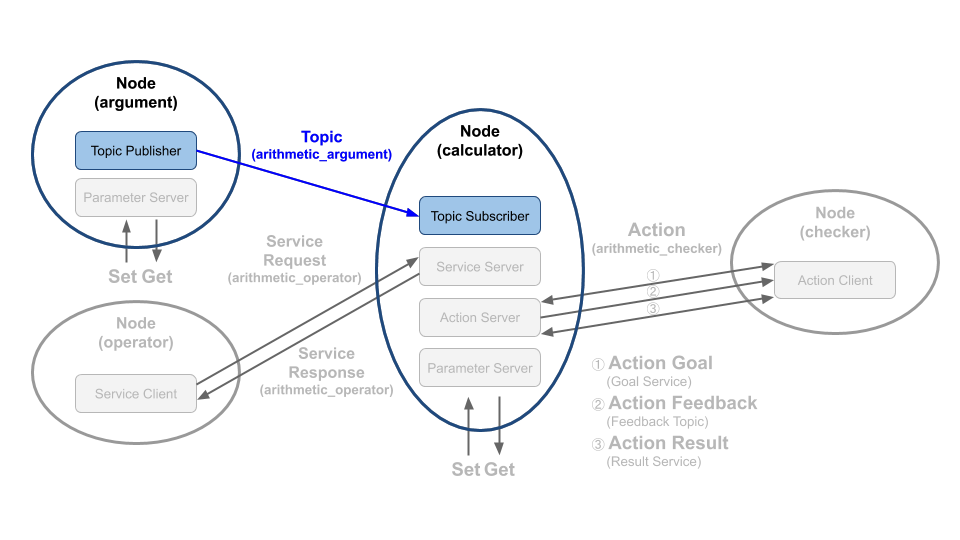

# Chapter 35: 토픽 프로그래밍 (C++)
## 01. 토픽(Topic)
- 토픽(Topic)은 비동기식 단방향 메시지 송수신 방식으로 msg 메시지 형태의 메시지를 발행하는 퍼블리셔(Publisher)와 메시지를 구독하는 서브스크라이버(Subscriber) 간의 통신이라고 볼 수 있다.
- 이는 1:1 통신을 기본으로 하지만 복수의 노드에서 하나의 토픽을 송수신하는 1:N도 가능하고 그 구성 방식에 따라 N:1, N:N 통신도 가능하다.
- ROS 메시지 통신에서 가장 널리 사용되는 통신 방법이다.
- 우리는 이 강좌에서 그림 1과 같이 토픽을 생성한 시간(POSIX Time)과 연산에 사용할 변수 a와 변수 b를 퍼블리시하는 토픽 퍼블리셔 그리고 이를 서브스크라이브하는 토픽 서브스크라이버를 작성해 볼 것이다.
- 이 강좌는 코드를 집중적으로 볼 예정이기에 토픽에 대한 개념에 대한 자세한 내용은 '009 ROS 2 토픽 (topic)' 강좌를 참고하도록 하자.



## 02. 토픽 퍼블리셔 코드
- 토픽 퍼블리셔 역할을 하는 argument 노드의 소스 코드는 깃허브 리포지토리에 위치해놓았다.
- 해당 리포지토리에서 하기의 장소에 관련 코드가 있기에 참고하도록 하자.
```
topic_service_action_rclcpp_example/include/arithmetic/argument.hpp

topic_service_action_rclcpp_example/src/arithmetic/argument.cpp
```
- 토픽 퍼블리셔 역할을 하는 argument 노드의 전체 소스 코드는 아래와 같다.
- topic_service_action_rclcpp_example/include/arithmetic/argument.hpp
```cpp
#ifndef ARITHMETIC__ARGUMENT_HPP_
#define ARITHMETIC__ARGUMENT_HPP_

#include <chrono>
#include <memory>
#include <string>
#include <utility>

#include "rclcpp/rclcpp.hpp"

#include "msg_srv_action_interface_example/msg/arithmetic_argument.hpp"


class Argument : public rclcpp::Node
{
public:
  using ArithmeticArgument = msg_srv_action_interface_example::msg::ArithmeticArgument;

  explicit Argument(const rclcpp::NodeOptions & node_options = rclcpp::NodeOptions());
  virtual ~Argument();

private:
  void publish_random_arithmetic_arguments();
  void update_parameter();

  float min_random_num_;
  float max_random_num_;

  rclcpp::Publisher<ArithmeticArgument>::SharedPtr arithmetic_argument_publisher_;
  rclcpp::TimerBase::SharedPtr timer_;
  rclcpp::Subscription<rcl_interfaces::msg::ParameterEvent>::SharedPtr parameter_event_sub_;
  rclcpp::AsyncParametersClient::SharedPtr parameters_client_;
};
#endif  // ARITHMETIC__ARGUMENT_HPP_
```
- topic_service_action_rclcpp_example/src/arithmetic/argument.cpp
```cpp
#include <cstdio>
#include <memory>
#include <string>
#include <utility>
#include <random>

#include "rclcpp/rclcpp.hpp"
#include "rcutils/cmdline_parser.h"

#include "arithmetic/argument.hpp"

using namespace std::chrono_literals;

Argument::Argument(const rclcpp::NodeOptions & node_options)
: Node("argument", node_options),
  min_random_num_(0.0),
  max_random_num_(0.0)
{
  this->declare_parameter("qos_depth", 10);
  int8_t qos_depth = this->get_parameter("qos_depth").get_value<int8_t>();
  this->declare_parameter("min_random_num", 0.0);
  min_random_num_ = this->get_parameter("min_random_num").get_value<float>();
  this->declare_parameter("max_random_num", 9.0);
  max_random_num_ = this->get_parameter("max_random_num").get_value<float>();
  this->update_parameter();

  const auto QOS_RKL10V =
    rclcpp::QoS(rclcpp::KeepLast(qos_depth)).reliable().durability_volatile();

  arithmetic_argument_publisher_ =
    this->create_publisher<ArithmeticArgument>("arithmetic_argument", QOS_RKL10V);

  timer_ =
    this->create_wall_timer(1s, std::bind(&Argument::publish_random_arithmetic_arguments, this));
}

Argument::~Argument()
{
}

void Argument::publish_random_arithmetic_arguments()
{
  std::random_device rd;
  std::mt19937 gen(rd());
  std::uniform_real_distribution<float> distribution(min_random_num_, max_random_num_);

  msg_srv_action_interface_example::msg::ArithmeticArgument msg;
  msg.stamp = this->now();
  msg.argument_a = distribution(gen);
  msg.argument_b = distribution(gen);
  arithmetic_argument_publisher_->publish(msg);

  RCLCPP_INFO(this->get_logger(), "Published argument_a %.2f", msg.argument_a);
  RCLCPP_INFO(this->get_logger(), "Published argument_b %.2f", msg.argument_b);
}

void Argument::update_parameter()
{
  parameters_client_ = std::make_shared<rclcpp::AsyncParametersClient>(this);
  while (!parameters_client_->wait_for_service(1s)) {
    if (!rclcpp::ok()) {
      RCLCPP_ERROR(this->get_logger(), "Interrupted while waiting for the service. Exiting.");
      return;
    }
    RCLCPP_INFO(this->get_logger(), "service not available, waiting again...");
  }

  auto param_event_callback =
    [this](const rcl_interfaces::msg::ParameterEvent::SharedPtr event) -> void
    {
      for (auto & changed_parameter : event->changed_parameters) {
        if (changed_parameter.name == "min_random_num") {
          auto value = rclcpp::Parameter::from_parameter_msg(changed_parameter).as_double();
          min_random_num_ = value;
        } else if (changed_parameter.name == "max_random_num") {
          auto value = rclcpp::Parameter::from_parameter_msg(changed_parameter).as_double();
          max_random_num_ = value;
        }
      }
    };

  parameter_event_sub_ = parameters_client_->on_parameter_event(param_event_callback);
}

void print_help()
{
  printf("For argument node:\n");
  printf("node_name [-h]\n");
  printf("Options:\n");
  printf("\t-h Help           : Print this help function.\n");
}

int main(int argc, char * argv[])
{
  if (rcutils_cli_option_exist(argv, argv + argc, "-h")) {
    print_help();
    return 0;
  }

  rclcpp::init(argc, argv);

  auto argument = std::make_shared<Argument>();

  rclcpp::spin(argument);

  rclcpp::shutdown();

  return 0;
}
```
- 먼저 hpp 파일을 보면 ROS 2를 다루는데 필수적인 라이브러리들이 먼저 선언되어 있다.
- 각 라이브러리에 대한 간단한 기능과 링크를 아래 정리해놓았다.
    1. chrono: 시간을 다루는 라이브러리(https://www.cplusplus.com/reference/chrono/)
    2. memory: ​동적 메모리를 다루는 라이브러리(https://www.cplusplus.com/reference/memory/?kw=memory)
    3. string: 문자열을 다루는 라이브러리(https://www.cplusplus.com/reference/string/string/?kw=string)
    4. utility: 서로다른 도메인을 다루는 라이브러리(https://www.cplusplus.com/reference/utility/?kw=utility)
- 그 아래에는 rclcpp API를 담고있는 rclcpp헤더파일과 강좌에서 만든 인터페이스를 담고있는 헤더파일이 선언되어 있다.
```cpp
#include <chrono>
#include <memory>
#include <string>
#include <utility>

#include "rclcpp/rclcpp.hpp"

#include "msg_srv_action_interface_example/msg/arithmetic_argument.hpp"
```
- rclcpp의 Node 클래스를 상속받는 Argument 클래스에 대해 알아보자.
- Argument 클래스의 생성자는 rclcpp의 NodeOptions를 인자로 받는다.
- NodeOptions에는 context, arguments, intra process communication, parameter, allocator와 같은 Node 생성을 위한 다양한 옵션을 정할 수 있다.
- Arguments 클래스에는 rclcpp::Publisher와 rclcpp::TimerBase 멤버변수가 선언되어 있으며 토픽 메시지에 담을 랜덤 변수의 범위를 정해줄 두 멤버변수도 함께 확인할 수 있다.
- 파라미터와 관련된 멤버변수와 함수는 추후 다른 강좌에서 다루도록 하겠다.
```cpp
class Argument : public rclcpp::Node
{
public:
  using ArithmeticArgument = msg_srv_action_interface_example::msg::ArithmeticArgument;

  explicit Argument(const rclcpp::NodeOptions & node_options = rclcpp::NodeOptions());
  virtual ~Argument();

private:
  void publish_random_arithmetic_arguments();
  void update_parameter();

  float min_random_num_;
  float max_random_num_;

  rclcpp::Publisher<ArithmeticArgument>::SharedPtr arithmetic_argument_publisher_;
  rclcpp::TimerBase::SharedPtr timer_;
  rclcpp::Subscription<rcl_interfaces::msg::ParameterEvent>::SharedPtr parameter_event_sub_;
  rclcpp::AsyncParametersClient::SharedPtr parameters_client_;
};
```
- 이제 cpp 파일을 보자.
- hpp 파일에서 보지 못한 라이브러리에 대해 알아보자.
    1. cstdio: C 언어 표준 인풋 아웃풋 라이브러리 (http://www.cplusplus.com/reference/cstdio/)
    2. random: 랜덤 숫자 생성 라이브러리 (http://www.cplusplus.com/reference/random/?kw=random)
- 그 아래 cmdline_parser 헤더파일은 프로그램 실행시 넘겨받은 인자를 다루는 ROS 2 라이브러리 이다.
```cpp
#include <cstdio>
#include <memory>
#include <string>
#include <utility>
#include <random>

#include "rclcpp/rclcpp.hpp"
#include "rcutils/cmdline_parser.h"

#include "arithmetic/argument.hpp"
```
- Argument 클래스의 생성자를 보자.
- 부모클래스인 rclcpp::Node를 먼저 선언해야만 한다.
- 첫번째 인자에는 노드의 이름을 적어주고, 두번째 인자에는 노드 옵션 변수를 명시해주자.
- 퍼블리쉬를 위한 QoS는 rclcpp::QoS 라이브러리를 이용하여 History 옵션은 KeepLast(depth는 10), Reliability 옵션은 reliable, Durability 옵션은 volatile로 설정하였다.
- QoS에 대한 자세한 설명은 '019 DDS의 QoS(Quality of Service)' 강좌를 참고하자.
- 해당 QoS는 아래 publisher를 초기화 할때 두번째 인자로 들어가게 되고, 첫번째 인자에는 메시지 통신에 사용될 토픽명을 적어준다.
- timer의 경우 1초당 한번씩 publisher_random_arithmetic_arguments 멤버함수를 호출하도록 설정하였다.
```cpp
Argument::Argument(const rclcpp::NodeOptions & node_options)
: Node("argument", node_options),
  min_random_num_(0.0),
  max_random_num_(0.0)
{
  this->declare_parameter("qos_depth", 10);
  int8_t qos_depth = this->get_parameter("qos_depth").get_value<int8_t>();
  this->declare_parameter("min_random_num", 0.0);
  min_random_num_ = this->get_parameter("min_random_num").get_value<float>();
  this->declare_parameter("max_random_num", 9.0);
  max_random_num_ = this->get_parameter("max_random_num").get_value<float>();
  this->update_parameter();

  const auto QOS_RKL10V =
    rclcpp::QoS(rclcpp::KeepLast(qos_depth)).reliable().durability_volatile();

  arithmetic_argument_publisher_ =
    this->create_publisher<ArithmeticArgument>("arithmetic_argument", QOS_RKL10V);

  timer_ =
    this->create_wall_timer(1s, std::bind(&Argument::publish_random_arithmetic_arguments, this));
}
```
- publisher_random_arithmetic_arguments 멤버함수를 보자.
- 해당 함수는 timer에 의해 1초당 한번씩 호출된다.
- random 라이브러리를 사용하여 ROS 2 파라미터를 통해 얻은 숫자가 저장된 min_random_num, max_random_num 사이의 랜덤한 숫자를 생성하도록 하자.
- 그리고 토픽 메시지 통신에서 사용할 인터페이스(msg)를 선언하자.
- 해당 인터페이스의 멤버 변수들을 올바르게 채워주고 난뒤, Argument 클래스에서 초기화한 publisher를 통해 해당 인터페이스를 publish 함수를 통해 송신할 수 있다.
- 그 아래에는 인터페이스를 통해 송신한 랜덤한 숫자를 로그로 표시하는 코드도 확인할 수 있다.
```cpp
void Argument::publish_random_arithmetic_arguments()
{
  std::random_device rd;
  std::mt19937 gen(rd());
  std::uniform_real_distribution<float> distribution(min_random_num_, max_random_num_);

  msg_srv_action_interface_example::msg::ArithmeticArgument msg;
  msg.stamp = this->now();
  msg.argument_a = distribution(gen);
  msg.argument_b = distribution(gen);
  arithmetic_argument_publisher_->publish(msg);

  RCLCPP_INFO(this->get_logger(), "Published argument_a %.2f", msg.argument_a);
  RCLCPP_INFO(this->get_logger(), "Published argument_b %.2f", msg.argument_b);
}
```

## 03. 토픽 서브스크라이버 코드
- 토픽 서브스크라이버 역할을 하는 calculator 노드의 소스 코드는 위와 마찬가지로 깃허브 리포지토리에 위치해 놓았다.
- 해당 리포지토리에서 하기의 장소에 관련 코드가 있기에 참고하도록 하자.
```
topic_service_action_rclcpp_example/include/calculator/calculator.hpp

topic_service_action_rclcpp_example/src/calculator/calculator.cpp
```
- 이 소스 코드는 토픽 서브스크라이버, 서비스 서버, 액션 서버를 모두 포함하고 있어서 매우 길기 때문에 전체 코드를 강좌 글에 담는 것은 생략하도록 하고 전체 소스 코드 중 토픽 서브스크라이버와 관련한 코드만 살펴보도록 하겠다.
- Calculator 클래스는 토픽 퍼블리셔 노드와 마찬가지로 rclcpp::node 를 상속하고 있으며 생성자에서 'calculator' 이라는 노드 이름으로 초기화되었다.
- 그 뒤 위에서와 마찬가지로 QoS는 rclcpp::QoS 라이브러리를 이용하여 History 옵션은 KeepLast(depth는 10), Reliability 옵션은 reliable, Durability 옵션은 volatile로 설정하였다.
- QoS에 대한 자세한 설명은 '019 DDS의 QoS(Quality of Service)' 강좌를 참고하자.
- 이제 subscriber에 대해 보자.
- subscriber는 create_subscription을 통해 초기화되며 해당 함수는 토픽명과 QoS 그리고 콜백함수인자로 구성되어 있다.
- 토픽명과 QoS는 Argument 클래스에서 적은 것과 동일하게 적어 주었고, 콜백함수는 std::bind를 사용한 것이 아닌 람다 표현식를 이용하였다.
- 람다 표현식은 C++ 14 부터 적용된 문법으로 잘 활용하면 가독성을 높여준다.
- 콜백함수를 보면 인자를 통해 수신받은 메시지에 접근하여 멤버 변수에 저장하고 있다.
- 그리고 수신받은 시간과 전달받은 데이터를 로그로 나타내는 코드도 확인할 수 있다.
```cpp
  const auto QOS_RKL10V =
    rclcpp::QoS(rclcpp::KeepLast(qos_depth)).reliable().durability_volatile();

  arithmetic_argument_subscriber_ = this->create_subscription<ArithmeticArgument>(
    "arithmetic_argument",
    QOS_RKL10V,
    [this](const ArithmeticArgument::SharedPtr msg) -> void
    {
      argument_a_ = msg->argument_a;
      argument_b_ = msg->argument_b;

      RCLCPP_INFO(
        this->get_logger(),
        "Subscribed at: sec %ld nanosec %ld",
        msg->stamp.sec,
        msg->stamp.nanosec);

      RCLCPP_INFO(this->get_logger(), "Subscribed argument a : %.2f", argument_a_);
      RCLCPP_INFO(this->get_logger(), "Subscribed argument b : %.2f", argument_b_);
    }
  );
```

## 04. 토픽 퍼블리셔, 서브스크라이버 복습!
- 설명이 좀 길었으니 여기서 정리하고 넘어가자.
- 토픽은 아래와 같이 설정하여 사용하면 된다.

### 4-1. 토픽 퍼블리셔 (데이터를 송신하는 프로그램)
1. Node 설정
2. QoS 설정
3. create_publisher 설정 (+ timer 설정)
4. 퍼블리시 함수 작성

### 4-2. 토픽 서브스크라이버 (데이터를 수신하는 프로그램)
1. Node 설정
2. QoS 설정
3. create_subscription 설정
4. 서브스크라이브 함수 작성

## 05. 노드 실행 코드
- 지난 강좌에서 소스 코드를 집중적으로 보기전에 이를 먼저 빌드하여 노드들을 실행해보는 실습시간을 가졌다.
- 이번에는 작성한 노드를 어떻게 설정해야 실행 가능하게 되는지 알아보도록 하자.
- 우선 이전 강의에서 익힌 노드 실행 명령어는 다음과 같다.
- calculator가 이 강좌에서 다룬 토픽 서브스크라이버 노드이고, argument는 토픽 퍼블리셔 노드이다.
```
$ ros2 run topic_service_action_rclcpp_example calculator
```
```
$ ros2 run topic_service_action_rclcpp_example argument
```
- 이 두 개의 노드를 실행할 수 있도록 설정한 부분은 지난 강좌의 "4. 빌드 설정 파일 (CMakeLists.txt)" 에서 확인할 수 있다.
- CMake의 add_executable 태그는 main 함수가 포함된 소스파일을 실행 가능하도록 만들어 주는 역할을 한다.
- 그 첫번째 인자에는 실행명을 적고, 다음 인자에는 main 함수가 포함된 소스파일을 적어준다.
- 필요하다면 그 다음 인자로 target이 되는 소스파일도 적어주어야 한다.
- 이를 통해 우리는 ros2 run 명령어를 통해 argument와 calculator 소스 파일을 실행할 수 있다.
```
add_executable(argument src/arithmetic/argument.cpp)
add_executable(calculator src/calculator/main.cpp src/calculator/calculator.cpp)
```
- argument.cpp 파일의 main 함수를 확인해보자.
- cmdline_parser 라이브러리의 함수를 사용하여 건네받은 인자 중에 "-h"가 있다면 print_help() 함수를 호출하고 함수를 빠져나가는 것을 먼저 확인할 수 있다.
- 추후 강좌를 통해 cmdline_parser 라이브러리를 이용하여 이용하여 Node에 인자를 전달하는 방법에 대해 설명하겠다.
- rclcpp::init 함수를 통해 namespace, remap 등을 포함하는 ROS argument를 전달할 수 있고, 이를 토대로 rclcpp를 초기화한다.
- 앞서 정의해 놓은 Argument 클래스를 인스턴스화 하고 이를 rclcpp::spin 함수를 통해 동작되도록 하자.
- 그리고 마지막으로 ctrl+c 와 같은 시그널을 통해 rclcpp::shutdown 함수가 호출되어야지만 좀비프로세스가 생성되지 않고 rclcpp가 소멸되게 된다.
- calculater/main.cpp 파일도 거의 같은 모습을 하고 있으니 확인해보기 바란다.
```cpp
int main(int argc, char * argv[])
{
  if (rcutils_cli_option_exist(argv, argv + argc, "-h")) {
    print_help();
    return 0;
  }

  rclcpp::init(argc, argv);

  auto argument = std::make_shared<Argument>();

  rclcpp::spin(argument);

  rclcpp::shutdown();

  return 0;
}
```

[출처] 035 토픽 프로그래밍 (C++) (오픈소스 소프트웨어 & 하드웨어: 로봇 기술 공유 카페 (오로카)) | 작성자 Routiful
