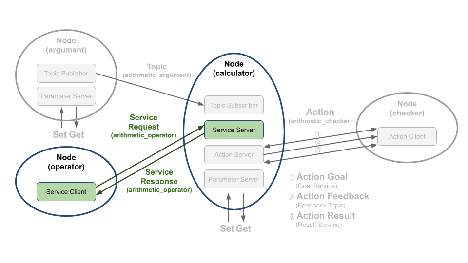

# Chapter 36: 서비스 프로그래밍 (C++)
## 01. 서비스(service)
- 서비스(service)는 동기식 양방향 메시지 송수신 방식이다.
- 서비스를 요청(Request)을 하는 쪽을 서비스 클라이언트(Service Client)라고 하고 요청받은 서비스를 수행한 후 해당 서비스에 대한 응답(Response)을 하는 쪽을 서비스 서버(Service Server)라고 한다.
- 서비스는 요청을 하는 클라이언트와 요청받은 일을 수행한 후에 그 결괏값을 전달하는 서버와의 1:1 또는 N:1 통신 과정이라고 볼 수 있다.
- 우리는 이 강좌에서 그림과 같은 서비스 요청을 하는 서비스 클라이언트와 서비스 응답을 하는 서비스 서버를 작성해 볼 것이다.
- 여기서 서비스 요청 값으로는 연산자(더하기[ + ], 빼기 [ - ], 곱하기 [ * ], 나누기 [ / ])를 임의로 선택 한후에 보낼 것이다.
- 그리고 기존에 저장된 변수 a, b를 요청 값으로 받은 연산자로 계산하여 그 결괏값을 서비스 응답 값으로 보내는 프로그램을 짜볼 것이다.
- 강좌 진행에 앞서서 서비스에 대한 자세한 내용은 '010 ROS 2 서비스 (service)' 강좌를 참고하도록 하자.



## 02. 서비스 서버 코드
- 서비스 서버 역할을 하는 calculator 노드의 소스 코드는 깃허브 리포지토리에 위치해놓았다.
- 해당 리포지토리에서 하기의 장소에 관련 코드가 있기에 참고하도록 하자.
```
topic_service_action_rclcpp_example/include/calculator/calculator.hpp

topic_service_action_rclcpp_example/src/calculator/calculator.cpp
```
- Calculator 노드는 토픽 서브스크라이버, 서비스 서버, 액션 서버를 모두 포함하고 있어서 매우 길기 때문에 전체 코드를 강좌 글에 담는 것은 생략하도록 하고 전체 소스 코드 중 서비스 서버와 관련한 코드만 살펴보도록 하겠다.
- Calculator 클래스는 rclcpp::node 를 상속하고 있으며 생성자에서 'calculator' 라는 노드 이름으로 초기화되었다.
- arithmetic_argument_server 멤버변수는 rclcpp::Service 타입의 스마트포인터변수로 서비스명과 콜백함수를 인자로 받는 create_service 함수를 통해 실체화 된다.
- 해당 코드에서는 위 그림과 같이 arithmetic_operator 서비스명을 사용했고, 콜백함수는 람다 표현식을 이용하여 get_arithmetic_operator를 지정하였다.
- 람다 표현식이 먼저 정의되어야지만 이를 사용할 수 있기에 코드의 순서가 아래와 같다. 만약 ROS와 같은 스타일로 코드를 만들고 싶다면 std::bind 를 사용해도 문제없다.
- 서비스 통신도 DDS를 통해 동작하기에 QoS를 지원한다.
- create_service 의 세번째 인자에 rmw_qos_profile_t의 형태로 원하는 설정이 가능하며, 기본적으로는 rmw_qos_profile_services_default가 설정되어 있다.
- QoS에 대한 자세한 설명은 '019 DDS의 QoS(Quality of Service)' 강좌를 참고하자.
- get_arithmetic_operator 를 살펴보자.
- 해당 람다 표현식은 Request와 Response 인자를 가지고 있어서 함수 내부에서 이를 사용할 수 있다.
- 우선 argument_operator 멤버 변수에 에 요청받은 연산자를 저장한다.
- 그다음 argument_a, argument_b 와 함께 argument_operator 변수를 calculate_given_formula 함수에 넘겨주어 그 결괏값을 리턴받아 response 변수에 저장하여 서비스를 요청한 클라이언트가 이를 받아볼 수 있도록 한다.
- 그리고 해당 연산식을 ostringstream 라이브러리를 이용해 string 변수에 저장하였다.
- 저장된 string 변수는 로그로 확인할 수 있다.
- topic_service_action_rclcpp_example/src/calculator/calculator.cpp
```cpp
  auto get_arithmetic_operator =
    [this](
    const std::shared_ptr<ArithmeticOperator::Request> request,
    std::shared_ptr<ArithmeticOperator::Response> response) -> void
    {
      argument_operator_ = request->arithmetic_operator;
      argument_result_ =
        this->calculate_given_formula(argument_a_, argument_b_, argument_operator_);
      response->arithmetic_result = argument_result_;

      std::ostringstream oss;
      oss << std::to_string(argument_a_) << ' ' <<
        operator_[argument_operator_ - 1] << ' ' <<
        std::to_string(argument_b_) << " = " <<
        argument_result_ << std::endl;
      argument_formula_ = oss.str();

      RCLCPP_INFO(this->get_logger(), "%s", argument_formula_.c_str());
    };

  arithmetic_argument_server_ =
    create_service<ArithmeticOperator>("arithmetic_operator", get_arithmetic_operator);
```
- calculate_given_formula 함수는 상수 a, b 와 연산자 정보를 포함하는 상수 operator를 인자로 받아 그 계산 결괏값을 리턴해주는 역할을 한다.
- 아래 코드에서 Request 구조체를 통해 미리 저장된 상수와 operator 인자를 비교하여 해당 연산을 진행하는 로직을 확인할 수 있다.
- Request 구조체는 `027 토픽, 서비스, 액션 인터페이스` 강좌에서 정의하였으니 참고하기 바란다.
- msg_srv_action_interface_example/srv/ArithmeticOperator.srv
```cpp
# Constants
int8 PLUS = 1
int8 MINUS = 2
int8 MULTIPLY = 3
int8 DIVISION = 4
```
- topic_service_action_rclcpp_example/src/calculator/calculator.cpp
```cpp
float Calculator::calculate_given_formula(
  const float & a,
  const float & b,
  const int8_t & operators)
{
  float argument_result = 0.0;
  ArithmeticOperator::Request arithmetic_operator;

  if (operators == arithmetic_operator.PLUS) {
    argument_result = a + b;
  } else if (operators == arithmetic_operator.MINUS) {
    argument_result = a - b;
  } else if (operators == arithmetic_operator.MULTIPLY) {
    argument_result = a * b;
  } else if (operators == arithmetic_operator.DIVISION) {
    argument_result = a / b;
    if (b == 0.0) {
      RCLCPP_ERROR(this->get_logger(), "ZeroDivisionError!");
      argument_result = 0.0;
      return argument_result;
    }
  } else {
    RCLCPP_ERROR(
      this->get_logger(),
      "Please make sure arithmetic operator(plus, minus, multiply, division).");
    argument_result = 0.0;
  }

  return argument_result;
}
```

## 03. 서비스 클라이언트 코드
- 서비스 클라이언트 역할을 하는 operator 노드의 소스 코드는 깃허브 리포지토리에서 찾아볼 수 있다.
- 해당 리포지토리에서 하기의 장소에 관련 코드가 있기에 참고하도록 하자.
```
topic_service_action_rclcpp_example/include/arithmetic/operator.hpp

topic_service_action_rclcpp_example/src/arithmetic/operator.cpp
```
- 서비스 서버 역할을 하는 operator 노드의 전체 소스 코드는 아래와 같다.
- topic_service_action_rclcpp_example/include/arithmetic/operator.hpp
```cpp
#ifndef ARITHMETIC__OPERATOR_HPP_
#define ARITHMETIC__OPERATOR_HPP_

#include <chrono>
#include <memory>
#include <string>
#include <utility>
#include <random>

#include "rclcpp/rclcpp.hpp"
#include "msg_srv_action_interface_example/srv/arithmetic_operator.hpp"


class Operator : public rclcpp::Node
{
public:
  using ArithmeticOperator = msg_srv_action_interface_example::srv::ArithmeticOperator;

  explicit Operator(const rclcpp::NodeOptions & node_options = rclcpp::NodeOptions());
  virtual ~Operator();

  void send_request();

private:
  rclcpp::Client<ArithmeticOperator>::SharedPtr arithmetic_service_client_;
};
#endif  // ARITHMETIC__OPERATOR_HPP_
```
- topic_service_action_rclcpp_example/src/arithmetic/operator.cpp
```cpp
#include <fcntl.h>
#include <getopt.h>
#include <termios.h>
#include <unistd.h>
#include <cstdio>
#include <iostream>
#include <memory>
#include <string>
#include <utility>

#include "rclcpp/rclcpp.hpp"
#include "rcutils/cmdline_parser.h"

#include "arithmetic/operator.hpp"

using namespace std::chrono_literals;

Operator::Operator(const rclcpp::NodeOptions & node_options)
: Node("operator", node_options)
{
  arithmetic_service_client_ = this->create_client<ArithmeticOperator>("arithmetic_operator");
  while (!arithmetic_service_client_->wait_for_service(1s)) {
    if (!rclcpp::ok()) {
      RCLCPP_ERROR(this->get_logger(), "Interrupted while waiting for the service.");
      return;
    }
    RCLCPP_INFO(this->get_logger(), "Service not available, waiting again...");
  }
}

Operator::~Operator()
{
}

void Operator::send_request()
{
  std::random_device rd;
  std::mt19937 gen(rd());
  std::uniform_int_distribution<int> distribution(1, 4);

  auto request = std::make_shared<ArithmeticOperator::Request>();
  request->arithmetic_operator = distribution(gen);

  using ServiceResponseFuture = rclcpp::Client<ArithmeticOperator>::SharedFuture;
  auto response_received_callback = [this](ServiceResponseFuture future) {
      auto response = future.get();
      RCLCPP_INFO(this->get_logger(), "Result %.2f", response->arithmetic_result);
      return;
    };

  auto future_result =
    arithmetic_service_client_->async_send_request(request, response_received_callback);
}
```
- hpp 파일에 선언된 Operator 클래스를 보자. Operator 클래스는 rclcpp::Node 클래스를 상속받는 자식 클래스이고, 생성자에서 rclcpp::NodeOptions를 인자로 받는다.
- 그리고 서비스 요청을 위한 send_request 함수와 rclcpp::Client 스마트포인터타입의 멤버변수를 가지고 있다.
```cpp
class Operator : public rclcpp::Node
{
public:
  using ArithmeticOperator = msg_srv_action_interface_example::srv::ArithmeticOperator;

  explicit Operator(const rclcpp::NodeOptions & node_options = rclcpp::NodeOptions());
  virtual ~Operator();

  void send_request();

private:
  rclcpp::Client<ArithmeticOperator>::SharedPtr arithmetic_service_client_;
};
```
- Operator 클래스의 생성자 내부를 보면 부모 클래스인 rclcpp::Node를 노드명과 node_options 인자로 먼저 초기화해 준다.
- 그리고 create_client 함수를 통해 서비스명을 인자로 받아 rclcpp::Client를 실체화 시켜준다.
- 서비스 통신도 DDS를 통해 동작하기에 QoS를 지원한다.
- create_client 함수의 두번째 인자에 rmw_qos_profile_t의 형태로 원하는 설정이 가능하며, 기본적으로는 rmw_qos_profile_services_default가 설정되어 있다.
- QoS에 대한 자세한 설명은 '019 DDS의 QoS(Quality of Service)' 강좌를 참고하자.
- 서비스 클라이언트는 서비스 서버가 없다면 요청을 할수 없을 뿐더러 원하는 응답도 얻지 못하기에 같은 서비스 명을 가진 서비스 서버를 기다리는 코드가 함께 따라다닌다는 것을 기억하자.
```cpp
Operator::Operator(const rclcpp::NodeOptions & node_options)
: Node("operator", node_options)
{
  arithmetic_service_client_ = this->create_client<ArithmeticOperator>("arithmetic_operator");
  while (!arithmetic_service_client_->wait_for_service(1s)) {
    if (!rclcpp::ok()) {
      RCLCPP_ERROR(this->get_logger(), "Interrupted while waiting for the service.");
      return;
    }
    RCLCPP_INFO(this->get_logger(), "Service not available, waiting again...");
  }
}
```
- 실제로 요청을 수행하는 send_request 함수를 보자. 랜덤한 연산자를 고르기 위해 1 ~ 4 사이의 랜덤한 숫자를 생성하여 request 변수에 저장하게 된다.
- 그리고 요청에 의한 응답이 왔을 때 불려질 response_received_callback 콜백함수를 람다 표현식을 이용하여 정의해보자.
- 해당 람다 표현식은 인자로 future를 가지고 있는데, 이는 C++11의 비동기식 프로그래밍의 future, promise 개념과 동일하다.
- 콜백함수가 불려졌다면 future 변수를 통해 response 값을 저장할 수 있고, 이를 로그로 확인할 수 있다.
- 코드 마지막줄에서 정의된 request 변수와 람다 표현식을 가지고 async_send_request 함수를 통해 비동기식으로 서비스 요청을 보내는 것을 확인할 수 있다.
```cpp
void Operator::send_request()
{
  std::random_device rd;
  std::mt19937 gen(rd());
  std::uniform_int_distribution<int> distribution(1, 4);

  auto request = std::make_shared<ArithmeticOperator::Request>();
  request->arithmetic_operator = distribution(gen);

  using ServiceResponseFuture = rclcpp::Client<ArithmeticOperator>::SharedFuture;
  auto response_received_callback = [this](ServiceResponseFuture future) {
      auto response = future.get();
      RCLCPP_INFO(this->get_logger(), "Result %.2f", response->arithmetic_result);
      return;
    };

  auto future_result =
    arithmetic_service_client_->async_send_request(request, response_received_callback);
}
```

## 04. 서비스 서버, 서비스 클라이언트 복습!
- 설명이 좀 길었으니 여기서 정리하고 넘어가자.
- 서비스는 아래와 같이 설정하여 사용하면 된다!

### 4-1. 서비스 서버 (요청에 응답하는 프로그램)
1. Node 설정
2. create_server 설정
3. 콜백함수 설정

### 4-2. 서비스 클라이언트 (요청하는 프로그램)
1. Node 설정
2. create_client 설정
3. 요청함수 설정

## 05. 노드 실행 코드
- 지난 강좌에서 소스 코드를 집중적으로 보기전에 이를 먼저 빌드하여 노드들을 실행해보는 실습시간을 가졌다.
- 이번에는 작성한 노드를 어떻게 설정해야 실행 가능하게 되는지 알아보도록 하자.
- 우선 이전 강의에서 익힌 노드 실행 명령어는 다음과 같다.
- calculator가 이 강좌에서 다룬 서비스 서버 노드이고, operator는 서비스 클라이언트 노드이다.
```
$ ros2 run topic_service_action_rclcpp_example calculator
$ ros2 run topic_service_action_rclcpp_example operator
```
- 이 두 개의 노드를 실행할 수 있도록 설정한 부분은 지난 강좌의 "4. 빌드 설정 파일 (CMakeLists.txt)" 에서 확인할 수 있다.
- CMake의 add_executable 태그는 main 함수가 포함된 소스파일을 실행 가능하도록 만들어 주는 역할을 한다.
- 그 첫번째 인자에는 실행명을 적고, 다음 인자에는 main 함수가 포함된 소스파일을 적어준다.
- 필요하다면 그 다음 인자로 target이 되는 소스파일도 적어주어야 한다.
- 이를 통해 우리는 ros2 run 명령어를 통해 operator 와 calculator 소스 파일을 실행할 수 있다.
```cpp
add_executable(operator src/arithmetic/operator.cpp)
add_executable(calculator src/calculator/main.cpp src/calculator/calculator.cpp)
```
- 서비스 서버인 calculator 노드는 토픽 서브스크라이버, 서비스 서버, 액션 서버를 역할을 하는 복합 기능 노드로 실행 코드에 대한 설명은 '035 토픽 프로그래밍 (C++)'에서 이미 다루었기에 아래 코드에 대한 설명은 해당 강좌를 다시 보도록 하자.
- topic_service_action_rclcpp_example/src/calculator/main.cpp
```cpp
int main(int argc, char * argv[])
{
  if (rcutils_cli_option_exist(argv, argv + argc, "-h")) {
    print_help();
    return 0;
  }

  rclcpp::init(argc, argv);

  auto calculator = std::make_shared<Calculator>();

  rclcpp::spin(calculator);

  rclcpp::shutdown();

  return 0;
}
```
- topic_service_action_rclcpp_example/src/arithmetic/operator.cpp
```cpp
// 코드 중략

bool pull_trigger()
{
  const uint8_t KEY_ENTER = 10;
  while (1) {
    if (kbhit()) {
      uint8_t c = getch();
      if (c == KEY_ENTER) {
        return true;
      } else {
        return false;
      }
    }
  }
  return false;
}

void print_help()
{
  printf("For operator node:\n");
  printf("node_name [-h]\n");
  printf("Options:\n");
  printf("\t-h Help           : Print this help function.\n");
}

int main(int argc, char * argv[])
{
  if (rcutils_cli_option_exist(argv, argv + argc, "-h")) {
    print_help();
    return 0;
  }

  rclcpp::init(argc, argv);

  auto operator_node = std::make_shared<Operator>();

  while (rclcpp::ok()) {
    rclcpp::spin_some(operator_node);
    operator_node->send_request();

    printf("Press Enter for next service call.\n");
    if (pull_trigger() == false) {
      rclcpp::shutdown();
      return 0;
    }
  }
}
```
- Operator 노드의 메인 함수는 Operator 클래스를 인스턴스화 하고 반복문을 통해 send_request 함수를 호출하는 로직을 가지고 있다.
- 해당 로직에서 pull_trigger 함수를 통해 서비스 요청이 끝난 다음 키보드 입력을 기다리며 한번 더 서비스 요청을 할 것인지(ENTER Key) 아니면 노드를 종료할 것인지(Not ENTER Key)를 선택할 수 있다.
```cpp
int main(int argc, char * argv[])
{
  if (rcutils_cli_option_exist(argv, argv + argc, "-h")) {
    print_help();
    return 0;
  }

  rclcpp::init(argc, argv);

  auto operator_node = std::make_shared<Operator>();

  while (rclcpp::ok()) {
    rclcpp::spin_some(operator_node);
    operator_node->send_request();

    printf("Press Enter for next service call.\n");
    if (pull_trigger() == false) {
      rclcpp::shutdown();
      return 0;
    }
  }
}
```

[출처] 036 서비스 프로그래밍 (C++) (오픈소스 소프트웨어 & 하드웨어: 로봇 기술 공유 카페 (오로카)) | 작성자 Routiful
