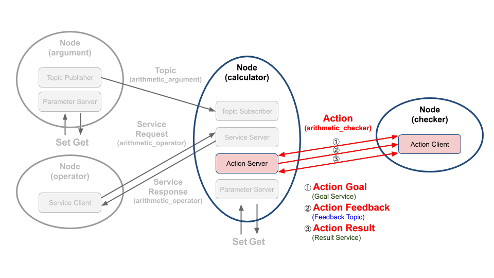

# Chapter 37: 액션 프로그래밍 (C++)
## 01. 액션(action)
- 액션(action)은 비동기식+동기식 양방향 메시지 송수신 방식이다.
- 액션(action)은 액션 목표 (goal)를 지정하는 액션 클라이언트(Action Client) 그리고 액션 목표를 받아 특정 태스크를 수행하는 동시에, 중간 결괏값에 해당되는 액션 피드백(feedback)과 최종 결괏값에 해당되는 액션 결과(result)를 전송하는 액션 서버(Action Server) 간의 통신이라고 볼 수 있다.
- 우리는 이 강좌에서 그림과 같은 액션 목표(action goal)를 지정하는 액션 클라이언트와 액션 목표를 받아 특정 태스크를 수행하면서 중간 결괏값에 해당되는 액션 피드백(action feedback)과 최종 결괏값에 해당되는 액션 결과(action result)를 전송하는 액션 서버를 작성해 볼 것이다.
- 강좌 진행에 앞서서 액션에 대한 자세한 내용은 '011 ROS 2 액션 (action)' 강좌를 참고하도록 하자.



- 앞으로 설명할 코드에서의 액션 목표로는 이전 강좌에서 설명하였던 매회 계산 값들의 합계의 최댓값이고 액션 피드백은 계산 공식의 문자열 값, 액션 결과는 매회 계산 값들의 합계가 지정된 액션 목표값에 도달하였을 때의 값이다.​

## 02. 액션 서버 코드
- 액션 서버 역할을 하는 calculator 노드의 소스 코드는 깃허브 리포지토리에 위치해놓았다.
- 해당 리포지토리에서 하기의 장소에 관련 코드가 있기에 참고하도록 하자.
```
topic_service_action_rclcpp_example/include/calculator/calculator.hpp

topic_service_action_rclcpp_example/src/calculator/calculator.cpp
```
- Calculator 노드는 토픽 서브스크라이버, 서비스 서버, 액션 서버를 모두 포함하고 있어서 매우 길기 때문에 전체 코드를 강좌 글에 담는 것은 생략하도록 하고 전체 소스 코드 중 서비스 서버와 관련한 코드만 살펴보도록 하겠다.
- Calculator 클래스는 rclcpp::node 를 상속하고 있으며 생성자에서 'calculator' 라는 노드 이름으로 초기화되어있다.
- arithmetic_action_server 멤버변수는 rclcpp_action::Server 타입의 스마트포인터변수이다.
- 토픽과 서비스 통신을 위한 멤버변수들은 rclcpp::Publisher, rclcpp::Service 와 같이 rclcpp 네임스페이스를 가지는데 반해 액션 통신을 위한 변수들은 rclcpp_action 네임스페이스를 가진다.
- arithmetic_action_server 멤버변수는 node 정보들과 액션명 그리고 콜백함수들을 인자로 가지는 create_server 함수를 통해 실체화된다. 
- topic_service_action_rclcpp_example/src/calculator/calculator.cpp
```cpp
  arithmetic_action_server_ = rclcpp_action::create_server<ArithmeticChecker>(
    this->get_node_base_interface(),
    this->get_node_clock_interface(),
    this->get_node_logging_interface(),
    this->get_node_waitables_interface(),
    "arithmetic_checker",
    std::bind(&Calculator::handle_goal, this, _1, _2),
    std::bind(&Calculator::handle_cancel, this, _1),
    std::bind(&Calculator::execute_checker, this, _1)
  );
```
- handle_goal 함수는 액션 클라이언트에서 액션 목표(goal)을 요청했을 때 콜백되는 함수이다.
- 해당 함수 인자로 액션 클라이언트 메시지의 uuid와 액션 목표 값을 확인할 수 있으며, 액션 목표 값에 대한 처리를 통해 테스크를 진행할지 그렇지 아니할지를 리턴값으로 보낼 수 있다.
- 이는 서비스 통신 처럼 동작한다.
- topic_service_action_rclcpp_example/src/calculator/calculator.cpp
```cpp
rclcpp_action::GoalResponse Calculator::handle_goal(
  const rclcpp_action::GoalUUID & uuid,
  std::shared_ptr<const ArithmeticChecker::Goal> goal)
{
  (void)uuid;
  (void)goal;
  return rclcpp_action::GoalResponse::ACCEPT_AND_EXECUTE;
}
```
- handle_cancel 함수는 액션 클라이언트에서 액션 목표 취소을 요청을 했을 때 콜백되는 함수이다.
- 해당 함수 인자로 ServerGoalHandle 타입을 사용하며 진행 중이었던 테스크의 결괏값, 진행상황, 상태 등을 넘겨 주는 동작을 수행할 수 있다. 이는 서비스 통신 처럼 동작한다.
- topic_service_action_rclcpp_example/src/calculator/calculator.cpp
```cpp
rclcpp_action::CancelResponse Calculator::handle_cancel(
  const std::shared_ptr<GoalHandleArithmeticChecker> goal_handle)
{
  RCLCPP_INFO(this->get_logger(), "Received request to cancel goal");
  (void)goal_handle;
  return rclcpp_action::CancelResponse::ACCEPT;
}
```
- execute_checker 함수는 액션 클라이언트에서 요청한 액션 목표을 가지고 실제 테스크가 진행되는 함수이다.
- 해당 함수 내부에서는 ServerGoalHandle 타입의 인자를 가지고 액션 목표과 액션 피드백 그리고 액션 결괏값에 접근할 수 있다.
- 함수 내부 로직에서는 ServerGoalHandle 클래스의 get_goal 멤버 함수를 통해 액션 클라이언트에서 보낸 액션 목표를 가져와서 Calculator 클래스의 argument_result 멤버 변수값의 합과 비교한 후 만약 그 합이 액션 목표값과 비교하는 모습을 확인할 수 있다.
- 그리고 반복문이 동작할 때마다 Calculator 클래스의 argument_formula 멤버 변수를 액션 클라이언트에 publish(이는 토픽처럼 동작한다)해주는 모습도 확인할 수 있다.
- topic_service_action_rclcpp_example/src/calculator/calculator.cpp
```cpp
void Calculator::execute_checker(const std::shared_ptr<GoalHandleArithmeticChecker> goal_handle)
{
  RCLCPP_INFO(this->get_logger(), "Execute arithmetic_checker action!");
  rclcpp::Rate loop_rate(1);

  auto feedback_msg = std::make_shared<ArithmeticChecker::Feedback>();
  float total_sum = 0.0;
  float goal_sum = goal_handle->get_goal()->goal_sum;

  while ((total_sum < goal_sum) && rclcpp::ok()) {
    total_sum += argument_result_;
    feedback_msg->formula.push_back(argument_formula_);
    if (argument_formula_.empty()) {
      RCLCPP_WARN(this->get_logger(), "Please check your formula");
      break;
    }
    RCLCPP_INFO(this->get_logger(), "Feedback: ");
    for (const auto & formula : feedback_msg->formula) {
      RCLCPP_INFO(this->get_logger(), "\t%s", formula.c_str());
    }
    goal_handle->publish_feedback(feedback_msg);
    loop_rate.sleep();
  }

  if (rclcpp::ok()) {
    auto result = std::make_shared<ArithmeticChecker::Result>();
    result->all_formula = feedback_msg->formula;
    result->total_sum = total_sum;
    goal_handle->succeed(result);
  }
}
```

## 03. 액션 클라이언트 코드
- 액션 클라이언트 역할을 하는 checker 노드의 소스 코드는 깃허브 리포지토리에 위치해놓았다.
- 해당 리포지토리에서 하기의 장소에 관련 코드가 있기에 참고하도록 하자.
```
topic_service_action_rclcpp_example/include/checker/checker.hpp

topic_service_action_rclcpp_example/src/checker/checker.cpp
```
- 전체 코드는 아래와 같다.
- topic_service_action_rclcpp_example/include/checker/checker.hpp
```cpp
#ifndef CHECKER__CHECKER_HPP_
#define CHECKER__CHECKER_HPP_

#include <memory>
#include <string>
#include <utility>

#include "rclcpp/rclcpp.hpp"
#include "rclcpp_action/rclcpp_action.hpp"

#include "msg_srv_action_interface_example/action/arithmetic_checker.hpp"


class Checker : public rclcpp::Node
{
public:
  using ArithmeticChecker = msg_srv_action_interface_example::action::ArithmeticChecker;
  using GoalHandleArithmeticChecker = rclcpp_action::ClientGoalHandle<ArithmeticChecker>;

  explicit Checker(
    float goal_sum,
    const rclcpp::NodeOptions & node_options = rclcpp::NodeOptions());
  virtual ~Checker();

private:
  void send_goal_total_sum(float goal_sum);

  void get_arithmetic_action_goal(
    std::shared_future<rclcpp_action::ClientGoalHandle<ArithmeticChecker>::SharedPtr> future);

  void get_arithmetic_action_feedback(
    GoalHandleArithmeticChecker::SharedPtr,
    const std::shared_ptr<const ArithmeticChecker::Feedback> feedback);

  void get_arithmetic_action_result(
    const GoalHandleArithmeticChecker::WrappedResult & result);

  rclcpp_action::Client<ArithmeticChecker>::SharedPtr arithmetic_action_client_;
};
#endif  // CHECKER__CHECKER_HPP_
```
- topic_service_action_rclcpp_example/src/checker/checker.cpp
```cpp
#include <memory>

#include "checker/checker.hpp"

Checker::Checker(float goal_sum, const rclcpp::NodeOptions & node_options)
: Node("checker", node_options)
{
  arithmetic_action_client_ = rclcpp_action::create_client<ArithmeticChecker>(
    this->get_node_base_interface(),
    this->get_node_graph_interface(),
    this->get_node_logging_interface(),
    this->get_node_waitables_interface(),
    "arithmetic_checker");

  send_goal_total_sum(goal_sum);
}

Checker::~Checker()
{
}

void Checker::send_goal_total_sum(float goal_sum)
{
  using namespace std::placeholders;

  if (!this->arithmetic_action_client_) {
    RCLCPP_WARN(this->get_logger(), "Action client not initialized");
  }

  if (!this->arithmetic_action_client_->wait_for_action_server(std::chrono::seconds(10))) {
    RCLCPP_WARN(this->get_logger(), "Arithmetic action server is not available.");
    return;
  }

  auto goal_msg = ArithmeticChecker::Goal();
  goal_msg.goal_sum = goal_sum;

  auto send_goal_options = rclcpp_action::Client<ArithmeticChecker>::SendGoalOptions();
  send_goal_options.goal_response_callback =
    std::bind(&Checker::get_arithmetic_action_goal, this, _1);
  send_goal_options.feedback_callback =
    std::bind(&Checker::get_arithmetic_action_feedback, this, _1, _2);
  send_goal_options.result_callback =
    std::bind(&Checker::get_arithmetic_action_result, this, _1);
  this->arithmetic_action_client_->async_send_goal(goal_msg, send_goal_options);
}

void Checker::get_arithmetic_action_goal(
  std::shared_future<GoalHandleArithmeticChecker::SharedPtr> future)
{
  auto goal_handle = future.get();
  if (!goal_handle) {
    RCLCPP_WARN(this->get_logger(), "Action goal rejected.");
  } else {
    RCLCPP_INFO(this->get_logger(), "Action goal accepted.");
  }
}

void Checker::get_arithmetic_action_feedback(
  GoalHandleArithmeticChecker::SharedPtr,
  const std::shared_ptr<const ArithmeticChecker::Feedback> feedback)
{
  RCLCPP_INFO(this->get_logger(), "Action feedback: ");
  for (const auto & formula : feedback->formula) {
    RCLCPP_INFO(this->get_logger(), "\t%s ", formula.c_str());
  }
}

void Checker::get_arithmetic_action_result(
  const GoalHandleArithmeticChecker::WrappedResult & result)
{
  switch (result.code) {
    case rclcpp_action::ResultCode::SUCCEEDED:
      RCLCPP_INFO(this->get_logger(), "Action succeeded!");
      RCLCPP_INFO(this->get_logger(), "Action result(all formula): ");
      for (const auto & formula : result.result->all_formula) {
        RCLCPP_INFO(this->get_logger(), "\t%s ", formula.c_str());
      }
      RCLCPP_INFO(this->get_logger(), "Action result(total sum): ");
      RCLCPP_INFO(this->get_logger(), "\t%.2f ", result.result->total_sum);
      break;
    case rclcpp_action::ResultCode::ABORTED:
      RCLCPP_WARN(this->get_logger(), "The action was aborted");
      return;
    case rclcpp_action::ResultCode::CANCELED:
      RCLCPP_WARN(this->get_logger(), "The action was canceled");
      return;
    default:
      RCLCPP_ERROR(this->get_logger(), "Unknown result code");
      return;
  }
  rclcpp::shutdown();
}
```
- hpp 파일에 선언된 Checker 클래스를 보자.
- Checker 클래스는 rclcpp::Node 클래스를 상속받는 자식 클래스이고, 생성자에서 goal_sum 변수와 rclcpp::NodeOptions를 인자로 받는다.
- goal_sum 변수의 경우 추후 실행 인자 프로그래밍 강의에서 다루도록 하겠다.
- 멤버 함수로는 액션 요청을 위한 send_goal_total_sum 함수와 액션 동작 시 호출되는 콜백 함수들 그리고 멤버 변수로 rclcpp_action::Client 타입의 스마트 포인터를 확인할 수 있다.
```cpp
class Checker : public rclcpp::Node
{
public:
  using ArithmeticChecker = msg_srv_action_interface_example::action::ArithmeticChecker;
  using GoalHandleArithmeticChecker = rclcpp_action::ClientGoalHandle<ArithmeticChecker>;

  explicit Checker(
    float goal_sum,
    const rclcpp::NodeOptions & node_options = rclcpp::NodeOptions());
  virtual ~Checker();

private:
  void send_goal_total_sum(float goal_sum);

  void get_arithmetic_action_goal(
    std::shared_future<rclcpp_action::ClientGoalHandle<ArithmeticChecker>::SharedPtr> future);

  void get_arithmetic_action_feedback(
    GoalHandleArithmeticChecker::SharedPtr,
    const std::shared_ptr<const ArithmeticChecker::Feedback> feedback);

  void get_arithmetic_action_result(
    const GoalHandleArithmeticChecker::WrappedResult & result);

  rclcpp_action::Client<ArithmeticChecker>::SharedPtr arithmetic_action_client_;
};
```
- Checker 노드의 생성자를 보자.
- 먼저 부모 클래스인 rclcpp::Node를 노드명과 node_options 인자로 먼저 초기화해 준다.
- 그리고rclcpp_action::create_client 함수를 통해 해당 노드의 인터페이스들과 액션명을 인자로 받아 rclcpp_action::Client를 실체화 시켜준다.
- 그리고 액션 목표 값을 보내주는 send_goal_total_sum 함수를 호출한다.
```cpp
Checker::Checker(float goal_sum, const rclcpp::NodeOptions & node_options)
: Node("checker", node_options)
{
  arithmetic_action_client_ = rclcpp_action::create_client<ArithmeticChecker>(
    this->get_node_base_interface(),
    this->get_node_graph_interface(),
    this->get_node_logging_interface(),
    this->get_node_waitables_interface(),
    "arithmetic_checker");

  send_goal_total_sum(goal_sum);
}
```
- send_goal_total_sum 함수는 goal_sum 변수를 인자로 받아 액션 목표 값을 보내주는 역할을 한다.
- 먼저 액션 클라이언트가 실체화 되었는지 확인하고, 액션 서버와 통신할 수 있는지 확인한다.
- 액션 목표 값을 설정하기 위해서 ArithmeticChecker 액션 인터페이스의 Goal 메시지를 불러와 인자로 받은 goal_sum 변수를 넘겨준다.
- 그리고 rclcpp_action::Client의 SendGoalOptions 구조체를 통해 goal_response_callback, feedback_callback, result_callback 함수를 초기화 시켜주고 이를 Goal 메시지와 함께 async_send_goal 함수를 통해 액션 서버에 보낼 수 있다.
```cpp
void Checker::send_goal_total_sum(float goal_sum)
{
  using namespace std::placeholders;

  if (!this->arithmetic_action_client_) {
    RCLCPP_WARN(this->get_logger(), "Action client not initialized");
  }

  if (!this->arithmetic_action_client_->wait_for_action_server(std::chrono::seconds(10))) {
    RCLCPP_WARN(this->get_logger(), "Arithmetic action server is not available.");
    return;
  }

  auto goal_msg = ArithmeticChecker::Goal();
  goal_msg.goal_sum = goal_sum;

  auto send_goal_options = rclcpp_action::Client<ArithmeticChecker>::SendGoalOptions();
  send_goal_options.goal_response_callback =
    std::bind(&Checker::get_arithmetic_action_goal, this, _1);
  send_goal_options.feedback_callback =
    std::bind(&Checker::get_arithmetic_action_feedback, this, _1, _2);
  send_goal_options.result_callback =
    std::bind(&Checker::get_arithmetic_action_result, this, _1);
  this->arithmetic_action_client_->async_send_goal(goal_msg, send_goal_options);
}
```
- get_arithmetic_action_goal 함수는 앞서 설정한 SendGoalOptions의 goal_response_callback 으로 앞서 설명했던 액션 서버의 handle_goal 함수와 연결되어 있다.
- 이는 서비스 통신 처럼 동작하며, 액션 목표 값을 보내고 난 뒤 이에 대한 첫번째 응답을 확인할 수 있다.
```cpp
void Checker::get_arithmetic_action_goal(
  std::shared_future<GoalHandleArithmeticChecker::SharedPtr> future)
{
  auto goal_handle = future.get();
  if (!goal_handle) {
    RCLCPP_WARN(this->get_logger(), "Action goal rejected.");
  } else {
    RCLCPP_INFO(this->get_logger(), "Action goal accepted.");
  }
}
```
- get_arithmetic_action_feedback 함수는 앞서 설정한 SendGoalOptions의 feedback_callback 으로 앞서 설명했던 액션 서버의 execute_checker 함수와 연결되어 있다.
- 액션 인터페이스의 feedback 메시지를 인자로 가지고 있어 액션 피드백을 확인할 수 있다.
```cpp
void Checker::get_arithmetic_action_feedback(
  GoalHandleArithmeticChecker::SharedPtr,
  const std::shared_ptr<const ArithmeticChecker::Feedback> feedback)
{
  RCLCPP_INFO(this->get_logger(), "Action feedback: ");
  for (const auto & formula : feedback->formula) {
    RCLCPP_INFO(this->get_logger(), "\t%s ", formula.c_str());
  }
}
```
- get_arithmetic_action_result 함수는 앞서 설정한 SendGoalOptions의 result_callback 으로 앞서 설명했던 액션 서버의 execute_checker 함수와 연결되어 있다.
- WrappedResult 타입의 변수를 인자로 가지고 있어서 액션 결괏값을 확인할 수 있을 뿐만 아니라, 액션 결과 상태에 따른 액션 클라이언트의 대응 로직을 쉽게 개발할 수 있다.
```cpp
void Checker::get_arithmetic_action_result(
  const GoalHandleArithmeticChecker::WrappedResult & result)
{
  switch (result.code) {
    case rclcpp_action::ResultCode::SUCCEEDED:
      RCLCPP_INFO(this->get_logger(), "Action succeeded!");
      RCLCPP_INFO(this->get_logger(), "Action result(all formula): ");
      for (const auto & formula : result.result->all_formula) {
        RCLCPP_INFO(this->get_logger(), "\t%s ", formula.c_str());
      }
      RCLCPP_INFO(this->get_logger(), "Action result(total sum): ");
      RCLCPP_INFO(this->get_logger(), "\t%.2f ", result.result->total_sum);
      break;
    case rclcpp_action::ResultCode::ABORTED:
      RCLCPP_WARN(this->get_logger(), "The action was aborted");
      return;
    case rclcpp_action::ResultCode::CANCELED:
      RCLCPP_WARN(this->get_logger(), "The action was canceled");
      return;
    default:
      RCLCPP_ERROR(this->get_logger(), "Unknown result code");
      return;
  }
  rclcpp::shutdown();
}
```

## 04. 액션 서버, 액션 클라이언트 복습!
- 설명이 좀 길었으니 여기서 정리하고 넘어가자.
- 액션은 아래와 같이 설정하여 사용하면 된다!

### 4-1. 액션 서버 (요청에 응답하는 프로그램)
1. Node 설정
2. create_server 설정
3. goal, cancel, accepted 콜백 함수 설정

### 4-2. 액션 클라이언트 (요청하는 프로그램)
1. Node 설정
2. create_client 설정
3. goal_response, feedback, result 콜백 함수 설정

## 05. 노드 실행 코드
- 지난 강좌에서 소스 코드를 집중적으로 보기전에 이를 먼저 빌드하여 노드들을 실행해보는 실습시간을 가졌다.
- 이번에는 작성한 노드를 어떻게 설정해야 실행 가능하게 되는지 알아보도록 하자.
- 우선 이전 강의에서 익힌 노드 실행 명령어는 다음과 같다.
- calculator가 이 강좌에서 다룬 액션 서버 노드이고, checker는 액션 클라이언트 노드이다.
```
$ ros2 run topic_service_action_rclcpp_example calculator 
$ ros2 run topic_service_action_rclcpp_example checker
```
- 이 두 개의 노드를 실행할 수 있도록 설정한 부분은 지난 강좌의 "4. 빌드 설정 파일 (CMakeLists.txt)" 에서 확인할 수 있다.
- CMake의 add_executable 태그는 main 함수가 포함된 소스파일을 실행 가능하도록 만들어 주는 역할을 한다.
- 그 첫번째 인자에는 실행명을 적고, 다음 인자에는 main 함수가 포함된 소스파일을 적어준다.
- 필요하다면 그 다음 인자로 target이 되는 소스파일도 적어주어야 한다.
- 이를 통해 우리는 ros2 run 명령어를 통해 operator 와 checker 소스 파일을 실행할 수 있다.
```
add_executable(operator src/checker/checker.cpp) 
add_executable(calculator src/calculator/main.cpp src/calculator/calculator.cpp)
```
- 액션 서버인 calculator 노드는 토픽 서브스크라이버, 서비스 서버, 액션 서버를 역할을 하는 복합 기능 노드로 실행 코드에 대한 설명은 '035 토픽 프로그래밍 (C++)'에서 이미 다루었기에 아래 코드에 대한 설명은 해당 강좌를 다시 보도록 하자.
- checker 노드의 main 함수를 보자.
- 이전 강좌에서 다뤘던 main 함수들과 다르게 실행 인자를 받아 Checker 클래스에 넘겨주는 코드가 있다.
- 해당 과정에 대한 설명은 추후 강좌에서 좀더 자세히 다뤄보겠다.
- topic_service_action_rclcpp_example/src/checker/checker.cpp
```cpp
int main(int argc, char * argv[])
{
  if (rcutils_cli_option_exist(argv, argv + argc, "-h")) {
    print_help();
    return 0;
  }

  rclcpp::init(argc, argv);

  float goal_total_sum = 50.0;
  char * cli_option = rcutils_cli_get_option(argv, argv + argc, "-g");
  if (nullptr != cli_option) {
    goal_total_sum = std::stof(cli_option);
  }
  printf("goal_total_sum : %2.f\n", goal_total_sum);

  auto checker = std::make_shared<Checker>(goal_total_sum);

  rclcpp::spin(checker);

  rclcpp::shutdown();

  return 0;
}
```

[출처] 037 액션 프로그래밍 (C++) (오픈소스 소프트웨어 & 하드웨어: 로봇 기술 공유 카페 (오로카)) | 작성자 Routiful
