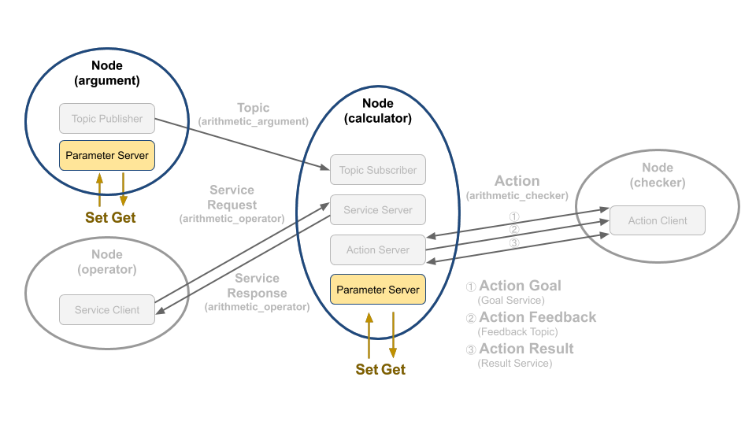

# Chapter 38: 파라미터 프로그래밍 (C++)
## 01. 파라미터 (parameter)
- ROS 2의 파라미터(parameter)는 ROS 1의 parameter server와 dynamic_reconfigure 패키지의 기능을 모두 가지고 있어 노드가 동작하는 동안 특정 값을 저장, 변경, 회수가 가능하다.
- ROS 2의 모든 노드는 파라미터 서버(parameter server)를 가지고 있어서 파라미터 클라이언트(parameter client)와 서비스 통신을 통해 파라미터에 접근할 수 있도록 구현 되었있다.
- 이는 `010 ROS 2 서비스 (service)` 강좌에서 다루었던 서비스(service)와 그 목적은 다르지만 데이터 처리 자체는 동일하다고 볼 수 있다.
- 서비스가 특정 테스크 수행을 위한 요청과 응답이라는 RPC(remote procedure call)에 가까운 목적이었다면, 파라미터는 특정 매개변수를 노드 내부 또는 외부에서 쉽게 저장(Set) 하거나 변경할 수 있고, 쉽게 회수(Get)하여 사용할 수 있게 하는 점에서 그 사용 목적이 다르다고 볼 수 있다.
- 여기서는 파라미터 관련 코드를 중점적으로 볼 것이기에 파라미터와 관련한 자세한 내용은 이전 강좌인 `013 ROS 2 파라미터 (Parameter)` 강좌를 참고하도록 하자.
- 우리는 이전 강좌에서 토픽, 서비스, 액션 관련 프로그래밍을 익히기 위하여 argument, operator, calculator, checker 노드를 작성해 보았다.
- 이들 노드 중에서 그림 1과 같이 argument 노드와 calculator 노드는 파라미터 서버를 가지고 있다.
- argument 노드는 QoS 설정과 랜덤으로 생성되는 변수 a, b의 랜덤 생성 범위를 파라미터로 이용했었고 calculator 노드는 QoS 설정을 파라미터로 사용하였다.
- 우리는 여기서 argument 노드에서 사용되는 파라미터에 대해 자세히 알아볼 것이다.



## 02. 파라미터 서버와 초기화
- 모든 ROS 2 노드는 자신의 파라미터 서버를 가지고 있다.
- 간단히 talker 노드를 동작시켜 이를 확인해보자.
```
$ ros2 run demo_nodes_cpp talker
[INFO]: Publishing: 'Hello World: 1'
[INFO]: Publishing: 'Hello World: 2'
```
- talker 노드는 간단한 퍼블리쉬 예제코드가 포함되어 있는 것을 확인할 수 있다.
- 이제 아래 명령어를 통해 등록된 토픽을 확인해보자.
```
$ ros2 topic list
/chatter
/parameter_events
/rosout
```
- 등록된 토픽은 총 세개인데, 먼저 talker 노드에서 등록한 /chatter 와 모든 노드의 로그를 확인할 수 있는 /rosout 이 있다.
- 그리고 /parameter_events 토픽도 확인할 수 있는데, 이를 서브스크라이브하여 노드는 런타임에서 생성, 변경, 삭제되는 파라미터를 확인할 수 있다.
- 이제 아래 명령어를 통해 등록된 서비스도 한번 확인해보자.
```
$ ros2 service list
/talker/describe_parameters
/talker/get_parameter_types
/talker/get_parameters
/talker/list_parameters
/talker/set_parameters
/talker/set_parameters_atomically
```
- 등록된 서비스는 총 6개이다.
- talker 노드의 코드를 확인해보면 서비스 통신과 관련된 코드는 없는데 어디서 이러한 서비스가 등록된 걸까.
- 이는 Talker 클래스가 상속받은 rclcpp::Node 에서 생성한 서비스들로 이를 이용하여 다른 노드에서 talker 노드와 관련된 파라미터들에 접근할 수 있다.
- 파라미터 서버에 파라미터를 등록하는 방법은 크게 네가지 정도가 있다.
    1. yaml 포맷의 파일의 경로를 프로그램 실행 인자로 rclcpp::Node에 전달
    2. ros2cli 를 이용한 파라미터 등록
    3. rclcpp::Node의 declare, set 파라미터 함수 사용
    4. 파라미터 클라이언트 API를 이용
- 이번 강좌에서는 사용자들이 가장 많이 사용하는 1번 방법을 알아보려한다.
- 먼저 yaml 포맷의 파일을 보자.
- topic_service_action_rclcpp_example/param/arithmetic_config.yaml
```yml
/**: # namespace and node name
  ros__parameters:
    qos_depth: 30
    min_random_num: 0.0
    max_random_num: 9.0
```
- 첫번째 줄의 표식(/**:)은 namespace와 node name과 관계없이 파라미터 이름과 초깃값을 설정하겠다는 뜻을 가지고 있다.
- 만약 namespace와 node name에 따라 설정을 다르게 하고 싶다면, 아래와 같이 적어주면 된다.
```yml
/namespace: 
  /node_name:
    ros__parameters:
      foo: 30
      bar: 0.0
```
- 두번째 줄에는 ros__parameters: 라고 태그를 만들어줘야지만 그 아래 설정된 값들을 ROS 파라미터로 등록시킬 수 있다.
- 파라미터로 등록할 수 있는 타입으로는 bool, int, double, string, array 등이 있다.
- 설정이 끝난 파라미터 파일은 보통 launch 파일에 포함시켜 노드를 킬 때 불러올 수 있도록 한다.
- 런치파일과 관련된 내용은 추후 강좌에서 자세히 알아보도록 하고, 아래 param_dir 을 통해 파라미터 파일의 경로를 불러오는 것만 확인하도록 하자.
- topic_service_action_rclcpp_example/launch/arithmetic.launch.py
```py
import os

from ament_index_python.packages import get_package_share_directory
from launch import LaunchDescription
from launch.actions import DeclareLaunchArgument
from launch.substitutions import LaunchConfiguration
from launch_ros.actions import Node


def generate_launch_description():
    param_dir = LaunchConfiguration(
        'param_dir',
        default=os.path.join(
            get_package_share_directory('topic_service_action_rclcpp_example'),
            'param',
            'arithmetic_config.yaml'))

    return LaunchDescription([
        DeclareLaunchArgument(
            'param_dir',
            default_value=param_dir,
            description='Full path of parameter file'),

        Node(
            package='topic_service_action_rclcpp_example',
            executable='argument',
            name='argument',
            parameters=[param_dir],
            output='screen'),

        Node(
            package='topic_service_action_rclcpp_example',
            executable='calculator',
            name='calculator',
            parameters=[param_dir],
            output='screen'),
    ])
```
- 런치 파일과 파라미터 파일은 CMakeLists 파일에서 저장 경로를 꼭 지정하여야만 제대로 불러올 수 있는 것도 잊지말자.
- topic_service_action_rclcpp_example/CMakeLists.txt
```
# 중략

install(DIRECTORY launch param
  DESTINATION share/${PROJECT_NAME}
)

# 중략
```
- 이제 launch 파일 실행되면 위에서 설정한 파라미터 값들이 파라미터 서버에 등록됬다는 것을 확인할 수 있다.
- 이를 간단히 CLI 명령어를 통해 확인해 보자.
```
$ ros2 launch topic_service_action_rclcpp_example arithmetic.launch.py
$ ros2 param list
/argument:
  max_random_num
  min_random_num
  qos_depth
  use_sim_time
/calculator:
  qos_depth
  use_sim_time
$ ros2 param get /argument max_random_num
Double value is: 9.0
```

## 03. 파라미터 클라이언트
- 앞서 등록한 파라미터에 접근하기 위해서는 rclcpp::Node이 멤버함수 혹은 파라미터 클라이언트 API를 이용해야한다.
- 파라미터 클라이언트를 가지고 있는 argument 노드의 소스 코드는 깃허브 리포지토리에서 찾아볼 수 있다.
- 해당 리포지토리에서 하기의 장소에 관련 코드가 있기에 참고하도록 하자.
```
topic_service_action_rclcpp_example/include/arithmetic/argument.hpp

topic_service_action_rclcpp_example/src/arithmetic/argument.cpp
```
- argument 노드는 이미 서비스 프로그래밍 강좌에서 자세히 살펴보았다.
- 이번 강좌에서는 파라미터와 관련된 코드만 알아보자.
- topic_service_action_rclcpp_example/include/arithmetic/argument.hpp
```cpp
// 중략

class Argument : public rclcpp::Node
{
public:
  using ArithmeticArgument = msg_srv_action_interface_example::msg::ArithmeticArgument;

  explicit Argument(const rclcpp::NodeOptions & node_options = rclcpp::NodeOptions());
  virtual ~Argument();

private:
  void publish_random_arithmetic_arguments();
  void update_parameter();

  float min_random_num_;
  float max_random_num_;

  rclcpp::Publisher<ArithmeticArgument>::SharedPtr arithmetic_argument_publisher_;
  rclcpp::TimerBase::SharedPtr timer_;
  rclcpp::Subscription<rcl_interfaces::msg::ParameterEvent>::SharedPtr parameter_event_sub_;
  rclcpp::AsyncParametersClient::SharedPtr parameters_client_;
};
#endif  // ARITHMETIC__ARGUMENT_HPP_
```
- topic_service_action_rclcpp_example/cpp/arithmetic/argument.cpp
```cpp
// 중략

Argument::Argument(const rclcpp::NodeOptions & node_options)
: Node("argument", node_options),
  min_random_num_(0.0),
  max_random_num_(0.0)
{
  this->declare_parameter("qos_depth", 10);
  int8_t qos_depth = this->get_parameter("qos_depth").get_value<int8_t>();
  this->declare_parameter("min_random_num", 0.0);
  min_random_num_ = this->get_parameter("min_random_num").get_value<float>();
  this->declare_parameter("max_random_num", 9.0);
  max_random_num_ = this->get_parameter("max_random_num").get_value<float>();
  this->update_parameter();

  const auto QOS_RKL10V =
    rclcpp::QoS(rclcpp::KeepLast(qos_depth)).reliable().durability_volatile();

  arithmetic_argument_publisher_ =
    this->create_publisher<ArithmeticArgument>("arithmetic_argument", QOS_RKL10V);

  timer_ =
    this->create_wall_timer(1s, std::bind(&Argument::publish_random_arithmetic_arguments, this));
}

// 중략

void Argument::update_parameter()
{
  parameters_client_ = std::make_shared<rclcpp::AsyncParametersClient>(this);
  while (!parameters_client_->wait_for_service(1s)) {
    if (!rclcpp::ok()) {
      RCLCPP_ERROR(this->get_logger(), "Interrupted while waiting for the service. Exiting.");
      return;
    }
    RCLCPP_INFO(this->get_logger(), "service not available, waiting again...");
  }

  auto param_event_callback =
    [this](const rcl_interfaces::msg::ParameterEvent::SharedPtr event) -> void
    {
      for (auto & changed_parameter : event->changed_parameters) {
        if (changed_parameter.name == "min_random_num") {
          auto value = rclcpp::Parameter::from_parameter_msg(changed_parameter).as_double();
          min_random_num_ = value;
        } else if (changed_parameter.name == "max_random_num") {
          auto value = rclcpp::Parameter::from_parameter_msg(changed_parameter).as_double();
          max_random_num_ = value;
        }
      }
    };

  parameter_event_sub_ = parameters_client_->on_parameter_event(param_event_callback);
}
```
- Argument 클래스는 rclcpp::Node를 상속받는다.
- 해당 클래스의 멤버변수를 살펴보면 ParameterEvent 타입으로 선언된 토픽 서브스크라이버와 AsyncParametersClient 클래스의 스마트 포인터를 확인할 수 있다.
```cpp
  rclcpp::Subscription<rcl_interfaces::msg::ParameterEvent>::SharedPtr parameter_event_sub_;
  rclcpp::AsyncParametersClient::SharedPtr parameters_client_;
```
- Argument 클래스의 생성자를 보자.
- 해당 노드에서 사용할 파라미터를 선언하는 declare_parameter 함수를 사용하여 먼저 파라미터 이름과 초깃값을 인자로 넣어주자.
- 그리고 get_parameter 함수를 통해 선언한 파라미터의 값을 회수할 수 있다.
```cpp
  this->declare_parameter("qos_depth", 10);
  int8_t qos_depth = this->get_parameter("qos_depth").get_value<int8_t>();
  this->declare_parameter("min_random_num", 0.0);
  min_random_num_ = this->get_parameter("min_random_num").get_value<float>();
  this->declare_parameter("max_random_num", 9.0);
  max_random_num_ = this->get_parameter("max_random_num").get_value<float>();
  this->update_parameter();
```
- update_parameter 함수에서는 AsyncParametersClient를 this 포인터로 초기화한다.
- 그리고 런타임에서 파라미터 서버에 이벤트(등록, 변경, 삭제)가 있을 때 콜백되는 함수를 등록할 수 있고, 이를 통해 파라미터 값이 변경되었을 때를 확인할 수 있다.
```cpp
void Argument::update_parameter()
{
  parameters_client_ = std::make_shared<rclcpp::AsyncParametersClient>(this);
  while (!parameters_client_->wait_for_service(1s)) {
    if (!rclcpp::ok()) {
      RCLCPP_ERROR(this->get_logger(), "Interrupted while waiting for the service. Exiting.");
      return;
    }
    RCLCPP_INFO(this->get_logger(), "service not available, waiting again...");
  }

  auto param_event_callback =
    [this](const rcl_interfaces::msg::ParameterEvent::SharedPtr event) -> void
    {
      for (auto & changed_parameter : event->changed_parameters) {
        if (changed_parameter.name == "min_random_num") {
          auto value = rclcpp::Parameter::from_parameter_msg(changed_parameter).as_double();
          min_random_num_ = value;
        } else if (changed_parameter.name == "max_random_num") {
          auto value = rclcpp::Parameter::from_parameter_msg(changed_parameter).as_double();
          max_random_num_ = value;
        }
      }
    };

  parameter_event_sub_ = parameters_client_->on_parameter_event(param_event_callback);
}
```
- 아래 명령어를 통해 파라미터 이벤트가 동작되는 방식을 확인해보자.
- 먼저 기존의 런치파일을 실행시키면 argument가 0.0~10.0 사이의 랜덤한 실수가 나오는 것을 확인할 수 있다.
- 이를 파라미터 CLI를 통해 범위를 바꿔주면 아래와 같이 런타임에서 변화가 생기는 것을 확인할 수 있다.
```
$ ros2 launch topic_service_action_rclcpp_example arithmetic.launch.py
[calculator-2] [INFO]: Subscribed at: sec 1610853901 nanosec 99239646
[calculator-2] [INFO]: Subscribed argument a : 6.21
[calculator-2] [INFO]: Subscribed argument b : 0.23
[argument-1] [INFO]: Published argument_a 6.66
[argument-1] [INFO]: Published argument_b 1.32
[calculator-2] [INFO]: Subscribed at: sec 1610853902 nanosec 99293140
[calculator-2] [INFO]: Subscribed argument a : 6.66
[calculator-2] [INFO]: Subscribed argument b : 1.32
[argument-1] [INFO]: Published argument_a 15.67
[argument-1] [INFO]: Published argument_b 9.11
[calculator-2] [INFO]: Subscribed at: sec 1610853903 nanosec 99297804
[calculator-2] [INFO]: Subscribed argument a : 15.67
[calculator-2] [INFO]: Subscribed argument b : 9.11

$ ros2 param set /argument max_random_num 20.0
Set parameter successful
```

## 04. 파라미터 서버, 파라미터 클라이언트 복습!
- 설명이 좀 길었으니 여기서 정리하고 넘어가자.
- 파라미터는 아래와 같이 설정하여 사용하면 된다!

### 4-1. 파라미터 서버 (파라미터가 등록되는 공간)
1. parameter.yaml 설정
2. launch 파일 설정

### 4-2. 파라미터 클라이언트 (파라미터에 접근할 수 있는 API)
1. declare_parameter 함수로 사용할 파라미터 등록
2. get_parameter 함수로 파라미터 값 회수
3. parameter_event 콜백 함수 설정

[출처] 038 파라미터 프로그래밍 (C++) (오픈소스 소프트웨어 & 하드웨어: 로봇 기술 공유 카페 (오로카)) | 작성자 Routiful
