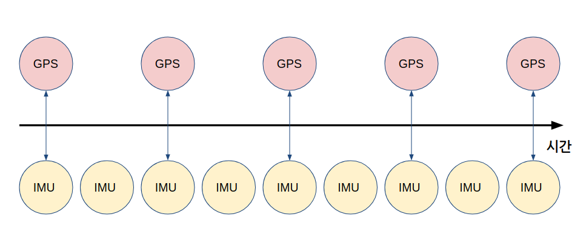

# Chapter 41: 시간 (Time, Duration, Clock, Rate)
## 01. 시계(Clock)와 시간(Time)
- 다수의 센서를 사용하는 로봇은 시간에 따른 각 센서 값의 변화량과 그 센서들 간의 시간 동기화가 매우 중요하다.
- ROS 2는 여러 노드들이 서로 통신하며 다양한 정보(센서 값, 알고리즘을 수행한 결괏값 등)들을 주고 받기 때문에 해당 정보들이 발간된 정확한 시간이 필수적이다.
- 예를 들어, 로봇의 위치 추정을 위해 GPS 데이터를 발간해주는 노드와 IMU 데이터를 발간해주는 노드를 사용한다고 해보자.
- GPS 토픽의 경우 복수개의 인공위성으로 부터 받은 정보를 종합한 로봇의 위도, 경도, 오차 데이터를 발간하는 주기가 약 2초라고 가정하고, IMU의 로봇 자세 데이터를 발간하는 토픽의 주기가 보다 빠른 약 1초 라고 하자.
- 두 토픽을 구독하여 로봇의 위치를 추정하기 위해서는 보통 필터를 거치게 되는데, 이때 필터가 동작하는 주기에서 가까운 시간에 발간된 데이터를 골라 인풋으로 넣어줘야만 보다 정확한 결과를 얻을 수 있다.
- 만약 로봇이 동작하고 4초 후의 GPS 데이터와 3초 후의 IMU 데이터를 필터의 인풋으로 넣는다면 그 아웃풋이 4초 후의 IMU 데이터를 사용한 것보다 좋지 못할 것이다.



- 이 때문에 ROS 2 에서는 발간되는 토픽에 주요 데이터 뿐만아니라 해당 토픽이 발간되는 시간을 함께 포함시킬 수 있도록 한다.
- stamp, frame id 를 포함하고 있는 std_msgs/msg/header 데이터 타입은 ROS 2 에서 제공하는 표준 메시지 타입 중의 하나로서 sensor_msgs, geometry_msgs, nav_msgs 등 ROS 2의 기본 메시지 타입 대부분에 포함되어 있다.
```
# Standard metadata for higher-level stamped data types.
# This is generally used to communicate timestamped data
# in a particular coordinate frame.

# Two-integer timestamp that is expressed as seconds and nanoseconds.
builtin_interfaces/Time stamp

# Transform frame with which this data is associated.
string frame_id
```
- 영국에 거주하는 손흥민 선수와 한국에 거주하는 박지성 레전드가 화상미팅 시간을 정하려면 어느 시계를 기준으로 잡을지 먼저 이야기해야만 할 것이다.
- 즉 다른 시계를 보고 시간을 이야기할 수 없기 때문에, ROS 2 에서는 그 기준이 되는 시계를 노드가 생성될 때 정해 지도록 하였다.
- 아래 명령어를 터미널 창에 복사하여 ROS 2의 시계와 그 시간을 확인해보자.
```
$ ros2 run time_rclcpp_example time_example --ros-args -p use_sim_time:=False
[INFO]: sec 1611792893.524822 nsec 1611792893524821381
[INFO]: sec 1611792894.525022 nsec 1611792894525021996
[INFO]: sec 1611792895.524994 nsec 1611792895524993945
[INFO]: sec 1611792896.524888 nsec 1611792896524888265
[INFO]: sec 1611792897.524969 nsec 1611792897524969178
[INFO]: sec 1611792898.524978 nsec 1611792898524977661
[INFO]: Over 5 seconds!
[INFO]: sec 1611792899.525013 nsec 1611792899525012802
[INFO]: sec 1611792900.525024 nsec 1611792900525024424
[INFO]: sec 1611792901.524993 nsec 1611792901524993305
[INFO]: sec 1611792902.525016 nsec 1611792902525015881
[INFO]: sec 1611792903.524888 nsec 1611792903524887863
[INFO]: sec 1611792904.524991 nsec 1611792904524990989
[INFO]: Over 5 seconds!
```
- 위 예제를 통해 time_example 노드가 가진 시계의 시간을 확인할 수 있다.
- ROS 2에서 사용하는 기본 시계는 System Clock 이며 rclcpp 에서는 std::chrono 라이브러리를 rclpy 는 time 모듈을 캡슐화하여 사용하고 있다.
- System Clock 은 국제 표준시인 협정 세계시(UTC, Coordinated Universal Time)로 표시되어 전세계 어디서든 사용이 가능하다.

## 02. 시간 추상화(Time Abstractions)
- 앞서 ROS 2에서 사용하는 기본 시계과 그 시간을 확인해 보았다.
- 이와 더불어 ROS 2 에서는 기본 시계 이외에도 타임머신처럼 동작하는 시계도 사용이 가능하다.
- 타임머신 처럼 동작하는 시계는 과거 어느 시점으로 시간을 돌려 줄 수도 있고, 시간을 더 빠르게 흘러가게 할 수도 있으며 또 시간을 멈출 수 있는 기능을 가지고 있다.
- 이 시계는 과거에 기록한 데이터를 다룰 때(ros2bag)나 로봇 시뮬레이션(gazebo, ignition)에서 사용할 수 있고, 이를 통해 사용자는 개발된 알고리즘을 보다 효율적으로 디버깅할 수 있다.
- 이를 위해 ROS 2에서는 시간을 추상화하였고, 총 세가지의 시간를 제공하고 있다.
- 시계는 시간 소스(Time Source) 를 통해 선언하여 사용할 수 있다.
- rcl/time.h
```h
enum rcl_time_source_type_t
  {
    RCL_TIME_SOURCE_UNINITIALIZED = 0,
    RCL_ROS_TIME,
    RCL_SYSTEM_TIME,
    RCL_STEADY_TIME
  };
```

### 2-1. System Time
- System Clock을 사용한 시간을 말한다.
- 이는 단조 증가하지만 타임서버와의 동기화를 통해 시간이 거꾸로 가는 경우도 있다.
- 예를 들면 server pc와 remote pc 간의 데이터 통신을 원활히 하기 위해서는 시간을 동기화 시켜야만 하는데, 아래 명령어를 각 pc에 입력하여 특정 서버의 시간으로 동기화 할 수 있다.
```
$ sudo ntpdate ntp.ubuntu.com
28 Jan 09:51:50 ntpdate[3424]: adjust time server 91.189.91.157 offset 0.043664 sec
```

### 2-2. ​ROS Time
- 보통 시뮬레이션 환경에서 시간을 조절하기 위해 많이 사용한다.
- 노드가 생성되기 전에 노드가 기본으로 가지고 있는 파라미터 중의 하나인 use_sim_time 을 통해 사용할 수 있으며, use_sim_time 이 True 로 설정된 노드는 /clock 토픽을 구독할 때까지 시간을 0으로 초기화 한다.
```
$ ros2 run time_rclcpp_example time_example --ros-args -p use_sim_time:=True
[INFO]: sec 0.000000 nsec 0
[INFO]: sec 0.000000 nsec 0
[INFO]: sec 0.000000 nsec 0
[INFO]: sec 0.000000 nsec 0
[INFO]: sec 0.000000 nsec 0
[INFO]: sec 0.000000 nsec 0
[INFO]: sec 0.000000 nsec 0
```

### 2-3. Steady Time
- Hardware timeouts 를 사용한 시간을 말한다.
- 위에서 알아본 시간들과 달리 무조건 단조증가(monotonic) 한다는 특성을 가진다.

## 03. Time API
- ROS 2에서 제공하는 시간과 관련된 API는 크게 time, duration, rate가 있다.
- 아래 예제 코드(rclcpp, rclpy)를 보면서 간단한 사용법에 대해 알아보자.
- time_rclcpp_example/src/main.cpp
```cpp
#include <memory>
#include <utility>

#include "rclcpp/rclcpp.hpp"
#include "rclcpp/time_source.hpp"

#include "std_msgs/msg/header.hpp"


int main(int argc, char * argv[])
{
  rclcpp::init(argc, argv);

  auto node = rclcpp::Node::make_shared("time_example_node");
  auto time_publisher = node->create_publisher<std_msgs::msg::Header>("time", 10);
  std_msgs::msg::Header msg;

  rclcpp::WallRate loop_rate(1.0);
  rclcpp::Duration duration(1, 0);

  while (rclcpp::ok()) {
    static rclcpp::Time past = node->now();

    rclcpp::Time now = node->now();
    RCLCPP_INFO(node->get_logger(), "sec %lf nsec %ld", now.seconds(), now.nanoseconds());

    if ((now - past).nanoseconds() * 1e-9 > 5) {
      RCLCPP_INFO(node->get_logger(), "Over 5 seconds!");
      past = node->now();
    }

    msg.stamp = now + duration;
    time_publisher->publish(msg);

    rclcpp::spin_some(node);
    loop_rate.sleep();
  }

  rclcpp::shutdown();

  return 0;
}
```
- 아래는 rclpy 에서 Time, Duration, Rate 모듈에 대한 예제코드 이다.
- rclcpp와 거의 흡사한 인터페이스를 가지고 있는 것을 확인할 수 있다.
- time_rclpy_example/time_rclpy_example/time_example/main.py
```cpp
import rclpy
from rclpy.duration import Duration
from std_msgs.msg import Header


def main(args=None):
    rclpy.init(args=args)

    node = rclpy.create_node('time_example_node')
    time_publisher = node.create_publisher(Header, 'time', 10)
    msg = Header()

    rate = node.create_rate(1.0)
    duration = Duration(seconds=1, nanoseconds=0)
    past = node.get_clock().now()

    try:
        while rclpy.ok():
            now = node.get_clock().now()
            seconds, nanoseconds = now.seconds_nanoseconds()
            node.get_logger().info('sec {0} nsec {1}'.format(seconds, nanoseconds))

            if ((now - past).nanoseconds * 1e-9) > 5:
                node.get_logger().info('Over 5 seconds!')
                past = node.get_clock().now()

            msg.stamp = (now + duration).to_msg()
            time_publisher.publish(msg)

            rclpy.spin_once(node)
            rate.sleep()
    except KeyboardInterrupt:
        node.get_logger().info('Keyboard Interrupt (SIGINT)')
    finally:
        node.destroy_node()
        rclpy.shutdown()


if __name__ == '__main__':
    main()
```

### 3-1. Time
- Time 클래스는 시간을 다룰 수 있는 오퍼레이터를 제공하며 그 결과를 seconds 혹은 nanoseconds 단위로 반환해준다.
- seconds 는 double 형이고, nanoseconds 는 unsinged int의 64비트형을 가지며 nanoseconds 가 seconds 보다 더 정확한 시간을 반환한다.
```cpp
if ((now - past).nanoseconds() * 1e-9 > 5) {
	RCLCPP_INFO(node->get_logger(), "Over 5 seconds!");
	past = node->now();
}
```
- ROS 2 노드에서는 now 함수를 통해 노드의 시간을 확인할 수 있다.
```cpp
rclcpp::Time now = node->now();
```

### 3-2. Duration
- Duration 클래스는 순간의 시간(timestamp, 5시 30분 29초)이 아닌 기간(3시간 후, 1시간 전)을 다룰 수 있는 오퍼레이터를 제공하며 그 결과를 seconds 혹은 nanoseconds 단위로 반환해준다.
- Duration 은 이전 시간을 이야기할 수 있고 이는 음수로 표기된다.
- Duration은 Time 과의 연산이 가능하여 보다 직관적으로 시간을 다룰 수 있도록 한다.
- 예를 들면, 아래 예제 코드와 같이 실제 시간보다 1초 느린 값을 간단히 계산할 수 있다.
```cpp
rclcpp::Duration duration(1, 0);
msg.stamp = now + duration;
time_publisher->publish(msg);
```

### 3-3. Rate
- Rate 클래스는 반복문에서 특정 주기를 유지시켜 주는 API를 제공한다.
- 아래 예시를 보면 WallRate 클래스의 생성자에 헤르츠 단위로 주기를 설정한 후, 반복문 가장 아래 줄에 sleep() 함수로 주기를 맞춰 주는 것을 확인할 수 있다. (Rate는 System Clock을 사용하고 WallRate는 Steady Clock을 사용해서 시간을 확인한다.)
- 하지만 ROS 2 에서는 콜백 함수를 사용하는 Timer API를 제공하고 있기에 이를 사용하는 것을 추천한다.
```cpp
rclcpp::WallRate loop_rate(1);

while (rclcpp::ok()) {
// 코드 중략
    loop_rate.sleep();
}
```

### 3-4. 실행 결과
- 아래 명령어를 이용해서 rclcpp 로 개발된 노드를 실행시켜 보자.
- 먼저 use_sim_time 파라미터를 False 로 세팅하여 System Time 을 사용한 로그를 확인해 보면, UTC 형식으로 1초마다 로그가 나오는 것을 확인할 수 있고, 5초가 지날 때마다 로그가 나오는 것도 확인할 수 있다.
```
$ ros2 run time_rclcpp_example time_example --ros-args -p use_sim_time:=False
[INFO]: sec 1611808317.044796 nsec 1611808317044796531
[INFO]: sec 1611808318.044951 nsec 1611808318044951274
[INFO]: sec 1611808319.044939 nsec 1611808319044938670
[INFO]: sec 1611808320.044937 nsec 1611808320044936942
[INFO]: sec 1611808321.044966 nsec 1611808321044965935
[INFO]: sec 1611808322.044962 nsec 1611808322044962073
[INFO]: Over 5 seconds!
[INFO]: sec 1611808323.044957 nsec 1611808323044957461
[INFO]: sec 1611808324.044966 nsec 1611808324044966062
[INFO]: sec 1611808325.044970 nsec 1611808325044969462
[INFO]: sec 1611808326.044998 nsec 1611808326044997735
[INFO]: sec 1611808327.045034 nsec 1611808327045034118
[INFO]: sec 1611808328.044970 nsec 1611808328044969859
[INFO]: Over 5 seconds!
[INFO]: sec 1611808330.585464 nsec 1611808330585463561
[INFO]: sec 1611808331.585448 nsec 1611808331585448206
[INFO]: sec 1611808332.585462 nsec 1611808332585461648
[INFO]: sec 1611808333.585369 nsec 1611808333585369322
[INFO]: Over 5 seconds!
[INFO]: sec 1611808334.585364 nsec 1611808334585364035
[INFO]: sec 1611808335.585377 nsec 1611808335585377352
[INFO]: sec 1611808336.585368 nsec 1611808336585367969
[INFO]: sec 1611808337.585372 nsec 1611808337585372004
[INFO]: sec 1611808338.585397 nsec 1611808338585397207
[INFO]: sec 1611808339.585366 nsec 1611808339585365766
[INFO]: Over 5 seconds!
```
- use_sim_time 파라미터를 True로 세팅하여 ROS Time 을 사용한 노드의 로그를 확인해 보자.
- /clock 토픽이 없기 때문에 시간은 항상 0 으로 초기화 된다.
- /time 토픽을 확인해 보면 Duration을 이용한 시간 수정으로 인해 stamp가 1초 느리게 나오는 것을 확인할 수 있을 것이다.
```
$ ros2 run time_rclcpp_example time_example --ros-args -p use_sim_time:=True
[INFO]: sec 0.000000 nsec 0
[INFO]: sec 0.000000 nsec 0
[INFO]: sec 0.000000 nsec 0
$ ros2 topic echo /time
stamp:
  sec: 1
  nanosec: 0
frame_id: ''
---
stamp:
  sec: 1
  nanosec: 0
frame_id: ''
---
stamp:
  sec: 1
  nanosec: 0
frame_id: ''
---
```
- rclpy 로 개발된 노드의 실행 명령어는 아래와 같고, use_sim_time 파라미터 값을 True로 설정하면 노드에서 확인할 수 있는 시간이 ROS Time 으로 변경되는 것도 확인할 수 있다. 그 결과는 rclcpp와 같다.
```
$ ros2 run time_rclpy_example time_example --ros-args -p use_sim_time:=False
[INFO]: sec 1611845885 nsec 1185392
[INFO]: sec 1611845886 nsec 1596232
[INFO]: sec 1611845887 nsec 1656253
[INFO]: sec 1611845888 nsec 1605086
[INFO]: sec 1611845889 nsec 1518249
[INFO]: sec 1611845890 nsec 1772286
[INFO]: Over 5 seconds!
[INFO]: sec 1611845891 nsec 1571463
[INFO]: sec 1611845892 nsec 1440453
[INFO]: sec 1611845893 nsec 1595560
[INFO]: sec 1611845894 nsec 1582543
[INFO]: sec 1611845895 nsec 1552400
[INFO]: sec 1611845896 nsec 1604775
[INFO]: Over 5 seconds!
[INFO]: sec 1611845897 nsec 1605453
```

[출처] 041 시간(Time, Duration, Clock, Rate) (오픈소스 소프트웨어 & 하드웨어: 로봇 기술 공유 카페 (오로카)) | 작성자 Routiful
