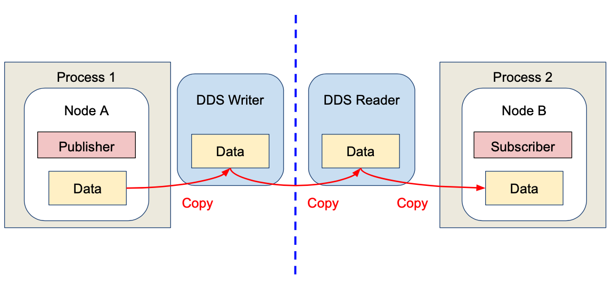
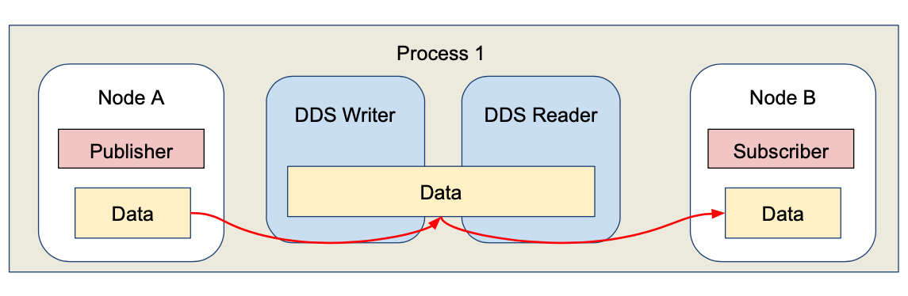
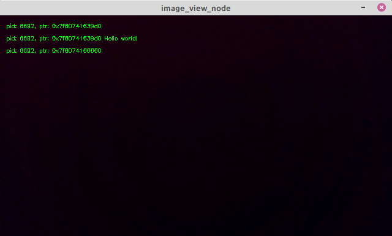
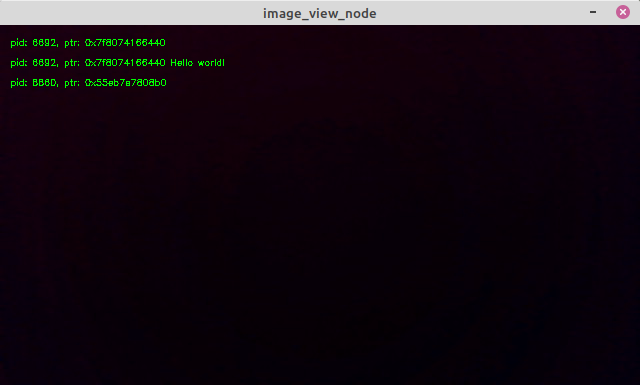

# Chapter 44: Intra-process communication
## 01. ROS Node 와 Nodelets
- ROS 에서 Node는 계산을 수행하는 하나의 프로세스이다.
- 이는 단순한 동작만을 수행하고 다른 노드와 독립적인 특징을 가진다.
- 그리고 전체 시스템이 하나의 오류만으로 무너지지 않는다는 점과 한가지 기능에 집중하여 빠르게 개발될 수 있다는 점 그리고 모듈성, 재활용성과 같은 장점을 가지고 있다.
- 일반적으로 ROS 를 사용하여 개발된 로봇은 복수개의 노드로 이루어진다.
- 예를 들어, 모바일 로봇이 동작되기 위해서는 라이다 데이터를 다루는 노드, 모터를 제어하는 노드, 로봇의 위치를 추종하는 노드, 경로를 생성하는 노드 등이 한번에 실행 된다.
- 하지만 단일 컴퓨팅 시스템에서 복수 노드를 실행 시킬 때 데이터 통신을 위한 작업으로 인한 전체적인 성능 저하와 메모리 사용량이 늘어난다는 단점이 있다.
- 이를 해결하기 위해 ROS 1 에서는 Nodelets 패키지를 제공했다.
- nodelets 패키지는 단일 컴퓨팅 시스템의 단일 프로세스에서 동작되는 복수개의 노드들을 위한 zero-copy pointer 를 제공하여 퍼블리셔와 서브스크라이버 간의 데이터 통신에 있어 고정된 메모리 공간을 사용할 수 있도록 하였다.

## 02. Intra-proces communication
- ROS 2 에서는 복수개의 노드 사용시 시스템의 성능 저하를 해결하기 위해 IPC(Intra-Process Communication) 를 제공한다.
- 이는 ROS 1 의 nodelets 의 기능과 비슷하지만 그것의 단점들을 해결하였고, 일반적인 node를 설계하는 것과 매우 유사한 API를 제공하는 것에 목표를 두었다.
- ROS 2 에서 퍼블리쉬 노드를 실행시키면 하나의 프로세스가 생성되고, 서브스크라이브 노드를 실행시키면 또 다른 프로세스가 생성된다.
- 아래 명령어로 노드를 두개 실행시키고 프로세스 아이디를 확인해보면 명확히 알 수 있다.
```
# Terminal 1
$ ros2 run my_first_ros_rclcpp_pkg helloworld_publisher
[INFO]: Received message: 'Hello World: 0'
[INFO]: Received message: 'Hello World: 1'
[INFO]: Received message: 'Hello World: 2'
[INFO]: Received message: 'Hello World: 3'

# Terminal 2
$ ros2 run my_first_ros_rclcpp_pkg helloworld_subscriber
[INFO]: Published message: 'Hello World: 0'
[INFO]: Published message: 'Hello World: 1'
[INFO]: Published message: 'Hello World: 2'
[INFO]: Published message: 'Hello World: 3'

#Terminal 3
$ ps -e
# ...중략...
990049 pts/0    00:00:00 helloworld_publ
990225 pts/3    00:00:00 helloworld_subs
# ...중략...
```
- 아래 그림을 통해 ROS 2에서 두 노드간의 일반적인 데이터 흐름을 확인해 보자.
- 서로 다른 프로세스 이기 때문에 송수신 되는 데이터가 여러번 메모리에 복사되는 것을 확인할 수 있다.
- 만약 퍼블리셔와 서브스크라이버가 복수개라면 더 많은 메모리 복사가 일어나게 될 것이다.



-하지만 ROS 2의 IPC 를 사용하면 복수개의 노드를 단일 프로세스에서 동작되도록 할 수 있고 아래 그림과 같이 고정된 메모리 공간에 접근하여 메모리 복사가 이루어지지 않도록 한다.



## 03. 데모코드
- ROS 2 의 IPC 를 사용하는 방법과 그 결과를 알아보자.
- IPC 는 rclcpp 만 지원한다.
- 첫번째 데모와 두번째 데모는 두 노드를 단일 프로세스로 실행시켜 zero-copy 의 결과를 확인해 볼 수 있다.
- 세번째 데모는 매우 실용적인 데모로 ROS 2에서 IPC 를 이용하여 이미지 파이프라인을 만드는 방법에 대해 알아보도록 하겠다.

### 3-1. The two node pipeline demo
- demos/intra_process_demo/src/two_node_pipeline/two_node_pipeline.cpp
```cpp
// Copyright 2015 Open Source Robotics Foundation, Inc.
//
// Licensed under the Apache License, Version 2.0 (the "License");
// you may not use this file except in compliance with the License.
// You may obtain a copy of the License at
//
//     http://www.apache.org/licenses/LICENSE-2.0
//
// Unless required by applicable law or agreed to in writing, software
// distributed under the License is distributed on an "AS IS" BASIS,
// WITHOUT WARRANTIES OR CONDITIONS OF ANY KIND, either express or implied.
// See the License for the specific language governing permissions and
// limitations under the License.

#include <chrono>
#include <cinttypes>
#include <cstdio>
#include <memory>
#include <string>
#include <utility>

#include "rclcpp/rclcpp.hpp"
#include "std_msgs/msg/int32.hpp"

using namespace std::chrono_literals;

// Node that produces messages.
struct Producer : public rclcpp::Node
{
  Producer(const std::string & name, const std::string & output)
  : Node(name, rclcpp::NodeOptions().use_intra_process_comms(true))
  {
    // Create a publisher on the output topic.
    pub_ = this->create_publisher<std_msgs::msg::Int32>(output, 10);
    std::weak_ptr<std::remove_pointer<decltype(pub_.get())>::type> captured_pub = pub_;
    // Create a timer which publishes on the output topic at ~1Hz.
    auto callback = [captured_pub]() -> void {
        auto pub_ptr = captured_pub.lock();
        if (!pub_ptr) {
          return;
        }
        static int32_t count = 0;
        std_msgs::msg::Int32::UniquePtr msg(new std_msgs::msg::Int32());
        msg->data = count++;
        printf(
          "Published message with value: %d, and address: 0x%" PRIXPTR "\n", msg->data,
          reinterpret_cast<std::uintptr_t>(msg.get()));
        pub_ptr->publish(std::move(msg));
      };
    timer_ = this->create_wall_timer(1s, callback);
  }

  rclcpp::Publisher<std_msgs::msg::Int32>::SharedPtr pub_;
  rclcpp::TimerBase::SharedPtr timer_;
};

// Node that consumes messages.
struct Consumer : public rclcpp::Node
{
  Consumer(const std::string & name, const std::string & input)
  : Node(name, rclcpp::NodeOptions().use_intra_process_comms(true))
  {
    // Create a subscription on the input topic which prints on receipt of new messages.
    sub_ = this->create_subscription<std_msgs::msg::Int32>(
      input,
      10,
      [](std_msgs::msg::Int32::UniquePtr msg) {
        printf(
          " Received message with value: %d, and address: 0x%" PRIXPTR "\n", msg->data,
          reinterpret_cast<std::uintptr_t>(msg.get()));
      });
  }

  rclcpp::Subscription<std_msgs::msg::Int32>::SharedPtr sub_;
};

int main(int argc, char * argv[])
{
  setvbuf(stdout, NULL, _IONBF, BUFSIZ);
  rclcpp::init(argc, argv);
  rclcpp::executors::SingleThreadedExecutor executor;

  auto producer = std::make_shared<Producer>("producer", "number");
  auto consumer = std::make_shared<Consumer>("consumer", "number");

  executor.add_node(producer);
  executor.add_node(consumer);
  executor.spin();

  rclcpp::shutdown();

  return 0;
}
```
- 아래 퍼블리셔를 가지고있는 Producer 구조체를 확인해 보자.
- rclcpp의 Node 클래스를 상속받아 이를 초기화 해주는 과정에서 노드네임을 정해주었다.
- 그리고 IPC를 사용하기 위해 use_intra_process_comms 함수를 true로 세팅해주고 있다.
- std_msgs::msg::Int32 메시지 타입을 발간할 publisher 생성 후에는 weak_ptr로 shared_ptr로 선언된 publisher에 접근이 가능한지 확인할 수 있도록 했다.
- 타이머 콜백 함수 내부에는 std_msgs::msg::Int32 메시지 타입을 unique_ptr를 통해 유일한 소유권을 부여하고 해당 함수가 호출 될 때마다 count 변수 값을 증가시킨다.
- 그리고 printf 함수를 통해서는 메시지의 data 변수 값과 메시지가 저장된 메모리 주소를 확인할 수 있도록 했다.
- publisher는 unique_ptr로 선언된 메시지를 std::move 함수를 통해 그 유일한 소유권을 넘겨준다.
```cpp
// Node that produces messages.
struct Producer : public rclcpp::Node
{
  Producer(const std::string & name, const std::string & output)
  : Node(name, rclcpp::NodeOptions().use_intra_process_comms(true))
  {
    // Create a publisher on the output topic.
    pub_ = this->create_publisher<std_msgs::msg::Int32>(output, 10);
    std::weak_ptr<std::remove_pointer<decltype(pub_.get())>::type> captured_pub = pub_;
    // Create a timer which publishes on the output topic at ~1Hz.
    auto callback = [captured_pub]() -> void {
        auto pub_ptr = captured_pub.lock();
        if (!pub_ptr) {
          return;
        }
        static int32_t count = 0;
        std_msgs::msg::Int32::UniquePtr msg(new std_msgs::msg::Int32());
        msg->data = count++;
        printf(
          "Published message with value: %d, and address: 0x%" PRIXPTR "\n", msg->data,
          reinterpret_cast<std::uintptr_t>(msg.get()));
        pub_ptr->publish(std::move(msg));
      };
    timer_ = this->create_wall_timer(1s, callback);
  }

  rclcpp::Publisher<std_msgs::msg::Int32>::SharedPtr pub_;
  rclcpp::TimerBase::SharedPtr timer_;
};
```
- 서브크라이버를 가진 Consumer 구조체를 보자.
- Producer 구조체와 같이 rclcpp의 Node 생성자를 호출할 때 use_intra_process_comms 함수에 true 를 셋팅하고 있다.
- subscriber 콜백 함수의 인자에는 std_msgs::msg::Int32 메시지 타입의 unique_ptr 이 선언되어 있어 publisher 에서 발간된 메시지의 소유권을 넘겨 받을 수 있다.
- printf 함수를 통해서는 구독된 메시지의 data 변수의 값과 메모리 주소 값을 확인해 볼 수 있다.
```cpp
// Node that consumes messages.
struct Consumer : public rclcpp::Node
{
  Consumer(const std::string & name, const std::string & input)
  : Node(name, rclcpp::NodeOptions().use_intra_process_comms(true))
  {
    // Create a subscription on the input topic which prints on receipt of new messages.
    sub_ = this->create_subscription<std_msgs::msg::Int32>(
      input,
      10,
      [](std_msgs::msg::Int32::UniquePtr msg) {
        printf(
          " Received message with value: %d, and address: 0x%" PRIXPTR "\n", msg->data,
          reinterpret_cast<std::uintptr_t>(msg.get()));
      });
  }

  rclcpp::Subscription<std_msgs::msg::Int32>::SharedPtr sub_;
};
```
- 마지막으로 main 함수를 살펴보자.
- rclcpp::init 함수 다음에 rclcpp::executors::SingleThreadedExecutor를 선언하여 Producer 와 Consumer 구조체의 객체를 executor에 추가해 주고 spin 함수로 이를 동작시킨다.
```cpp
int main(int argc, char * argv[])
{
  setvbuf(stdout, NULL, _IONBF, BUFSIZ);
  rclcpp::init(argc, argv);
  rclcpp::executors::SingleThreadedExecutor executor;

  auto producer = std::make_shared<Producer>("producer", "number");
  auto consumer = std::make_shared<Consumer>("consumer", "number");

  executor.add_node(producer);
  executor.add_node(consumer);
  executor.spin();

  rclcpp::shutdown();

  return 0;
}
```
- IPC 는 unique_ptr 를 통해 전달하고 싶은 메시지의 소유권을 유일하게 만들고 executor를 통해 단일 프로세스에서 두 노드가 동작되도록 하는 zero-copy 통신 방법을 사용한다.
- 그리고 그 구현 방식이 이전 강의에서 배웠던 코드 구조와 거의 유사하다는 장점을 가지고 있어 언제든지 쉽게 변환이 가능하다.
- 아래 실행 명령어를 터미널 창에 입력하여 그 결과를 확인해보자.
- 발간된 메시지와 구독된 메시지의 주소값이 동일하다는 것을 확인할 수 있다.
```
$ ros2 run intra_process_demo two_node_pipeline
Published message with value: 0, and address: 0x561F33830850
 Received message with value: 0, and address: 0x561F33830850
Published message with value: 1, and address: 0x561F33830850
 Received message with value: 1, and address: 0x561F33830850
Published message with value: 2, and address: 0x561F33830850
 Received message with value: 2, and address: 0x561F33830850
Published message with value: 3, and address: 0x561F33830850
 Received message with value: 3, and address: 0x561F33830850
Published message with value: 4, and address: 0x561F33830850
 Received message with value: 4, and address: 0x561F33830850
Published message with value: 5, and address: 0x561F33830850
 Received message with value: 5, and address: 0x561F33830850
Published message with value: 6, and address: 0x561F33830850
 Received message with value: 6, and address: 0x561F33830850
Published message with value: 7, and address: 0x561F33830850
 Received message with value: 7, and address: 0x561F33830850
Published message with value: 8, and address: 0x561F33830850
 Received message with value: 8, and address: 0x561F33830850
Published message with value: 9, and address: 0x561F33830850
 Received message with value: 9, and address: 0x561F33830850
Published message with value: 10, and address: 0x561F33830850
 Received message with value: 10, and address: 0x561F33830850
```
- 아래 명령어를 통해 해당 노드가 동일한 프로세스 아이디를 가진다는 것도 확인할 수 있다.
```
$ ps -e
#...중략...
990842 pts/0    00:00:00 two_node_pipeli
#...중략...
```

### 3-2. The cyclic pipeline demo
- demos/intra_process_demo/src/cyclic_pipeline/cyclic_pipeline.cpp
```cpp
// Copyright 2015 Open Source Robotics Foundation, Inc.
//
// Licensed under the Apache License, Version 2.0 (the "License");
// you may not use this file except in compliance with the License.
// You may obtain a copy of the License at
//
//     http://www.apache.org/licenses/LICENSE-2.0
//
// Unless required by applicable law or agreed to in writing, software
// distributed under the License is distributed on an "AS IS" BASIS,
// WITHOUT WARRANTIES OR CONDITIONS OF ANY KIND, either express or implied.
// See the License for the specific language governing permissions and
// limitations under the License.

#include <chrono>
#include <cinttypes>
#include <cstdio>
#include <memory>
#include <string>
#include <utility>

#include "rclcpp/rclcpp.hpp"
#include "std_msgs/msg/int32.hpp"

using namespace std::chrono_literals;

// This node receives an Int32, waits 1 second, then increments and sends it.
struct IncrementerPipe : public rclcpp::Node
{
  IncrementerPipe(const std::string & name, const std::string & in, const std::string & out)
  : Node(name, rclcpp::NodeOptions().use_intra_process_comms(true))
  {
    // Create a publisher on the output topic.
    pub = this->create_publisher<std_msgs::msg::Int32>(out, 10);
    std::weak_ptr<std::remove_pointer<decltype(pub.get())>::type> captured_pub = pub;
    // Create a subscription on the input topic.
    sub = this->create_subscription<std_msgs::msg::Int32>(
      in,
      10,
      [captured_pub](std_msgs::msg::Int32::UniquePtr msg) {
        auto pub_ptr = captured_pub.lock();
        if (!pub_ptr) {
          return;
        }
        printf(
          "Received message with value:         %d, and address: 0x%" PRIXPTR "\n", msg->data,
          reinterpret_cast<std::uintptr_t>(msg.get()));
        printf("  sleeping for 1 second...\n");
        if (!rclcpp::sleep_for(1s)) {
          return;    // Return if the sleep failed (e.g. on ctrl-c).
        }
        printf("  done.\n");
        msg->data++;    // Increment the message's data.
        printf(
          "Incrementing and sending with value: %d, and address: 0x%" PRIXPTR "\n", msg->data,
          reinterpret_cast<std::uintptr_t>(msg.get()));
        pub_ptr->publish(std::move(msg));    // Send the message along to the output topic.
      });
  }

  rclcpp::Publisher<std_msgs::msg::Int32>::SharedPtr pub;
  rclcpp::Subscription<std_msgs::msg::Int32>::SharedPtr sub;
};

int main(int argc, char * argv[])
{
  setvbuf(stdout, NULL, _IONBF, BUFSIZ);
  rclcpp::init(argc, argv);
  rclcpp::executors::SingleThreadedExecutor executor;

  // Create a simple loop by connecting the in and out topics of two IncrementerPipe's.
  // The expectation is that the address of the message being passed between them never changes.
  auto pipe1 = std::make_shared<IncrementerPipe>("pipe1", "topic1", "topic2");
  auto pipe2 = std::make_shared<IncrementerPipe>("pipe2", "topic2", "topic1");
  rclcpp::sleep_for(1s);  // Wait for subscriptions to be established to avoid race conditions.
  // Publish the first message (kicking off the cycle).
  std::unique_ptr<std_msgs::msg::Int32> msg(new std_msgs::msg::Int32());
  msg->data = 42;
  printf(
    "Published first message with value:  %d, and address: 0x%" PRIXPTR "\n", msg->data,
    reinterpret_cast<std::uintptr_t>(msg.get()));
  pipe1->pub->publish(std::move(msg));

  executor.add_node(pipe1);
  executor.add_node(pipe2);
  executor.spin();

  rclcpp::shutdown();

  return 0;
}
```
- 먼저 IncrementerPipe 구조체를 살펴보자.
- 구조체의 생성자는 노드 네임과 구독할 토픽 네임 그리고 발간할 토픽 네임을 인자로 받아온다.
- 또한 첫번째 예제처럼 IPC를 사용하겠다는 내용을 rclcpp::Node 클래스의 생성자를 통해 설정하였다.
- publisher를 std_msgs::msg::Int32 메시지 타입으로 설정하고 weak_ptr로 해당 퍼블리셔에 접근이 가능한지 확인할 수 있도록 하였다.
- subscriber는 publisher와 같은 메시지 타입을 가지며 구독한 데이터의 값과 그 주소값을 printf 함수로 보여준다.
- 1초 딜레이 이후 구독한 데이터의 값을 증가시켜 그 값과 주소값을 printf 함수로 보여준다음 발간한다.
```cpp
// This node receives an Int32, waits 1 second, then increments and sends it.
struct IncrementerPipe : public rclcpp::Node
{
  IncrementerPipe(const std::string & name, const std::string & in, const std::string & out)
  : Node(name, rclcpp::NodeOptions().use_intra_process_comms(true))
  {
    // Create a publisher on the output topic.
    pub = this->create_publisher<std_msgs::msg::Int32>(out, 10);
    std::weak_ptr<std::remove_pointer<decltype(pub.get())>::type> captured_pub = pub;
    // Create a subscription on the input topic.
    sub = this->create_subscription<std_msgs::msg::Int32>(
      in,
      10,
      [captured_pub](std_msgs::msg::Int32::UniquePtr msg) {
        auto pub_ptr = captured_pub.lock();
        if (!pub_ptr) {
          return;
        }
        printf(
          "Received message with value:         %d, and address: 0x%" PRIXPTR "\n", msg->data,
          reinterpret_cast<std::uintptr_t>(msg.get()));
        printf("  sleeping for 1 second...\n");
        if (!rclcpp::sleep_for(1s)) {
          return;    // Return if the sleep failed (e.g. on ctrl-c).
        }
        printf("  done.\n");
        msg->data++;    // Increment the message's data.
        printf(
          "Incrementing and sending with value: %d, and address: 0x%" PRIXPTR "\n", msg->data,
          reinterpret_cast<std::uintptr_t>(msg.get()));
        pub_ptr->publish(std::move(msg));    // Send the message along to the output topic.
      });
  }

  rclcpp::Publisher<std_msgs::msg::Int32>::SharedPtr pub;
  rclcpp::Subscription<std_msgs::msg::Int32>::SharedPtr sub;
};
```
- main 함수를 보면 앞선 예제와 같이 executor를 선언하여 pipe1과 pipe2 노드를 하나의 프로세스에서 실행되도록 한다.
- pipe1 노드는 topic1 이름을 가진 토픽을 구독하고 topic2 이름을 가진 토픽을 발간한다.
- pipe2 노드는 topic2 이름을 가진 토픽을 구독하고 topic1 이름을 가진 토픽을 발간한다.
- std_msgs::msg::Int32 타입의 메시지를 unique_ptr로 선언하고 이를 pipe1의 topic2 이름을 가진 퍼블리셔로 발간한다.
- 첫번째 데모에서는 메시지를 매 주기마다 새로 선언하여 송수신 했지만 이번 데모에서는 단 한번만 선언된 메시지를 서로 주고 받는다.
```cpp
int main(int argc, char * argv[])
{
  setvbuf(stdout, NULL, _IONBF, BUFSIZ);
  rclcpp::init(argc, argv);
  rclcpp::executors::SingleThreadedExecutor executor;

  // Create a simple loop by connecting the in and out topics of two IncrementerPipe's.
  // The expectation is that the address of the message being passed between them never changes.
  auto pipe1 = std::make_shared<IncrementerPipe>("pipe1", "topic1", "topic2");
  auto pipe2 = std::make_shared<IncrementerPipe>("pipe2", "topic2", "topic1");
  rclcpp::sleep_for(1s);  // Wait for subscriptions to be established to avoid race conditions.
  // Publish the first message (kicking off the cycle).
  std::unique_ptr<std_msgs::msg::Int32> msg(new std_msgs::msg::Int32());
  msg->data = 42;
  printf(
    "Published first message with value:  %d, and address: 0x%" PRIXPTR "\n", msg->data,
    reinterpret_cast<std::uintptr_t>(msg.get()));
  pipe1->pub->publish(std::move(msg));

  executor.add_node(pipe1);
  executor.add_node(pipe2);
  executor.spin();

  rclcpp::shutdown();

  return 0;
}
```
- 아래 명령어를 터미널에 입력하여 실행시켜 보자.
- main 문에서 생성된 메시지가 고정된 메모리에서 pipe1과 pipe2를 오가며 그 값이 하나씩 증가하는 것을 확인할 수 있다.
```
$ ros2 run intra_process_demo cyclic_pipeline
Published first message with value:  42, and address: 0x5556A69CAC10
Received message with value:         42, and address: 0x5556A69CAC10
  sleeping for 1 second...
  done.
Incrementing and sending with value: 43, and address: 0x5556A69CAC10
Received message with value:         43, and address: 0x5556A69CAC10
  sleeping for 1 second...
  done.
Incrementing and sending with value: 44, and address: 0x5556A69CAC10
Received message with value:         44, and address: 0x5556A69CAC10
  sleeping for 1 second...
  done.
Incrementing and sending with value: 45, and address: 0x5556A69CAC10
Received message with value:         45, and address: 0x5556A69CAC10
  sleeping for 1 second...
  done.
Incrementing and sending with value: 46, and address: 0x5556A69CAC10
Received message with value:         46, and address: 0x5556A69CAC10
  sleeping for 1 second...
  done.
Incrementing and sending with value: 47, and address: 0x5556A69CAC10
Received message with value:         47, and address: 0x5556A69CAC10
  sleeping for 1 second...
```

### 3-3. Image pipeline demo
- 이번 데모는 총 세개의 노드로 이루어져 있으며 모두 IPC를 지원한다.
- camera_node는 opencv 라이브러리를 이용하여 카메라 입력값을 받아 sensor_msg::msg::Image 메시지 타입으로 발간해주는 역할을 한다.
- watermark_node는 camera_node 에서 발간하는 이미지를 구독하고 해당 이미지에 간단한 텍스트를 추가하여 이를 발간한다.
- image_view_node는 watermark_node 에서 발간하는 이미지를 구독하여 cv::imshow 함수를 통해 이미지를 보여주는 역할을 한다.
- 아래 명령어를 통해 IPC를 이용한 이미지 파이프라인 데모를 실행시켜 보자.
```
$ ros2 run intra_process_demo image_pipeline_all_in_one
```
- 카메라를 통해 입력된 이미지 위에 적힌 텍스트에 집중하자.
- pid 는 프로세스 아이디를 뜻하며 ptr 는 메시지가 저장된 메모리 주소를 표시하고 있다.
- 첫번째 줄은 camera_node 에서 적은 텍스트이다.
- 두번째 줄은 watermark_node 에서 적은 텍스트이며 해당 텍스트에는 추가로 Hello world! 가 적혀 있다.
- 세번째 줄은 image_view_node가 적은 텍스트 이다.
- 모두 같은 프로세스 아이디를 가지고 있으며 같은 메모리 주소를 나타낸다.



- 만약 IPC를 사용하지 않는다면 어떻게 될까.
- 아래 명령어를 통해 알아보자.
- 첫번째 터미널에는 IPC를 사용한 이미지 파이프라인을 실행시키고 두번째 터미널에는 image_view_node 를 실행시킨다.
```
# Terminal 1
$ ros2 run intra_process_demo image_pipeline_all_in_one

# Terminal 2
$ ros2 run intra_process_demo image_view_node
```
- 첫번째 명령어를 통해 켜진 이미지 창에는 모두 같은 프로세스 아이디와 동일한 주소값을 텍스트로 확인할 수 있다.
- 하지만 두번째 명령어를 통해 켜진 이미지 창은 다른 결과를 보여준다.
- camera_node 와 watermark_node는 같은 프로세스에서 zero-copy를 사용하여 이미지를 송수신 하지만 단일 노드로 실행된 image_view_node는 다른 프로세스에서 실행되며 메모리 주소도 다른 것을 확인할 수 있다.



- 이처럼 IPC 기능을 이용하여 이미지 파이프라인을 구성하면 해당 이미지를 처리하기 위한 노드가 복수개여도 그 메모리가 이미지 사이즈로 고정되지만, IPC를 사용하지 않으면 복수개의 노드가 이미지를 수신 받을 때마다 그 메모리가 복사된다.

[출처] 044 Intra-process communication (오픈소스 소프트웨어 & 하드웨어: 로봇 기술 공유 카페 (오로카)) | 작성자 Routiful
