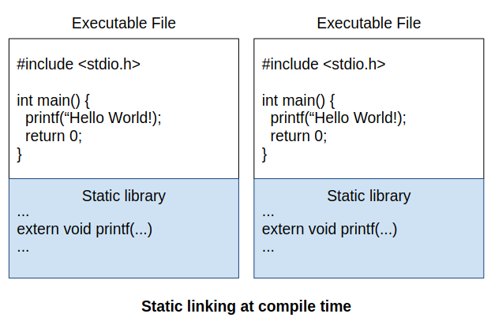
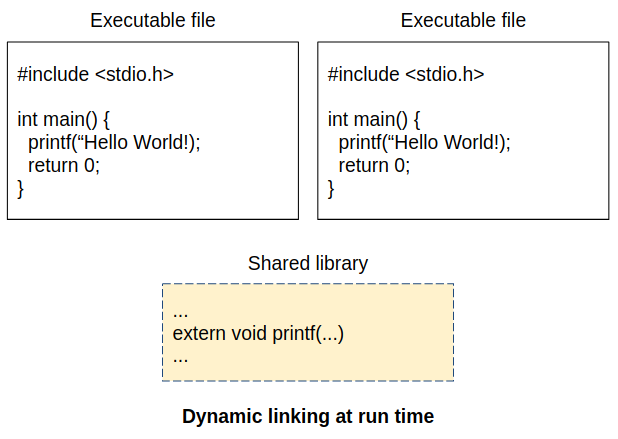

# Chapter 46: Component
## 01. 정적 링킹과 동적 링킹
- 지난 강좌에서 Node와 Nodelets에 대해 알아보았다.
- 이번엔 이 둘의 또 다른 특징에 대해 알아보자.
- Node 는 실행파일로 컴파일(compile) 되지만, Nodelets 은 공유 라이브러리(shared library) 로 컴파일 되어 실행 중인 컨테이너 프로세스(container process) 에 로드(load) 되는 특징을 가지고 있다.
- 이를 좀더 정확히 이해하기 위해서 정적 링킹(static linking)과 동적 링킹(dynamic linking)에 대해 알아보도록 하자.
- 컴파일 과정에서 링킹(linking)은 링커(linker)가 여러 오브젝트(object) 파일을 실행파일과 연결해주는 과정을 이야기 한다.
- 링킹은 정적 링킹(static linking)과 동적 링킹(dynamic linking)으로 나눌 수 있다.
- 정적 링킹이란 컴파일 과정에서 링커가 정적 라이브러리를 복사하여 실행파일에 저장하는 것을 말한다.
- 동적 링킹이란 런타임에서 메모리에 공유 라이브러리가 있다면 해당 코드에 접근하여 사용하고 그렇지 않다면 이를 메모리에 올려주는 것을 말한다.
- 정적 링킹은 실행 가능한 파일을 만들어 준다는 점에서 관리가 편하고, 코드를 은닉할 수 있다는 장점이 있다.
- 하지만 모든 라이브러리가 해당 파일에 저장되기 때문에 많은 저장 공간을 요구하고, 특정 라이브러리가 수정되면 전체 프로그램을 컴파일 해야한다는 단점을 가지고 있다.
- 동적 링킹은 메모리에 올라간 공유 라이브러리를 여러 실행 파일들이 사용하기 때문에 메모리 관리가 효율적이고, 라이브러리의 유지 보수가 더 편리하다.
- 하지만 런타임에서 메모리에 적재된 공유 라이브러리를 찾고 그 주소에 접근해야 해서 성능이 떨어진다는 단점을 가진다.
- 예를 들어 stdio 헤더의 printf를 사용하는 프로그램을 작성했다고 하자.
- 정적 링킹으로 컴파일된 프로그램은 복수개가 실행되면 같은 코드가 중복되어 메모리에 적재되게 된다(그림 1).
- 하지만 이를 공유 라이브러리화 하여 동적 링킹하면 보다 효율적으로 메모리를 사용할 수 있다(그림 2).





- 현대 컴파일러와 운영체제는 기본적으로 동적 링킹을 지원한다.

## 02. 동적 로딩과 ROS 2 Component
- 동적 로딩(dynamic loading)이란 동적 링킹과 유사하지만 차이점이 있다.
- 동적 링킹은 프로그램 시작 시 운영체제가 공유 라이브러리를 메모리에서 찾아서 접근하지만 동적 로딩은 런타임에서 프로그램이 공유 라이브러리 사용을 결정한다.
- ROS 에서는 동적 로딩을 지원하는 패키지인 class_loader와 pluginlib가 있다.
- class_loader 는 ROS 에 독립적인 패키지로 C++ 클래스를 동적 로딩 하는 기능을 지원한다.
- pluginlib 는 class_loader를 기반으로 개발 되었으며 ROS 패키지로 작성된 플러그인을 런타임에서 로딩하는 기능을 지원한다.
- pluginlib 는 RQt, RViz, Nodelets 과 같은 어플리케이션에서 사용되고 있으며, 필요한 기능을 플러그인 형태로 추가하며 어플리케이션의 확장성을 가질 수 있도록 했다.
- ROS 2 에서도 class_loader 와 pluginlib 라이브러리를 지원한다.
- 그런데 ROS 2 에서는 pluginlib을 이용했던 Nodelets 이 아닌 이와 같은 기능을 하는 class_loader 기반의 Components를 제공한다.
- 컴포넌트는 rclcpp 에서만 사용 가능하며 main 함수를 통해 노드를 직접 실행 가능할 뿐만 아니라, main 함수 없이 런타임에 컨테이너로 동적 로딩되어 실행될 수도 있다.
- 컴포넌트를 사용함으로써 동적 링킹에서 얻을 수 있었던 장점을 모두 가져갈 수 있다.
- 그리고 ROS 2 의 rclcpp::Node 클래스를 상속받은 자식 클래스이거나 이를 멤버 변수로 가지고 있는 클래스를 로드 할 수 있어 publish, subscribe, server, client 기능 또한 사용할 수 있다는 장점을 가진다.
- 동일한 컨테이너에 적재된 컴포넌트들은 동일한 프로세스 위에서 실행 되기 때문에 이전 강좌에서 배웠던 intra-process communication도 적용 된다.
- 또한 노드를 개발할 때 사용하는 API와 크게 다르지 않다는 장점이 있다.

## 03. 데모코드
- 노드를 컴포넌트로 사용하기 위한 데모 코드를 살펴보도록 하자.
- 이는 노드를 작성할 때와 크게 다르지 않기에 이전 강좌에서 이미 설명한 부분은 넘어가도록 하겠다.
- 데모 코드는 rclcpp::Node 상속 유무로 나눠서 살펴보자.

### 3-1. TalkerComponent
- composition/include/composition/talker_component.hpp
```h
// Copyright 2016 Open Source Robotics Foundation, Inc.
//
// Licensed under the Apache License, Version 2.0 (the "License");
// you may not use this file except in compliance with the License.
// You may obtain a copy of the License at
//
//     http://www.apache.org/licenses/LICENSE-2.0
//
// Unless required by applicable law or agreed to in writing, software
// distributed under the License is distributed on an "AS IS" BASIS,
// WITHOUT WARRANTIES OR CONDITIONS OF ANY KIND, either express or implied.
// See the License for the specific language governing permissions and
// limitations under the License.

#ifndef COMPOSITION__TALKER_COMPONENT_HPP_
#define COMPOSITION__TALKER_COMPONENT_HPP_

#include "composition/visibility_control.h"
#include "rclcpp/rclcpp.hpp"
#include "std_msgs/msg/string.hpp"

namespace composition
{

class Talker : public rclcpp::Node
{
public:
  COMPOSITION_PUBLIC
  explicit Talker(const rclcpp::NodeOptions & options);

protected:
  void on_timer();

private:
  size_t count_;
  rclcpp::Publisher<std_msgs::msg::String>::SharedPtr pub_;
  rclcpp::TimerBase::SharedPtr timer_;
};

}  // namespace composition

#endif  // COMPOSITION__TALKER_COMPONENT_HPP_
```
- composition/src/talker_component.cpp
```cpp
// Copyright 2016 Open Source Robotics Foundation, Inc.
//
// Licensed under the Apache License, Version 2.0 (the "License");
// you may not use this file except in compliance with the License.
// You may obtain a copy of the License at
//
//     http://www.apache.org/licenses/LICENSE-2.0
//
// Unless required by applicable law or agreed to in writing, software
// distributed under the License is distributed on an "AS IS" BASIS,
// WITHOUT WARRANTIES OR CONDITIONS OF ANY KIND, either express or implied.
// See the License for the specific language governing permissions and
// limitations under the License.

#include "composition/talker_component.hpp"

#include <chrono>
#include <iostream>
#include <memory>
#include <utility>

#include "rclcpp/rclcpp.hpp"
#include "std_msgs/msg/string.hpp"

using namespace std::chrono_literals;

namespace composition
{

// Create a Talker "component" that subclasses the generic rclcpp::Node base class.
// Components get built into shared libraries and as such do not write their own main functions.
// The process using the component's shared library will instantiate the class as a ROS node.
Talker::Talker(const rclcpp::NodeOptions & options)
: Node("talker", options), count_(0)
{
  // Create a publisher of "std_mgs/String" messages on the "chatter" topic.
  pub_ = create_publisher<std_msgs::msg::String>("chatter", 10);

  // Use a timer to schedule periodic message publishing.
  timer_ = create_wall_timer(1s, std::bind(&Talker::on_timer, this));
}

void Talker::on_timer()
{
  auto msg = std::make_unique<std_msgs::msg::String>();
  msg->data = "Hello World: " + std::to_string(++count_);
  RCLCPP_INFO(this->get_logger(), "Publishing: '%s'", msg->data.c_str());
  std::flush(std::cout);

  // Put the message into a queue to be processed by the middleware.
  // This call is non-blocking.
  pub_->publish(std::move(msg));
}

}  // namespace composition

#include "rclcpp_components/register_node_macro.hpp"

// Register the component with class_loader.
// This acts as a sort of entry point, allowing the component to be discoverable when its library
// is being loaded into a running process.
RCLCPP_COMPONENTS_REGISTER_NODE(composition::Talker)
```
- 노드를 컴포넌트로 사용하기 위해서는 rclcpp::Node 를 상속 받은 클래스 바깥에 매크로를 이용해서 해당 클래스를 등록시켜줘야만 한다.
- 그래야 동적 로딩 시 컨테이너가 해당 라이브러리의 위치를 확인할 수 있다.
```cpp
#include "rclcpp_components/register_node_macro.hpp"

// Register the component with class_loader.
// This acts as a sort of entry point, allowing the component to be discoverable when its library
// is being loaded into a running process.
RCLCPP_COMPONENTS_REGISTER_NODE(composition::Talker)
```
- CMakeLists 파일에는 find_package 를 통해 rclcpp_components 라이브러리와의 의존성을 명시해 주고, 작성한 노드를 add_library 매크로를 이용해서 공유 라이브러리로 만든다.
- 그리고 rclcpp_components_register_nodes 매크로를 이용해 노드를 컴포넌트로 사용할 수 있도록 등록시켜준다.
- composition/CMakeLists.txt
```cpp
...중략...

find_package(ament_cmake REQUIRED)
find_package(example_interfaces REQUIRED)
find_package(rclcpp REQUIRED)
find_package(rclcpp_components REQUIRED)
find_package(rcutils REQUIRED)
find_package(std_msgs REQUIRED)

include_directories(include)

# create ament index resource which references the libraries in the binary dir
set(node_plugins "")

add_library(talker_component SHARED
  src/talker_component.cpp)
target_compile_definitions(talker_component
  PRIVATE "COMPOSITION_BUILDING_DLL")
ament_target_dependencies(talker_component
  "rclcpp"
  "rclcpp_components"
  "std_msgs")
rclcpp_components_register_nodes(talker_component "composition::Talker")
set(node_plugins "${node_plugins}composition::Talker;$<TARGET_FILE:talker_component>\n")

...중략...
```

### 3-2. NodeLikeListenerComponent
- composition/include/composition/node_like_listener_component.hpp
```h
// Copyright 2019 Open Source Robotics Foundation, Inc.
//
// Licensed under the Apache License, Version 2.0 (the "License");
// you may not use this file except in compliance with the License.
// You may obtain a copy of the License at
//
//     http://www.apache.org/licenses/LICENSE-2.0
//
// Unless required by applicable law or agreed to in writing, software
// distributed under the License is distributed on an "AS IS" BASIS,
// WITHOUT WARRANTIES OR CONDITIONS OF ANY KIND, either express or implied.
// See the License for the specific language governing permissions and
// limitations under the License.

#ifndef COMPOSITION__NODE_LIKE_LISTENER_COMPONENT_HPP_
#define COMPOSITION__NODE_LIKE_LISTENER_COMPONENT_HPP_

#include "composition/visibility_control.h"
#include "rclcpp/rclcpp.hpp"
#include "std_msgs/msg/string.hpp"

namespace composition
{

class NodeLikeListener
{
public:
  COMPOSITION_PUBLIC
  explicit NodeLikeListener(const rclcpp::NodeOptions & options);

  COMPOSITION_PUBLIC
  rclcpp::node_interfaces::NodeBaseInterface::SharedPtr
  get_node_base_interface() const;

private:
  rclcpp::Node::SharedPtr node_;
  rclcpp::Subscription<std_msgs::msg::String>::SharedPtr sub_;
};

}  // namespace composition

#endif  // COMPOSITION__NODE_LIKE_LISTENER_COMPONENT_HPP_
```
- composition/src/node_like_listener_component.cpp
```cpp
// Copyright 2016 Open Source Robotics Foundation, Inc.
//
// Licensed under the Apache License, Version 2.0 (the "License");
// you may not use this file except in compliance with the License.
// You may obtain a copy of the License at
//
//     http://www.apache.org/licenses/LICENSE-2.0
//
// Unless required by applicable law or agreed to in writing, software
// distributed under the License is distributed on an "AS IS" BASIS,
// WITHOUT WARRANTIES OR CONDITIONS OF ANY KIND, either express or implied.
// See the License for the specific language governing permissions and
// limitations under the License.

#include "composition/node_like_listener_component.hpp"

#include <iostream>
#include <memory>

#include "rclcpp/rclcpp.hpp"
#include "std_msgs/msg/string.hpp"

namespace composition
{

// Create a Listener "component" that does not subclass the generic rclcpp::Node base class.
/**
 * Note that "components" don't have to derive from rclcpp::Node.
 * In the case that an object does not inherit from rclcpp::Node, then it must implement:
 * - Constructor that takes `const rclcpp::NodeOptions&`
 * - get_node_base_interface() which returns a NodeBaseInterface::SharedPtr
 *
 * This is an example of an object that implements the interface required to be a component.
 */
NodeLikeListener::NodeLikeListener(const rclcpp::NodeOptions & options)
: node_(std::make_shared<rclcpp::Node>("listener", options))
{
  // Create a callback function for when messages are received.
  // Variations of this function also exist using, for example, UniquePtr for zero-copy transport.
  auto callback =
    [this](const typename std_msgs::msg::String::SharedPtr msg) -> void
    {
      RCLCPP_INFO(this->node_->get_logger(), "I heard: [%s]", msg->data.c_str());
      std::flush(std::cout);
    };

  // Create a subscription to the "chatter" topic which can be matched with one or more
  // compatible ROS publishers.
  // Note that not all publishers on the same topic with the same type will be compatible:
  // they must have compatible Quality of Service policies.
  sub_ = this->node_->create_subscription<std_msgs::msg::String>("chatter", 10, callback);
}

rclcpp::node_interfaces::NodeBaseInterface::SharedPtr
NodeLikeListener::get_node_base_interface() const
{
  return this->node_->get_node_base_interface();
}

}  // namespace composition

#include "rclcpp_components/register_node_macro.hpp"

// Register the component with class_loader.
// This acts as a sort of entry point, allowing the component to be discoverable when its library
// is being loaded into a running process.
RCLCPP_COMPONENTS_REGISTER_NODE(composition::NodeLikeListener)
```
- NodeLikeListener 클래스는 rclcpp::Node 를 상속받지 않는다.
- 하지만 아래 조건을 충족시키면 컴포넌트로 사용이 가능하다.
    1. rclcpp::Node 를 멤버 변수로 가지고 있다.
    2. 클래스 생성자의 매개변수로 오직 rclcpp::NodeOptions 를 가진다.
    3. 컨테이너로 노드의 인터페이스를 전달해줄 함수를 가진다.
- 해당 클래스를 컴포넌트로 등록하기 위해서 매크로를 이용하는 것과 CMakeList 에 컴파일 설정을 하는 방법은 TalkerComponent 클래스 예제와 동일하다.

## 04. 실행 방법
- 컴포넌트를 사용하는 방법은 세가지가 있다.
- 첫째는 generic container process 로 service 통신을 이용해서 컴포넌트를 등록하는 것이고, 둘째는 main 함수에 executors 를 선언하여 컴포넌트를 등록하는 것이 있다.
- 셋째는 Launch 를 이용하여 복수개의 컴포넌트를 한번에 등록하는 것이다.
- 이를 하나씩 알아보도록 하자.

### 4-1. Generic Container Process
- 컨테이너에 컴포넌트를 런타임에서 등록하기 위해서는 service 통신을 이용해야만 하는데, 이는 CLI 를 통해서 쉽게 사용 가능하다.
- 먼저 아래 명령어를 통해 source 된 workspace 에서 사용할 수 있는 컴포넌트를 찾아보자.
```
$ ros2 component types
logging_demo
  logging_demo::LoggerConfig
  logging_demo::LoggerUsage
image_tools
  image_tools::Cam2Image
  image_tools::ShowImage
demo_nodes_cpp_native
  demo_nodes_cpp_native::Talker
demo_nodes_cpp
  demo_nodes_cpp::OneOffTimerNode
  demo_nodes_cpp::ReuseTimerNode
  demo_nodes_cpp::ServerNode
  demo_nodes_cpp::ClientNode
  demo_nodes_cpp::ListParameters
  demo_nodes_cpp::ParameterBlackboard
  demo_nodes_cpp::SetAndGetParameters
  demo_nodes_cpp::ParameterEventsAsyncNode
  demo_nodes_cpp::EvenParameterNode
  demo_nodes_cpp::Talker
  demo_nodes_cpp::LoanedMessageTalker
  demo_nodes_cpp::SerializedMessageTalker
  demo_nodes_cpp::Listener
  demo_nodes_cpp::SerializedMessageListener
  demo_nodes_cpp::ListenerBestEffort
composition
  composition::Talker
  composition::Listener
  composition::NodeLikeListener
  composition::Server
  composition::Client
action_tutorials_cpp
  action_tutorials_cpp::FibonacciActionClient
  action_tutorials_cpp::FibonacciActionServer
tf2_ros
  tf2_ros::StaticTransformBroadcasterNode
```
- 아래 명령어를 통해 컨테이너를 실행해 보고, 컴포넌트 리스트를 확인해보자.
```
# Terminal 1
$ ros2 run rclcpp_components component_container

# Terminal 2
$ ros2 component list
/ComponentManager
```
- 이제 위에서 확인한 talker 컴포넌트를 실행 중인 컨테이너에 적재해보자.
- 적재가 완료되면 컨테이너를 실행시켰던 터미널 창에서 퍼블리쉬 되는 정보를 확인할 수 있다.
```
# Terminal 2
$ ros2 component load /ComponentManager composition composition::Talker
Loaded component 1 into '/ComponentManager' container node as '/talker'

# Terminal 1
$ ros2 run rclcpp_components component_container
[INFO]: Load Library: /home/oroca/robot_ws/install/composition/lib/libtalker_component.so
[INFO]: Found class: rclcpp_components::NodeFactoryTemplate<composition::Talker>
[INFO]: Instantiate class: rclcpp_components::NodeFactoryTemplate<composition::Talker>
[INFO]: Publishing: 'Hello World: 1'
[INFO]: Publishing: 'Hello World: 2'
[INFO]: Publishing: 'Hello World: 3'
[INFO]: Publishing: 'Hello World: 4'
[INFO]: Publishing: 'Hello World: 5'
[INFO]: Publishing: 'Hello World: 6'
```
- 아래 명령어를 통해 listener 컴포넌트도 실행시켜 보자.
- 컨테이너를 실행시켰던 터미널에서 listener 컴포넌트가 등록된 것을 확인할 수 있고, talker 와 listener 컴포넌트의 로그도 함께 확인할 수 있다.
```
# Terminal 2
$ ros2 component load /ComponentManager composition composition::Listener
Loaded component 2 into '/ComponentManager' container node as '/listener'

# Terminal 1
[INFO]: Load Library: /home/oroca/robot_ws/install/composition/lib/liblistener_component.so
[INFO]: Found class: rclcpp_components::NodeFactoryTemplate<composition::Listener>
[INFO]: Instantiate class: rclcpp_components::NodeFactoryTemplate<composition::Listener>
[INFO]: Publishing: 'Hello World: 159'
[INFO]: I heard: [Hello World: 159]
[INFO]: Publishing: 'Hello World: 160'
[INFO]: I heard: [Hello World: 160]
[INFO]: Publishing: 'Hello World: 161'
[INFO]: I heard: [Hello World: 161]
[INFO]: Publishing: 'Hello World: 162'
[INFO]: I heard: [Hello World: 162]
[INFO]: Publishing: 'Hello World: 163'
[INFO]: I heard: [Hello World: 163]
[INFO]: Publishing: 'Hello World: 164'
```
- talker 컴포넌트에 네임스페이스를 붙여서 실행시켜보자.
- talker 컴포넌트가 처음으로 컨테이너에 적재되었던 때와 다르게 라이브러리를 불러오지 않는다.
- 이미 talker 컴포넌트가 공유 라이브러리로 메모리에 적재되어 있으니 해당 메모리에 접근할 수 있고, 네임스페이스 옵션만 변경하여 실행시킨다는 것을 확인해보자.
```
# Terminal 2
$ ros2 component load /ComponentManager composition composition::Talker --node-namespace /ns

# Terminal 1
[INFO]: Found class: rclcpp_components::NodeFactoryTemplate<composition::Talker>
[INFO]: Instantiate class: rclcpp_components::NodeFactoryTemplate<composition::Talker>
[INFO]: Publishing: 'Hello World: 336'
[INFO]: I heard: [Hello World: 336]
[INFO]: Publishing: 'Hello World: 1'
[INFO]: Publishing: 'Hello World: 337'
[INFO]: I heard: [Hello World: 337]
[INFO]: Publishing: 'Hello World: 2'
[INFO]: Publishing: 'Hello World: 338'
[INFO]: I heard: [Hello World: 338]
[INFO]: Publishing: 'Hello World: 3'
```
- 아래 명령어를 통해 현재 실행중인 컨테이너와 컴포넌트를 확인해보자.
```
$ ros2 component list
/ComponentManager
  1  /talker
  2  /listener
  3  /ns/talker
```

### 4-2. Custom Executable
- main 함수를 작성하여 컴포넌트를 하나의 executor 에 등록하는 방법이다.
- 컴파일 타임에 공유 라이브러리들이 동적 링킹되며 컴포넌트화 시키지 않은 노드도 이와 같이 사용이 가능하다.
- 해당 방법으로 실행된 프로그램은 위에서 알아본 CLI 를 통해 확인되지 않는다.
- composition/src/manual_composition.cpp
```cpp
// Copyright 2016 Open Source Robotics Foundation, Inc.
//
// Licensed under the Apache License, Version 2.0 (the "License");
// you may not use this file except in compliance with the License.
// You may obtain a copy of the License at
//
//     http://www.apache.org/licenses/LICENSE-2.0
//
// Unless required by applicable law or agreed to in writing, software
// distributed under the License is distributed on an "AS IS" BASIS,
// WITHOUT WARRANTIES OR CONDITIONS OF ANY KIND, either express or implied.
// See the License for the specific language governing permissions and
// limitations under the License.

#include <memory>

#include "composition/client_component.hpp"
#include "composition/listener_component.hpp"
#include "composition/talker_component.hpp"
#include "composition/server_component.hpp"
#include "rclcpp/rclcpp.hpp"

int main(int argc, char * argv[])
{
  // Force flush of the stdout buffer.
  setvbuf(stdout, NULL, _IONBF, BUFSIZ);

  // Initialize any global resources needed by the middleware and the client library.
  // This will also parse command line arguments one day (as of Beta 1 they are not used).
  // You must call this before using any other part of the ROS system.
  // This should be called once per process.
  rclcpp::init(argc, argv);

  // Create an executor that will be responsible for execution of callbacks for a set of nodes.
  // With this version, all callbacks will be called from within this thread (the main one).
  rclcpp::executors::SingleThreadedExecutor exec;
  rclcpp::NodeOptions options;

  // Add some nodes to the executor which provide work for the executor during its "spin" function.
  // An example of available work is executing a subscription callback, or a timer callback.
  auto talker = std::make_shared<composition::Talker>(options);
  exec.add_node(talker);
  auto listener = std::make_shared<composition::Listener>(options);
  exec.add_node(listener);
  auto server = std::make_shared<composition::Server>(options);
  exec.add_node(server);
  auto client = std::make_shared<composition::Client>(options);
  exec.add_node(client);

  // spin will block until work comes in, execute work as it becomes available, and keep blocking.
  // It will only be interrupted by Ctrl-C.
  exec.spin();

  rclcpp::shutdown();

  return 0;
}
```
- composition/CMakeLists.txt
```cpp
... 중략 ...

add_executable(manual_composition
  src/manual_composition.cpp)
target_link_libraries(manual_composition
  talker_component
  listener_component
  server_component
  client_component)
ament_target_dependencies(manual_composition
  "rclcpp")

... 중략 ...
```

### 4-3. Launch
- 복수개의 노드를 실행시킬 때 사용하는 launch 파일을 이용해서도 컴포넌트를 사용할 수 있다.
- launch_ros 모듈의 ComposableNodeContainer 함수를 이용해서 컨테이너의 이름과 네임스페이스를 정할 수 있고, ComposableNode 함수를 통해 컴포넌트를 컨테이너에 등록시킬 수 있다.
- composition/launch/composition_demo.launch.py
```py
# Copyright 2019 Open Source Robotics Foundation, Inc.
#
# Licensed under the Apache License, Version 2.0 (the "License");
# you may not use this file except in compliance with the License.
# You may obtain a copy of the License at
#
#     http://www.apache.org/licenses/LICENSE-2.0
#
# Unless required by applicable law or agreed to in writing, software
# distributed under the License is distributed on an "AS IS" BASIS,
# WITHOUT WARRANTIES OR CONDITIONS OF ANY KIND, either express or implied.
# See the License for the specific language governing permissions and
# limitations under the License.

"""Launch a talker and a listener in a component container."""

import launch
from launch_ros.actions import ComposableNodeContainer
from launch_ros.descriptions import ComposableNode


def generate_launch_description():
    """Generate launch description with multiple components."""
    container = ComposableNodeContainer(
            name='my_container',
            namespace='',
            package='rclcpp_components',
            executable='component_container',
            composable_node_descriptions=[
                ComposableNode(
                    package='composition',
                    plugin='composition::Talker',
                    name='talker'),
                ComposableNode(
                    package='composition',
                    plugin='composition::Listener',
                    name='listener')
            ],
            output='screen',
    )

    return launch.LaunchDescription([container])
```
- 아래 명령어를 통해 launch 파일을 실행시켜보자.
```
$ ros2 launch composition composition_demo.launch.py
[INFO] [launch]: All log files can be found below /home/oroca/.ros/log/2021-03-07-17-11-59-339092-orocaserver-3161348
[INFO] [launch]: Default logging verbosity is set to INFO
[INFO] [component_container-1]: process started with pid [3161361]
[component_container-1] [INFO]: Load Library: /home/oroca/robot_ws/install/composition/lib/libtalker_component.so
[component_container-1] [INFO]: Found class: rclcpp_components::NodeFactoryTemplate<composition::Talker>
[component_container-1] [INFO]: Instantiate class: rclcpp_components::NodeFactoryTemplate<composition::Talker>
[INFO] [launch_ros.actions.load_composable_nodes]: Loaded node '/talker' in container '/my_container'
[component_container-1] [INFO]: Load Library: /home/oroca/robot_ws/install/composition/lib/liblistener_component.so
[component_container-1] [INFO]: Found class: rclcpp_components::NodeFactoryTemplate<composition::Listener>
[component_container-1] [INFO]: Instantiate class: rclcpp_components::NodeFactoryTemplate<composition::Listener>
[INFO] [launch_ros.actions.load_composable_nodes]: Loaded node '/listener' in container '/my_container'
[component_container-1] [INFO]: Publishing: 'Hello World: 1'
[component_container-1] [INFO]: I heard: [Hello World: 1]
[component_container-1] [INFO]: Publishing: 'Hello World: 2'
[component_container-1] [INFO]: I heard: [Hello World: 2]
[component_container-1] [INFO]: Publishing: 'Hello World: 3'
[component_container-1] [INFO]: I heard: [Hello World: 3]
[component_container-1] [INFO]: Publishing: 'Hello World: 4'
[component_container-1] [INFO]: I heard: [Hello World: 4]
[component_container-1] [INFO]: Publishing: 'Hello World: 5'
[component_container-1] [INFO]: I heard: [Hello World: 5]
```

## 05. 맺음말
- 컴포넌트는 ROS 의 Nodelet 을 대체하는 ROS 2 의 새로운 기능으로 class_loader 를 기반으로 한다.
- 컨테이너를 실행 시킨 후에는 런타임에 컴포넌트를 동적 로딩 시킬 수 있으며, 공유 라이브러리를 통해 메모리의 효율적 사용이 가능하다.
- 동일 프로세스에 복수개의 컴포넌트를 실행시킬 수 있어 intra-process communication 이 가능하다는 장점도 있다.
- 이번 강의를 통해서는 컴포넌트를 개발하는 과정에 집중하기보다 컴파일 과정, 정적 링킹과 동적 링킹의 차이점, 동적 로딩, 공유 라이브러리에 대한 개념을 다시한번 점검해보는 시간을 가지기 바란다.
- 그러면 진행하고 있는 혹은 진행할 프로젝트에서 어떤 부분에 컴포넌트를 적용해서 성능 향상을 얻어 낼 수 있는지 쉽게 파악될 것이다.

[출처] 046 Component (오픈소스 소프트웨어 & 하드웨어: 로봇 기술 공유 카페 (오로카)) | 작성자 Routiful
