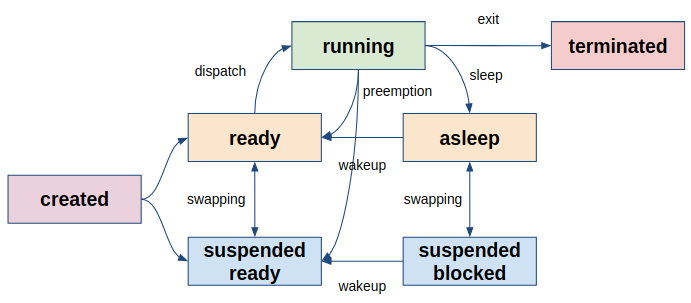
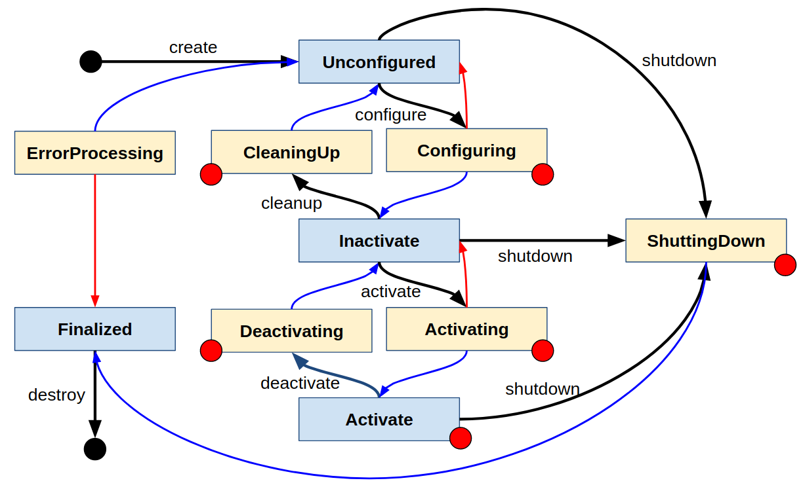

# Chapter 48: Lifecycle
## 01. 노드 관리
- 운영체제는 복수개의 프로세스를 효율적으로 관리하기 위해 프로세스의 상태를 정의하고 상태의 전환을 조율한다.
- 프로세스의 상태는 프로세서, 메모리와 같은 자원의 할당 여부에 따라 정의되고 처리 순서, 교착 상태, 메모리 할당 등에 의해 그 상태가 전환될 수 있다.



- ROS 2 에서는 Node의 상태를 관리할 수 있는 인터페이스인 Lifecycle을 제공한다.
- Lifecycle 을 통해 개발자는 노드의 상태를 확인할 수 있고, 런타임에서 노드를 재실행하거나 교체할 수도 있다.
- 카메라 센서를 통해 받은 이미지 정보를 발간하는 노드를 예를 들어 보자.
- 먼저 노드를 동작시키기 전에 카메라와의 통신을 위한 포트가 제대로 잡혔는지 확인해볼 수 있을 것이고 포트가 제대로 잡히지 않았다면 그 동작을 제한할 수 있을 것이다.
- 만약 노드가 동작되는 도중에 에러가 발생 하였다면 잠시 그 동작을 멈추고 에러를 해결한 다음 재시작할 수 있을 것이고, 주변 환경의 변화로 인해 에러를 해결할 수 없다면 해당 노드는 종료시키고 준비된 다른 노드를 동작시킬 수도 있을 것이다.
- 물론 이와 같은 동작은 개발자가 만든 코드를 통해 처리할 수도 있다.
- 하지만 Lifecycle 을 통해 통일된 인터페이스를 사용함으로서 ROS 에 등록된 복수개의 노드를 동일한 방법으로 제어할 수 있다는 장점을 가질 수 있다.
- Lifecycle 은 노드를 관리하기 위한 인터페이스로 주요 상태 (Primary states) 와 전환 상태 (Transition states) 그리고 전환 (Transition) 를 제공한다.

## 02. Lifecycle
- ROS 2 의 Lifecycle 을 통해 확인할 수 있는 노드의 상태와 그 상태 전환에 대해 알아보자.
- 그림에서 파란색 박스는 주요 상태, 노란색 박스는 전환 상태를 이야기 한다.
- 검정색 화살표는 전환을 표기하였고, 파란색 화살표는 전환 상태의 결과가 성공일때 주요 상태의 변화를 나타내고, 빨간색 화살표는 전환 상태의 결과가 실패일때 주요 상태의 변화를 나타낸다. 빨간색 작은 원은 에러가 확인될 수 있는 상태를 나타낸다.



- Lifecycle 은 4개의 주요 상태가 정의되어 있으며, 해당 상태에서 머무르다가 전환를 통해 전환 상태로 이동하고 그 결과에 따라 주요 상태가 전환되게 된다.
    - Unconfigured : 노드가 생성된 직후의 상태, 에러 발생 이후 다시 조정될 수 있는 상태
    - Inactivate : 노드가 동작을 수행하지 않는 상태. 파라미터 등록, 토픽 발간과 구독 추가 삭제 등을 (재)구성 할 수 있는 상태
    - Activate : 노드가 동작을 수행하는 상태.
    - Finalized : 노드가 메모리에서 해제되기 직전 상태. 노드가 파괴되기 전 디버깅이나 내부 검사를 진행할 수 있는 상태
- Lifecycle 은 6개의 전환 상태가 정의되어 있고, 전환 상태 결과에 따라 다음 주요 상태가 결정된다.
    - Configuring : 노드를 구성하기 위해 필요한 설정 수행
    - CleaningUp : 노드가 처음 생성되었을 때 상태와 동일하게 만드는 과정 수행
    - Activating : 노드가 동작을 수행하기 전 마지막 준비 과정 수행
    - Deactivating : 노드가 동작을 수행하기 전으로 돌아가는 과정 수행
    - ShuttingDown : 노드가 파괴되기 전 필요한 과정 수행
    - ErrorProcessing : 사용자 코드가 동작되는 상태에서 발생하는 에러를 해결하기 위한 과정 수행
- Lifecycle 은 7개의 전환이 정의되어 있어서 주요 상태를 전환시키고 싶을 때 사용할 수 있다.
    - Create
    - Configure
    - Cleanup
    - Activate
    - Deactivate
    - Shutdown
    - Destroy
    
## 03. 데모 코드
- ROS 2 Foxy 버전 기준으로 Lifecycle 은 rclcpp 를 통해서만 사용가능 하다.
- 데모 코드는 Lifecycle 이 적용된 노드(lc_talker) 와 lc_talker 에서 발간하는 정보와 주요 상태를 구독하는 노드(lc_listener) 그리고 lc_talker 의 현재 주요 상태를 확인하고 다른 주요 상태로 전환시켜주는 노드(lc_client) 로 구성되어 있다.

### 3-1. lc_talker
- demos/lifecycle/src/lifecycle_talker.cpp
```cpp
// Copyright 2016 Open Source Robotics Foundation, Inc.
//
// Licensed under the Apache License, Version 2.0 (the "License");
// you may not use this file except in compliance with the License.
// You may obtain a copy of the License at
//
//     http://www.apache.org/licenses/LICENSE-2.0
//
// Unless required by applicable law or agreed to in writing, software
// distributed under the License is distributed on an "AS IS" BASIS,
// WITHOUT WARRANTIES OR CONDITIONS OF ANY KIND, either express or implied.
// See the License for the specific language governing permissions and
// limitations under the License.

#include <chrono>
#include <iostream>
#include <memory>
#include <string>
#include <thread>
#include <utility>

#include "lifecycle_msgs/msg/transition.hpp"

#include "rclcpp/rclcpp.hpp"
#include "rclcpp/publisher.hpp"

#include "rclcpp_lifecycle/lifecycle_node.hpp"
#include "rclcpp_lifecycle/lifecycle_publisher.hpp"

#include "rcutils/logging_macros.h"

#include "std_msgs/msg/string.hpp"

using namespace std::chrono_literals;

/// LifecycleTalker inheriting from rclcpp_lifecycle::LifecycleNode
/**
 * The lifecycle talker does not like the regular "talker" node
 * inherit from node, but rather from lifecyclenode. This brings
 * in a set of callbacks which are getting invoked depending on
 * the current state of the node.
 * Every lifecycle node has a set of services attached to it
 * which make it controllable from the outside and invoke state
 * changes.
 * Available Services as for Beta1:
 * - <node_name>__get_state
 * - <node_name>__change_state
 * - <node_name>__get_available_states
 * - <node_name>__get_available_transitions
 * Additionally, a publisher for state change notifications is
 * created:
 * - <node_name>__transition_event
 */
class LifecycleTalker : public rclcpp_lifecycle::LifecycleNode
{
public:
  /// LifecycleTalker constructor
  /**
   * The lifecycletalker/lifecyclenode constructor has the same
   * arguments a regular node.
   */
  explicit LifecycleTalker(const std::string & node_name, bool intra_process_comms = false)
  : rclcpp_lifecycle::LifecycleNode(node_name,
      rclcpp::NodeOptions().use_intra_process_comms(intra_process_comms))
  {}

  /// Callback for walltimer in order to publish the message.
  /**
   * Callback for walltimer. This function gets invoked by the timer
   * and executes the publishing.
   * For this demo, we ask the node for its current state. If the
   * lifecycle publisher is not activate, we still invoke publish, but
   * the communication is blocked so that no messages is actually transferred.
   */
  void
  publish()
  {
    static size_t count = 0;
    auto msg = std::make_unique<std_msgs::msg::String>();
    msg->data = "Lifecycle HelloWorld #" + std::to_string(++count);

    // Print the current state for demo purposes
    if (!pub_->is_activated()) {
      RCLCPP_INFO(
        get_logger(), "Lifecycle publisher is currently inactive. Messages are not published.");
    } else {
      RCLCPP_INFO(
        get_logger(), "Lifecycle publisher is active. Publishing: [%s]", msg->data.c_str());
    }

    // We independently from the current state call publish on the lifecycle
    // publisher.
    // Only if the publisher is in an active state, the message transfer is
    // enabled and the message actually published.
    pub_->publish(std::move(msg));
  }
  /// Transition callback for state configuring
  /**
   * on_configure callback is being called when the lifecycle node
   * enters the "configuring" state.
   * Depending on the return value of this function, the state machine
   * either invokes a transition to the "inactive" state or stays
   * in "unconfigured".
   * TRANSITION_CALLBACK_SUCCESS transitions to "inactive"
   * TRANSITION_CALLBACK_FAILURE transitions to "unconfigured"
   * TRANSITION_CALLBACK_ERROR or any uncaught exceptions to "errorprocessing"
   */
  rclcpp_lifecycle::node_interfaces::LifecycleNodeInterface::CallbackReturn
  on_configure(const rclcpp_lifecycle::State &)
  {
    // This callback is supposed to be used for initialization and
    // configuring purposes.
    // We thus initialize and configure our publishers and timers.
    // The lifecycle node API does return lifecycle components such as
    // lifecycle publishers. These entities obey the lifecycle and
    // can comply to the current state of the node.
    // As of the beta version, there is only a lifecycle publisher
    // available.
    pub_ = this->create_publisher<std_msgs::msg::String>("lifecycle_chatter", 10);
    timer_ = this->create_wall_timer(
      1s, std::bind(&LifecycleTalker::publish, this));

    RCLCPP_INFO(get_logger(), "on_configure() is called.");

    // We return a success and hence invoke the transition to the next
    // step: "inactive".
    // If we returned TRANSITION_CALLBACK_FAILURE instead, the state machine
    // would stay in the "unconfigured" state.
    // In case of TRANSITION_CALLBACK_ERROR or any thrown exception within
    // this callback, the state machine transitions to state "errorprocessing".
    return rclcpp_lifecycle::node_interfaces::LifecycleNodeInterface::CallbackReturn::SUCCESS;
  }

 /// Transition callback for state activating
  /**
   * on_activate callback is being called when the lifecycle node
   * enters the "activating" state.
   * Depending on the return value of this function, the state machine
   * either invokes a transition to the "active" state or stays
   * in "inactive".
   * TRANSITION_CALLBACK_SUCCESS transitions to "active"
   * TRANSITION_CALLBACK_FAILURE transitions to "inactive"
   * TRANSITION_CALLBACK_ERROR or any uncaught exceptions to "errorprocessing"
   */
  rclcpp_lifecycle::node_interfaces::LifecycleNodeInterface::CallbackReturn
  on_activate(const rclcpp_lifecycle::State &)
  {
    // We explicitly activate the lifecycle publisher.
    // Starting from this point, all messages are no longer
    // ignored but sent into the network.
    pub_->on_activate();

    RCUTILS_LOG_INFO_NAMED(get_name(), "on_activate() is called.");

    // Let's sleep for 2 seconds.
    // We emulate we are doing important
    // work in the activating phase.
    std::this_thread::sleep_for(2s);

    // We return a success and hence invoke the transition to the next
    // step: "active".
    // If we returned TRANSITION_CALLBACK_FAILURE instead, the state machine
    // would stay in the "inactive" state.
    // In case of TRANSITION_CALLBACK_ERROR or any thrown exception within
    // this callback, the state machine transitions to state "errorprocessing".
    return rclcpp_lifecycle::node_interfaces::LifecycleNodeInterface::CallbackReturn::SUCCESS;
  }
 /// Transition callback for state deactivating
  /**
   * on_deactivate callback is being called when the lifecycle node
   * enters the "deactivating" state.
   * Depending on the return value of this function, the state machine
   * either invokes a transition to the "inactive" state or stays
   * in "active".
   * TRANSITION_CALLBACK_SUCCESS transitions to "inactive"
   * TRANSITION_CALLBACK_FAILURE transitions to "active"
   * TRANSITION_CALLBACK_ERROR or any uncaught exceptions to "errorprocessing"
   */
  rclcpp_lifecycle::node_interfaces::LifecycleNodeInterface::CallbackReturn
  on_deactivate(const rclcpp_lifecycle::State &)
  {
    // We explicitly deactivate the lifecycle publisher.
    // Starting from this point, all messages are no longer
    // sent into the network.
    pub_->on_deactivate();

    RCUTILS_LOG_INFO_NAMED(get_name(), "on_deactivate() is called.");

    // We return a success and hence invoke the transition to the next
    // step: "inactive".
    // If we returned TRANSITION_CALLBACK_FAILURE instead, the state machine
    // would stay in the "active" state.
    // In case of TRANSITION_CALLBACK_ERROR or any thrown exception within
    // this callback, the state machine transitions to state "errorprocessing".
    return rclcpp_lifecycle::node_interfaces::LifecycleNodeInterface::CallbackReturn::SUCCESS;
  }

  /// Transition callback for state cleaningup
  /**
   * on_cleanup callback is being called when the lifecycle node
   * enters the "cleaningup" state.
   * Depending on the return value of this function, the state machine
   * either invokes a transition to the "unconfigured" state or stays
   * in "inactive".
   * TRANSITION_CALLBACK_SUCCESS transitions to "unconfigured"
   * TRANSITION_CALLBACK_FAILURE transitions to "inactive"
   * TRANSITION_CALLBACK_ERROR or any uncaught exceptions to "errorprocessing"
   */
  rclcpp_lifecycle::node_interfaces::LifecycleNodeInterface::CallbackReturn
  on_cleanup(const rclcpp_lifecycle::State &)
  {
    // In our cleanup phase, we release the shared pointers to the
    // timer and publisher. These entities are no longer available
    // and our node is "clean".
    timer_.reset();
    pub_.reset();

    RCUTILS_LOG_INFO_NAMED(get_name(), "on cleanup is called.");

    // We return a success and hence invoke the transition to the next
    // step: "unconfigured".
    // If we returned TRANSITION_CALLBACK_FAILURE instead, the state machine
    // would stay in the "inactive" state.
    // In case of TRANSITION_CALLBACK_ERROR or any thrown exception within
    // this callback, the state machine transitions to state "errorprocessing".
    return rclcpp_lifecycle::node_interfaces::LifecycleNodeInterface::CallbackReturn::SUCCESS;
  }
 /// Transition callback for state shutting down
  /**
   * on_shutdown callback is being called when the lifecycle node
   * enters the "shuttingdown" state.
   * Depending on the return value of this function, the state machine
   * either invokes a transition to the "finalized" state or stays
   * in its current state.
   * TRANSITION_CALLBACK_SUCCESS transitions to "finalized"
   * TRANSITION_CALLBACK_FAILURE transitions to current state
   * TRANSITION_CALLBACK_ERROR or any uncaught exceptions to "errorprocessing"
   */
  rclcpp_lifecycle::node_interfaces::LifecycleNodeInterface::CallbackReturn
  on_shutdown(const rclcpp_lifecycle::State & state)
  {
    // In our shutdown phase, we release the shared pointers to the
    // timer and publisher. These entities are no longer available
    // and our node is "clean".
    timer_.reset();
    pub_.reset();

    RCUTILS_LOG_INFO_NAMED(
      get_name(),
      "on shutdown is called from state %s.",
      state.label().c_str());

    // We return a success and hence invoke the transition to the next
    // step: "finalized".
    // If we returned TRANSITION_CALLBACK_FAILURE instead, the state machine
    // would stay in the current state.
    // In case of TRANSITION_CALLBACK_ERROR or any thrown exception within
    // this callback, the state machine transitions to state "errorprocessing".
    return rclcpp_lifecycle::node_interfaces::LifecycleNodeInterface::CallbackReturn::SUCCESS;
  }

private:
  // We hold an instance of a lifecycle publisher. This lifecycle publisher
  // can be activated or deactivated regarding on which state the lifecycle node
  // is in.
  // By default, a lifecycle publisher is inactive by creation and has to be
  // activated to publish messages into the ROS world.
  std::shared_ptr<rclcpp_lifecycle::LifecyclePublisher<std_msgs::msg::String>> pub_;

  // We hold an instance of a timer which periodically triggers the publish function.
  // As for the beta version, this is a regular timer. In a future version, a
  // lifecycle timer will be created which obeys the same lifecycle management as the
  // lifecycle publisher.
  std::shared_ptr<rclcpp::TimerBase> timer_;
};

/**
 * A lifecycle node has the same node API
 * as a regular node. This means we can spawn a
 * node, give it a name and add it to the executor.
 */
int main(int argc, char * argv[])
{
  // force flush of the stdout buffer.
  // this ensures a correct sync of all prints
  // even when executed simultaneously within the launch file.
  setvbuf(stdout, NULL, _IONBF, BUFSIZ);

  rclcpp::init(argc, argv);

  rclcpp::executors::SingleThreadedExecutor exe;

  std::shared_ptr<LifecycleTalker> lc_node =
    std::make_shared<LifecycleTalker>("lc_talker");

  exe.add_node(lc_node->get_node_base_interface());

  exe.spin();

  rclcpp::shutdown();

  return 0;
}
```
- 먼저 LifecycleTalker 클래스 선언 부분을 살펴보자.
- 기존에는 rclcpp::Node 클래스를 상속 받아 노드를 개발하였지만 Lifecycle을 사용하기 위해서는 rclcpp_lifecycle::LifecycleNode 클래스를 상속받아야 한다.
- 생성자를 살펴보면 상속받은 부모 클래스를 초기화 해주는 부분이 rclcpp::Node 클래스를 초기화 해주었던 방법과 동일하다는 것을 확인할 수 있다.
- 이처럼 ROS 2 에서는 추가 기능을 사용하기 위한 코드가 기본 노드 생성 코드에서 크게 벗어나지 않기 때문에 확장성이 매우 좋다.
```cpp
class LifecycleTalker : public rclcpp_lifecycle::LifecycleNode
{
public:
  explicit LifecycleTalker(const std::string & node_name, bool intra_process_comms = false)
  : rclcpp_lifecycle::LifecycleNode(node_name,
      rclcpp::NodeOptions().use_intra_process_comms(intra_process_comms))
  {}
```
- 다음은 Lifecycle 에서 정의한 전환 상태에서 노드가 어떤 동작을 해야하는지 설정해주는 부분을 살펴보도록 하자.
- 해당 부분에는 사용자 코드가 포함된다.
- on_configure 함수에는 Unconfigure 상태에서 Inactivate 상태로 전환되는 전환 상태에서 필요한 동작을 구현해주어야 한다.
- 아래 함수를 보면 메시지를 발간하기 위한 lifecycle publisher 와 wall_timer 를 인스턴스화 하는 코드를 확인할 수 있고, 함수 리턴 값을 통해 그 성공과 실패를 전달할 수 있다.
- 만약 성공한다면 Inactivate 상태로 전환될 것이고, 그렇지 않다면 Unconfigure 상태에 머무를 것이다.
- 에러가 발생하면 ErrorProcessing 전환상태가 불려진다.
```cpp
rclcpp_lifecycle::node_interfaces::LifecycleNodeInterface::CallbackReturn
  on_configure(const rclcpp_lifecycle::State &)
  {
    pub_ = this->create_publisher<std_msgs::msg::String>("lifecycle_chatter", 10);
    timer_ = this->create_wall_timer(
      1s, std::bind(&LifecycleTalker::publish, this));

    RCLCPP_INFO(get_logger(), "on_configure() is called.");

    return rclcpp_lifecycle::node_interfaces::LifecycleNodeInterface::CallbackReturn::SUCCESS;
  }
```
- on_activate 함수에는 Inactivate 상태에서 Activate 상태로 전환되는 전환 상태에서 필요한 과정을 구현한다.
- rclcpp_lifecycle::LifecyclePublisher 는 기존에 노드에서 사용했던 publisher 를 제어할 수 있는 함수가 추가되어 있어 이를 꼭 불러줘야만 한다.
- on_activate 콜백 결과 Activate 상태에서 publisher 가 동작되어야 하기 때문에 on_activate() 함수가 코드에 포함되어 있는 것을 확인할 수 있다.
```cpp
rclcpp_lifecycle::node_interfaces::LifecycleNodeInterface::CallbackReturn
  on_activate(const rclcpp_lifecycle::State &)
  {
    pub_->on_activate();

    RCUTILS_LOG_INFO_NAMED(get_name(), "on_activate() is called.");

    std::this_thread::sleep_for(2s);

    return rclcpp_lifecycle::node_interfaces::LifecycleNodeInterface::CallbackReturn::SUCCESS;
  }
```
- on_deactivate 함수에는 Activate 상태에서 Inactivate 상태로 전환되는 전환 상태에서 필요한 과정을 구현한다.
- on_deactivate 콜백 결과 Inactivate 상태에서 publisher 가 동작을 멈춰야 하기 때문에 on_deactivate() 함수가 코드에 포함되어 있는 것을 확인할 수 있다.
```cpp
rclcpp_lifecycle::node_interfaces::LifecycleNodeInterface::CallbackReturn
  on_deactivate(const rclcpp_lifecycle::State &)
  {
    pub_->on_deactivate();

    RCUTILS_LOG_INFO_NAMED(get_name(), "on_deactivate() is called.");

    return rclcpp_lifecycle::node_interfaces::LifecycleNodeInterface::CallbackReturn::SUCCESS;
  }
```
- on_cleanup 함수에는 Inactivate 상태에서 Unconfigure 상태로 전환되는 전환 상태에서 필요한 과정을 구현한다.
- 아래 코드를 보면 timer 와 publisher 를 초기화 하는 것을 확인할 수 있다.
```cpp
rclcpp_lifecycle::node_interfaces::LifecycleNodeInterface::CallbackReturn
  on_cleanup(const rclcpp_lifecycle::State &)
  {
    timer_.reset();
    pub_.reset();

    RCUTILS_LOG_INFO_NAMED(get_name(), "on cleanup is called.");

    return rclcpp_lifecycle::node_interfaces::LifecycleNodeInterface::CallbackReturn::SUCCESS;
  }
```
- on_shutdown 함수에는 노드를 파괴시키기 전에 필요한 과정을 구현한다.
- rclcpp_lifecycle::State 매개변수를 통해 어느 주요 상태로 부터 불려진건지 확인할 수도 있다.
```cpp
rclcpp_lifecycle::node_interfaces::LifecycleNodeInterface::CallbackReturn
  on_shutdown(const rclcpp_lifecycle::State & state)
  {
    timer_.reset();
    pub_.reset();

    RCUTILS_LOG_INFO_NAMED(
      get_name(),
      "on shutdown is called from state %s.",
      state.label().c_str());

    return rclcpp_lifecycle::node_interfaces::LifecycleNodeInterface::CallbackReturn::SUCCESS;
  }
```

### 3-2. lc_listener
- demos/lifecycle/src/lifecycle_listener.cpp
```cpp
// Copyright 2016 Open Source Robotics Foundation, Inc.
//
// Licensed under the Apache License, Version 2.0 (the "License");
// you may not use this file except in compliance with the License.
// You may obtain a copy of the License at
//
//     http://www.apache.org/licenses/LICENSE-2.0
//
// Unless required by applicable law or agreed to in writing, software
// distributed under the License is distributed on an "AS IS" BASIS,
// WITHOUT WARRANTIES OR CONDITIONS OF ANY KIND, either express or implied.
// See the License for the specific language governing permissions and
// limitations under the License.

#include <memory>
#include <string>

#include "lifecycle_msgs/msg/transition_event.hpp"

#include "rclcpp/rclcpp.hpp"

#include "rcutils/logging_macros.h"

#include "std_msgs/msg/string.hpp"

/// LifecycleListener class as a simple listener node
/**
 * We subscribe to two topics
 * - lifecycle_chatter: The data topic from the talker
 * - lc_talker__transition_event: The topic publishing
 *   notifications about state changes of the node
 *   lc_talker
 */
class LifecycleListener : public rclcpp::Node
{
public:
  explicit LifecycleListener(const std::string & node_name)
  : Node(node_name)
  {
    // Data topic from the lc_talker node
    sub_data_ = this->create_subscription<std_msgs::msg::String>(
      "lifecycle_chatter", 10,
      std::bind(&LifecycleListener::data_callback, this, std::placeholders::_1));

    // Notification event topic. All state changes
    // are published here as TransitionEvents with
    // a start and goal state indicating the transition
    sub_notification_ = this->create_subscription<lifecycle_msgs::msg::TransitionEvent>(
      "/lc_talker/transition_event",
      10,
      std::bind(&LifecycleListener::notification_callback, this, std::placeholders::_1));
  }

  void data_callback(const std_msgs::msg::String::SharedPtr msg)
  {
    RCLCPP_INFO(get_logger(), "data_callback: %s", msg->data.c_str());
  }

  void notification_callback(const lifecycle_msgs::msg::TransitionEvent::SharedPtr msg)
  {
    RCLCPP_INFO(
      get_logger(), "notify callback: Transition from state %s to %s",
      msg->start_state.label.c_str(), msg->goal_state.label.c_str());
  }

private:
  std::shared_ptr<rclcpp::Subscription<std_msgs::msg::String>> sub_data_;
  std::shared_ptr<rclcpp::Subscription<lifecycle_msgs::msg::TransitionEvent>>
  sub_notification_;
};

int main(int argc, char ** argv)
{
  // force flush of the stdout buffer.
  // this ensures a correct sync of all prints
  // even when executed simultaneously within the launch file.
  setvbuf(stdout, NULL, _IONBF, BUFSIZ);

  rclcpp::init(argc, argv);

  auto lc_listener = std::make_shared<LifecycleListener>("lc_listener");
  rclcpp::spin(lc_listener);

  rclcpp::shutdown();

  return 0;
}
```
- LifecycleListener 클래스는 Lifecycle 이 적용되지 않은 rclcpp::Node 클래스를 상속 받는다.
- 해당 클래스에는 두개의 subscriber 가 선언되어 있는데 하나는 lc_talker 에서 보내주는 데이터를 구독하는 것이고, 다른 하나는 lc_talker 의 상태 전환 이벤트를 구독하여 이전 주요 상태와 전환된 주요 상태를 보여줄 것이다.
- Lifecycle 과 연관된 토픽은 앞에 노드 네임이 네임스페이스로 붙어있어 다른 토픽과 겹치지 않는다.
```cpp
// Data topic from the lc_talker node
    sub_data_ = this->create_subscription<std_msgs::msg::String>(
      "lifecycle_chatter", 10,
      std::bind(&LifecycleListener::data_callback, this, std::placeholders::_1));

    // Notification event topic. All state changes
    // are published here as TransitionEvents with
    // a start and goal state indicating the transition
    sub_notification_ = this->create_subscription<lifecycle_msgs::msg::TransitionEvent>(
      "/lc_talker/transition_event",
      10,
      std::bind(&LifecycleListener::notification_callback, this, std::placeholders::_1));
```

### 3-3. lc_client
- demos/lifecycle/src/lifecycle_service_client.cpp
```cpp
// Copyright 2016 Open Source Robotics Foundation, Inc.
//
// Licensed under the Apache License, Version 2.0 (the "License");
// you may not use this file except in compliance with the License.
// You may obtain a copy of the License at
//
//     http://www.apache.org/licenses/LICENSE-2.0
//
// Unless required by applicable law or agreed to in writing, software
// distributed under the License is distributed on an "AS IS" BASIS,
// WITHOUT WARRANTIES OR CONDITIONS OF ANY KIND, either express or implied.
// See the License for the specific language governing permissions and
// limitations under the License.

#include <chrono>
#include <memory>
#include <string>
#include <thread>

#include "lifecycle_msgs/msg/state.hpp"
#include "lifecycle_msgs/msg/transition.hpp"
#include "lifecycle_msgs/srv/change_state.hpp"
#include "lifecycle_msgs/srv/get_state.hpp"

#include "rclcpp/rclcpp.hpp"

#include "rcutils/logging_macros.h"

using namespace std::chrono_literals;

// which node to handle
static constexpr char const * lifecycle_node = "lc_talker";

// Every lifecycle node has various services
// attached to it. By convention, we use the format of
// <node name>/<service name>.
// In this demo, we use get_state and change_state
// and thus the two service topics are:
// lc_talker/get_state
// lc_talker/change_state
static constexpr char const * node_get_state_topic = "lc_talker/get_state";
static constexpr char const * node_change_state_topic = "lc_talker/change_state";

template<typename FutureT, typename WaitTimeT>
std::future_status
wait_for_result(
  FutureT & future,
  WaitTimeT time_to_wait)
{
  auto end = std::chrono::steady_clock::now() + time_to_wait;
  std::chrono::milliseconds wait_period(100);
  std::future_status status = std::future_status::timeout;
  do {
    auto now = std::chrono::steady_clock::now();
    auto time_left = end - now;
    if (time_left <= std::chrono::seconds(0)) {break;}
    status = future.wait_for((time_left < wait_period) ? time_left : wait_period);
  } while (rclcpp::ok() && status != std::future_status::ready);
  return status;
}

class LifecycleServiceClient : public rclcpp::Node
{
public:
  explicit LifecycleServiceClient(const std::string & node_name)
  : Node(node_name)
  {}

  void
  init()
  {
    // Every lifecycle node spawns automatically a couple
    // of services which allow an external interaction with
    // these nodes.
    // The two main important ones are GetState and ChangeState.
    client_get_state_ = this->create_client<lifecycle_msgs::srv::GetState>(
      node_get_state_topic);
    client_change_state_ = this->create_client<lifecycle_msgs::srv::ChangeState>(
      node_change_state_topic);
  }

  /// Requests the current state of the node
  /**
   * In this function, we send a service request
   * asking for the current state of the node
   * lc_talker.
   * If it does return within the given time_out,
   * we return the current state of the node, if
   * not, we return an unknown state.
   * \param time_out Duration in seconds specifying
   * how long we wait for a response before returning
   * unknown state
   */
  unsigned int
  get_state(std::chrono::seconds time_out = 3s)
  {
    auto request = std::make_shared<lifecycle_msgs::srv::GetState::Request>();

    if (!client_get_state_->wait_for_service(time_out)) {
      RCLCPP_ERROR(
        get_logger(),
        "Service %s is not available.",
        client_get_state_->get_service_name());
      return lifecycle_msgs::msg::State::PRIMARY_STATE_UNKNOWN;
    }

    // We send the service request for asking the current
    // state of the lc_talker node.
    auto future_result = client_get_state_->async_send_request(request);

    // Let's wait until we have the answer from the node.
    // If the request times out, we return an unknown state.
    auto future_status = wait_for_result(future_result, time_out);

    if (future_status != std::future_status::ready) {
      RCLCPP_ERROR(
        get_logger(), "Server time out while getting current state for node %s", lifecycle_node);
      return lifecycle_msgs::msg::State::PRIMARY_STATE_UNKNOWN;
    }

    // We have an succesful answer. So let's print the current state.
    if (future_result.get()) {
      RCLCPP_INFO(
        get_logger(), "Node %s has current state %s.",
        lifecycle_node, future_result.get()->current_state.label.c_str());
      return future_result.get()->current_state.id;
    } else {
      RCLCPP_ERROR(
        get_logger(), "Failed to get current state for node %s", lifecycle_node);
      return lifecycle_msgs::msg::State::PRIMARY_STATE_UNKNOWN;
    }
  }
/// Invokes a transition
  /**
   * We send a Service request and indicate
   * that we want to invoke transition with
   * the id "transition".
   * By default, these transitions are
   * - configure
   * - activate
   * - cleanup
   * - shutdown
   * \param transition id specifying which
   * transition to invoke
   * \param time_out Duration in seconds specifying
   * how long we wait for a response before returning
   * unknown state
   */
  bool
  change_state(std::uint8_t transition, std::chrono::seconds time_out = 3s)
  {
    auto request = std::make_shared<lifecycle_msgs::srv::ChangeState::Request>();
    request->transition.id = transition;

    if (!client_change_state_->wait_for_service(time_out)) {
      RCLCPP_ERROR(
        get_logger(),
        "Service %s is not available.",
        client_change_state_->get_service_name());
      return false;
    }

    // We send the request with the transition we want to invoke.
    auto future_result = client_change_state_->async_send_request(request);

    // Let's wait until we have the answer from the node.
    // If the request times out, we return an unknown state.
    auto future_status = wait_for_result(future_result, time_out);

    if (future_status != std::future_status::ready) {
      RCLCPP_ERROR(
        get_logger(), "Server time out while getting current state for node %s", lifecycle_node);
      return false;
    }

    // We have an answer, let's print our success.
    if (future_result.get()->success) {
      RCLCPP_INFO(
        get_logger(), "Transition %d successfully triggered.", static_cast<int>(transition));
      return true;
    } else {
      RCLCPP_WARN(
        get_logger(), "Failed to trigger transition %u", static_cast<unsigned int>(transition));
      return false;
    }
  }

private:
  std::shared_ptr<rclcpp::Client<lifecycle_msgs::srv::GetState>> client_get_state_;
  std::shared_ptr<rclcpp::Client<lifecycle_msgs::srv::ChangeState>> client_change_state_;
};
/**
 * This is a little independent
 * script which triggers the
 * default lifecycle of a node.
 * It starts with configure, activate,
 * deactivate, activate, deactivate,
 * cleanup and finally shutdown
 */
void
callee_script(std::shared_ptr<LifecycleServiceClient> lc_client)
{
  rclcpp::WallRate time_between_state_changes(0.1);  // 10s

  // configure
  {
    if (!lc_client->change_state(lifecycle_msgs::msg::Transition::TRANSITION_CONFIGURE)) {
      return;
    }
    if (!lc_client->get_state()) {
      return;
    }
  }

  // activate
  {
    time_between_state_changes.sleep();
    if (!rclcpp::ok()) {
      return;
    }
    if (!lc_client->change_state(lifecycle_msgs::msg::Transition::TRANSITION_ACTIVATE)) {
      return;
    }
    if (!lc_client->get_state()) {
      return;
    }
  }

  // deactivate
  {
    time_between_state_changes.sleep();
    if (!rclcpp::ok()) {
      return;
    }
    if (!lc_client->change_state(lifecycle_msgs::msg::Transition::TRANSITION_DEACTIVATE)) {
      return;
    }
    if (!lc_client->get_state()) {
      return;
    }
  }

  // activate it again
  {
    time_between_state_changes.sleep();
    if (!rclcpp::ok()) {
      return;
    }
    if (!lc_client->change_state(lifecycle_msgs::msg::Transition::TRANSITION_ACTIVATE)) {
      return;
    }
    if (!lc_client->get_state()) {
      return;
    }
  }

  // and deactivate it again
  {
    time_between_state_changes.sleep();
    if (!rclcpp::ok()) {
      return;
    }
    if (!lc_client->change_state(lifecycle_msgs::msg::Transition::TRANSITION_DEACTIVATE)) {
      return;
    }
    if (!lc_client->get_state()) {
      return;
    }
  }

  // we cleanup
  {
    time_between_state_changes.sleep();
    if (!rclcpp::ok()) {
      return;
    }
    if (!lc_client->change_state(lifecycle_msgs::msg::Transition::TRANSITION_CLEANUP)) {
      return;
    }
    if (!lc_client->get_state()) {
      return;
    }
  }

  // and finally shutdown
  // Note: We have to be precise here on which shutdown transition id to call
  // We are currently in the unconfigured state and thus have to call
  // TRANSITION_UNCONFIGURED_SHUTDOWN
  {
    time_between_state_changes.sleep();
    if (!rclcpp::ok()) {
      return;
    }
    if (!lc_client->change_state(lifecycle_msgs::msg::Transition::TRANSITION_UNCONFIGURED_SHUTDOWN))
    {
      return;
    }
    if (!lc_client->get_state()) {
      return;
    }
  }
}

int main(int argc, char ** argv)
{
  // force flush of the stdout buffer.
  // this ensures a correct sync of all prints
  // even when executed simultaneously within the launch file.
  setvbuf(stdout, NULL, _IONBF, BUFSIZ);

  rclcpp::init(argc, argv);

  auto lc_client = std::make_shared<LifecycleServiceClient>("lc_client");
  lc_client->init();

  rclcpp::executors::SingleThreadedExecutor exe;
  exe.add_node(lc_client);

  std::shared_future<void> script = std::async(
    std::launch::async,
    std::bind(callee_script, lc_client));
  exe.spin_until_future_complete(script);

  rclcpp::shutdown();

  return 0;
}
```
- Lifecycle 인터페이스는 서비스 서버를 제공하여 개발자가 서비스 클라이언트를 통해 쉽게 노드를 상태를 확인하고 전환할 수 있도록 하였다.
- 서비스의 이름은 Lifecycle 노드의 이름 뒤에 원하는 기능을 더한 형태이다.
```cpp
static constexpr char const * node_get_state_topic = "lc_talker/get_state";
static constexpr char const * node_change_state_topic = "lc_talker/change_state";
```
- get_state 함수를 보면 lifecycle_msgs::srv::GetState 타입의 서비스 클라이언트를 이용해서 현재 주요 상태를 확인하는 코드를 볼 수 있다.
```cpp
unsigned int
  get_state(std::chrono::seconds time_out = 3s)
  {
    auto request = std::make_shared<lifecycle_msgs::srv::GetState::Request>();

    if (!client_get_state_->wait_for_service(time_out)) {
      RCLCPP_ERROR(
        get_logger(),
        "Service %s is not available.",
        client_get_state_->get_service_name());
      return lifecycle_msgs::msg::State::PRIMARY_STATE_UNKNOWN;
    }

    // We send the service request for asking the current
    // state of the lc_talker node.
    auto future_result = client_get_state_->async_send_request(request);

    // Let's wait until we have the answer from the node.
    // If the request times out, we return an unknown state.
    auto future_status = wait_for_result(future_result, time_out);

    if (future_status != std::future_status::ready) {
      RCLCPP_ERROR(
        get_logger(), "Server time out while getting current state for node %s", lifecycle_node);
      return lifecycle_msgs::msg::State::PRIMARY_STATE_UNKNOWN;
    }

    // We have an succesful answer. So let's print the current state.
    if (future_result.get()) {
      RCLCPP_INFO(
        get_logger(), "Node %s has current state %s.",
        lifecycle_node, future_result.get()->current_state.label.c_str());
      return future_result.get()->current_state.id;
    } else {
      RCLCPP_ERROR(
        get_logger(), "Failed to get current state for node %s", lifecycle_node);
      return lifecycle_msgs::msg::State::PRIMARY_STATE_UNKNOWN;
    }
  }
```
- change_state 함수를 통해 transition 매개변수와 lifecycle_msgs::srv::ChangeState 타입의 서비스 클라이언트를 이용해서 노드의 주요 상태를 전환할 수 있는 코드를 확인할 수 있다.
```cpp
bool
  change_state(std::uint8_t transition, std::chrono::seconds time_out = 3s)
  {
    auto request = std::make_shared<lifecycle_msgs::srv::ChangeState::Request>();
    request->transition.id = transition;

    if (!client_change_state_->wait_for_service(time_out)) {
      RCLCPP_ERROR(
        get_logger(),
        "Service %s is not available.",
        client_change_state_->get_service_name());
      return false;
    }

    // We send the request with the transition we want to invoke.
    auto future_result = client_change_state_->async_send_request(request);

    // Let's wait until we have the answer from the node.
    // If the request times out, we return an unknown state.
    auto future_status = wait_for_result(future_result, time_out);

    if (future_status != std::future_status::ready) {
      RCLCPP_ERROR(
        get_logger(), "Server time out while getting current state for node %s", lifecycle_node);
      return false;
    }

    // We have an answer, let's print our success.
    if (future_result.get()->success) {
      RCLCPP_INFO(
        get_logger(), "Transition %d successfully triggered.", static_cast<int>(transition));
      return true;
    } else {
      RCLCPP_WARN(
        get_logger(), "Failed to trigger transition %u", static_cast<unsigned int>(transition));
      return false;
    }
  }
```
- 참고로 CMakeLists.txt 에는 rclcpp 뿐만 아니라 rclcpp_lifecycle 패키지도 포함시켜줘야 한다는 것 잊지말자.
```cpp
...중략...

find_package(ament_cmake REQUIRED)
find_package(rclcpp_lifecycle REQUIRED)
find_package(lifecycle_msgs REQUIRED)
find_package(rclcpp REQUIRED)
find_package(std_msgs REQUIRED)

...중략...
```
- 이제 코드는 모두 살펴 보았으니 아래 명령어로 해당 노드들을 하나씩 실행 시켜 보자.
```
$ ros2 run lifecycle lifecycle_talker
$ ros2 run lifecycle lifecycle_listener
$ ros2 run lifecycle lifecycle_service_client
```
- 만약 한번에 실행시키고 싶다면 아래 launch 명령어를 사용해도 된다.
```
$ ros2 launch lifecycle lifecycle_demo.launch.py
```
- lc_talker 와 lc_listener 를 단독으로 실행시켰을 때는 터미널 창에 아무런 로그를 확인할 수 없다.
- Lifecycle 인터페이스를 가지고 있는 lc_talker 노드는 생성자에 아무런 코드가 포함되어 있지 않기 때문에 상태 전환을 통해서만 동작시킬 수 있다.
- lc_client 노드를 실행 시키면 그때 부터 lc_talker 의 상태가 Configure -> Inactivate -> Activate -> Inactivate -> Activate -> Inactivate -> Finalized 순서로 전환되어 아래와 같은 로그를 확인할 수 있다.
```
[INFO]: on_configure() is called.
[INFO]: Lifecycle publisher is currently inactive. Messages are not published.
[WARN]: Trying to publish message on the topic '/lifecycle_chatter', but the publisher is not activated
[INFO]: Lifecycle publisher is currently inactive. Messages are not published.
[WARN]: Trying to publish message on the topic '/lifecycle_chatter', but the publisher is not activated
[INFO]: Lifecycle publisher is currently inactive. Messages are not published.
[WARN]: Trying to publish message on the topic '/lifecycle_chatter', but the publisher is not activated
[INFO]: Lifecycle publisher is currently inactive. Messages are not published.
[WARN]: Trying to publish message on the topic '/lifecycle_chatter', but the publisher is not activated
[INFO]: Lifecycle publisher is currently inactive. Messages are not published.
[WARN]: Trying to publish message on the topic '/lifecycle_chatter', but the publisher is not activated
[INFO]: Lifecycle publisher is currently inactive. Messages are not published.
[WARN]: Trying to publish message on the topic '/lifecycle_chatter', but the publisher is not activated
[INFO]: Lifecycle publisher is currently inactive. Messages are not published.
[WARN]: Trying to publish message on the topic '/lifecycle_chatter', but the publisher is not activated
[INFO]: Lifecycle publisher is currently inactive. Messages are not published.
[WARN]: Trying to publish message on the topic '/lifecycle_chatter', but the publisher is not activated
[INFO]: Lifecycle publisher is currently inactive. Messages are not published.
[WARN]: Trying to publish message on the topic '/lifecycle_chatter', but the publisher is not activated
[INFO]: on_activate() is called.
[INFO]: Lifecycle publisher is active. Publishing: [Lifecycle HelloWorld #10]
[INFO]: Lifecycle publisher is active. Publishing: [Lifecycle HelloWorld #11]
[INFO]: Lifecycle publisher is active. Publishing: [Lifecycle HelloWorld #12]
[INFO]: Lifecycle publisher is active. Publishing: [Lifecycle HelloWorld #13]
[INFO]: Lifecycle publisher is active. Publishing: [Lifecycle HelloWorld #14]
[INFO]: Lifecycle publisher is active. Publishing: [Lifecycle HelloWorld #15]
[INFO]: Lifecycle publisher is active. Publishing: [Lifecycle HelloWorld #16]
[INFO]: Lifecycle publisher is active. Publishing: [Lifecycle HelloWorld #17]
[INFO]: Lifecycle publisher is active. Publishing: [Lifecycle HelloWorld #18]
[INFO]: on_deactivate() is called.
[INFO]: Lifecycle publisher is currently inactive. Messages are not published.
[WARN]: Trying to publish message on the topic '/lifecycle_chatter', but the publisher is not activated
[INFO]: Lifecycle publisher is currently inactive. Messages are not published.
[WARN]: Trying to publish message on the topic '/lifecycle_chatter', but the publisher is not activated
[INFO]: Lifecycle publisher is currently inactive. Messages are not published.
[WARN]: Trying to publish message on the topic '/lifecycle_chatter', but the publisher is not activated
[INFO]: Lifecycle publisher is currently inactive. Messages are not published.
[WARN]: Trying to publish message on the topic '/lifecycle_chatter', but the publisher is not activated
[INFO]: Lifecycle publisher is currently inactive. Messages are not published.
[WARN]: Trying to publish message on the topic '/lifecycle_chatter', but the publisher is not activated
[INFO]: Lifecycle publisher is currently inactive. Messages are not published.
[WARN]: Trying to publish message on the topic '/lifecycle_chatter', but the publisher is not activated
[INFO]: Lifecycle publisher is currently inactive. Messages are not published.
[WARN]: Trying to publish message on the topic '/lifecycle_chatter', but the publisher is not activated
[INFO]: Lifecycle publisher is currently inactive. Messages are not published.
[WARN]: Trying to publish message on the topic '/lifecycle_chatter', but the publisher is not activated
[INFO]: Lifecycle publisher is currently inactive. Messages are not published.
[WARN]: Trying to publish message on the topic '/lifecycle_chatter', but the publisher is not activated
[INFO]: Lifecycle publisher is currently inactive. Messages are not published.
[WARN]: Trying to publish message on the topic '/lifecycle_chatter', but the publisher is not activated
[INFO]: on_activate() is called.
[INFO]: Lifecycle publisher is active. Publishing: [Lifecycle HelloWorld #29]
[INFO]: Lifecycle publisher is active. Publishing: [Lifecycle HelloWorld #30]
[INFO]: Lifecycle publisher is active. Publishing: [Lifecycle HelloWorld #31]
[INFO]: Lifecycle publisher is active. Publishing: [Lifecycle HelloWorld #32]
[INFO]: Lifecycle publisher is active. Publishing: [Lifecycle HelloWorld #33]
[INFO]: Lifecycle publisher is active. Publishing: [Lifecycle HelloWorld #34]
[INFO]: Lifecycle publisher is active. Publishing: [Lifecycle HelloWorld #35]
[INFO]: Lifecycle publisher is active. Publishing: [Lifecycle HelloWorld #36]
[INFO]: Lifecycle publisher is active. Publishing: [Li
```
- lc_listener 노드는 lc_talker 노드의 상태 전환 이벤트를 확인하여 이를 로그로 보여주고, lc_talker 가 activate 상태일 때 구독하고 있는 데이터를 확인하는 모습을 보여준다.
```
[INFO]: notify callback: Transition from state unconfigured to configuring
[INFO]: notify callback: Transition from state configuring to inactive
[INFO]: notify callback: Transition from state inactive to activating
[INFO]: notify callback: Transition from state activating to active
[INFO]: data_callback: Lifecycle HelloWorld #10
[INFO]: data_callback: Lifecycle HelloWorld #11
[INFO]: data_callback: Lifecycle HelloWorld #12
[INFO]: data_callback: Lifecycle HelloWorld #13
[INFO]: data_callback: Lifecycle HelloWorld #14
[INFO]: data_callback: Lifecycle HelloWorld #15
[INFO]: data_callback: Lifecycle HelloWorld #16
[INFO]: data_callback: Lifecycle HelloWorld #17
[INFO]: data_callback: Lifecycle HelloWorld #18
[INFO]: notify callback: Transition from state active to deactivating
[INFO]: notify callback: Transition from state deactivating to inactive
[INFO]: notify callback: Transition from state inactive to activating
[INFO]: data_callback: Lifecycle HelloWorld #29
[INFO]: notify callback: Transition from state activating to active
[INFO]: data_callback: Lifecycle HelloWorld #30
[INFO]: data_callback: Lifecycle HelloWorld #31
[INFO]: data_callback: Lifecycle HelloWorld #32
[INFO]: data_callback: Lifecycle HelloWorld #33
[INFO]: data_callback: Lifecycle HelloWorld #34
[INFO]: data_callback: Lifecycle HelloWorld #35
[INFO]: data_callback: Lifecycle HelloWorld #36
[INFO]: data_callback: Lifecycle HelloWorld #37
[INFO]: notify callback: Transition from state active to deactivating
[INFO]: notify callback: Transition from state deactivating to inactive
[INFO]: notify callback: Transition from state inactive to cleaningup
[INFO]: notify callback: Transition from state cleaningup to unconfigured
[INFO]: notify callback: Transition from state unconfigured to shuttingdown
[INFO]: notify callback: Transition from state shuttingdown to finalized
[INFO]: signal_handler(signal_value=2)
```
- lc_client 노드는 서비스 통신을 통해 lc_talker 의 상태를 전환하고 그 전환 결과를 보여준다.
```
[INFO]: Transition 1 successfully triggered.
[INFO]: Node lc_talker has current state inactive.
[INFO]: Transition 3 successfully triggered.
[INFO]: Node lc_talker has current state active.
[INFO]: Transition 4 successfully triggered.
[INFO]: Node lc_talker has current state inactive.
[INFO]: Transition 3 successfully triggered.
[INFO]: Node lc_talker has current state active.
[INFO]: Transition 4 successfully triggered.
[INFO]: Node lc_talker has current state inactive.
[INFO]: Transition 2 successfully triggered.
[INFO]: Node lc_talker has current state unconfigured.
[INFO]: Transition 5 successfully triggered.
[INFO]: Node lc_talker has current state finalized.
```

## 04. 맺음말
- Lifecycle 인터페이스는 navigation2, moveit2 와 같이 여러 노드로 이루어진 패키지에서 실제 사용 중에 있다.
- 초기 로봇 개발 단계에서는 노드의 갯수가 적어서 그 관리가 어렵지 않다.
- 하지만 점점 기능이 추가되면서 노드가 많아지면 어느 순간 시스템 오류로 인해 로봇이 제대로 동작하지 않는 경우가 많아 진다.
- 이때 해당 인터페이스를 사용하면 복수개의 노드를 동일하게 관리할 수 있어서 시스템 오류를 예방하거나 디버깅하기 쉬워 진다.
- 만약 프로젝트를 진행하고 있다면 이번 기회에 적용해보는 것도 좋을 것 같다.

[출처] 048 Lifecycle (오픈소스 소프트웨어 & 하드웨어: 로봇 기술 공유 카페 (오로카)) | 작성자 Routiful
