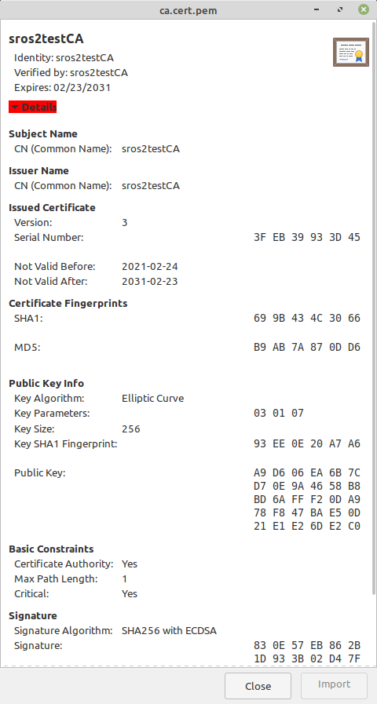
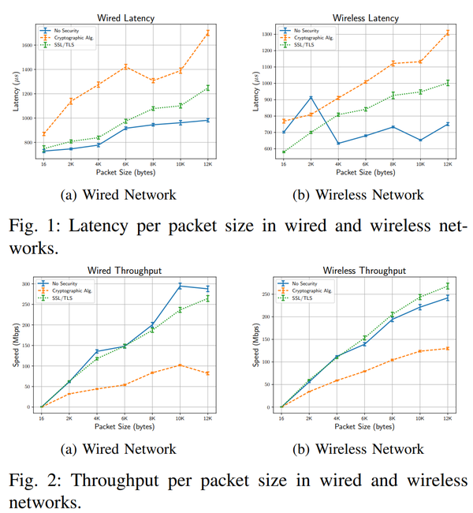
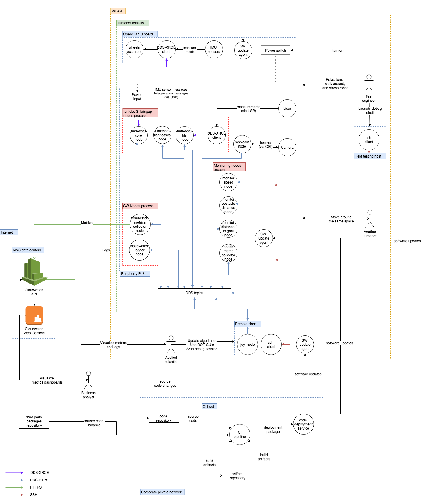

# Chapter 49: Security
## 01. ROS 2의 보안(Security)
- 네트워크 기능을 포함하는 어플리케이션에서의 보안 기능은 이를 이용하는 제품을 상용화하는데 있어서 매우 중요한 요소이다.
- 그래서 ROS 1을 사용하는 로봇 기업들 사이에서는 ROS 1의 보안 기능 부재가 항상 문제로 거론되었었다.
- 실제로 ROS 1의 경우, 노드를 관리하는 ROS master의 IP 주소와 연결 포트만 알아낼 수 있다면 노드 간에 주고 받는 모든 메시지를 들여다 볼 수 있으며 메시지의 조작도 가능하고 ROS master 혹은 특정 노드를 강제 종료하는 방법등으로 시스템 자체를 죽일 수 있었다.
- ROS master의 기본 포트 번호는 11311 포트인데 이를 바꾸지 않고 쓰는 경우도 흔한 일이였다.
- 하지만 ROS 1의 개발 초창기에는 보안 기능보다 로봇 개발에 사용되는 다양한 하드웨어와 소프트웨어를 평가하고 작동하는 확장성과 유연성에 더 무게를 두었고 보안에 대한 기회비용보다 더 중요하게 여겼다.
- 즉, 보안 이슈는 개발 우선 순위에서 항상 뒤져 있었던게 사실이다.
- 당연히 ROS 초창기에는 글로벌한 로보틱스 소프트웨어 플랫폼의 생태계를 만들어야 했기에 이 선택은 옳았다.
- 그리고 ROS가 널리 보급되어 사용하게 되면서 이러한 보안 기능에 대한 늘어나는 요구의 대응책으로 2016년 이후에 SROS(Secure Robot Operating System)라하여 ROS 운영에 있어서 보안 기능을 담은 패키지가 새롭게 선보였다.
- SROS을 도입하게 되면 TLS(Transport Layer Security)에 대응하는 것이 가능하고 각 노드 및 메시지의 억세스 제어가 가능해진다.
- 이것에 의해 메시지 통신의 내용을 암호화하여 데이터를 훔친다거나 가로채는 것이 불가능하게 된다.
- 그러나 이것은 도중에 추가로 개발되어 도입된 기능으로 ROS 1의 공식 서포트 패키지는 아니여서 이를 지원하는 ROS 클라이언트 라이브러리가 한정된다는 단점을 가지고 있었다.
- 이에 ROS 2에서는 디자인 설계부터 보안 기능이 고려되어 개발되었다.
- 우선, ROS 1의 TCP 기반의 메시지 통신(TCPROS)은 OMG(Object Management Group)에서 항공, 교통, 군사, 우주, 플랜트용으로 개발되어 표준으로 쓰이는 DDS(Data Distribution Service)으로 대체하였고, 자연스럽게 DDS-Security이라는 DDS 보안 사양을 ROS 2에 적용하여 보안에 대한 이슈를 통신단부터 해결하였다.
- 또한 ROS 커뮤니티에서는 SROS의 후속작인 SROS2를 개발하였고 보안 관련 ROS 클라이언트 라이브러리를 지원하였으며 보안관련 프로그래밍에 익숙지 않은 로보틱스 개발자를 위해 보안을 위한 툴킷을 만들어 배포하고 있다.
- 이 강좌에서는 SROS2에 대해 더 자세히 알아보고 SROS2를 사용한 ROS 2의 보안 기능을 테스트해볼 것이다.

> - 참고로 ROS 2의 보안에 대한 더 자세한 내용은 ROS 2 디자인 문서의 'Security' 관련 문서를 참고하자.

## 02. SROS2(Secure Robot Operating System 2)
- SROS2(Secure Robot Operating System 2)는 SROS의 차기 버전으로 SROS의 컨셉과 목적은 동일하게 계승하고 있지만 ROS 2에서 새롭게 도입된 DDS의 확장 기능인 DDS-Security을 ROS 2에서 사용할 수 있도록 새롭게 개발되었다.
- ROS 2에서는 보안 기능을 사용하기 위해 유저 코드에 SROS 관련 API를 추가하는 것이 아니다.
- 우리가 사용하는 RCL(ROS client library)에 도메인 참가자(domain participant)를 위한 보안 파일 지원, 실행 옵션, 보안 기능 On/Off 등을 포함시켜 놓았기에 사용자는 SROS2에서 제공하는 유틸리티를 'ros2 security' 명령어로 보안 관련 도구(tools)와 지침(policies)을 사용하면 된다.
- DDS-Security는 DDS 확장 기능의 사양으로 DDS의 기본 사양은 아닌 추가 옵션이다.
- 기본적으로는 인증(Authentication), 액세스 제어(Access control), 암호화(Cryptography), 로깅(Logging), 데이터 태깅(Data tagging)과 같이 아래 5가지 기능을 담고있다.
- 이 5가지 기능 중 SROS2에서는 DDS-Security에 대응하고 있는 벤더들의 공통 기능인 1) 인증, 2) 액세스 제어, 3) 암호화 이렇게 3가지 기능을 플러그인 형태로 제공하고 있다.
    - Authentication: DDS 도메인 참가자(domain participant) 확인
    - Access control: 참가자가 수행 할 수있는 DDS 관련 작업에 대한 제한
    - Cryptography: 암호화, 서명, 해싱 처리
    - Logging: DDS 보안 관련 이벤트를 감시하는 기능
    - Data tagging: 데이터 샘플에 태그를 추가하는 기능
    
### 2-1. 인증(Authentication)
- 인증 플러그인에서는 DDS의 도메인 참가자(domain participant) 확인 작업에 PKI(Public Key Infrastructure)를 사용한다.
- 인증은 각 도메인 참가자당 x.509 인증서에 해당되는 공개키(public key) 및 개인키(private key)가 요구되며 각 x.509 인증서는 특정 인증 기관인 CA(Certificate Authority)에 의해 서명되어 있어야 한다.

> - X.509는 공개키 인증서(public key certificates)의 형식을 정의하는 표준으로 X.509 인증서는 웹 검색을 위한 보안 프로토콜인 HTTPS에 사용되는 TLS/SSL을 포함하여 많은 인터넷 프로토콜에서 사용되고 있다.

### 2-2. 액세스 제어(Access control)
- 액세스 제어 플러그인에서는 지정된 도메인 참여자의 DDS 관련 기능에 대한 제한을 정의하고 적용한다.
- 이것은 시스템 관리자가 프로그램 별로 기능을 제한할 수 있게 해주는 리눅스 커널 보안 모듈인 AppArmor(Application Armor)이나 프로세스들의 자원의 사용을 제한하고 격리시키는 리눅스 커널 기능인 cgroups(control groups)은 아니다.
- 이는 특정 DDS 도메인에 특정 도메인 참가자가 참여하는 것을 제한하거나 참가자가 특정 DDS 토픽을 읽거나 쓸 수 있도록 허용하는 것이다. 이러한 제어는 XML 문서 형태로 액세스 제어 방침(policy)을 지정할 수 있게 되어 있다.

### 2-3. 암호화(Cryptography)
- 암호화 플로그인에서는 암호화(encryption), 복호화(decryption), 서명(signing), 해싱(hashing) 등의 모든 암호화 관련 작업을 담당하며 앞서 설명한 인증과 액세스 제어 플러그인은 암호화 플러그인을 사용한다.
---

- 이러한 SROS2의 3가지 기능은 멀티 플랫폼(Linux, macOS, Windows 등)을 지원하고 있으며 멀티 프로그래밍 언어(C++, Python 등)로 제작된 노드에서 사용 가능하다.
- DDS 벤더의 선택은 RMW를 제공하고 있는 eProsima의 FastDDS, Eclipse(ADLink)의 CycloneDDS, RTI의 Connext, GurumNetworks의 GurumDDS 중에서 선택이 가능한데 DDS 벤더가 DDS-Security 사양을 준수하고 있어야만 한다.
- 현재 SROS2의 개발은 RTI Connext Secure 5.3.x 및 eProsima의 Fast-RTPS 1.6.x 버전 이상에서 테스트되고 있다.
- SROS2의 3가지 기능에 대한 내용은 다음 장에서 설명과 함께 실습을 통해 알아보도록 하자.

> - 참고로 SROS는 SROS의 대표 개발자인 Ruffin White의 노력이 많이 들어갔는데 그가 2016년 OpenRobotics 인턴일 때 ROS의 창시자 Morgan Quigley 박사와 함께 SROS(Secure Robot Operating System)을 만들었으며 ROSCon2016에서 이를 처음 발표하였고 그 뒤로 UC San Diego에서 PhD 학위 과정을 하면서 SROS2 개발까지도 진행하게 된다.
> - SROS2에 대한 더 자세한 내용은 지난 IROS2018 SROS2 Tutorial 발표 자료 및 예제 코드와 지난 ROSCon2019에서의 워크샵에서 진행한 `Is your robot secure? ROS 1 & ROS 2 Security Workshop`의 발표 문서 및 예제코드도 참고하면 도움이 될 것 같다.
> - 그리고 ROS 2 Security Working Group의 리더로 있는 Canonical사 Kyle Fazzari의 'Robotics security: What is SROS 2?' 글도 읽어 보기를 추천한다.

## 03. ROS 2의 인증, 액세스 제어, 암호화 기능
- ROS2CLI 강좌에서 간단히 설명한 ROS2CLI 중 'ros2 security' 명령어가 SROS2 유틸리티이다.
- 이 장에서는 SROS2 유틸리티를 사용해보면서 SROS2의 핵심 기능인 인증, 액세스 제어, 암호화 기능에 대해 알아보도록 하겠다.

### 3-1. 노드 인증
- ROS 2 네트워크에 참가하는 노드들을 인증하여 참여 불가 판정을 하는 것으로 공개키(public key) 및 개인키(private key)가 요구된다.
- 만약 인증되지 않은 노드가 ROS 2 네트워크에 참가하려하면 접속은 거부 된다.
- 노드 인증 기능의 사용에 있어서 사용할 패키지 및 노드의 소스 코드 변경은 전혀 필요 없다.
- 그 대신에 암호키 및 보안 파일과 'ROS 2 sercurity' 명령어를 사용하여 보안 설정을 하게 된다.
- 우선 다음과 같이 암호키 등의 보안 설정을 보관하는 폴더를 생성한다.
```
$ cd ~/robot_ws
$ ros2 security create_keystore key_box
creating keystore: key_box
creating new CA key/cert pair
creating governance file: key_box/enclaves/governance.xml
creating signed governance file: key_box/enclaves/governance.p7s
all done! enjoy your keystore in key_box
cheers!
```



- 이 명령어로 key_box라는 폴더가 생성되고 그 안에 아래와 같은 거버넌스, 개인키, 공개키와 같은 4개의 파일과 링크 파일 4개가 자동 생성하게 된다. 이러한 파일 생성에는 OpenSSL을 사용하고 있다.
```
$ cd ~/robot_ws/key_box/
$ tree
.
├── enclaves
│   ├── governance.p7s
│   └── governance.xml
├── private
│   ├── ca.key.pem
│   ├── identity_ca.key.pem -> ca.key.pem
│   └── permissions_ca.key.pem -> ca.key.pem
└── public
    ├── ca.cert.pem
    ├── identity_ca.cert.pem -> ca.cert.pem
    └── permissions_ca.cert.pem -> ca.cert.pem
```
- 다음으로 노드 인증 기능을 테스트할 talker 노드와 listener 노드을 위해 암호키와 인증서를 생성한다.
```
$ cd ~/robot_ws
$ ros2 security create_key key_box /talker_listener/talker
$ ros2 security create_key key_box /talker_listener/listener
├── enclaves
│   ├── governance.p7s
│   ├── governance.xml
│   └── talker_listener
│       ├── listener
│       │   ├── cert.pem
│       │   ├── governance.p7s -> ../../governance.p7s
│       │   ├── identity_ca.cert.pem -> ../../../public/identity_ca.cert.pem
│       │   ├── key.pem
│       │   ├── permissions_ca.cert.pem -> ../../../public/permissions_ca.cert.pem
│       │   ├── permissions.p7s
│       │   └── permissions.xml
│       └── talker
│           ├── cert.pem
│           ├── governance.p7s -> ../../governance.p7s
│           ├── identity_ca.cert.pem -> ../../../public/identity_ca.cert.pem
│           ├── key.pem
│           ├── permissions_ca.cert.pem -> ../../../public/permissions_ca.cert.pem
│           ├── permissions.p7s
│           └── permissions.xml
(이하 생략)
```
- 그 후 다음과 같이 터미널 창에서 'export' 명령로 SROS2 환경 변수 (ROS_SECURITY_xxxxx)를 선언하여 ROS 2 보안 설정을 한다.
- SROS2 환경 변수에는 하기와 같이 'ROS_SECURITY_KEYSTORE', 'ROS_SECURITY_ENABLE', 'ROS_SECURITY_STRATEGY'의 3가지가 있다.
    1. 'ROS_SECURITY_KEYSTORE': 보안 설정 파일을 보관하는 폴더를 지정하는 것으로 위에서 'create_keystore'으로 지정한 폴더의 경로를 넣어주면 된다. 
    2. 'ROS_SECURITY_ENABLE': 보안 설정의 On/Off 기능으로 true/false 형태로 설정하게 된다. 디폴트 설정 값은 false으로 지금까지 이 설정을 사용하지 않았다면 ROS2의 Security 기능을 사용하고 있지 않았던 것이다. 
    3. 'ROS_SECURITY_STRATEGY': 보안 설정 방법에 대한 것으로 Enforce으로 설정하게 되면 보안 설정 파일이 없는 메시지 통신은 금지하고 Permissive의 경우 비보안 참여자로 참여 시킨다. 보안 설정 파일을 찾을 수 없는 경우를 대비하여 Permissive이 아닌 Enforce 옵션을 사용하자.
- 참고로 이러한 환경 변수는 노드를 실행할 때 마다 매번 각 터미널에서 선언해야 한다.
- 이어지는 노드 실행 명령어들을 실행하기 전에 꼭 다음 3가지 환경 변수는 각 터미널창에서 실행해주는 것을 잊지 않도록 하자.
- 만약 ROS 2의 보안 기능을 지속적으로 사용할 예정이라면 편의를 위해 3가지 환경 변수를 '~/.bashrc'에 추가해두면 편리하게 사용할 수 있다.
```
$ export ROS_SECURITY_KEYSTORE=~/robot_ws/key_box
$ export ROS_SECURITY_ENABLE=true
$ export ROS_SECURITY_STRATEGY=Enforce
```
- talker 노드와 listener 노드를 실행해보자.
- enclave라는 ROS arguments는 위에서 'ros2 security create_key' 명령어를 통해 각 노드를 위해 생성한 암호키와 인증서를 담은 폴더를 지정하는 것이다.
- 2개의 노드가 인증되어 접속되어 메시지를 주고 받는 것을 확인할 수 있다.
- 그리고 다음의 예제에서는 demo_nodes_cpp 패키지와 demo_nodes_py 패키지의 서로다른 언어로 작성된 노드를 실행시켜보았다.
- 이를 통해 클라이언트 라이브러리의 종류에 의존하지 않는다는 것도 확인할 수 있었다. SROS2는 C++, Python 언어의 노드 간에도 상관없이 사용 가능하다.
```
$ ros2 run demo_nodes_cpp talker --ros-args --enclave /talker_listener/talker
```
```
$ ros2 run demo_nodes_py listener --ros-args --enclave /talker_listener/listener
```
- 암호키는 노드 이름을 기반으로 생성되기에 노드 이름을 변경하게 되면 노드 인증에 실패하게 된다.
- 다음과 같이 listener 노드를 실행할 때 listener2라는 이름으로 노드 이름을 변경하여 실행해보자.
- 그러면 다른 이름으로 노드가 실행되어 노드 인증에 실패하기에 ROS 2 네트워크에 참가가 거부되는 것을 확인할 수 있다.
```
$ ros2 run demo_nodes_py listener --ros-args -r __node:=listener2 --enclave /talker_listener/listener
```
- 참고로 위 명령어를 실행하게 되면 기존에 동작 중이던 talker 노드와 listener 노드가 종료되면서 아래와 같은 에러를 남기게 된다.
```
[SECURITY_CRYPTO Error] Not valid SecureDataHeader submessage id -> Function decode_rtps_message
```

> - 참고로 ROS 2 Authentication에 대한 더 자세한 설명은 관련 ROS 2 디자인 문서인 참고자료를 참고하자.

### 3-2. 액세스 제어
- 액세스 제어는 지정한 네임스페이스, 토픽, 서비스, 액션에 대해 송신, 수신, 실행을 UNIX 퍼미션 같은 개념으로 쓰기, 읽기, 실행 등의 허가/거부를 설정할 수 있게 되었다.
- 이 퍼미션 설정은 XML 포맷으로 파일로 만들어 액세스 제어 방침(policy)으로 관리할 수 있다. 각 태그의 의미는 다음과 같다.

|`<profile>`|퍼미션을 부여하는 네임스페이스 또는 노드 이름|
|:---:|:---:|
|`<profiles> `|profile 태그 리스트|
|`<topic> `|토픽 이름|
|`<topics>`|publish="ALLOW"의 경우 토픽 송신 가능, subscribe="ALLOW"의 경우 토픽 수신 가능한 토픽 태그 리스트|
|`<service>`|서비스 이름|
|`<services>`|request="ALLOW"의 경우 서비스 클라이언트에서 요청 가능, reply="ALLOW"의 경우 서비스 서버에서 응답 가능한 서비스 태그 리스트|
|`<action>`|액션 이름|
|`<actions>`|call="ALLOW"의 경우 액션 클라이언트에서 호출 가능, execute="ALLOW"의 경우 액션 서버에서 실행 가능한 액션 태그 리스트|
|`<xi:include>`|다른 액세스 제어 방침(policy) XML 파일을 불러와 포함시킬 수 있는 태그로 common/node.xml 이나 logging.xml, time.xml, parameters.xml 등을 포함시킬 수 있다.|

- 참고로 publish, subscribe, request, reply, call, execute 등과 같은 퍼미션의 디폴트 값은 "DENY"이다.
- 이는 모든 억세스를 거부하도록 설정하게 되어 있다.
- 이 때문에 퍼미션 파일에서는 허가할 부분의 것만 "ALLOW"으로 설정하면 된다.
- 예제로 제공되는 액세스 제어 방침 파일을 보며 각 태그의 기능을 이해하면 더 쉽게 이해할 수 있는데 다음의 명령어를 이용하여 SROS2 리포지토리의 policies 폴더를 다운로드 하자.
- 이 폴더 안에 sample.policy.xml 파일과 talker_listener.policy.xml 파일을 참고 삼아 보도록 하자.
```
$ sudo apt update && sudo apt install subversion
$ cd ~/robot_ws
$ svn checkout https://github.com/ros2/sros2/trunk/sros2/test/policies
```

> - 참고로 위 명령어에서 'git clone'이 아닌 subversion의 'svn checkout' 명령어를 사용한 이유는 지정 리포지토리의 특정 폴더만 다운로드 하기 위해서이다.
> - 특정 파일이나 폴더만을 다운로드 받을 때 유용한 명령어이니 알아두도록 하자.

- [sample.policy.xml](https://github.com/ros2/sros2/blob/foxy/sros2/test/policies/sample.policy.xml)
```xml
<?xml version="1.0" encoding="UTF-8"?>
<policy version="0.2.0"
  xmlns:xi="http://www.w3.org/2001/XInclude">
  <enclaves>
    <xi:include href="talker_listener.policy.xml"
      xpointer="xpointer(/policy/enclaves/*)"/>
    <xi:include href="add_two_ints.policy.xml"
      xpointer="xpointer(/policy/enclaves/*)"/>
    <xi:include href="minimal_action.policy.xml"
      xpointer="xpointer(/policy/enclaves/*)"/>
    <enclave path="/sample_policy/admin">
      <profiles>
        <profile ns="/" node="admin">
          <xi:include href="common/node.xml"
            xpointer="xpointer(/profile/*)"/>
          <actions call="ALLOW" execute="ALLOW">
            <action>fibonacci</action>
          </actions>
          <services reply="ALLOW" request="ALLOW">
            <service>add_two_ints</service>
          </services>
          <topics publish="ALLOW" subscribe="ALLOW">
            <topic>chatter</topic>
          </topics>
        </profile>
      </profiles>
    </enclave>
  </enclaves>
</policy>
```
- [talker_listener.policy.xml](https://github.com/ros2/sros2/blob/foxy/sros2/test/policies/talker_listener.policy.xml)
```xml
<?xml version="1.0" encoding="UTF-8"?>
<policy version="0.2.0"
  xmlns:xi="http://www.w3.org/2001/XInclude">
  <enclaves>
    <enclave path="/talker_listener/talker">
      <profiles>
        <profile ns="/" node="talker">
          <xi:include href="common/node.xml"
            xpointer="xpointer(/profile/*)"/>
          <topics publish="ALLOW" >
            <topic>chatter</topic>
          </topics>
        </profile>
      </profiles>
    </enclave>
    <enclave path="/talker_listener/listener">
      <profiles>
        <profile ns="/" node="listener">
          <xi:include href="common/node.xml"
            xpointer="xpointer(/profile/*)"/>
          <topics subscribe="ALLOW" >
            <topic>chatter</topic>
          </topics>
        </profile>
      </profiles>
    </enclave>
  </enclaves>
</policy>
```
- 위 sample.policy.xml 및 talker_listener.policy.xml 만을 예로 들었는데 이 이외에도 `<xi:include>` 태그를 이용하여 logging.xml, time.xml, parameters.xml 등도 호출하고 있다.
- 이것들은 하기 리포지토리에서 확인해보기를 추천한다.
- 여기서는 rosout와 같은 logging을 허가할지 거부할지 선택하고 clock, get_parameters 및 set_parameters과 같은 파라미터 관련 service의 퍼미션을 설정하게 되어 있다.
- [SROS2's policies](https://github.com/ros2/sros2/tree/foxy/sros2/test/policies)
- XML 퍼미션 파일의 생성 명령어는 다음과 같다.
- 퍼미션 설정은 위에서 예로 설명한 'policies/sample.policy.xml'에 기재된 내용을 기반으로 permissions.xml 퍼미션 파일과 permissions.p7s 인증된 퍼미션 파일을 새로 생성하였다.
```
$ cd ~/robot_ws
$ ros2 security create_permission key_box /talker_listener/talker policies/sample.policy.xml
$ ros2 security create_permission key_box /talker_listener/listener policies/sample.policy.xml
```
- 퍼미션 설정으로 기존 퍼미션 파일과 신규 작성한 퍼미션 파일이 달라졌음을 아래와 같이 확인할 수 있다.
- 이전 파일은 특정 토픽명을 지정하지 않았기에 모든 토픽이 "ALLOW" 이지만 변경 후에는 /chatter 토픽만을 허가하게 되었다.
- [이전 파일]
```xml
(생략)
      <allow_rule>
        <domains>
          <id>7</id>
        </domains>
        <publish>
          <topics>
            <topic>rq/*/_action/cancel_goalRequest</topic>
            <topic>rq/*/_action/get_resultRequest</topic>
            <topic>rq/*/_action/send_goalRequest</topic>
            <topic>rq/*Request</topic>
            <topic>rr/*/_action/cancel_goalReply</topic>
            <topic>rr/*/_action/get_resultReply</topic>
            <topic>rr/*/_action/send_goalReply</topic>
            <topic>rt/*/_action/feedback</topic>
            <topic>rt/*/_action/status</topic>
            <topic>rr/*Reply</topic>
            <topic>rt/*</topic>
          </topics>
        </publish>
(생략)
        </subscribe>
      </allow_rule>
(생략)
```
- [신규 파일]
```xml
      <allow_rule>
        <domains>
          <id>7</id>
        </domains>
        <publish>
          <topics>
            <topic>rq/talker/describe_parametersRequest</topic>
            <topic>rq/talker/get_parameter_typesRequest</topic>
            <topic>rq/talker/get_parametersRequest</topic>
            <topic>rq/talker/list_parametersRequest</topic>
            <topic>rq/talker/set_parametersRequest</topic>
            <topic>rq/talker/set_parameters_atomicallyRequest</topic>
            <topic>rr/talker/describe_parametersReply</topic>
            <topic>rr/talker/get_parameter_typesReply</topic>
            <topic>rr/talker/get_parametersReply</topic>
            <topic>rr/talker/list_parametersReply</topic>
            <topic>rr/talker/set_parametersReply</topic>
            <topic>rr/talker/set_parameters_atomicallyReply</topic>
            <topic>rt/chatter</topic>
            <topic>rt/parameter_events</topic>
            <topic>rt/rosout</topic>
          </topics>
        </publish>
(생략)
        </subscribe>
      </allow_rule>
(생략)
```
- 신규 XML 퍼미션 파일 생성 후에 아래의 명령어로 talker 노드와 listener 노드를 실행시켜보자.
- 참고로 '-e'는 위 노드 인증 예제에서 사용했던 '--enclave' 옵션과 동일한 것으로 '-e'으로 단축하여 사용할 수 있다.
```
$ ros2 run demo_nodes_cpp talker --ros-args -e /talker_listener/talker
```
```
$ ros2 run demo_nodes_py listener --ros-args -e /talker_listener/listener
```
- 다음 예제에서는 실행하고 있던 listener 노드를 종료하고 새로 listener 노드를 실행해보자.
- 이번에는 'chatter' 이라는 토픽 이름을 'new_chatter' 으로 변경해본 것이다.
- 이를 실행해보면 이전에 실행시켰던 예제와는 달리 이번 예제에서는 퍼미션으로 지정한 '/chatter' 토픽에 한정하여 메시지 송/수신을 허가하였기에 다른 토픽 이름으로는 실행이 불가능 하다는 것을 확인할 수 있다.
- 이는 노드 인증에서 다루었던 노드 하나의 인증보다 더 강한 보안 설정을 할 수 있게 된 것을 확인할 수 있다.
- 이러한 것을 SROS2에서 억세스 제어라고 한다.
```
$ ros2 run demo_nodes_py listener --ros-args -r chatter:=new_chatter -e /talker_listener/listener
```
- 참고로 위 명령어처럼 토픽명을 바꾸어 실행하게 되면 아래와 같은 에러를 남기며 실행이 중단된다.
```
[SECURITY Error] rt/new_chatter topic not found in allow rule. (/tmp/binarydeb/ros-foxy-fastrtps-2.0.2/src/cpp/security/accesscontrol/Permissions.cpp:1291) -> Function check_create_datareader
[SECURITY Error] Error checking creation of local reader (rt/new_chatter topic not found in allow rule. (/tmp/binarydeb/ros-foxy-fastrtps-2.0.2/src/cpp/security/accesscontrol/Permissions.cpp:1291))
 -> Function register_local_reader
[PARTICIPANT Error] Problem creating associated Reader -> Function createSubscriber
```

> - 참고로 ROS 2 Access Control Policies에 대한 더 자세한 설명은 관련 ROS 2 디자인 문서인 참고자료를 참고하자.

### 3-3. 다른 컴퓨터에서 SROS2 사용하기
- 지금까지의 예제는 하나의 컴퓨터에서 SROS2의 노드 인증과 액세스 제어와 관련한 테스트였다.
- 이러한 SROS2 기능은 단일 컴퓨터에서 사용되기 보다는 네트워크를 경유하는 복수의 컴퓨터 간에 연결된 경우에 더 중요한 역할을 하게 된다.
- 실제로 다른 컴퓨터 간의 메시지 통신에서 보안 기능이 동작하는지 알아보자.
- 지금까지 SROS2 예제를 실행했던 컴퓨터가 robot1이고 robot1 컴퓨터의 IP가 192.168.1.10 이라고 하고, 새로운 컴퓨터인 robot2 컴퓨터가 192.168.1.20 의 IP라고 가정한다면 다음과 같이 테스트할 수 있다.
- 우선 robot1 컴퓨터에서 robot2 컴퓨터로 ssh로 접속하여 robot_ws 폴더에 key_box 폴더를 만들어 두자.
- 그 다음 robot2 컴퓨터와의 접속을 해제한 후 scp 명령어를 이용하여 robot2 컴퓨터에 robot1 컴퓨터에 생성해둔 암호키 파일들과 인증서를 담았던 key_box 폴더 전체를 복사하여 옮겨놓자.
```
$ ssh robot2@192.168.1.20
$ mkdir -p ~/robot_ws/key_box
$ exit
```
```
$ cd ~/robot_ws/key_box
$ scp -r talker robot2@192.168.1.20:~/robot_ws/key_box
```
- 그 뒤 다음과 같이 robot1 컴퓨터에서는 talker 노드를 robot2 컴퓨터에서는 listener 노드를 실행 시키면 문제없이 메시지 통신이 이루어지는 것을 확인할 수 있다.
- 만약 robot2 컴퓨터에서 key_box 폴더를 삭제하여 암호키 파일들과 인증서가 없는 상태에서 다시 실행시켜 보면 메시지 통신이 되지 않는 것도 확인할 수 있다.

- [robot1]
```
$ ros2 run demo_nodes_cpp talker --ros-args --enclave /talker_listener/talker
```

- [robot2]
```
$ ssh robot2@192.168.1.20
$ ros2 run demo_nodes_py listener --ros-args --enclave /talker_listener/listener
```

### 3-4. 다른 DDS 벤더로 SROS2 사용하기
- ROS 2의 보안 기능은 DDS Security의 기능을 이용하여 구현되어 있기 때문에 이것들의 보안 기능은 DDS 벤더에 의존하지 않는다.
- 이전에 설명했던 것처럼 실행시에 다른 DDS 벤더를 실행해도 문제없이 노드 인증이나 억세스 제어가 되었다.
- talker 노드와 listener 노드를 실행할 때 아래 중에 한개씩 다른 DDS 벤더들을 선택하여 실행해보자.
```cpp
export RMW_IMPLEMENTATION=rmw_fastrtps_cpp
export RMW_IMPLEMENTATION=rmw_connext_cpp
export RMW_IMPLEMENTATION=rmw_cyclonedds_cpp
export RMW_IMPLEMENTATION=rmw_gurumdds_cpp
```

## 04. 보안 vs 성능
- SORS2를 사용하게 되면 ROS 2 네트워크를 통해 이루어지는 모든 메시지 통신에 보안을 강화시킬 수 있다.
- 이는 이 강좌의 서두에서 말했었지만 ROS 2를 이용하는 제품을 상용화하는데 있어서 매우 중요한 기능이라고 볼 수 있다.
- 하지만 보안 기능을 활성화하면 기본 메시지에 더하여 오버헤드 데이터가 추가되고 그로인해 지연시간과 대역폭에 영향을 주게된다.
- 이는 어쩔 수 없는 트레이드-오프 관계이다.
- 아래의 그림은 참고자료의 결과로 No Security, Cryptographic Alg (SROS2), SSL/TLS (VPN)을 유선 환경/무선 환경에 대해 지연시간과 대역폭의 차이를 비교한 것이다.
- ROS 2에서 보안 기능이 비활성화된 No Security 상태와 보안 기능을 활성화한 Cryptographic Alg (SROS2) 상태의 비교 결과를 보면 지연시간과 대역폭 모두 상당히 차이가 난다는 것을 볼 수 있다.
- 'Robot Operating System 2: The need for a holistic security approach to robotic architectures'에서도 보안 기능을 사용하면 사용하지 않을 때에 비해 지연시간은 5배 더 발생되고 대역폭은 1/5로 감소하는 것으로 나왔다.
- 이를 보았을 때 상용화가 아닌 이상에야 보안 기능을 끄고 개발하는게 좋을 것 같으며 상용화를 준비한다면 보안 기능을 빠질 수 없기에 네트워크를 통해 사용하는 메시지를 줄이고 간소화시키는 것이 필요해보인다.



## 05. ROS 2 Robotic Systems Threat Model
- ROS 2 디자인 문서 중  ROS 2 Robotic Systems Threat Model 문서에는 ROS 2를 이용하는 로봇 또는 로봇 시스템의 보안 취약점을 분석할 수 있는 기준을 마련해두고 있다.
- 이 로봇 시스템(robotic system) 위협 모델(threat model)의 대상은 하나 이상의 액추에이터(actuator) 또는 센서(sensor)에 연결된 하나 이상의 범용 컴퓨터를 로봇 시스템으로 정의하였으며, 액추에이터를 물리적 동작을 생성하는 모든 장치로 정의하고, 센서는 물리적 속성을 캡처하거나 기록하는 모든 장치로 정의하였다.
- 그리고 분석 요소로 액터(Actors), 자산(Assets), 진입점(Entry Points)이라 정의하고 있는데 액터는 로봇과 상호 작용하는 인간 또는 외부 시스템이라 정의하고 어떤 액터가 로봇과 상호 작용하는지 분석하여 로봇 시스템이 어떻게 손상 될 수 있는지 결정하는데 사용하고 있다.
- 예를 들어, 액터는 로봇 시스템을 공격하기 위해 악용 될 수있는 내부/외부 명령을 로봇에게 줄 수 있는 요소를 말한다.
- 자산은 공격자로부터 방어해야하는 시스템의 모든 사용자, 리소스 (예: 디스크 공간), 소유물(예: 사용자의 물리적 안전)으로 정의하였다.
- 예를 들어 센서 데이터는 시스템의 리소스/자산이며 해당 데이터의 개인 정보는 시스템 소유물이자 비즈니스 목표이다.
- 진입점은 시스템이 세계(통신 채널, API, 센서 등)와 상호 작용하는 방식이라 정의하고 있다.
- 이러한 로봇 시스템(robotic system) 위협 모델(threat model)의 대상과 분석 요소를 기반으로 다양한 위협 요소(threats)에 대해 위협 범주, 위협 위험 평가, 영향을 받는 자산, 영향을 받는 진입점별로 분석하고 점수 또는 체크를 하는 위협 분석 및 모델링(Threat Analysis and Modeling)을 이 문서에서는 제시하고 있다.
- 그리고, 위에서 제시한 위협 분석 및 모델링(Threat Analysis and Modeling)의 예로 모바일 로봇인 TurtleBot3와 매니퓰레이터인 MARA를 대상으로 한 분석 결과도 있으니 보안과 관련하여 관심있는 사람은 ROS 2 Robotic Systems Threat Model 문서를 읽어보도록 하자.



## 06. 맺음말
- 이상으로 ROS 2의 보안 기능에 대해 자세히 알아보았고 핵심 개념이자 유틸리티인 SROS2에 대해 더 자세히 알아보고 SROS2를 사용한 ROS 2의 보안 기능을 테스트해보았다.
- ROS 2의 핵심 기능이 보안이라는 것에는 이견이 없을듯 싶은데 마지막에 보안 vs 성능 결과를 보고 보안 기능이 안좋다고 느껴질 수도 있을 것이다.
- 하지만 보안 기능은 상용화 제품에 빠질 수 없는 것이라는 것을 다시 한번 더 강조하고 싶으며 ROS 커뮤니티 및 ROS 2 TSC 멤버, DDS 벤더들의 노력으로 관련 기능 및 성능도 좋아지고 있다고 이야기 하고 싶다.

[출처] 049 Security (오픈소스 소프트웨어 & 하드웨어: 로봇 기술 공유 카페 (오로카)) | 작성자 표윤석
