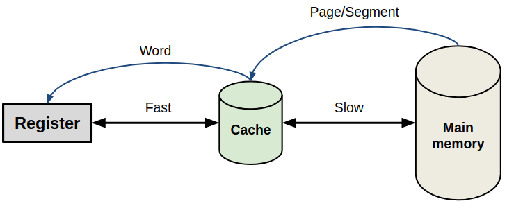
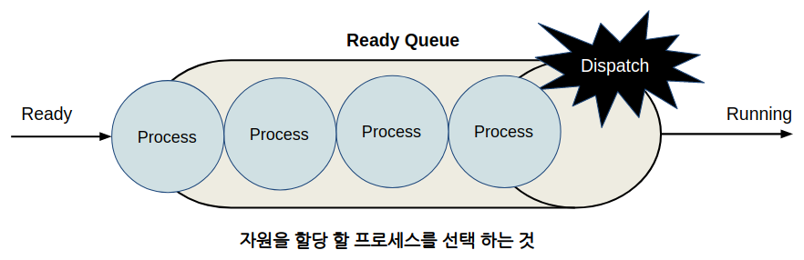
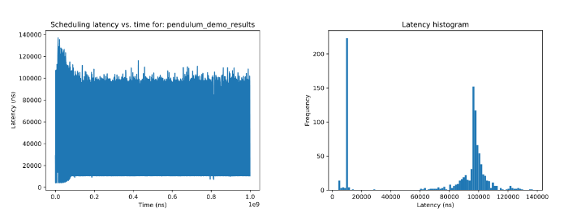

# Chapter 50: Real-time
## 01. Real-time 의 정의
- ROS 2 에서의 실시간(Real-time) 시스템에 대해 알아보기 전에 먼저 실시간 시스템에 대한 정의를 알아보자.

> - Real-time (control) system means that the (control) system must provide the (control) responses or actions to the stimulus or requests within specific times, which therefore depend not just on what the system does but also on how fast it reacts.
> - Zhang, P. (2008). Industrial control technology: a handbook for engineers and researchers. William Andrew.

- 이를 좀더 간략히 요약하면 정해진 시간 안에 (Deadline) 입력에 대한 정확한 출력이 보장하는 (Determinism) 시스템 을 실시간 시스템이라고 정의할 수 있다.
- 실시간 시스템은 그 정도에 따라 Hard real-time system, Firm real-time system, Soft real-time system 으로 나눌 수 있다.
- Hard real-time system 은 매우 엄격한 데드라인을 가지고 있어서, 만약 한번이라도 데드라인 이내에 입력에 대한 정확한 출력을 받아볼 수 없다면 매우 큰 위험을 초래할 수 있는 시스템을 말한다.
- 예를 들면, 항공 센서, 자율 조종 시스템, 우주선, 핵 융합 발전소 등이 있다.
- Firm real-time system 은 입력에 대한 출력이 정해진 데드라인 이내에 보장되어야 하지만, 만약 그렇지 않더라도 그 동작에 큰 문제가 없는 시스템을 말한다.
- 예를 들면, 화상 회의, 금융 예보 시스템, 자동 조립 라인 등이 있다.
- Soft real-time system 은 데드라인이 명확하지 않고, 데드라인 이후에 출력을 받아 보더라도 그 동작에 큰 문제가 없는 시스템을 말한다.
- 예를 들면, 웹 브라우징, 티켓 예매 등이 있겠다.

## 02. Real-time 에 대한 배경 지식
- 앞서 알아본 실시간 시스템을 위한 프로그램을 개발할 때 필요한 지식과 몇가지 개념을 알아보자.

### 2-1. Real-time programming
- 일반적으로 실시간 프로그래밍은 아래와 같은 패턴을 가진다.
```cpp
init() // non real-time safe
{
  // Allocate memory
  memory.new();
  
  // Start threads
  threads.start();
}

thread() // real-time safe
{
  // Loop
  while (...)
}
  
shutdown() // non real-time safe
{
  // End threads
  threads.end();

  // Deallocate memory
  memory.delete();
}
```
- 첫번째 파트는 실시간을 보장하지 않는 부분으로 필요한 메모리를 할당하고, 스레드를 시작시킨다.
- 두번째 파트는 실시간을 보장하는 부분으로 실시간성이 필요한 연산에 대한 코드가 포함된다. 
- 세번째 파트는 실시간을 보장하지 않는 부분으로 할당된 메모리를 반납한다.

### 2-2. Page faults
- 프로그램이 실행될 때 CPU는 연산에 필요한 자원의 위치를 파악하고 해당 자원을 메인 메모리로부터 복사하여 캐시를 통해 레지스터로 할당한다.
- 레지스터와 캐시는 하드웨어가 관리하는 메모리로 그 속도가 매우 빠르지만 그 크기가 작다.
- 하지만 메인 메모리는 소프트웨어가 관리하는 자원으로 속도가 느리지만 크기가 크다.



- 이와 같은 메모리의 특징 때문에 운영체제는 자원의 지역성을 이용하여 메인 메모리로 부터 프로세서가 다음에 접근할 것 같은 자원들을 캐시로 복사하여 캐시히트(Cache hit)를 더 자주 일어나게 만들려고 한다.
- 하지만 만약 프로세서가 필요로하는 자원이 캐시에 없게되면 결국 메인 메모리에 접근하여 다른 자원을 복사해야만 하는데 이를 페이지 폴트(Page faults)라고 한다.
- 연속적인 페이지 폴트는 메모리 복사로 인한 시간 지연을 초래하고, 이는 실시간성을 깨뜨리는 중요한 요소가 된다.
- 페이지 폴트는 아래와 같은 방법을 사용하여 최소화할 수 있다.
    1. mlockall function : 가상 메모리 주소를 RAM에 미리 할당하는 mlockall 함수 사용
    2. Dynamic memory pool : 가상 메모리 크기를 고정된 사이즈로 할당하고, 프로세스 런타임시 해당 메모리를 반납하지 않도록 함
    3. Custom real-time safe memory allocators : 기존의 메모리 할당자는 실시간성을 가지기에 어렵기에 사용자가 개발한 메모리 할당자를 사용하도록 함
    4. Global variables and (static) arrays : 프로세스 시작시에 전역 변수나 정적 배열을 통해 미리 메모리 공간을 할당하도록 함
    5. Cache friendliness for pointer and vtable accesses : 가상 메모리를 사용함에 따른 오버헤드를 줄이기 위한 포인터를 사용하도록 함

### 2-3. Process scheduling
- 현대 운영체제는 여러 프로세스에 대한 효율적인 자원 할당을 통해 멀티 프로그래밍을 지원한다. 프로세스 스케쥴링은 메모리를 할당받은 준비 상태의 프로세스가 레디큐에 있을 때 어떤 순서로 이를 프로세서에 할당(Dispatch)하여 동작 상태로 변경할 것인가를 이야기한다.



- 스케쥴링 정책은 크게 선점여부와 우선순위로 나뉜다.
- 선점 스케줄링(Preemptive scheduling)은 현재 실행중인 프로세스를 인터럽트 하여 다른 프로세스에 자원을 할당 시킨다.
- 비선점 스케줄링(Non-preemptive scheduling)은 프로세스가 자원을 할당 받았을 때 다른 프로세스가 해당 자원을 빼앗을 수 없다.
- 우선순위는 우선순위의 변화 여부에 따라 정적 우선순위(Static priority)와 동적 우선순위(Dynamic priority)로 나뉘어 진다.
- 만약 실시간성을 가져야 하는 프로세스가 자원을 빼앗길 수 있거나 우선순위가 낮게 설정 된다면 설정된 데드라인 안쪽으로 출력을 만들어내지 못할 것이다.
- 따라서 RT_PREEMPT와 같은 커널 패치를 통해 개발자가 프로세스 스케쥴링에 임의로 개입할 수 있도록 하고, 프로세스의 우선순위를 높게 설정하여 실시간성을 가질 수 있도록 해야한다.

### 2-4. Performance benchmarking
- 개발된 프로그램이 실시간성을 가지는지 그렇지 않은지를 판단하기 위해서는 페이지 폴트와 스케쥴링 지터(Scheduling jitter)를 확인하고 이를 개선해나가야 할 것이다.
- 이를 위해 프로그램에 printf와 같은 로그함수를 사용하는 것은 오히려 실시간성을 깨뜨리는 요인이 된다.

#### (1) cyclictest
- 실시간 환경의 스케쥴링 지터를 측정하기 위한 리눅스 명령어이다.
- 스레드의 갯수와 우선순위, 스케쥴러 타입을 설정하여 레이턴시와 지터가 얼마나 되는지 확인할 수 있다.

#### (2) rttest
- ROS 2 에서 지원하는 라이브러리로 사용자 코드에서 발생하는 스케쥴링 지터를 저장하여 알려준다.

#### (3) getrusage
- 페이지 폴트, 메모리 스왑, I/O 블락 등 실시간성을 나타내는 지표에 대한 통계를 반환해준다.
---

- 이와 같은 기능들을 이용하여 개발자는 본인의 프로그램의 실시간성을 확인할 수 있다.

## 03. ROS 2 Real-time
- 실시간성은 ROS 2의 특정 기능을 사용한다고 얻어질 수 있는 것이 아니다.
- 실시간성은 개발자의 컴퓨터 공학적 지식의 수준과 하드웨어 개발 환경에 더 밀접하게 관련되어 있고, ROS 2는 이를 보조하는 역할을 하게될 것이라고 생각한다.
- ROS 2 는 rcl과 rmw에 별도의 추상화 라이브러리를 이용하여 사용자 정의 메모리 할당자를 설정할 수 있도록 되어있다.
- 이를 통해 개발자는 페이지 폴트를 최소화 하기 위한 여러가지 전략을 구상할 수 있을 것이다.

## 04. 데모 코드
- ROS 2 를 이용한 실시간 프로그래밍 데모는 pendulum_control 패키지을 통해 확인할 수 있다.
- 해당 데모는 ROS 2 Foxy 버전을 소스빌드하여 설치한 후 진행해야만 하고, 실시간성을 위한 커널은 설치하지 않았다.
- 해당 데모가 실시간성을 가지기 위해서는 최소 8Gb RAM 저장 공간을 필요로 하며 이상적으로는 rttest 결과 페이지 폴트가 단 한번도 없어야하고, 평균 지연이 30,000ns 이하 여야만 한다.
- ROS 2 설치가 끝났다면 아래 명령어로 pendulum_demo를 실행시켜 보자.
- 데모 실행 직후 나오는 로그를 보면 스케쥴링 우선순위와 메모리 할당 부분에서 에러가 발생하는 것을 확인할 수 있다.
```
$ . ~/ros2_foxy/install/local_setup.bash
$ cd ~/ros2_foxy/install/pendulum_control/bin
$ ./pendulum_demo > output.txt
Couldn't set scheduling priority and policy: Operation not permitted
mlockall failed: Cannot allocate memory
Couldn't lock all cached virtual memory.
Pagefaults from reading pages not yet mapped into RAM will be recorded.
No results filename given, not writing results
```
- output.txt 에 저장된 로그를 확인해 보면 rttest 결과 페이지 폴트가 한번 있었음을 확인할 수 있다.
```
$ cat output.txt 
Initial major pagefaults: 172
Initial minor pagefaults: 4115
rttest statistics:
  - Minor pagefaults: 1
  - Major pagefaults: 0
  Latency (time after deadline was missed):
    - Min: 56179 ns
    - Max: 170799 ns
    - Mean: 129188.509000 ns
    - Standard deviation: 40351.343055


PendulumMotor received 498 messages
PendulumController received 946 messages
```
- 페이지 폴트 횟수를 줄이기 위해서는 RAM 에 저장할 수 있는 메모리 크기에 대한 제한을 풀어줘야만 한다.
- 관리자 권한으로 /etc/security/limits.conf 파일 가장 아랫줄에 memlock 옵션(${username} - memlock -1)을 추가해주고, 재부팅 이후 아래 명령어도 함께 터미널창에 입력한다.
```
$ ulimit -l unlimited
```
- 이후 다시한번 컴퓨터를 재실행하고 데모코드를 실행하면 앞서 볼 수 있었던 에러 메시지가 출력되지 않는다.
- output.txt 에 저장된 로그를 열어보면 rttest 결과 에서 페이지 폴트가 완전히 없어진 것도 확인할 수 있다.
```
$ cat output.txt 
Initial major pagefaults: 0
Initial minor pagefaults: 2124268
rttest statistics:
  - Minor pagefaults: 0
  - Major pagefaults: 0
  Latency (time after deadline was missed):
    - Min: 53620 ns
    - Max: 177322 ns
    - Mean: 146186.291000 ns
    - Standard deviation: 17348.023064


PendulumMotor received 519 messages
PendulumController received 958 messages
```
- 다음은 logger 노드를 이용해서 pendulum_demo 의 런타임 로그를 확인해보자.
- 새로운 터미널 창을 열어 아래 명령어로 logger 노드를 먼저 실행시키고 다른 터미널 창을 열어서 pendulum demo를 실행시켜보자.
- 그러면 logger 노드를 실행시킨 터미널 창에서 로그가 출력되는 것을 확인할 수 있다.
```
# Terminal 1
$ . ~/ros2_foxy/install/local_setup.bash
$ cd ~/ros2_foxy/install/pendulum_control/bin
$ ./pendulum_logger
# ... 내용 생략 ...
Commanded motor angle: 1.570796
Actual motor angle: 1.541950
Current latency: 99387 ns
Mean latency: 105697.995992 ns
Min latency: 53414 ns
Max latency: 170257 ns
Minor pagefaults during execution: 0
Major pagefaults during execution: 0

# Terminal 2
$ . ~/ros2_foxy/install/local_setup.bash
$ cd ~/ros2_foxy/install/pendulum_control/bin
$ ./pendulum_demo > output.txt
```
- pendulum_demo 노드를 종료한 다음 output.txt 에 저장된 실시간성에 대한 결과를 확인해보자.
```
$ cat output.txt
Initial major pagefaults: 16
Initial minor pagefaults: 2124638
rttest statistics:
  - Minor pagefaults: 0
  - Major pagefaults: 0
  Latency (time after deadline was missed):
    - Min: 53414 ns
    - Max: 170257 ns
    - Mean: 105750.270000 ns
    - Standard deviation: 33639.231572


PendulumMotor received 553 messages
PendulumController received 967 messages
```
- 페이지 폴트는 나타나지 않지만, 최소 레이턴시와 최대 레이턴시가 크게 차이나는 모습을 확인할 수 있다.
- 이는 커널 수정 없이 데모 코드를 실행하여서 나타나는 결과로 리눅스 스케쥴러의 프로세스 스케쥴링으로 인한 딜레이가 주 원인이다.
- 이를 해결하기 위해 관리자 권한으로 /etc/security/limits.conf 파일 가장 아랫줄에 우선순위 옵션 (${username} - rtprio 98)을 추가하여 특정 유저가 실행하는 프로세스의 우선순위를 수정해주고 재부팅하자.
- 우선순위는 0-99까지 설정 가능하지만 가장 높은 우선순위는 중요한 시스템 프로세스가 가지고 있기 때문에 그보다 하나 낮은 98 로 설정하였다.
- 변경된 우선순위로 인한 실시간성의 변화를 쉽게 확인하기 위해 그래프를 그려보도록 하자.
- pendulum_demo 에 -f 매개변수를 추가하고, rttest 결과값을 담을 폴더명을 실행인자로 설정한다.
- pendulum_demo_results 폴더에 담긴 데이터는 rttest_plot 프로그램을 이용하여 그래프[그림3 참조]로 나타낼 수 있다.
```
$ . ~/ros2_foxy/install/local_setup.bash
$ cd ~/ros2_foxy/install/pendulum_control/bin
$ ./pendulum_demo -f pendulum_demo_results
$ rttest_plot pendulum_demo_results
```



- ROS 2 에서 공식 지원하는 데모코드 이외에도 커뮤니티에서 지원하는 Inverted pendulum demo도 있다.
- 위 데모는 실시간성을 위한 커널(RT_PREEMPT) 설치 등과 같은 추가 사항이 포함되어 있으니 ROS 2 실시간 프로그래밍에 더 많은 관심을 가진 독자들은 이를 참고하기 바란다.

## 05. 맺음말
- 로봇을 개발함에 있어 실시간성은 중요한 요소 중에 하나이다.
- 자율주행자동차, 배달로봇, 물류로봇, 농사용 로봇, 드론 등은 센서 피드백을 통해 들어온 입력이 정해진 시간 안에 정확한 출력으로 계산되어야만 크고 작은 사고를 방지하고 보다 높은 효율을 얻을 수 있다.
- 하지만 실시간성은 ROS 2 만을 이용해서 얻을 수 있는 성능이 아니다.
- 프로그램이 실시간성을 가지기 위해서는 개발자가 개발하는 시스템에서 실시간성이 필요한 부분을 명확히 캐치하고, 해당 부분의 메모리 관리와 프로세스의 스케쥴링 등을 고려할 수 있어야 할 것이다.
- ROS 2 커뮤니티에서는 실시간성에 대한 논의가 계속해서 이어져 오고 있다.
- 이번 강좌를 통해 ROS 2 커뮤니티에서 이루어지는 실시간 프로그래밍 지원에 대한 관심과 이해가 높아졌기를 기대해 본다.

[출처] 050 Real-time (오픈소스 소프트웨어 & 하드웨어: 로봇 기술 공유 카페 (오로카)) | 작성자 Routiful
