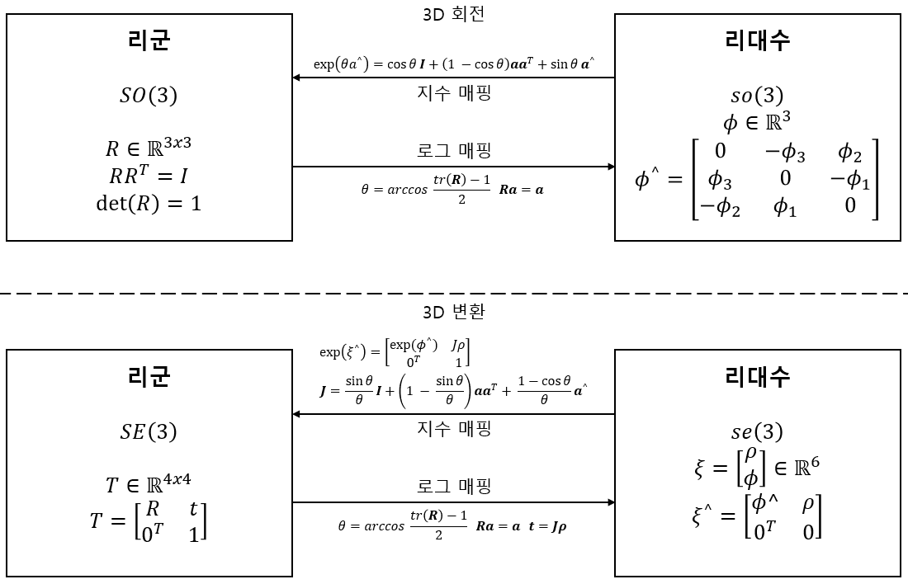

# Chapter 04: 리 군과 리 대수
## 01. 리 군과 리 대수의 기초
3차원 회전 행렬이 특수 직교 군 $SO(3)$ 를 구성하고, 변환 행렬이 특수 유클리드 군 $SE(3)$ 을 구성한다.

```math
SO(3) = \{ R \in \mathbb{R}^{3 \times 3} | RR^T = I, \det(R) = 1 \}
```
```math
SE(3) = \left\{T = \begin{bmatrix} R & t \\
0^T & 1 \end{bmatrix} \in \mathbb{R}^{4 \times 4} | R \in SO(3), t \in \mathbb{R}^3 \right\}
```

회전 행렬과 변환 행렬 둘 다 덧셈 연산에 닫혀 있지 않다. 즉, 두 개의 회전 병렬 $R_1, R_2$ 의 경우 두 행렬을 더해서 얻어진 행렬은 정의에 따라 더 이상 회전 행렬이 아니다.

```math
R_1 + R_2 \notin SO(3), \ T_1 + T_2 \notin SE(3)
```

또한 두 행렬에 잘 정의된 덧셈 연산자가 없거나 일반적인 행렬 덧셈 연산은 두 집합에 닫혀 있지 않다. 곱셈 연산은 두 집합에서 유일하게 닫힌 연산이다.

```math
R_1R_2 \in SO(3), \ T_1T_2 \in SE(3)
```

행렬 곱셈이 회전 또는 변환의 복합에 해당한다는 것을 알고 있으며, 두 회전 행렬을 곱하면 두 번 회전이 수행된다. 잘 정의된 연산이 하나만 있는 집합의 경우 이를 군 또는 그룹이라고 한다.

### 1-1. 군 (그룹)
군 (그룹, Group) 은 집합과 연산의 대수 구조이다. 집합을 $A$ 로, 연산을 $\cdot$ 로 표시하면 군을 $G = (A, \cdot)$ 로 기록할 수 있다. 이는 아래의 조건을 충족해야 한다.

1. 닫힘: $\forall a_1, a_2 \in A, a_1 \cdot a_2 \in A$

2. 결합법칙: $\forall a_1, a_2, a_3 \in A, (a_1 \cdot a_2) \cdot a_3 = a_1 \cdot (a_2 \cdot a_3)$

3. 항등원: $\exists a_0 \in A, s.t. \forall a \in A, a_0 \cdot a = a \cdot a_0 = a$

4. 역원: $\forall a \in A, \exists a^{-1} \in A, s.t. a \cdot a^{-1} = a_0$

회전 행렬 집합과 행렬 곱셈이 군을 구성하고 변환 행렬과 행렬 곱셈이 군을 구성한다는 것을 확인할 수 있다. 다른 일반적인 군에는 정수의 합 $(\mathbb{Z}, +), 0$ 을 제거한 후의 유리수의 곱 $(\mathbb{Q}  0, \cdot)$ 등이 포함된다.

행렬에서 흔히 볼 수 있는 군은 아래와 같다.

- 일반 선열 군 $GL(n)$: 행렬 곱 연산을 사용하는 $n \times n$ 의 가역 행렬

- 특수 직교 군 $SO(n)$: 또는 $SO(2)$ 및 $SO(3)$ 가 가장 일반적인 회전 행렬 군

- 특수 유클리드 군 $SE(n)$: 또는 $SE(2)$ 및 $SE(3)$ 와 같이 앞서 언급한 $n$ 차원 유클리드 변환

군 구조는 군의 연산에 매우 우수한 속성을 갖도록 보장하며 군 이론은 군의 다양한 구조와 특성을 연구하는 이론이다. 리 군은 연속적인 속성을 가진 군을 말한다. 정수 군 $\mathbb{Z}$ 와 같이 이산 군은 연속 속성이 없으므로 리 군에 속하지 않는다. 우리가 강체가 공간에서 지속해 움직일 수 있다고 직관적으로 상상할 수 있으므로 모두 리 군이라고 할 수 있다.

### 1-2. 리 대수의 소개
임의의 회전 행렬 $R$ 을 고려할 때 아래 조건을 충족한다.

```math
RR^T = I
```

여기서 $R$은 카메라의 회전이며, 시간이 지남에 따라 지속해 변경된다. 즉 시간이 함수는 $R(t)$ 이고, 여전히 회전 행렬이기 때문에, 아래의 식으로 쓸 수 있다.

```math
R(t)R(t)^T = I
```

방정식의 양쪽을 시간으로 미분하면 아래 방정식을 얻는다.

```math
\dot{R}(t)R(t)^T + R(t)\dot{R}(t)^T = 0
```

두번째 항을 오른쪽으로 이항하고, 전치 관계를 사용하여 행렬을 교환하여 정리하면 아래와 같다.

```math
\dot{R}(t)R(t)^T = - \left(R(t)\dot{R}(t)^T \right)^T
```

$R(t)\dot{R}(t)^T$ 는 skew-symmetric 행렬이다. 임의의 skew-symmetric 행렬에 해당하는 고유한 벡터를 찾을 수 있다. 이 연산을 기호 $\lor$ 로 표시한다.

```math
a^{\land} = A = \begin{bmatrix}0 & -a_3 & a_2 \\
a_3 & 0 & -a_1 \\
-a_2 & a_1 & 0 \end{bmatrix}, A^{\lor} = a
```

따라서 $R(t)\dot{R}(t)^T$ 는 skew-symmetric 행렬이므로 $\phi(t) \in \mathbb{R}^3$ 에 해당하는 3차원 벡터를 찾을 수 있따.

```math
R(t)\dot{R}(t)^T = \phi(t)^{\land}
```

식의 양쪽에 $R(t)$ 를 곱하면 $R$ 이 직교 향렬이기 때문에 아래와 같은 식이 가능하다.

```math
\dot{R}(t) = \phi(t)^{\land}R(t) = \begin{bmatrix}0  & -\phi_3 & \phi_2 \\
\phi_3 & 0 & -\phi_1 \\
-\phi_2 & \phi_1 & 0 \end{bmatrix} R(t)
```

회전 행렬의 미분을 구하려면 왼쪽에 $\phi(t)^{\land}$ 행렬을 곱하면 된다. $t_0 = 0$ 을 고려할 때 회전 행렬 $R(0) = I$ 로 설정한다. 미분 정의에 따라 $R(t)$ 을 $t = t_0$ 근처에서 1차 태일러 확장으로 수행할 수 있다.

```math
R(t) \approx R(t_0) + \dot{R}(t_0)(t - t_0) \\
= I + \phi(t_0)^{\land}(t)
```

우리는 $\phi$ 가 $R$ 의 미분 특성을 반영한다는 것을 알 수 있으므로, $SO(3)$ 원접 근처의 탄젠트 공간에 있다고 한다.

```math
\dot{R}(t) = \phi(t_0)^{\land}R(t) = \phi^{\land}_0R(t)
```

위의 방정식은 $R$ 에 대한 미분 방정식이며, 초깃값은 $R(0) = I$ 이므로 이 방정식에 대한 해는 아래와 같다.

```math
(\phi(t_0) = \phi_0) \\
R(t) = \exp(\phi^{\land}_0 t)
```

위의 식이 미분 방정식과 초깃값 모두에 대해 성립함을 확인할 수 있다. 즉, $t = 0$ 근처에서 회전 행렬은 $\exp(\phi^{\land}_0 t)$ 에 의해 계산될 수 있다. 회전 행렬 $R$은 지수 관계를 통해 행렬 $\phi^{\land}_0$ 라는 또 다른 skew-symmetric 행렬과 연관되어 있음을 알 수 있다. 그러나 행렬의 지수는 무엇인가

1. 특정 순간에 $R$ 이 주어지면 우리는 지역 미분 관계에서 $R$ 을 설명하는 $\phi$ 를 얻을 수 있다. $R$ 에 해당하는 $\phi$ 는 무엇을 의미할까? 우리는 $\phi$ 를 $SO(3)$ 에 해당하는 리 대수 $so(3)$ 라고 한다.

2. 벡터 $\phi$ 가 주어졌을 때 행렬 지수 $\exp(\phi^{\land}_0)$ 는 어떻게 계산될까? 반대로 $R$ 이 주어지면 $\phi$ 를 계산하는 반대 연산이 있을까? 이는 리 군과 리 대수 사이의 지수/로그 매핑이다.

### 1-3. 리 대수의 정의
각 리 군에는 그에 상응하는 리 대수가 있다. 리 대수는 리 군 원점 근처의 지역적 특성을 설명하며, 다른 말로는 탄젠트 공간이라고 한다. 일반적인 리 대수는 아래와 같이 정의된다.

> 리 대수는 집합 $\mathbb{V}$ , 스칼라 필드 $\mathbb{F}$ 와 이진 연산 $[,]$ 으로 구성된다. 다음 특성을 충족하는 경우 ($\mathbb{V}$ , $\mathbb{F}$ , $[,]$ )는 $\mathfrak{g}$ 로 표현되는 리 대수가 된다.
>
> 1. 폐쇄성: $\forall X, Y \in \mathbb{V}, [X, Y] \in \mathbb{V}$
>
> 2. 쌍선성: $\forall X, Y, Z \in \mathbb{V}, a, b, \in \mathbb{F}$
> 
>     $[aX + bY, Z] = a[X, Z] + b[Y, Z], [Z, aX + bY] = a[Z, X] + b[Z, Y]$
>
> 3. 자기 반발성: $\forall X \in \mathbb{V}, [X, X] = 0$
>
> 4. Jacobian 등가: $\forall X, Y, Z \in \mathbb{V}, [X, [Y, Z]] + [Z, [X, Y]] + [Y, [Z, X]] = 0$

이진 연산 $[,]$ 는 리 괄호라고 한다. 겉으로 보기에 리 괄호는 많은 속성을 필요로 한다. 군의 간단한 이진 연산에 비해 리 괄호는 두 요소 간의 차이를 나타낸다. 이는 결합법칙을 요구하지 않지만 대신 괄호 다음에 요소와 자신이 0이 되기를 요구한다.

### 1-4. 리 대수 $so(3)$
$\phi$ 는 리 대수이다. $SO(3)$ 에 해당하는 리 대수는 $\mathbb{R}^3$ 에 정의된 벡터이며, $\phi$ 의 이전 추론에 따르면 각 $\phi$ 의 skew-symmetric 행렬을 생성할 수 있다.

```math
\Phi = \phi^{\land} = \begin{bmatrix}0  & -\phi_3 & \phi_2 \\
\phi_3 & 0 & -\phi_1 \\
-\phi_2 & \phi_1 & 0 \end{bmatrix} \in \mathbb{R}^{3 \times 3}
```

이 정의에서 두 벡터 $\phi_1$ , $\phi_2$ 의 리 괄호는 아래와 같다.

```math
[\phi_1, \phi_2] = (\Phi_1 \Phi_2 - \Phi_2 \Phi_1)^\lor
```

벡터 $\phi$ 는 skew-symmetric 행렬에 일대일로 대응하기 때문에 $so(3)$ 의 요소는 3차원 벡터 또는 3차워 skew-symmetric 행렬이라고 모호성 없이 말할 수 있다.

```math
so(3) = \left\{ \phi \in \mathbb{R}^3, \Phi = \phi^{\land} \in \mathbb{R}^{3 \times 3} \right\}
```

$so(3)$의 의미를 명확히 해야한다. 이는 회전 행렬의 미분을 표현하는데 사용할 수 있는 3차원 벡터 또는 skew-symmetric 행렬의 모음이다. $SO(3)$ 와의 관계는 위에서 보았듯, 아래와 같은 지수 매핑에 의해 제공된다.

```math
R = \exp(\phi^{\land})
```

### 1-5. 리 대수 $se(3)$
$SE(3)$ 의 경우 또한 대응하는 리 대수 $se(3)$ 가 있다. $so(3)$ 와 마찬가지로 $se(3)$ 는 $\mathbb{R}^6$ 공간에 있다.

```math
se(3) = \left\{ \xi = \begin{bmatrix} \rho \\ \phi \end{bmatrix} \in \mathbb{R}^6, \rho \in \mathbb{R}^3, \phi \in so(3), \xi^{\land} = \begin{bmatrix} \phi^{\land} & \rho \\ 0^T & 0 \end{bmatrix} \in \mathbb{R}^{4 \times 4} \right\}
```

각 $se(3)$ 요소를 6차원 벡터 $\xi$ 로 표현한다. 처음 3개의 요소는 $\rho$ 로 표현되는 병진을 위한 것이며, 다음 3개 요소는 $\phi$ 로 표현되는 회전을 위한 것인데, 기본적으로 $so(3)$ 요소이다. $se(3)$ 에서는 $\land$ 기호를 사용하여 6차원 벡터를 4차원 행렬로 변환하며, 더 이상skew-symmetric 행렬만을 의미하지 않는다.

```math
\xi^{\land} = \begin{bmatrix} \phi^{\land} & \rho \\ 0^T & 0 \end{bmatrix} \in \mathbb{R}^{4 \times 4}
```

여전히 $\land$ 와 $\lor$ 기호를 사용하여 `벡터에서 행렬로` 와 `행렬에서 벡터로` 간의 관계를 표현하여 $so(3)$ 와의 일관성을 유지한다. 또한 이는 여전히 일대일 대응이다. 리 대수 $se(3)$ 에도 $so(3)$ 와 유사한 리 괄호가 있다.

```math
[\xi_1, \xi_2] = (\xi^{\land}_1 \xi^{\land}_2 - \xi^{\land}_2 \xi^{\land}_1)^{\lor}
```

## 02. 지수와 로그 매핑
### 2-1. $SO(3)$의 지수 매핑
$\exp(\phi^{\land})$ 룰 계산하는 방법을 알아본다. 이는 다른 말로 지수 매핑이라고 한다. 먼저 $so(3)$ 의 지수 매핑을 알아본다.

임의의 행렬 지수는 수렴된 경우, 테일러 급수를 사용해 확장하여 작성할 수 있으며, 그 결과도 여전히 행렬이고 아래와 같이 쓸 수 있다.

```math
\exp(A) = \sum_{n=0}^\infin \frac {1} {n!} A^n
```

$so(3)$ 의 모든 요소에 대해 $\phi$ 는 이러한 방식으로 지수 매핑을 정의할 수 있다.

```math
\exp(\phi^{\land}) = \sum_{n=0}^\infin \frac {1} {n!} (\phi^{\land})^n
```

아래는 지수 매핑을 계산하는 쉬운 방법이다. $\phi$ 가 3차원 벡터이므로 길이와 방향을 각각 $\theta$ 와 $n$ 으로 표현한다면 $\phi = \theta n$ 이다. $n$ 은 길이가 1인 단위 방향 벡터이다. 이와 같은 단위 방향 벡터 $n$ 에 대해 다음의 두가지 특성이 있다.

```math
a^{\land}a^{\land} = \begin{bmatrix} -a_2^2 - a_3^2 & a_1a_2 & a_1 a_3 \\ a_1 a_2 & -a_1^2 - a_3^2 & a_2 a_3 \\ a_1 a_3 & a_2 a_3 & -a_1^2 - a_2^2 \end{bmatrix} = aa^T - I
```

```math
a^{\land}a^{\land}a^{\land} = a^{\land}(aa^T - I) = -a^{\land}
```

이 두 식은  $n^{\land}$ 고차 항을 처리하는 방법을 제공하며 이를 이용해 지수 매핑을 아래와 같이 작성할 수 있다.

```math
\exp(\theta a^{\land}) = \cos \theta I + (1 - \cos \theta) a a^T + \sin \theta a^{\land}
```

이는 Chapter 03의 로드리게스 식과 같은 식이다. 이는 $so(3)$ 가 실제로 회전 벡터이며 지수 매핑은 로드리게스 수식임을 나타낸다. 이를 통해 $so(3)$ 의 모든 벡터를 $SO(3)$ 의 회전 행렬에 매핑할 수 있다. 반대로 로그 매핑의 경우 $SO(3)$ 의 요소를 $so(3)$ 에 매핑할 수도 있다.

```math
\phi = \ln(R)^{\lor} = \left( \sum_{n=0}^\infin \frac {(-1)^n} {n+1} (R - I)^{n+1} \right)^{\lor}
```

지수 매핑과 마찬가지로 로그 매핑으로 확정하려면 테일러 급수를 사용해야 한다.

지수 매핑을 계산하는 방법을 알아보자. 지수 매핑은 injective가 아닌 surjective일 뿐이다. 즉, 각 $SO(3)$ 의 요소는 이에 해당하는 $so(3)$ 요소를 찾을 수 있다는 의미이다. 하지만 동일한 $SO(3)$ 에 해당하는 여러 $so(3)$ 의 요소가 있을 수 있다. 회전 각도 $\theta$ 의 경우 360' 회전이 회전하지 않는 것과 동일하다. 그러나 회전 각도를 $\pm \pi$ 사이로 고정하면 리 군과 리 대수 요소는 일대일 대응이다.

### 2-2. $SE(3)$ 의 지수 매핑
$se(3)$ 의 지수 매핑은 아래와 같다.

```math
\exp(\xi^{\land}) = \begin{bmatrix} \sum_{n=0}^\infin \frac {1} {n!} (\phi^{\land})^n & \sum_{n=0}^\infin \frac {1} {(n+1)!} (\phi^{\land})^n \rho \\ 0^T & 1 \end{bmatrix} \\
\triangleq \begin{bmatrix} R & J\rho \\ 0^T & 1 \end{bmatrix} = T
```

$so(3)$ 에서와 같이 $\exp$ 를 테일러 급수로 추론할 수 있으며, $\phi = \theta a$ 라고 하면 여기서 $a$ 는 단위 벡터이고 아래와 같다.

```math
\sum_{n=0}^\infin \frac {1} {(n+1)!} (\phi^{\land})^n \\
= \frac {\sin\theta} {\theta} I + \left(1 - \frac {\sin\theta} {\theta} \right) a a^T + \frac {1-\cos\theta} {\theta} a^{\land} \\
\overset{\underset{\mathrm{def}}{}}{=}- J
```

$\xi$의 지수 매핑의 왼쪽 상단에 있는 $R$ 은 $so(3)$ 의 회전 부분 $\phi$ 에 해당하는 $SO(3)$ 의 요소로 알려져 있고, 오른쪽 상단의 $J$ 는 위의 추론에 의해 제공된다.

```math
J = \frac {\sin\theta} {\theta} I + \left(1 - \frac {\sin\theta} {\theta} \right) a a^T + \frac {1-\cos\theta} {\theta} a^{\land}
```

이 식은 로드리게스 공식과 유사하지만 동일하지는 않다. 지수에 매핑된 후 병진 부분이 선형 Jacobian 행렬 $J$ 에 곱해지는 것을 볼 수 있다.



로그 매핑을 분석적으로 유도할 수 있지만 변환 행렬 $T$ 에 따라 $so(3)$ 에 해당하는 벡터를 찾는 것이 더 효율적이다. 왼쪽 상단 $R$ 에서 회전 벡터를 계산하고, 오른쪽 상단의 $t$ 는 아래를 충족한다.

```math
t = J\rho
```

$J$ 는 $\phi$ 로부터 얻을 수 있으므로 $\rho$ 는 선형 방정식으로 풀 수 있다.

## 03. 리 대수 유도 및 섭동 모델
### 3-1. BCH 수식 및 근사치
리 대수를 사용하는 주요 이유 중 하나는 최적화이며, 최적화 과정에서 미분은 매우 필요한 정보이다. 우리는 이미 $SO(3)$ 와 $SE(3)$ 의 리 군과 리 대수의 관계를 이해했지만, $SO(3)$ 에서 두 행렬 곱셈을 수행하면 리 대수 $so(3)$ 에서 어떤 일이 일어나는가. 반대로 $so(3)$ 에서 두 벡터를 더하면 $SO(3)$ 에서 두 행렬의 곱이 되는 것인가. 이것이 사실이라면 아래와 같이 쓸 수 있다.

```math
\exp(\phi_1^{\land})\exp(\phi_2^{\land}) = \exp((\phi_1 + \phi_2)^{\land}) ?
```

$\phi_1$, $\phi_2$ 가 스칼라인 경우에는 위 방정식은 참이다. 아지만 문제는 스칼라가 아닌 행렬의 지수 매핑을 계산하는 것이다.

```math
\ln(\exp(A) \exp(B)) = A + B ?
```

이 식은 행렬에서는 참이 아니다. 두 개의 리 대수 지수 매핑 곱의 전체 형태는 Baker-Campbell-Hausdorff 수식(BCH 수식)에 의해 주어진다. 전체 형식의 복잡성으로 인해 그 확장의 처음 몇 항목만 본다.

```math
\ln(\exp(A) \exp(B)) = A + B + \frac{1}{2}[A, B] + \frac{1}{12}[A, [A, B]] - \frac{1}{12}[B, [A, B]] + ...
```

여기서 [ ]는 리 괄호이다. BCH 수식은 두 행렬 지수의 곱을 처리하는 방법과 관계 있으며, 스칼라 형식과 비교했을 때, 리 괄호로 구성된 나머지 항목을 추가로 생성한다는 것을 볼 수 있다. 특히 $SO(3)$ 의 $\phi_1$ 과 $\phi_2$ 가 작을 때, 리 대수 $\ln(\exp(\phi_1^{land}) \exp(\phi_2^{land}))$ 을 고려하자. 미분을 취할 때 2차보다 큰 항은 무시할 수 있고, 이 때 BCH는 선형 근사 표현을 가진다.

```math
\ln(\exp(\phi_1^{land}) \exp(\phi_2^{land}))^{\lor} \approx \begin{cases} J_l(\phi_2)^{-1}\phi_1 + \phi_2 \ 이 \ 작은 \ 경우 \\
J_r(\phi_1)^{-1}\phi_2 + \phi_1 \ 이 \ 작은 \ 경우 \end{cases}
```

첫번째 근사치로 예를 들어본다. 이 방정식은 회전 행렬 $R_2$ 에 작은 회전 행렬 $R_1$ 을 곱할 때, 원래 리 대수 $\phi_2$ 에 $J_l(\phi_2)^{-1}\phi_1$을 더하는 것으로 근사화할 수 있음을 알려준다. 따라서 BCH 근사치에서 리 대수는 왼쪽 곱셈 근사치와 오른쪽 곱셈 근사치로 나뉘며, 사용할 때 왼쪽 또는 오른쪽 곱셈 근사치 모델을 사용하는지를 알고 있어야 한다.

왼쪽 곱셈을 예로 들어보자. 왼쪽 BCH 근사 Jacobian $J_l$ 은 아래의 식이다.

```math
J_l = J = \frac {\sin\theta} {\theta} I + \left(1 - \frac {\sin\theta} {\theta} \right) a a^T + \frac {1-\cos\theta} {\theta} a^{\land}
```

이것의 역은 아래와 같다.

```math
J_1^{-1} = \frac{\theta}{2}\cot\frac{\theta}{2}I + \left(1 - \frac{\theta}{2}\cot\frac{\theta}{2} \right)aa^T - \frac{\theta}{2}a^{\land}
```

$\theta$ 는 0이 아닌 경우, 오른쪽 Jacobian은 욎꼭 Jacobian에 마이너스 기호만 붙이면 된다.

```math
J_r(\phi) = J_l(-\phi)
```

BCH 근사치를 다시 말하자면, 회전 $R$ 의 경우 해당 리 대수가 $\phi$ 라고 가정한다. 왼쪽에 작은 회전을 곱하고 해당 리 대수는 $\triangle R$ 로 기록한다. 그러면 리 군에서 결과는 $\triangle R \cdot R$ 이며, 리 대수에서 BCH 근사치에 따르면 $J_l^{-1}(\phi) \triangle \phi + \phi$ 이다. 이를 결합하면 아래와 같이 쉽게 작성할 수 있다.

```math
\exp(\triangle \phi^{\land})\exp(\phi^{\land}) = \exp\left((\phi + J_l^{-1}(\phi)\triangle \phi)^{\land} \right)
```

반대로 우리가 리 대수애서 $\phi$ 와 $\triangle \phi$ 의 덧셈 연산을 수행할 경우, 리 군의 곱셈 연산을 아래와 같이 근사화할 수 있다.

```math
\exp\left((\phi + \triangle \phi)^{\land} \right) = \exp\left((J_l\triangle\phi)^{\land} \right)\exp(\phi^{\land}) = \exp(\phi^{\land})\exp((J_r\triangle\phi)^{\land})
```

마찬가지로 $SE(3)$ 의 경우 유사한 BCH 근사치가 있다.

```math
\exp(\triangle\xi^{\land})\exp(\xi^{\land}) \approx \exp\left((\mathcal{J}_l^{-1}\triangle\xi + \xi)^{\land} \right) \\
\exp(\xi^{\land})\exp(\triangle\xi^{\land}) \approx \exp\left((\mathcal{J}_r^{-1}\triangle\xi + \xi)^{\land} \right)
```

여기서 $\mathcal{J}_l$과 $\mathcal{J}_r$ 은더 복잡한 $6 \times 6$ 행렬이다.

### 3-2. $SO(3)$ 에서 리 대수 유도
회전 또는 변환은 일반적으로 SLAM 최적화 문제를 해결하는데 강력한 의미를 갖는다. 이와 관계된 리 대수 유도에 관한 문제를 보자. $SO(3)$ 의 회전 행렬 또는 $SE(3)$ 의 변환 행렬의 요소를 가지고 카메라 포즈를 추정하려 한다고 가정한다. 어느 시점에서 로봇의 포즈를 $T$ 로 설정할 수 있다. 그리고 표준 좌표의 점 $p$ 를 관찰하여 관측값 $z$ 를 생성한다. 이들의 좌표 변환 관계는 아래와 같다.

```math
z = Tp + w
```

$w$ 는 임의의 노이즈이다. 이 노이즈 때문에 실제 관측 데이터 $z$ 는 우리의 관찰 모델과 같을 수 없으며, 정확하게 $z = Tp$ 관계를 충족할 수 없다. 따라서 일반적으로 이상적인 관찰 데이터와 실제 데이터의 오류를 아래와 같이 계산한다.

```math
e = z - Tp
```

$N$ 개의 랜드마크의 관측값이 있다고 가정하면, 로봇의 자세 추정값은 전체 오류를 최소화하기 위해 최적의 $T$ 값을 찾는 것과 같다.

```math
\min_T J(T) = \sum_{i=1}^N\lVert{z_i - Tp_i} \rVert_2^2
```

이 최적화 문제를 해결하려면 변환 행렬 $T$ 에 대한 목적 함수 $J$ 의 미분을 계산해야 한다. 일반적으로 회전 또는 변환을 변수로 포함하는 어떤 포즈에 대한 함수가 있음을 명확히 하고 싶다. 더 나은 또는 최상의 추정치를 찾기 위해 이러한 회전 또는 변환을 조정해야 한다. 그러나 $SO(3)$ 및 $SE(3)$ 에는 잘 정의된 덧셈 연산이 없으므로 미분을 일반적인 형식으로 정의할 수 없다. $R$ 또는 $T$ 를 일반 행렬로 취급하면 최적화를 처리하기 위한 제약 조건을 도입해야 한다.

리 대수의 관점에서 리 대수는 벡터로 구성되어 있으므로 덧셈 연산이 가능하다. 따라서 이를 사용하여 미분 문제를 해결하는 아이디어가 있다.

1. 리 대수에 극소량을 더한다고 가정하고 목적 함수의 변화를 계산한다.

2. 리 군의 왼쪽 또는 오른쪽 곱셈에 극미한 섭동을 곱한다고 가정하고 섭동을 설명하기 위해 리 대수를 사용한다. 이후, 이 섭동에 대한 미분을 계산한다. 이를 왼쪽 및 오른쪽 섭동 모델이라고 한다.

1번 방법은 리 대수의 정규 미분 모델에 해당하고, 2번 방법은 섭동 모델에 해당한다.

### 3-3. 리 대수 미분 모델
먼저 $SO(3)$ 의 경우를 고려한다. 공간점 $p$ 를 회전하여 $Rp$ 를 얻었다고 가정한다. 회전 후 회전에 의한 점 좌표의 미분을 계산하기 위해 아래와 같이 쓴다.

```math
\frac{\partial(Rp)}{\partial R}
```

$SO(3)$ 는 덧셈 연산이 없으므로, 일반적인 미분 정의에 의해 계산될 수 없다. 따라서 일반적인 미분 모델 대신 $R$ 에 해당하는 리 대수를 $\phi$ 로 하여 계산하면 아래와 같다.

```math
\frac{\partial(\exp(\phi^{\land})p)}{\partial\phi}
```

미분 정의에 따라 아래와 같이 계산될 수 있다.

```math
\frac{\partial(\exp(\phi^{\land})p)}{\partial\phi} \\
= \lim_{\delta \to 0}\frac{\exp\left((\phi + \delta\phi)^{\land}p \right) - \exp(\phi^{\land})p}{\delta\phi} \\
= -(Rp)^{\land}J_l
```

따라서 리 대수의 덧셈 연산을 기준으로 회전한 점의 미분을 추론했다.

```math
\frac{\partial(Rp)}{\partial\phi} = (-Rp)^{\land}J_l
```

하지만 여전히 복잡한 형태의 $J_l$ 이 포함되어 있으므로 섭동 모델로 미분 계산을 더 쉽게 제공한다.

### 3-4. 섭동 모델
$R$ 에 대한 섭동 $\triangle R$ 을 수행하고 섭동에 관한 결과의 변화를 확인하는 것이다. 이 섭동은 왼쪽 또는 오른쪽에 곱할 수 있으며, 최종 결과는 약간 다를 수 있다. 왼쪽 섭동 $\triangle R$ 에 해당하는 리 대수는 $\varphi$라 하고 왼쪽 섭동을 고려해보자. $\varphi$ 에 대한 미분을 구하면 아래와 같다.

```math
\frac{\partial(Rp)}{\partial \varphi} = \lim_{\varphi\to 0}\frac{\exp(\varphi^{\land})\exp(\phi^{\land})p - \exp(\phi^{\land})p}{\varphi} \\
= \lim_{\varphi \to 0}\frac{-(Rp)^{\land}\varphi}{\varphi} \\
= -(Rp)^{\land}
```

이 미분 모델이 더 직관적인데, 이는 리 대수에 대한 직접적인 미분에 있던 Jacobian $J_l$ 의 계산이 생략되기 때문이다. 이렇게 하면 섭동 모델이 더 실용적으로 된다.

### 3-5. $SE(3)$ 에서 리 대수 유도
$SE(3)$ 에 대한 섭동 모델을 살펴보자. 공간 점 $p$ 가 $T$ 로 변환하여 $Tp$ 를 얻는다. 이제 $T$ 의 왼쪽에 섭동 $\triangle T = \exp(\delta\xi^{\land})$ 를 곱하고 섭동 항의 리 대수를 $\delta\xi = [\delta\rho, \delta\phi]^T$ 로 설정하면 아래와 같다.

```math
\frac{\partial(Tp)}{\partial\delta\xi} \\
= \lim_{\delta\xi \to 0}\frac{\exp(\delta\xi^{\land})\exp(\xi^{\land})p - \exp(\xi^{\land})p}{\delta\xi} \\
\overset{\underset{\mathrm{def}}{}}{=} (Tp)^{\odot}
```

최종 결과를 연산자 $\odot$ 으로 정의하고 이는 좌표의 공간 점을 $4 \times 6$ 행렬로 변환한다. 이 방정식은 $a, b, x, y$ 가 열벡터라고 가정하고 행렬 미분에 대한 약간 설명이 필요하며 연산자 기호에 대해 아래에는 다음과 같은 규칙이 있다.

```math
\frac{d \begin{bmatrix} a \\ b \end{bmatrix}}{d \begin{bmatrix} x \\ y \end{bmatrix}} = \left(\frac{d \begin{bmatrix}a, b \end{bmatrix}^{T}}{d \begin{bmatrix} x \\ y \end{bmatrix}} \right)^T = \begin{bmatrix}\frac{da}{dx} & \frac{db}{dx} \\ \frac{da}{dy} & \frac{db}{dy} \end{bmatrix}^T = \begin{bmatrix}\frac{da}{dx} & \frac{da}{dy} \\ \frac{db}{dx} & \frac{db}{dy} \end{bmatrix}
```

이것을 마지막 줄에 대입하면 최종 결과를 얻을 수 있다. 

## 04. 실습: Sophus
### 4-1. Sophus의 기본 사용법
실습을 통해 배운 것을 통합해본다. Eigen이 기하 모듈을 제공하지만 리 대수에 대한 지원은 제공하지 않는다. 더 나은 리 대수 라이브러리는 Strasdat(https://github.com/strasdat/Sophus) 에서 유지 관리하는 Sophus 라이브러리이다. 이는 $SO(3)$ 와 $SE(3)$ 를 지원하며 2차원 모션 및 유사 변환 $Sim(3)$ 을 포함한다. 이 책에서는 템플릿 클래스가 있는 Sophus 라이브러리를 사용한다. Sophus 자체도 `cmake` 프로젝트이다. Sophus 라이브러리는 설치 없이 컴파일하기만 하면 된다. 아래는 Sophus 라이브러리의 $SO(3)$와 $SE(3)$의 연산을 보여준다.
```cpp
// slambook/ch4/useSophus.cpp

# include <iostream>
# include <cmath>
# include <Eigen/Core>
# include <Eigen/Geometry>
# include "sophus/se3.hpp"

using namespace std;
using namespace Eigen;

/// 이 프로그램은 Sophus의 기본 사용법을 보여준다
int main(int argc, char **argv) {
  // z축을 따라 90도 회전하는 회전 행렬
  Matrix3d R = AngleAxisd(M_PI/2,Vector3d(0,0,1)).toRotationMatrix();
  // 또는 쿼터니언
  Quaterniond q(R);
  Sophus::SO3d SO3_R(R);  // Sophus::SO3d는 회전 행렬에서 직접 구성할 수 있다
  Sophus::SO3d SO3_q(q);  // 쿼터니언을 통해서도 생성 가능
  // 둘다 동등하다
  cout << "SO(3) from matrix: \n" << SO3_R.matrix() << endl;
  cout << "SO(3) from quaternion: \n" << SO3_q.matrix() << endl;
  cout << "they are equal" << endl;

  // 로그 맵을 사용하여 리 대수를 얻는다
  Vector3d so3 = SO3_R.log();
  cout << "so3 = " << so3.transpose() << endl;
  // hat은 벡터로부터 얻은 반대칭 행렬이다
  cout << "so3 hat=\n" << Sophus::SO3d::hat(so3) << endl;
  // 반대로 vee는 행렬로부터 얻은 벡터이다
  cout << "so3 hat vee= " << Sophus::SO3d::vee(Sophus::SO3d::hat(so3)).transpose() << endl;

  // 증분 섭동 모델 업데이트
  Vector3d update_so3(1e-4,0,0); // 매우 작은 양의 업데이트를 가정한다


  return 0;
}
```

데모 프로그램은 두 부분으로 나뉜다. 전반부는 $SO(3)$ 의 작업에 관해 설명하고, 후반부는 $SE(3)$ 에 관한 것이다. 지수 및 로그 매핑하는 방법 뿐 아니라 개체를 구성하고 업데이트해야 하는 양을 알고 있을 때, 리 군 요소를 업데이트하는 방법도 보여주었다. 컴파일하려면 `CMakeLists.txt`에 아래 코드를 추가해야 한다.

```txt
# Sophus를 사용하려면 find_package 명령을 사용하여 찾아야 한다.
find_package( Sophus REQUIRED )
include_directories( $ {Sophus_INCLUDE_DIRS } )

add_executable( useSophus useSophus.cp )
```

`find_package`는 cmake에서 라이브러리의 헤더 및 라이브러리 파일을 찾는 데 사용할 수 있는 명령어이다. cmake가 찾을 수 있는 경우 헤더 파일과 라이브러리 파일이 있는 디렉토리에 대한 변수가 제공된다. Sophus 라이브러리는 헤더 파일만 있고 원본 파일은 없다. 이를 바탕으로 Sophus 라이브러리를 자체 cmake 프로젝트에 도입할 수 있다.

## 05. 유사 변환 군과 그의 리 대수
단안 비전에 사용되는 유사 변환 그룹 $Sim(3)$ 과 해당 리 ㅐ수 $sim(3)$ 을 언급한다. SLAM에서 $SE(3)$ 를 사용하여 포즈를 나타내는 경우 스케일 불확실성 및 스케일 드리프트로 인해 전체 SLAM 프로세스의 스케일이 변경되지만, $SE(3)$ 에 반영되지 않는다. 따라서 단안 SLAM의 상황에서는 일반적으로 스케일 계수를 명시적으로 표현한다. 수학적으로 공간상의 점 $p$ 의 경우 유클리드 변환 대신 카메라 좌표계에서 유사 변환이 수행된다.

```math
p' = \begin{bmatrix}sR & t \\ o^T & 1 \end{bmatrix}p = sRp + t
```

유사 변환에서 스케일을 $s$ 로 표현하며, $p$의 3개 좌표 위에 작용하여 $p$ 의 배율을조정한다. $SO(3)$, $SE(3)$ 와 마찬가지로 유사 변환은 유사 변환 군 $Sim(3)$ 으로 알려진 행렬 곱셈 군이 형성된다.

```math
Sim(3) = \left\{S = \begin{bmatrix}sR & t \\ 0^T & 1 \end{bmatrix} \in \mathbb{R}^{4 \times 4} \right\}
```

마찬가지로 $Sim(3)$ 에는 해당 리 대수, 지수 매핑, 로그 매핑 등이 있다. 리 대수 $sim(3)$ 요소는 7차원 벡터 $\zeta$ 이다. 처음 6차원은 $se(3)$ 와 동일하며 마지막으로 스케일을 의미하는 $\sigma$ 하나가 더 있다.

```math
sim(3) = \left\{\zeta|\zeta = \begin{bmatrix}\rho \\ \phi \\ \sigma \end{bmatrix} \in \mathbb{R}^7, \zeta^{\land} = \begin{bmatrix} \sigma I + \phi^{\land} & \rho \\ 0^T & 0 \end{bmatrix} \in \mathbb{R}^{4 \times 4} \right\}
```

$Sim(3)$ 과 $sim(3)$ 은 여전히 지수 및 로그 매핑으로 연관되어 있다. 지수 매핑은 아래와 같다.

```math
\exp(\zeta^{\land}) = \begin{bmatrix} e^{\sigma}\exp(\phi^{\land}) & J_s\rho \\ 0^T & 1 \end{bmatrix}
```

여기서 $J_s$ 는 아래와 같다.

```math
J_s = \frac{e^{\sigma} - 1}{\sigma}I + \frac{\sigma e^{\sigma} \sin\theta + (1 - e^{\sigma}\cos\theta)\theta}{\sigma^2 + \theta^2}a^{\land} \\
+ \left(\frac{e^{\sigma} - 1}{\sigma} - \frac{(e^{\sigma}\cos\theta - 1)\sigma + (e^{\sigma}\sin\theta)\theta}{\sigma^2 + \theta^2} \right)a^{\land}a^{\land}
```

지수 매핑을 통해 리 대수와 리 군의 관계를 찾을 수 있다. 리 대수 $\zeta$ 의 경우 대응되는 리 군은 아래와 같다.

```math
s = e^{\sigma}, R = \exp(\phi^{\land}), t = J_s\rho
```

회전 부분은 $SO(3)$ 와 일치한다. 병진 부분은 $se(3)$ 에서 Jacobian $J$ 를 곱해야 하며 유사 변환된 Jacobian은 더 복잡하다. 스케일 계수의 경우 리 군의 $s$ 가 리 대수의 지수 함수 $\sigma$ 라는 것을 알 수 있다.

$Sim(3)$ 의 BCH 근사치는 $SE(3)$ 와 유사하다. $S$ 에 대한 $Sp$ 의 유사 변환 후 $S$ 의 도함수에 대해 논의할 수 있다. 마찬가지로 미분 모델과 섭동 모델이 모두 존재하지만, 섭동 모델이 더 간단하며, 추론 프로세스를 생략하고 섭동 모델의 결과를 직접 제공한다.

$Sp$ 의 왼쪽에 작은 섭동 $\exp(\zeta^{\land})$ 를 부여하고 $Sp$ 의 섭동에 대한 미분을 구한다. $Sp$ 는 4차원 동차 좌표이므로, $\zeta$ 는 $4 \times 7$ Jacobian 행렬을 갖는 7차원 벡터이다. 편의를 위해 $Sp$ 의 처음 3차원 구성 벡터 $q$ 를 기억한다면 아래와 같다.

```math
\frac{\partial Sp}{\partial\zeta} = \begin{bmatrix} I & -q^{\land} & q \\ 0^T & 0^T & 0 \end{bmatrix}
```