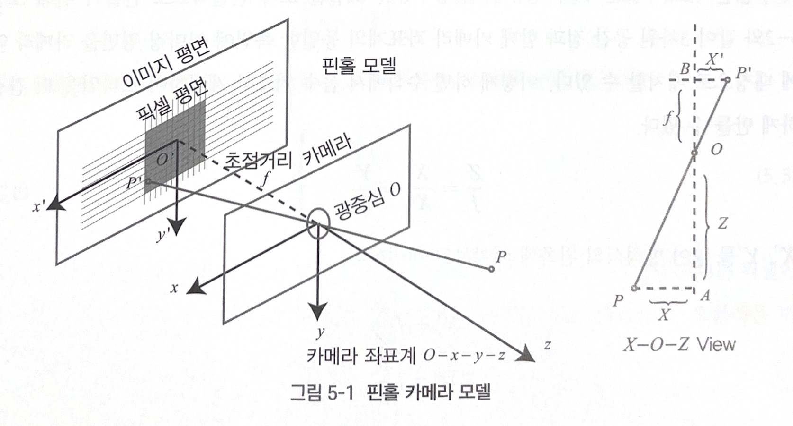
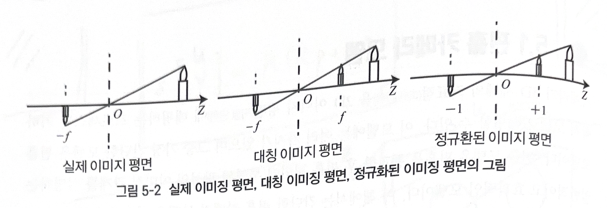
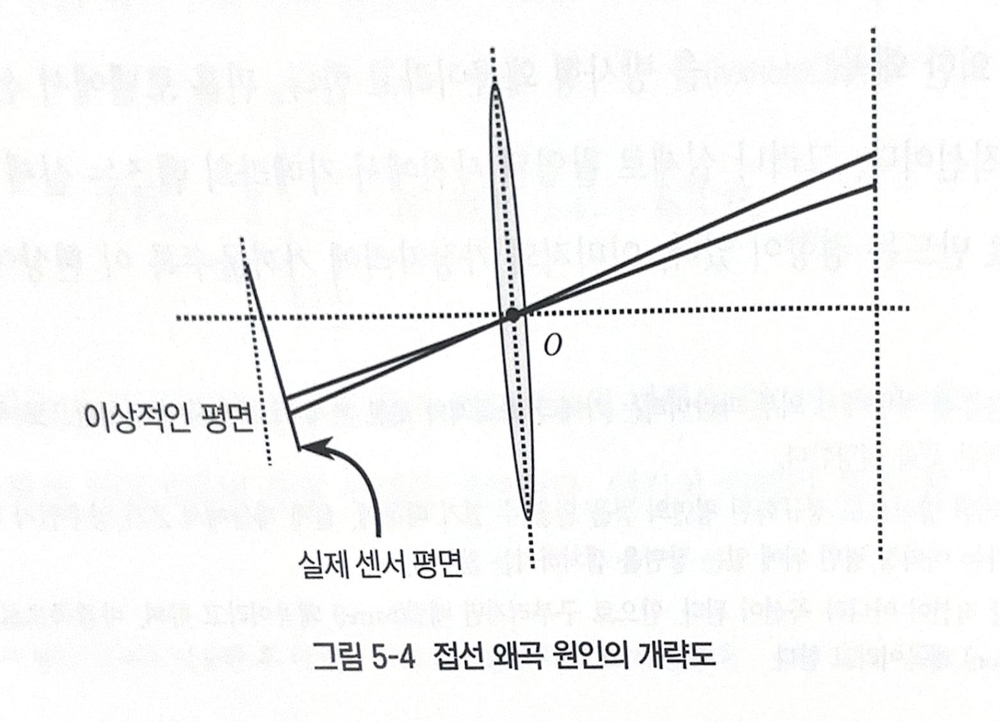
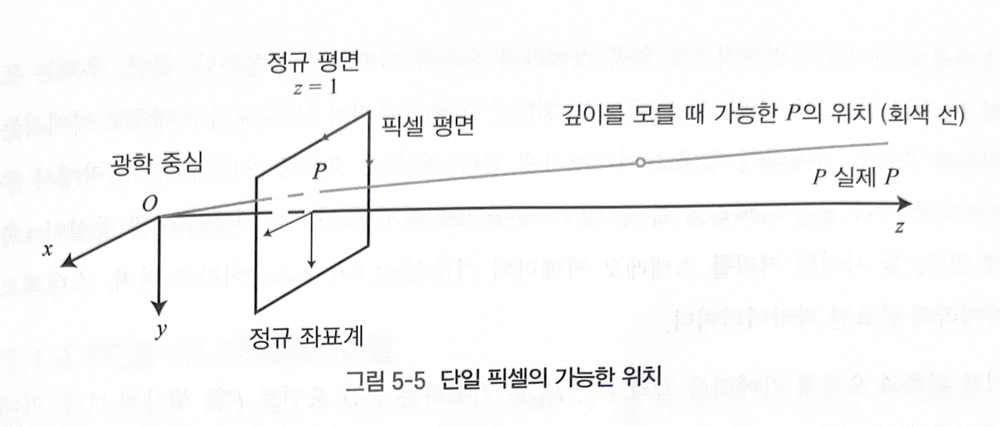
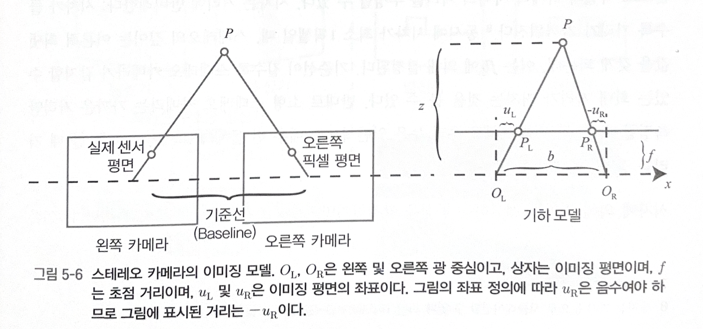
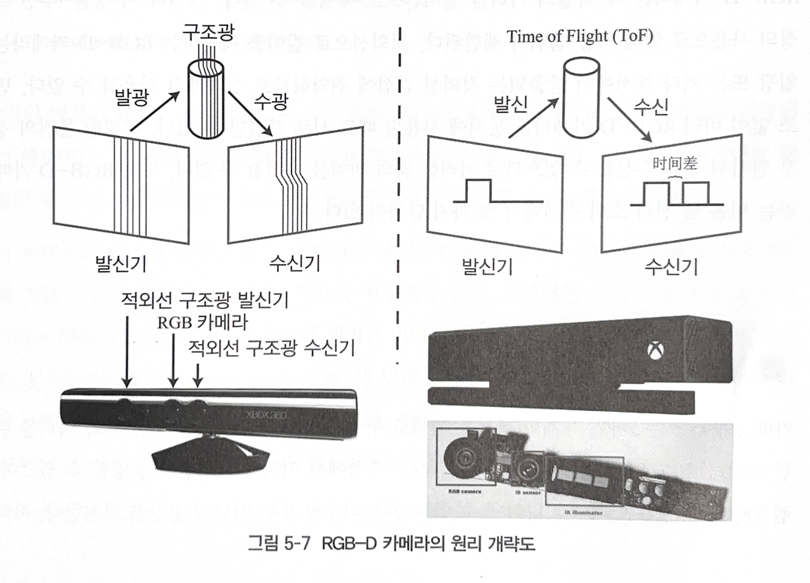
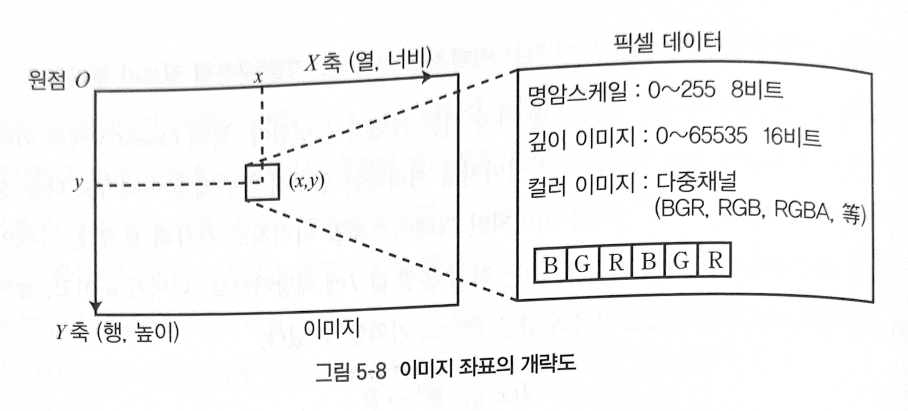

# Chapter 05: 카메라 및 이미지
## 01. 핀홀 카메라 모델
카메라가 3D 세계의 좌표 점을 2D 이미지 평면에 매핑하는 프로세스는 기하학적 모데레로 설명 가능하다. 이 모델이는 여러 가지가 있지만 그 중 가장 간단한 모델은 핀홀 모델이다. 핀홀 모델은 핀홀을 통과한 후 핀홀 뒷면에 투영된 광선의 이미징 관계를 설명하는 일반적이로 효과적인 모델이다. 카메라 렌즈의 존재로 인해 빛이 이미징 평면에 투사되는 과정에서 왜곡이 발생한다. 따라서 핀홀과 왜곡 모델을 통해 전체 투영 프로세스를 설명한다. 두 모델은 외부 3D 점을 카메라의 내부 이미징 평면에 투영하여 카메라의 내부 매개변수를 형성한다.

### 1-1. 핀홀 카메라 모델
어두운 상자 앞에 촛불을 두면 촛불은 어두운 상자의 작은 구멍을 통해 후면의 평면으로 투영된다. 이 때 평면에 촛불 이미지가 거꾸로 형성되게 된다. 이 과정에서 작은 구멍 모델은 3D 새계에서 2D 이미징 평면에 투영한다고 할 수 있다.





간단한 핀홀 모델을 기하학적으로 모델링해본다. $O-x-y-z$를 카메라 좌표계로 설정하면, $z$ 축이 카메라 앞을 가리키고, $x$ 축이 오른쪽으로, $y$ 축이 아래쪽을 향하도록 하는 것이 좋다. $O$ 는 카메라의 광 중심이며 핀홀 모델의 핀홀이기도 하다. 구멍 $O$ 에 투영된 후, 3D 포인트 $P$ 는 물리적 이미징 평면 $O'-x'-y'$ 에 떨어지며 이미지 포인트 $P'$ 를 생성한다. $P$ 의 좌표는 $[X, Y, Z]^T$ 이고, $P'$ 의 좌표는 $[X', Y', Z']^T$ 이며, 물리적 이미징 평면에서 작은 구멍이 있는 카메라 평면까지의 거리는 $f$ 이다. 따라서 삼각형 유사 관계에 따라 아래의 방정식이 나온다.

```math
\frac{Z}{f} = -\frac{X}{X'} = -\frac{Y}{Y'}
```

음수($-$) 기호는 반전된 이미지임을 나타낸다. 하지만 카메라로 사진을 찍을 때 사진이 반전되어 있지 않다. 모델을 보다 현실적으로 만들기 위해 3차원 공간 점과 함께 카메라 좌표계의 동일한 측면에 이미징 평면을 카메라 앞에 대칭으로 배치할 수 있다. 이 방법으로 수식에서도 음수를 제거하여 더 간결한 표현이 가능하다.

```math
\frac{Z}{f} = \frac{X}{X'} = \frac{Y}{Y'}
```

```math
X' = f\frac{X}{Z} \\
Y' = f\frac{Y}{Z}
```

이미징 평면을 임의로 앞쪽으로 옮기는 것은 카메라 투영을 처리하기 위한 수학적 접근일 뿐이고, 카메라가 캡쳐한 대부분의 이미지는 반전되는 것이 아니다. 카메라 자체의 소프트웨어가 사진을 뒤집기 때문에 실제로 얻는 것은 대칭 평면의 이미지이다.

위의 식은 초점 거리 $f$ 가 0.2m 이고, $X'$ 가 0.14m 인 경우와 같이, 모든 점의 단위가 미터로 이해될 수 있는 점 $P$ 와 이미지 간의 공간 관계를 설명한다. 하지만 카메라에서 얻는 것은 이미징 평면에서 이미지를 샘플링하고 정량화해야 하는 픽셀이다. 센서가 느끼는 빛은 이미지 픽셀로 변환하는 프로세스를 설명하기 위해 물리적 이미징 평면에 픽셀 평면 $o-u-v$ 를 고정하면, 픽셀 평면에서 $P'$ 의 픽셀 좌표인 $[u, v]^T$ 를 얻을 수 있다. 

픽셀 좌표계는 일반적으로 이미지의 왼쪽 위 모서리에 있는 원점 $o'$ , $x$ 축과 오른쪽으로 평행한 $u$ 축, $v$ 축은 $y$ 축과 평행하게 아래쪽으로 정의된다. 픽셀 좌표계와 이미징 평면 사이에는 배율 조정과 원점의 변환이 있다. $u$ 축에서 $\alpha$ 배 배율을 조정하고 $v$ 축에서 $\beta$ 배 배율을 조정하도록 픽셀 좌표를 설정한다. 동시에 원점이 $[c_x, c_y]^T$ 로 이동한다. 따라서 $P'$ 의 좌표와 픽셀 좌표 $[u, v]^T$ 의 관계는 아래와 같다.

```math
\begin{cases} u = \alpha X' + c_x \\
v = \beta Y' + c_y \end{cases}
```

$X'$ 과 $Y'$에 앞서 구한 수식을 대입하고, $\alpha f$ 를 $f_x$ 로, $\beta f$ 를 $f_y$ 로 치환하면 아래와 같다.

```math
\begin{cases} u = f_x \frac{X}{Z} + c_x \\
v = f_y \frac{Y}{Z} + c_y \end{cases}
```

여기서 $f$ 의 단위는 미터이고, $\alpha, \beta$ 의 단위는 픽셀/미터 이므로, $f_x, f_y$ 와 $c_x, c_y$ 의 단위는 픽셀이다. 행렬로 작성하는 것이 더 간결하지만, 왼쪽에는 동차 좌표계가 필요하고, 오른쪽은 비동차 좌표계가 필요하다.

```math
\begin{bmatrix}u \\ v \\ 1 \end{bmatrix}
= \frac{1}{Z} \begin{bmatrix} f_x & 0 & c_x \\ 0 & f_y & c_y \\ 0 & 0 & 1 \end{bmatrix} \begin{bmatrix} X \\ Y \\ Z \end{bmatrix}
\overset{\underset{\mathrm{def}}{}}{=} \frac{1}{Z}KP \\
Z\begin{bmatrix}u \\ v \\ 1 \end{bmatrix}
= \begin{bmatrix} f_x & 0 & c_x \\ 0 & f_y & c_y \\ 0 & 0 & 1 \end{bmatrix} \begin{bmatrix} X \\ Y \\ Z \end{bmatrix}
\overset{\underset{\mathrm{def}}{}}{=} KP
```

위 식의 중간에 있는 행렬을 카메라의 내부 파라미터 행렬 $K$ 라고 한다. 일반적인 카메라의 내부 파라미터는 고정되어 있으며, 사용 중에는 변경되지 않는다고 간주된다. 일부 카메라 제조업체는 카메라의 내부 매개변수에 대해 알려주며, 때로는 보정이라고 하는 과정을 통해 카메라의 내부 파라미터를 직접 구한다.

외부 파라미터도 존재한다. 위 식에서는 카메라 좌표계에서 $P$ 의 좌표를 사용하지만, 실제로는 카메라가 이동 중이므로, $P$ 의 카메라 좌표는 카메라의 현재 자세에 따라 카메라 좌표계 아래로 변환된 결과여야 한다. 카메라의 자세는 회전 매트릭스 $R$ 과 변환 벡터 $t$ 로 설명된다. 그래서 아래 방정식이 있다.

```math
ZP_{uv} = Z\begin{bmatrix} u \\ v \\ 1 \end{bmatrix}
= K(RP_W + t) = KTP_W
```

$KTP_W$ 는 동차 좌표계에서 비동차 좌표계로의 변환을 암시한다. 이것은 $P$ 의 표준 좌표계에서 픽셀 좌표계로의 투영 관계를 설명한다. 카메라 포즈 $R, t$ 는 카메라의 외부 파라미터라고 한다. 이는 카메라의 설치 상태에 따라 변경될 수 있고, SLAM의 추정 대상이 된다.

투영 프로세스는 다른 관점에서도 볼 수 있다. 위 식은 표준 좌표점을 카메라 좌표계로 변환한 다음, 마지막 차원의 값을 제거할 수 있음을 보여준다.

```math
(RP_W + t) = \underbrace{[X, Y, Z]^T}_{카메라\ 좌표} \to \underbrace{[X/Z, Y/Z, 1]^T}_{정규화\ 좌표}
```

정규화 좌표는 $z=1$ 평면의 점으로 볼 수 있고, 이 평면을 정규화 평면이라고 한다. 정규화된 좌표와 왼쪽 곱셈의 내부 파라미터는 픽셀 좌표를 가지므로, 픽셀 좌표 $[u, v]^T$ 를 정규화된 평면의 점 쌍으로 정량적 측정이 가능하다. 이 모델에서 볼 수 있듯이 카메라 좌표에 0이 아닌 상수를 동시에 곱하면 정규화된 좌표가 동일하며, 이는 투영 중에 점의 깊이가 손실되기 때문에 단안 비전에서 픽셀의 값을 얻을 수 없음을 보인다.

### 1-2. 왜곡 모델
더 넓은 화각의 이미징을 얻기 위해 카메라 앞에 렌즈를 추가할 수 있다. 렌즈의 추가는 이미징 과정에서 빛의 전파에 새로운 영향을 미친다.

1. 렌즈 자체의 모양이 빛의 전파에 미치는 영향

2. 기계적 조립 과정에서 렌즈와 이미징 평면이 완전히 평행할 수 없으므로, 렌즈를 통해 렌즈가 이미징 형면에 투영될 때 빛의 위치가 변경된다.

렌즈 형상에 의한 왜곡을 방사형 왜곡이라고 한다. 핀홀 모델에서 선은 픽셀 평면에 투영되거나 직선이다. 하지만 실제 촬영된 사진에서 카메라의 렌즈는 실제 환경에서 직선을 곡선으로 만드는 경향이 있다. 이미지의 가장자리에 가까울수로 이 현상이 두드러진다.


> 방사형 왜곡의 두가지 유형: 배럴 왜곡, 쿠션 왜곡

렌즈는 보통 중심 대칭이기 때문에, 왜곡은 일반적으로 방사형 대칭이다. 이는 위 그림과 같이 배럴 왜곡과 쿠션 왜곡 두 가지로 보통 나뉜다.

배럴 왜곡은 광축으로부터의 거리가 증가함에 따라 픽셀 반경이 감소하지만, 쿠션 왜곡은 픽셀 반경이 증가한다. 두 왜곡 모두 이미지의 중심과 광축의 교차점을 통과하는 직선은 형태를 그대로 유지한다.

렌즈의 형상은 방사형 왜곡을 일으킬 수 있을 뿐 아니라 렌즈와 이미징 표면이 카메라 조립 중 완벽한 평행이 될 수 없으므로 접선 왜곡도 나타난다.



방사형 왜곡과 접선 왜곡을 이해하기 위해 수학적 형태로 설명해보자. 좌표가 $[x, y]^T$ 인 정규화 평면에 임의의 점 $p$ 를 고려하거나 극좌표의 형태인 $[r, \theta]^T$ 로 작성할 수 있다. $r$ 은 점 $p$ 와 좌표계 원점 사이의 거리를 나타내고, $\theta$ 는 수평축과의 각도를 나타낸다. 방사형 왜곡은 좌표점이 길이 방향에 따라 변경되는 것을 볼 수 있다. 접선 왜곡은 좌표점이 접선 방향에 따라 변경되는 것을 볼 수 있다. 일반적으로 이러한 왜곡은 다항식 관계로 가정된다.

```math
x_{distorted} = x(1 + k_1r^2 + k_2r^4 + k_3r^6) \\
y_{distorted} = y(1 + k_1r^2 + k_2r^4 + k_3r^6)
```

$[x_{distorted}, y_{distorted}]^T$ 는 왜곡 후 점의 정규화된 좌표이다. 접선 왜곡의 경우에서는 $p_1, p_2$ 두 가지 다른 매개변수를 사용하여 표현한다.

```math
x_{distorted} = x + 2p_1xy + p_2(r^2 + 2x^2)
y_{distorted} = y + p_1(r^2 + 2y^2) + 2p_2xy
```

위 두 식에서 카메라 좌표계 점 $P$ 의 경우, 5개의 왜곡 계수를 통해 픽셀 평면에서 이 점의 올바른 위치를 찾을 수 있다.

1. 3D 공간 점을 정규화된 이미지 평면에 투영한다. 정규화된 좌표를 $[x, y]^T$ 로 설정한다.

2. 정규화 평면의 점에 대한 방사형 왜곡과 전단 왜곡을 계산한다.

```math
\begin{cases}
x_{distorted} = x(1 + k_1r^2 + k_2r^4 + k_3r^6) + 2p_1xy + p_2(r^2 + 2x^2) \\
y_{distorted} = y(1 + k_1r^2 + k_2r^4 + k_3r^6) + p_1(r^2 + 2y^2) + 2p_2xy
\end{cases}
```

3. 왜곡된 점은 내부 파라미터 행렬을 통해 픽셀 평면에 투영되어 이미지에서 올바른 위치를 얻는다.

```math
\begin{cases}
u = f_xx_{distorted} + c_x \\
v = f_yy_{distorted} + c_y
\end{cases}
```

실제로 왜곡을 수정할 때 파라미터를 $k_1, p_1, p_2$ 만 선택하거나 $k_1, k_2, p_1, p_2$ 를 사용하는 등 유연하게 선택 가능하다.

실제 이미지 시스템에서 연구자들은 핀홀 모델 이외에 카메라의 어파인 및 원근 모델과 같은 다른 모델들을 제안하였으며, 다른 유형의 왜곡들도 존재한다. Visual SLAM에서 일반적으로 사용되는 카메라를 고려할 때, 핀홀 모델과 방사령 및 접선 왜곡 모델로도 충분하다.

왜곡 보정에는 두 가지가 있다는 점을 보자. Undistortion, Correction 방법이다. 먼저 전체 이미지의 왜곡을 제거하고 수정된 이미지를 얻은 다음 이미지에서 점의 공간 위치에 대해 논의할 수 있다. 또는 왜곡 이미지에서 일부 특정 점을 추출하는 데에서 시작하여 왜곡 방정식을 통해 왜곡 전의 공간 위치를 논의할 수 있다. 둘 다 가능하지만 전자가 Visual SLAM에서 더 일반적인 방법이다. 이미지가 왜곡되지 않은 경우, 왜곡을 고려하지 않고 핀홀 모델을 사용하여 직접 투영 관계를 설정할 수 있다. 그러므로 이어지는 논의에서는 이미지가 왜곡되지 않았다고 직접 가정할 수 있다.

마지막으로 단안 카메라의 이미징 프로세스를 요약하면 아래와 같다.

1. 어떤 고정점 $P$ 가 있고, 그 점을 표준 좌표계에서 기술하면 $P_W$ 로 표현할 수 있다.

2. 카메라가 움직이기 때문에, 그 움직임은 $R, t$ 또는 변환 매트릭스 $T \in SE(3)$ 에 의해 설명된다. $P$ 의 카메라 좌표는 $\tilde{P}_c = RP_W + t$ 이다.

3. 이 시점에서 $\tilde{P}_c$ 의 구성 요소는 $X, Y, Z$ 이다. 정규화 평면 $Z = 1$ 에 투영하여 $P$ 의 정규화 좌표 $P_c = [X/Z, Y/Z, 1]^T$ 를 얻는다.

4. 왜곡이 있는 경우, $P_c$ 의 왜곡 후 좌표는 왜곡 파라미터를 기반으로 계산된다.

5. $P$ 의 왜곡된 좌표가 내부 파라미터를 통과하면 해당 픽셀 좌표를 얻는다. $P_{uv} = KP_c$

우리는 표준 좌표계, 카메라 좌표계, 정규화 좌표계 및 픽셀 좌표계의 네 가지 좌표계에 관한 이야기를 했다. 

### 1-3. 스테레오 카메라 모델
핀홀 카메라 모델은 단안 카메라의 이미징 모델을 설명한다. 하지만 단일 픽셀만으로는 이 공간 점의 정확한 위치를 확인할 수 없다. 이는 카메라의 광학 중심에서 정규화된 평면에 연결괸 모든 점을 한 픽셀에 투영할 수 있기 때문이다.



위 그림과 같이 $P$ 의 깊이가 결정된 경우에만 공간 위치를 정확하게 알 수 있다.

픽셀 거리를 측정하는 방법에는 여러 가지가 있다. 인간의 눈은 왼쪽과 오른쪽 눈으로 보이는 장면의 차이에 따라 물체와 인간 사이의 거리를 가늠할 수 있다. 스테레오 카메라의 원리도 같다. 왼쪽, 오른쪽 카메라의 이미지를 동시에 촬영하고, 이 이미지 간의 시차를 계산하여 각 픽셀의 깊이를 추정한다.



왼쪽과 오른쪽 스테레오 카메라에서 두 카메라를 각각 핀홀 카메라로 볼 수 있고, 수평으로 배치되므로 두 카메라의 광 중심이 $x$ 축에 있다. 둘 사이의 거리를 스테레오 카메라의 기준선이라고 한다.

왼쪽과 오른쪽 카메라를 각각 $P_L, P_R$ 로 기록하는 공간 포인트 $P$ 라고 생각해보자. 카메라 기준선의 존재로 인해 두 이미징 위치는 다르다. 이상적으로는 왼쪽과 오른쪽 카메라가 $x$ 축에만 변위가 있으므로, $P$ 의 이미지는 $x$ 축에만 차이가 있다. 왼쪽 좌표는 $u_L$ 이고, 오른쪽 좌표는 $u_R$ 이다. $\Delta PP_LP_R$ 과 $\Delta PO_LO_R$ 의 삼각형 닯은 조건에 따라 아래 식을 세울 수 있다.

```math
\frac{z - f}{z} = \frac{b - u_L + u_R}{b}
```

정리하면 아래 식이 나온다.

```math
z = \frac{fb}{d}, \ d \overset{\underset{\mathrm{def}}{}}{=} u_L - u_R
```

$d$ 는 시차로, 왼쪽과 오른쪽 이미지의 가로 좌표 차이로 정의된다. 시차를 기준으로 픽셀과 카메라 사이의 거리를 추정할 수 있다. 시차는 거리에 반비례하여 시차가 클수록 거리는 가까워진다. 동시에 시차가 최소 1픽셀일 때, 스테레오의 깊이는 이론적 최댓값을 갖는데, 이는 $fb$ 에 의해 결정된다. 기준선이 길수록 스테레오 카메라가 감지할 수 있는 최대 거리가 커진다.

시차에 의해 깊이를 계산하는 공식은 간결하지만, 시차 $d$ 자체를 계산하기는 어렵다. 왼쪽 눈 이미지의 픽셀이 오른쪽 눈 이미지에 나타나는 위치를 정확히 알아야 한다. 각 픽셀의 깊이를 계산하려는 경우 계산의 양과 정밀도가 문제가 되며, 이미지 텍스처가 풍부한 경우에만 시차를 계산할 수 있다. 계산된 양으로 인해 스테레오 카메라 깊이 추정은 GPU 또는 FPGA를 사용하여 실시간으로 계산한다.

### 1-4. RGB-D 카메라 모델
RGB-D 카메라는 각 픽셀의 깊이를 능동적으로 측정할 수 있는 방식을 취한다. 원리에 따라 두 가지로 나뉜다.

1. 적외선 구조 광 (Structured Infrared Light) 원리를 통해 픽셀 거리를 측정한다. Kinect 1세대, Project Tango 1세대, Intel RealSense 등이 있다.

2. 비행시간 (Time-of-Flight, ToF) 원리를 통해 픽셀 거리를 측정한다. Kinect 2세대, 일부 기존 ToF 센서가 있다.



두 유형 모두 감지 대상에 관성을 방출해야 한다. 적외선 구조 광 원리에서는 카메라는 반환되어 구조화된 광 패턴에 따라 물체와 객체 사이의 거리를 계산한다. ToF 원리에서 카메라는 대상에 펄스광을 방출한 다음 반사 전송되는 광의 비행시간에 따라 물체와 객체 사이의 거리를 결정한다. ToF의 원리는 레이저 센서와 유사하지만 레이저는 포인트 스캔을 통해 거리를 얻을 수 있으며, ToF 카메라는 RGB-D 카메라의 특징인 전체 이미지의 픽셀 깊이를 얻을 수 있다. 따라서 RGB-D 카메라를 분리하면 일반적으로 일반 카메라 외에 적어도 하나의 송신기와 수신기가 있음을 알 수 있다.

싶이를 측정한 후 RGB-D 카메라는 일반적으로 각 카메라가 생산되는 위치에 따라 깊이와 컬러 이미지 요소 간의 페어링을 수행하여 해당 컬러 및 깊이 맵을 출력한다. 동일한 이미지 위치에서 색상 및 거리 정보를 읽고 픽셀의 3D 카메라 좌표를 계산하여 포인트 클라우드를 생성한다. RGB-D 데이터는 이미지 수준에서 또는 포인트 클라우드 수준에서 처리할 수 있다.

RGB-D 카메라는 각 픽셀의 거리를 실시간으로 측정할 수 있다. 그러나 이 방출-수신 측정의 사용으로 인해 사용 범위가 제한된다. 적외선으로 깊이를 측정하는 RGB-D 카메라는 일관 또는 기타 센서에서 방출되는 적외선 간섭에 취약하므로 실외에서 사용할 수 없다. 변조 없이 여러 대의 카메라를 동시에 사용할 경우에도 간섭이 발생할 수 있다. 투명한 물체의 경우 반사된 빛을 수신할 수 없어서 이러한 점의 위치를 측정할 수 없다.

## 02. 이미지
카메라와 렌즈는 3차원 세계의 정보를 픽셀로 구성한 사진으로 변환한 다음 후속 처리를 위한 데이터 소스로 컴퓨터에 저장한다. 수학에서 이미지는 행렬로 설명할 수 있으며 컴퓨터에서는 2차원 배열로 나타낼 수 있는 연속 디스크 또는 메모리 공간을 차지한다.

컴퓨터 이미지 처리의 몇 가지 기본 작업을 보자. 특히 OpenCV 에서 이미지 데이터의 처리를 통해 컴퓨터에서 이미지를 처리하는 일반적인 단계를 이해한다. 가장 간단한 이미지인 그레이스케일 이미지로 시작해보자. 그레이 스케일 이미지에서 각 픽셀 위치 $(x, y)$ 는 회색 음영 값 $I$ 에 해당하므로, 너비가 $w$ 이고, 높이가 $h$ 인 이미지는 수학적으로 아래 함수로 표현할 수 있다.

```math
I(x, y) : \mathbb{R}^2 \mapsto \mathbb{R}
```

$(x, y)$ 는 픽셀의 좌표이다. 컴퓨터는 실수 공간을 표현할 수 없으므로 첨자와 이미지 판독 값을 특정 범위 내에서 정량화해야 한다. 예를 들어, $x, y$ 는 일반적으로 0부터 시작하는 정수이고, 일반적인 그레이스케일 이미지에서 이미지의 회색 음영 값은 0~255의 정수로 표현된다. 너비가 640픽셀, 높이가 480픽셀인 해상도인 그레이스케일 이미지는 아래와 같이 표현된다.

```c
// 이미지를 표현하기 위해 2차원 배열 사용
unsigned char image[480][640];
```

2차원 배열이 $480 \times 640$ 인 이유는 프로그램에서 이미지가 2차원 배열로 저장되기 때문이다. 첫 번째 첨자는 행, 두번째 첨자는 열이다. 이미지에서 배열의 행 수는 이미지의 높이 $h$, 열 수는 이미지의 너비 $w$이다.



이미지는 자연스럽게 픽셀로 구성된다. 픽셀에 엑세스할 때 픽셀이 있는 좌표를 지정해야 한다. 왼쪽에는 기존 픽셀 좌표계가 정의되는 방식이 표시된다. 픽셀 좌표계 원점은 이미지의 왼쪽 위 모서리에 있고, $X$ 축은 오른쪽, $Y$ 축은 아래쪽이다. 세번째 축인 $Z$ 축이 있는 경우, 오른손 법칙에 따라 $Z$ 축이 책 안쪽으로 들어간 방향이 된다. 이 정의는 카메라 좌표계와 일치한다. 이미지의 너비 또는 열 수는 $X$ 축에 해당하며, 이미지의 행 수 또는 높이는 $Y$ 축에 해당한다.

이 정의에 따라 $x, y$ 에 있는 픽셀에 관해 프로그램에서 엑세스하는 방법은 아래와 같다.

```c
// 이미지의 픽셀에 엑세스하는 방법
unsigned char pixel = image[y][x];
```

이는 회색 음영값 $I(x, y)$ 의 판독 값에 해당한다. 여기서 $x$ 와 $y$ 의 순서에 주의한다. 

픽셀의 그레이스케일은 8비트 정수 또는 0~255의 값으로 기록할 수 있다. 우리가 더 많은 정보를 기록하려고 할 때, 바이트는 충분하지 않을 수 있다. 예를 들어 RGB-D 카메라의 깊이 맵에서 개별 픽셀과 카메라 사이의 거리가 기록된다. 이 거리는 일반적으로 밀리미터이며, RGB-D 카메라의 범위는 일반적으로 약 10미터로 255를 초과한다. 이 시점에서 16비트 정수를 사용하여 깊이 맵의 정보 즉, 0~65535의 값을 기록한다. 미터로 환산하면 최대 65미터를 표현할 수 있어 충분하다.

컬러 이미지의 표현에는 채널의 개념이 필요하다. 컴퓨터에서는 적색, 녹색, 청색의 조합을 사용하여 색상을 표현한다. 따라서 각 픽셀에 대해 R, G, B 값을 기록해야 하며 각 값을 채널이라고 한다. 에를 들어 가장 일반적인 컬러 이미지에는 각각 8비트 정수로 표현되는 세개의 채널이 있다. 이 규칙에 따라 픽셀은 24비트 공간을 차지한다.

채널의 수와 순서는 자유롭게 정의할 수 있다. OpenCV 컬러 이미지에서 채널의 기본 순서는 B, G, R이다. 즉, 24비트 픽셀을 얻을 때, 처음 8비트는 파란색 값을 나타내고, 중간 8비트는 녹색을 마지막 8비트는 빨간색을 나타낸다. 만약 이미지의 투명함을 표현하고 싶다면 R, G, B, A 4개의 채널을 사용한다.
