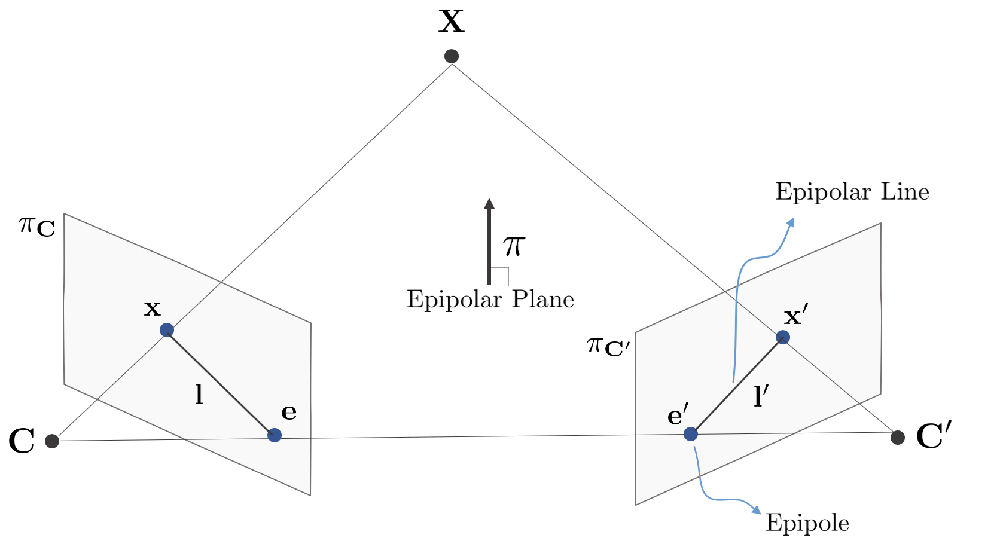

# Chapter 07: 시각적 주행 거리 측정 1
## 01. 특징점 방법
SLAM 시스템의 프론트엔드는 Visual Odometry (이하 VO)에 해당한다. VO는 인접한 이미지의 정보를 기반으로 대략적인 카메라 움직임을 추정하여 벡엔드 최적화를 위한 초깃값을 제공한다. VO 알고리즘은 특징점 방법과 다이랙트 방법 두가지 범주로 나뉜다. 특징점 방법을 기반으로 하는 프론트엔드는 오랫동안 주류 방법으로 여겨졌다. 안정적이고 조명, 동적 물체에 민감하지 않은 장점이 있다.

### 1-1. 특징점
VO의 핵심 문제는 인접한 이미지를 기반으로 카메라 움직임을 추정하는 것이다. 하지만 이미지 자체는 밝기와 색상의 행렬로, 행렬 수준에서 직접 모션 추정을 고려하는 것은 어렵다. 더 편리한 방법을 사용한다.

1. 이미지에서 대표적인 점들을 선택한다. 이러한 점들은 카메라 시야각이 약간 변경된 후에도 동일하게 유지되어 각 이미지에서 동일한 점을 찾을 수 있다.
2. 이러한 점을 기반으로 카메라 포즈 추정 문제와 해당 점의 위치 추정에 관해 설명한다. 이러한 점을 랜드마크라고 한다.

특징점은 이미지 정보의 또 다른 형태의 디지털 표현이다. 좋은 특징점 집합은 지정된 작업의 최종 성능에 매우 중요하다. 디지털 이미지는 컴퓨터에 회색 음영 값 행렬 형태로 저장되므로 가장 간단한 경우 단일 이미지 픽셀도 특징점으로 가능하다. VO에서 카메라 이동 후에도 특징점들이 안정적으로 유지되기를 원하며, 명암값은 조명, 변형 및 대상물 재질의 영향을 크게 받고, 이미지들 사이에 그 변화가 매우 크고 안정적이지 않다. 이상적으로는 장면과 카메라 시야각이 약간 변경될 때 알고리즘은 이미지에서 동일한 지점을 결정할 수도 있지만 명암값만으로는 충분하지 않아 특징점 추출이 필요하다.

특징점은 이미지의 특별한 부분이다. 이미지의 코너와 에지가 픽셀보다 더 측별하고 다른 이미지 사이에서 더 잘 구별된다는 것이 알려져있다. 따라서 특징점 추출에 직관적인 방법은 이미지 간에 코너를 식별하고 대응 관계를 결정하는 것이다. 헤리스 코너, FAST 코너, GFTT 코너 등의 다양한 코너 추출 알고리즘이 있다.

단순한 코너만으로는 많은 요구 사항을 충족할 수 없다. 따라서 SIFT, SURF, ORB 등과 같은 연구를 통해 안정적인 이미지의 지역 특징점을 설계한다. 이러한 특징점의 특징은 아래와 같다.

1. 반복성: 동일한 특징점을 다은 이미지에서 찾을 수 있다.
2. 특수성: 특징점마다 표현이 다르다.
3. 효율성: 동일한 이미지에서 특징점의 수는 픽셀의 수보다 훨씬 작아야 한다.
4. 지역성: 특징점은 이미지의 작은 영역에만 관련이 있다.

특징점은 key point와 descriptor로 구성된다. 이미지에서 SIFT 특징점을 계산한다고 할때, SIFT 키 포인트를 추출하고 SIFT 설명자를 계산한다는 것을 뜻한다. 키포인트는 이미지에서 해당 특징점의 2D 위치를 말하며, 일부 키 포인트에는 방향이나 크기와 같은 기타 정보도 포함되어 있다. 설명자는 일반적으로 키 포인트 주위의 픽셀에 대한 정보를 설명하는 벡터이다.

많은 이미지 특징점 중 SIFT (Scale-Invariant Feature Transform) 방법이 가장 고전적인 영상 피쳐 방법이다. 이미지 변환 중에 발생하는 조명, 스케일, 회전 등의 변화를 완전히 고려하지만 연산량이 매우 크다. 전체 SLAM 프로세스에서 이미지 특징점을 추출하고 매칭하는 것은 많은 부분 중 하나 일 뿐이므로 일반 PC의 CPU는 SIFT 특징점을 실시간으로 계산할 수 없어서 Localization 및 Mapping을 수행 할 수 없다. 따라서 SLAM에서는 이 SIFT 특징점 방법을 거의 사용하지 않는다.

계산 속도를 높이기 위해 정확성과 견고성을 적절하게 줄이는 것이 좋다. FAST 키 포인트는 특히 빠르게 계산할 수있는 keypoint이다. ORB (Oriented FAST and Rotated BRIEF) 특징점은 매우 대표적인 실시간 이미지 특징점이다. FAST 검출기가 방향성을 갖지 않는 문제를 개선하고 매우 빠른 바이너리 설명자 BRIEF를 사용하여 전체 이미지 특징점 추출을 크게 가속화한다. 논문에서 저자가 설명한 테스트에 따르면 같은 이미지에서 약 1000 개의 특징점을 동시에 추출하는 경우 ORB는 약 15.3ms, SURF는 약 217.3ms, SIFT는 약 5228.7 ms의 시간을 필요로 한다. ORB가 데이터의 특성과 스케일 불변성을 유지하고 속도가 분명히 향상되었음을 알 수 있다.

대부분의 특징점 추출은 병렬성이 뛰어나며 GPU와 같은 장치로 가속화 할 수 있다. GPU 가속 SIFT 이후에는 실시간 컴퓨팅 요구 사항을 충족 할 수 있다. 그러나 GPU를 도입하면 전체 SLAM 비용이 증가한다. 결과적인 성능 향상이 시스템의 계산 비용을 상쇄시키기에 충분한지 여부는 시스템 설계자의 신중한 고려가 필요하다. 현재의 SLAM 기법에서 ORB는 품질과 성능의 절충안이므로 ORB를 이용하여 기능을 추출하는 전 과정을 소개힌다.

### 1-2. ORB 특징점
ORB 특징점은 키포인트와 디스크립터의 두 부분으로 구성돤다. 키포인트는 개선된 FAST 코너 포인트인 `Oriented FAST`를 활용한다. 디스크립터는 BRIEF (Binary Robust Independent Elementary Feature) 라 불리며, 추출 된 ORB 특징은 다음과 같이 나뉘어진다.

1. FAST 코너 추출: 이미지에서 모서리점을 찾는다. 원래의 FAST에 비해, 특징점의 주요 방향은 ORB에서 계산되고 회전 불변 속성은 BRIEF 설명자에 의해 추가된다.
2. BRIEF 설명자: 이전 단계에서 특징점을 추출한 위치에서 주변 이미지 영역을 잘 표현하는 디스크립터를 생성한다. 

#### 1-2-1. FAST 키 포인트
FAST는 일종의 코너 포인트 추출기로서 그레이 스케일의 명백한 변화를 감지하며 속도가 빠른 것으로 알려져 있다. 이때, 어떤 위치에서의 픽셀 값이 이웃의 픽셀에 비해 너무 밝거나 너무 어두우면 모서리가 될 가능성이 크다고 인식하는 것이다. 다른 코너 감지 알고리즘에 비해 FAST는 픽셀의 밝기만 비교하면 되므로 매우 빠르다. 탐지 프로세스는 아래와 같다.

1. 이미지에서 픽셀 $p$ 를 선택하고 밝기가 $I_p$ 라고 가정한다.
2. 임곗값 $T$를 설정한다.
3. 픽셀 $p$ 를 중심으로 반지름이 3인 원에서 16개의 픽셀을 선택한다.
4. 선택한 원에 연속 $N$ 개의 점이 $I_p + T$ 보다 크거나 $I_p - T$ 보다 작은 경우, 픽셀 $p$ 는 특징점으로 간주 될 수 있다.. 그 외에 다른 일반적인 $N$ 은 9와 11의 값을 취하여 각각 FAST-9, FAST-11 이라고 한다.
5. 각 픽셀에 대해 위의 네 단계를 반복해 동일한 작업을 수행한다.

FAST-12 알고리즘에서는 효율성을 높이기 위해 사전 테스트 작업을 추가하여 코너가 아닌 대부분의 픽셀을 빠르게 제거 할 수 있다. 이는 각 픽셀에 대해 인접 원 위의  1번째, 5번째, 9번째 및 13번째 픽셀의 밝기를 검사하는 것이다. 이 4 개의 픽셀 중 3개가 $I_p + T$ 보다 크거나 $I_p - T$ 보다 작은 경우에만 코너가 될 수 있다. 이러한 사전 테스트 작업은 코너 감지를 크게 가속화한다. 또한 원래 FAST 모서리는 종종 동일한 영역에서 많은 FAST 코너가 존재하는 것처럼 보인다. 따라서 첫 번째 통과 감지 후 특정 영역에서 응답 최대치의 코너만 보존하기 위해 non-maximal suppression를 사용하여 코너 집중 문제가 방지된다.

FAST 특징점 계산은 픽셀 간의 밝기 차이를 비교하는 것으로 매우 빠르지만 반복성이 낮고 고르지 않게 분포되어 있다는 단점이 있다. 먼저 FAST 특징점의 수가 많고 불확실하다. 우리는 이미지에서 고정 된 수의 지형지물을 추출하기를 원한다. 원래 FAST 알고리즘은 ORB에서 향상되었다. 추출할 코너의 수 N을 지정하고 원래의 FAST 코너에 대한 해리스 응답 값을 계산 한 다음 가장 큰 응답 값을 가진 상위 N 코너를 모서리 점의 최종 집합으로 선택할 수 있다.

다음으로 FAST 코너 포인트에는 방향 정보가 없다. 또한, 반지름이 3인 원을 고정하기 때문에 거리에 있어서 코너처럼 보이고 뒤쪽에 가까울수록 코너가 아닐 수 있다. 방향성과 스케일이 없는 FAST 코너 포인트의 약점을 위해 ORB는 스케일과 회전에 대한 설명을 추가한다. 스케일 불변성은 이미지 피라미드를 구성하고 피라미드의 각 레이어에서 코너를 감지하여 얻을 수 있다. 이 피쳐의 회전은 Intensity Centroid에 의해 이루어진다.

회전의 경우 특징점 근처 이미지의 회색 음영 중심을 계산한다. 이미지 블록의 명암값을 음영 중심으로 사용한다. 구체적인 절차는 아래와 같다.

1. 작은 이미지 블록 $B$ 에서 이미지 블록의 모멘트를 정의한다.

```math
m_{pq} = \sum_{x,y \in B} x^p y^q I (x, y) \\
p, q = \left\{0, 1 \right\}
```

2. 모멘트를 통해 이미지 블록의 중심을 찾을 수 있다.

```math
C = \left( \frac{m_{10}}{m_{00}}, \frac{m_{01}}{m_{00}} \right)
```

3. 이미지 블록의 기하학적 중심 $O$ 와 위에서 구한 이미지 블록 중심 $C$ 를 연결하여, 방향 벡터 $\overrightarrow{OC}$ 를 얻을 수 있으며, 이를 특징점의 방향이라 정의할 수 있다.

```math
\theta = \arctan(m_{01}/ m_{10})
```

위의 방법을 통해 FAST 코너는 스케일과 회전에 대한 설명을 하고 있어, 서로 다른 이미지 간에 표현의 견고함을 크게 향상한다. ORB에서 이 향상된 FAST를 Oriented FAST라고 한다.

#### 1-2-2. BRIEF 설명자
Oriented FAST 키포인트를 추출한 후 각 포인트에 대한 설명자를 계산한다. ORB는 수정된 BRIEF 특성화를 사용한다. 먼저 BRIEF가 무앗인지 보도록 하자.

BRIEF는 설명 벡터가 0과 1의 숫자로 구성된 이진 설명자이다. 0과 1은 키 근처의 두 픽셀 (p 및 q와 같은)의 크기 관계를 인코딩한다. p가 q보다 크면 1, 그렇지 않으면 0을 취힌다. 128개 p를 취하면 q는 0과 1로 구성된 128 차원의 벡터로 만들어진다. 일반적으로 p와 q의 위치는 특정 확률 분포에 따라 임의로 선택된다. BRIEF는 매우 빠른 비교의 무작위 추출을 사용하며, 바이너리 표현식을 사용하기 때문에 실시간 이미지 매칭에 적합하고 저장하기에도 매우 편리하다. 원래의 BRIEF 디스크립터는 회전 불변성을 가지지 않으므로 이미지가 회전 될 때 쉽게 손실된다. ORB는 FAST 특징점 추출 단계에서 키 포인트의 방향을 계산하므로 방향 정보를 사용하여 ORB 설명자가 더 나은 회전 불변성을 갖도록 회전 후 Steer BRIEF 기능을 계산할 수 있다. 회전 및 크기 조정 덕분에 ORB는 변환, 회전 및 크기 조정의 변환을 통해 여전히 우수한 성능을 발휘힌다. 동시에 FAST와 BREIF의 조합은 매우 효율적이어서 ORB 기능이 실시간 SLAM에서 매우 인기가 있다.

### 1-3. 특징점 매칭
특징점 매칭은 Visual SLAM에서 매우 중요한 단계이며, 일반적으로 특징점 매칭은 SLAM의 데이터 연결 문제를 해결하여 현재 표시되는 랜드마크와 이전에 본 랜드마크 사이의 대응을 결정한다. 이미지와 이미지 또는 이미지와 맵 간의 설명자를 정확히 일치시킴으로써 후속 포즈 추정 및 최적화에 많은 작업을 줄일 수 있다. 하지만 이미지 특징점의 지역 특성으로 인해 잘못된 매칭이 많으며 이는 성능 향상을 제한하는 병목 현상 가운데 하나이다. 이는 장면에 많은 수의 반복된 텍스쳐가 있는 경우가 많을 때 특징점 설명이 매우 유사하기 때문이다.

두 순간의 이미지를 고려할 때, 이미지 $I_t$ 에서 특징점 $x_{t+ 1}^m$ $(m = 1, 2, ..., M)$ 을, 이미지 $I_{t+1}$ 에서 특징점 $x_{T+1}^n$ $(n = 1, 2, ..., N)$을 추출했을 때, 이 두 집합 사이에 대응하는 관계를 찾으로면 어떻게 해야 하는가. 가장 쉬운 특징 매칭 방법은 brute-force matcher 방법이다. 즉, 각 특징점 $x_{t+1}^m$ 와 모든 $x_{t+1}^n$ 에 대한 설명자의 거리를 측정한 다음 정렬하여 가장 가까운 점을 매칭점으로 가져오는 것이다. (brute-force 알고리즘: 모든 경우의 수 다 해보기) 설명자 거리 측정은 두 특징점 간의 유사성을 나타내지만, 실제 적용에서 다은 거리 측정값을 사용할 수도 있다. 부동 소수점 유형의 설명자의 경우, 유클리드 거리를 사용하는 것이 좋은 선택이며, BRIEF와 같은 이진 설명자의 경우, 두 이진 문자열 사이의 거리인 해밍 거리를 측정값으로 사용한다.

특징점의 수가 많은 경우, 특히 특정 프레임과 맵을 매칭시키고자 할 때, 이런 brute-force matcher는 계산량이 커질 것이다. 이것은 SLAM에서 실시간 요구를 충족시키지 못한다. 이런 경우 FLANN (Fast Approximate Nearest Neighbor) 알고리즘은 일치하는 지점 수가 매우 큰 경우에 적합하다.

## 03. 2D-2D: 에피폴라 기하
### 3-1. 에피폴라 제약 조건



그림과 같이 두 이미지에서 한 쌍의 특징점을 얻었다고 가정한다. 이러한 매칭 포인트가 다수 존재하는 경우, 이들 2차원 이미지 점의 일치에 의해 2개의 프레임 사이의 카메라의 움직임을 복원할 수 있다.

첫번째 프레임에서 두 번째 프레임까지의 모션을 $R, t$ 로 설정하여 두 프레임 이미지 $I, I'$ 사이의 움직임을 구하려고 한다. 두 카메라 센터는 각각 $C, C'$ 이며, 이미지 $I$ 의 특징점 $x$ 은 이미지 $I'$ 의 특징점 $x'$ 와 상응한다고 한다. 이들은 둘 다 특징점 매칭을 통해 얻을 수 있다는 것을 안다. 매칭이 올바르다면 실제로 동일한 공간상 점의 두 이미징 평면에 대한 각각의 투영임을 의미한다. 둘 사이의 기하학적 관계 규명에 필요한 용어를 본다. tjsqns $\overrightarrow{Cx}$ 와 선분 $\overrightarrow{C'x'}$ 는 3D 공간에서 점 $X$ 와 교차한다. 이 때, $C, C', X$ 세 점은 하나의 평면을 이루며, 이를 에피폴라 평면이라고 한다. $C$ 와 $C'$ 을 잇는 선분과 평면 $\pi_C, \pi_{C'}$ 와의 교차점을 각각 $e, e'$ 하 한다. 이를 헤피폴이라 하며ㅡ $C$ 와 $C'$ 을 잇는 선분을 기준선이라고 한다. 에피폴라 평면과 두 개의 평면 $\pi_C, \pi_{C'}$ 사이의 교차 선 $l, l'$ 를 에피폴라 선이라고 한다.

첫번째 프레임의 관점에서 보면 광선 $\overrightarrow{Cx}$ 위에 있는 모든 점이 동일한 픽셀 $x$ 에 투영된다. 동시에 $X$ 의 위치를 모르는 경우를 가정하면 두번째 이미지에서 선분 $\overrightarrow{e'x'}$ 는 $X$ 가 두번째 카메라에서 광선 $\overrightarrow{Cx}$ 를 투영할 수 있는 위치이다. 이제 특징점 매칭을 통해 $x'$ 의 픽셀 위치를 결정했기 때문에 특징점 매칭이 올바른 한 $X$ 의 공간 위치롸 카메라의 움직임을 추론할 수 있다. 특징점 매칭이 없으면 $x'$ 가 에피폴라 선분에 있는 위치를 정확히 확인할 수 없다. 그런 다음 올바른 매칭을 얻기 위해 에피폴라 선분 $l'$ 를 검색해야 한다.

이제 대수학적 관점에서 기하학적 관계를 분석해 본다. 첫번째 프레임의 좌표계에서 $X$ 의 공간 위치는 아래와 같다.

```math
X = [X, Y, Z]^T
```

핀홀 카메라 모델에서 두 픽셀 $x, x'$ 의 픽셀 위치를 알고 있다면

```math
sx = KX \\
s'x' = K(RX + t)
```

여기서 $K$ 는 카메라 내부 파라미터 행렬이고, $R, t$ 는 카메라 모션이다. 이는 리 대수 형태로 쓸 수 있다.

동차 좌표를 사용해서 픽셀을 나타내기도 한다. 동차 좌표를 사용하는 경우 벡토는 0이 아닌 상수를 자신에게 곱한 값과 같다. 이는 일반적으로 투영 관계를 표현하는 데 사용된다. 예를 들어 $sx$ 와 $x$ 는 투영된 관계이며, 동차 좌표에서의 의미도 동일하다. 이와 같은 관계를 아래와 같이 작성 가능하며, 스케일까지 동일하다.

```math
sx \simeq x
```

그런 다음 두 투영 관계를 아래와 같이 기술할 수 있다.

```math
x \simeq KX \\
x' \simeq K(RX + t)
```

이제 아래와 같이 놓는다.

```math
u = K^{-1}x \\
u' = K^{-1}x'
```

$u, u'$ 는 두 픽셀의 정규화된 평면의 좌표이다. 위의 식에 대입하여 아래를 얻는다.

```math
u' \simeq Ru + t
```

양변에 $t^{\wedge}$ 를 왼쪽에서 곱해본다. $t$ 를 양변에서 외적하는 것과 동일한 $\wedge$ 의 정의를 기억하자.

```math
t^{\wedge} u' \simeq t^{\wedge}Ru
```

양변에 $u'^T$ 를 왼쪽으로 곱한다.

```math
u'^T t^{\wedge}u' \simeq u'^T t^{\wedge} R u
```

식의 좌변을 보면 $(t^{\wedge}u')$ 는 $t$ 와 $u'$ 에 수직인 벡터이다. 따라서 $u'$으로 내적을 수행하면 0을 얻는다. 식의 좌변은 엄격하게 0이므로 0이 아닌 상수를 곱해고 역시 0이 되기 때문에 일반적인 등호로 쓸 수 있다. 그래서 아래의 식을 얻을 수 있다.

```math
u'^T t^{\wedge}Ru = 0
```

$x, x'$을 다시 대입한다.

```math
x'^T K^{-T}t^{\wedge}RK^{-1}x = 0
```

위 두 식은 모두 에피폴라 제약 조건이라고 한다. 이것의 기하학적 의미는 $C, C', X$ 가 동일 평면에 있음을 의미한다. 에피폴라 제약 조건은 병진 및 회전 모두 포함된다. Fundamental 행렬 $F$ 와 Essential 행렬 $E$ 의 두 가지 행렬을 정의하여 에피폴라 제약 조건을 아래와 같이 단순화한다.

```math
E = t^{\wedge}R \\
F = K^{-T}EK^{-1} \\
u'^T Eu = x'^T Fx = 0
```

에피폴라 제약 조건은 두 매칭점의 공간상의 위치 관계를 간결하게 제공한다. 따라서 카메라 포즈 추정 문제는 아래 두 단계로 요약된다.

1. 매칭되는 점의 픽셀 위치를 기준으로 행렬 $E$ 또는 $F$ 를 찾는다.
2. 행렬 $E$ 또는 $F$ 에 따라 $R, t$ 를 찾는다.

행렬 $E$ 와 $F$ 는 일반적으로 SLAM 문제에서 알고 있는 것으로 가정하는 카메라 내부 파라미터와는 다르므로 실제로는 더 간단한 형태의 행렬 $E$ 를 사용하는 경향이 있다.

### 3-2 Essential 행렬
Essential 행렬은 $E = t^{\wedge}R$ 이다. 9개의 미지수가 있는 $3\times 3$ 행렬이다. 이러한 행렬 중 행렬 $E$ 가 구성되는 방식에 따라 아래와 같은 주목할 만한 사항이 있다.

- Essential 행렬은 에피폴라 제약 조건에 의해 정의된다. 에피폴라 제약 조건은 E가 0이 아닌 상수를 갖는 제약 조건이기 때문에 에피폴라 제약 조건은 여전히 충족된다.
- $E = t^{\wedge}R$ 에 따르면, Essential 행렬 E의 특이값(Singular Value)은 $[\sigma, \sigma, 0]^T$의 형태여야 한다는 것이 증명 될 수 있다. 이것을 Essential 행렬의 특성이라고 한다.
- 각각의 이동과 회전은 3개의 자유도를 가지고 있기 때문에, $t^{\wedge}R$ 는 6개의 자유도를 가지고 있다. 그러나, 스케일 동등성 때문에, E는 실제로 5개의 자유도를 갖는다.

E가 5 자유도를 갖는다는 사실은 최소 5쌍의 점 대응관계로 Essential 행렬 E를 풀 수 있음을 나타낸다. 그러나 E의 내부 속성은 비선형 성질이므로, 스케일의 등가성만을 고려하여 8쌍의 점만 사용하여 E를 추정하는 것도 가능하다. 이것은 고전적인 8포인트 방법이다. 8포인트 방법은 E의 선형 특성만을 이용하므로 선형 대수에서 이를 해결할 수 있다.

정규화 된 좌표가 $x_1 = [u_1, v_1, 1]^T, x_2 = [u_2, v_2, 1]^T$ 인 한 쌍의 매칭 점을 고려한다. Epipolar 제약 조건에 따라 아래와 같은 방정식이 나온다.

```math
\left(u_2, v_2, 1 \right) \begin{pmatrix} e_1 & e_2 & e_3 \\ e_4 & e_5 & e_6 \\ e_7 & e_8 & e_9 \end{pmatrix} \begin{pmatrix} u_1 \\ v_1 \\ 1 \end{pmatrix} = 0
```

행렬 $E$ 를 벡터의 형태로 확장한다.

```math
e = [e_1, e_2, e_3, e_4, e_5, e_6, e_7, e_7, e_8, e_9]^T
```

이후 에피폴라 제약 조건을 $e$ 와 관련된 선형 형태로 작성한다.

```math
[u_2u_1, u_2v_1, u_2, v_2u_1, v_2v_1, v_2, u_1, v_1, 1] \cdot e = 0
```

마찬가지로 모든 점을 하나의 방정식에 넣고 선형 방정식 시스템으로 변환한다.

```math
\begin{pmatrix}u_2^1u_1^1 & u_2^1v_1^1 & u_2^1 & v_2^1u_1^1 & v_2^1v_1^1 & v_2^1 & u_1^1 & v_1^1 & 1 \\ u_2^2u_1^2 & u_2^2v_1^2 & u_2^2 & v_2^2u_1^2 & v_2^2v_1^2 & v_2^2 & u_1^2 & v_1^2 & 1 \\ \vdots & \vdots & \vdots & \vdots & \vdots & \vdots & \vdots & \vdots & \vdots \\ u_2^8u_1^8 & u_2^8v_1^8 & u_2^8 & v_2^8u_1^8 & v_2^8v_1^8 & v_2^8 & u_1^8 & v_1^8 & 1 \end{pmatrix} \begin{pmatrix} e_1 \\ e_2 \\ e_3 \\ e_4 \\ e_5 \\ e_6 \\ e_7 \\ e_8 \\ e_9 \end{pmatrix} = 0
```

이 8개의 방정식은 선형 방정식 시스템을 형성한다. 계수 행렬은 2D 특징점의 위치로 구성되며 크기는 $8 \times 9$ 이다. $e$ 는 이 행렬의 null space에 존재한다. 계수 행렬이 full rank인 경우 null space의 차원은 1이며, 이는 $e$ 가 선을 형성함을 의미한다. 이는 $e$ 의 스케일 동등성과 일치한다. 8쌍의 매칭점으로 구성된 행렬이 랭크 8의 조건을 만족하면, E의 각 요소는 위의 방정식에 의해 풀 수 있다.

다음은 추정된 E를 기반으로 카메라의 움직임 $R, t$ 를 복구하는 방법이다. 이 과정은 특이값 분해(SVD)에서 파생된다. E는 SVD로 아래와 같이 분해된다.

```math
E = U \Sigma V^T
```

여기서 $U, V$는 직교 행렬이고, $\Sigma$ 는 특이값 행렬이다. $E$ 의 내부적 특성에 따라 $\Sigma = diag(\sigma, \sigma, 0)$ 임을 알고 있다.SVD 분해에서 E에 대해 두가지 가능한 $t, R$ 이 있다.

```math
t_1^{\wedge} = UR_Z \left(\frac{\pi}{2} \right) \Sigma U^T, R_1 = UR_Z^T \left(\frac{\pi}{2} \right) V^T \\
t_2^{\wedge} = UR_Z\left(-\frac{\pi}{2} \right) \Sigma U^T, R_2 = UR_Z^T\left(-\frac{\pi}{2} \right) V^T
```

여기서 $R_Z \left(\frac{\pi}{2} \right)$ 는 $Z$ 축을 따라 90도를 회전하여 회전 행렬을 얻는 것을 의미한다. 또한 $-E$ 와 $E$ 가 동일하기 때문에 $t$ 에 음수 기호를 두면 동일한 결과를 얻을 수 있다. 따라서 $E$ 에서 $t, R$ 로 분해할 때 총 4개의 가능한 방법이 있다.


그림은 Essential 행렬을 분해하여 얻은 4가지 솔루션을 보여준다. 우리는 카메라 좌표계 공간(파란색 선)의 투영(빨간색 점)을 알고 있으며 카메라의 움직임을 추정하려고 한다. 빨간색 점이 일정하게 유지되는 경우 4가지 가능한 경우를 그릴 수 있다. 첫번째 솔루션만 두 카메라 모두에서 양의 깊이가 있다. 따라서 4가지 방법 중 하나를 해결하고, 두 카메라 아래의 지점 깊이를 감지하면 어느 방법이 올바른지를 결정할 수 있다.

E의 내부적 특성을 이용하면, 5 자유도만 있게 돤다. 최소값은 5쌍의 점으로 해결할 수 있다. 그러나 이러한 종류의 수행은 복잡하다. 엔지니어링 구현의 관점에서 볼 때, 대개 수십 쌍 또는 수백 쌍의 일치 지점이 있으므로 8쌍에서 5쌍으로 줄이는 것은 중요하지 않다. 과정을 간단하게 하기 위해 여기서는 기본적인 8포인트 방법만 본다.

남은 문제는 선형 방정식에 따라 풀리는 E는 E의 고유 속성을 만족시키지 못할 수도 있다는 것이다. 이 때 SVD를 수행할 때 의도적으로 $\Sigma$ 행렬을 조정합니다. 통상적인 방법은 8포인트 방법에 의해 얻어진 E에 대해 SVD 분해를 수행하고, 특이값 행렬 $\Sigma = diag(\sigma_1, \sigma_2, \sigma_3)$ 를 얻고, $\sigma_1 \geqslant \sigma_2 \geqslant \sigma_3$ 과 같이 설정할 수 있따.

```math
E = Udiag\left(\frac{\sigma_1 + \sigma_2}{2}, \frac{\sigma_1 + \sigma_2}{2}, 0 \right)V^T
```

이는 계산된 Essential 행렬을 E가 위치한 다양체에 투영하는 것과 같다. E가 스케일 등가성을 가지므로 특이값 행렬을 $diag(1, 1, 0)$ 로 변환하여 사용하는 것이 더 쉽고 합리적이다.

### 3-3. Homography
Fundamental 및 essential 행렬 외에도 두 평면 간의 매핑을 설명하는 호모그래피 행렬 (Homography) H가 있다. 장면의 특징점이 동일한 평면에 있는 경우 모션 추정은 호모그래피로 수행 할 수 있다. 이것은 드론이나 오버 헤드 카메라에서 일반적으로 볼 수 있다.

호모그래피 행렬은 일반적으로 두 이미지 사이의 공통 평면에서 일부 점의 변환을 설명한다. 이미지 $I_1$ 과 $I_2$ 에서 일치하는 특징점 $p_1$ 과 $p_2$ 의 쌍을 가정한다. 이 특징점은 평면 P에 속하며, 이 평면은 아래 방정식을 만족한다.

```math
n^T P + d = 0 \\
-\frac{n^T P}{d} = 1
```

이후 $sx = KX, s'x' = K(RX + t)$ 를 통해

```math
p_2 \simeq K(RP + t) \\
\simeq K\left(RP + t \cdot \left(-\frac{n^T P}{d} \right) \right) \\
\simeq K\left(R - \frac{tn^T}{d} \right) P \\
\simeq K\left(R - \frac{tn^T}{d} \right) K^{-1}p_1
```

따라서 중간 부분을 $H$ 로 나타내는 이미지 좌표 $p_1$ 과 $p_2$ 사이의 변환을 직접 설명으로 얻는다.

```math
p_2 \simeq Hp_1
```

이 정의는 회전, 평행 이동 및 평면의 매개 변수와 관련된다. 호모그래피 행렬 H는 기본 행렬 F와 마찬가지로 $3 \times 3$ 행렬이며, F와 유사하다. 마찬가지로 H도 매칭 지점에 따라 계산되어 분해되어 회전 및 평행 이동이 계산된다. 위 공식을 확장하면 아래를 얻을 수 있다.

```math
\begin{pmatrix} u_2 \\ v_2 \\ 1 \end{pmatrix} \simeq \begin{pmatrix}h_1 & h_2 & h_3 \\ h_4 & h_5 & h_6 \\ h_7 & h_8 & h_9 \end{pmatrix} \begin{pmatrix}u_1 \\ v_1 \\ 1 \end{pmatrix}
```

행렬 H에 0이 아닌 상수를 곱할 수 있다. 실제 처리에서 $h_9 = 1$ 을 만들 수 있다. 이후 세번째 행을 따라 0이 아닌 요소를 제거한다.

```math
u_2 = \frac{h_1u_1 + h_2v_1 + h_3}{h_7u_1 + h_8v_1 + h_9} \\
v_2 = \frac{h_4u_1 + h_5v_1 + h_6}{h_7u_1 + h_8v_1 + h_9}
```

이를 정리하면

```math
h_1u_1 + h_2v_1 + h_3 - h_7u_1u_2 - h_8v_1u_2 = u_2 \\
h_4u_1 + h_5v_1 + h_6 - h_7u_1v_2 - h_8v_1v_2 = v_2
```

이러한 매칭점 쌍 세트는 두 개의 제약 조건을 구성 할 수 있다. 8 자유도를 갖는 호모그래피 행렬은 4 쌍의 일치하는 특징점을 사용하여 아래 선형 방정식을 풀 수 있습니다.

```math
\begin{pmatrix}u_1^1 & v_1^1 & 1 & 0 & 0 & 0 & -u_1^1u_2^1 & -v_1^1u_2^1 \\ 0 & 0 & 0 & u_1^1 & v_1^1 & 1 & -u_1^1v_2^1 & -v_1^1v_2^1 \\ u_1^2 & v_1^2 & 1 & 0 & 0 & 0 & -u_1^2u_2^2 & -v_1^2u_2^2 \\ 0 & 0 & 0 & u_1^2 & v_1^2 & 1 & -u_1^2v_2^2 & -v_1^2v_2^2 \\ u_1^3 & v_1^3 & 1 & 0 & 0 & 0 & -u_1^3u_2^3 & -v_1^3u_2^3 \\ 0 & 0 & 0 & u_1^3 & v_1^3 & 1 & -u_1^3v_2^3 & -v_1^3v_2^3 \\ u_1^4 & v_1^4 & 1 & 0 & 0 & 0 & -u_1^4u_2^4 & -v_1^4u_2^4 \\ 0 & 0 & 0 & u_1^4 & v_1^4 & 1 & -u_1^4v_2^4 & -v_1^4v_2^4 \end{pmatrix} \begin{pmatrix}h_1 \\ h_2 \\ h_3 \\ h_4 \\ h_5 \\ h_6 \\ h_7 \\ h_8 \end{pmatrix} = \begin{pmatrix}u_2^1 \\ v_2^1 \\ u_2^2 \\ v_2^2 \\ u_2^3 \\ v_2^3 \\ u_2^4 \\ v_2^4 \end{pmatrix}
```

이 방법은 H 행렬을 벡터로 취급하고 직접 선형 변환으로 알려진 벡터의 선형 방정식을 풀어서 H를 계산한다. Essential 행렬과 유사하게, Homography 행렬이 풀린 후에는, 대응하는 회전 매트릭스 R 및 이동 벡터 t를 얻기 위해 분해해야 한다. 분해 방법에는 수치적 방법과 분석적 방법이 있다. Essential 행렬의 분해와 유사하게, Homography 행렬의 분해는 또한 4가지의 회전 매트릭스 및 이동 벡터를 얻을 수 있는 경우가 있고, 대응하는 장면 포인트의 평면의 법선 벡터가 계산 될 수 있다. 투영된 맵 포인트의 깊이가 모두 양수인 것으로 알려진 경우, 두 세트의 솔루션을 제외할 수 있다. 결국 두 세트의 솔루션만 있고 더 선험적인 정보로 판단해야 한다. 보통 장면 평면을 카메라 평면에 평행하게 하는 것과 같이 알려진 장면 평면의 법선 벡터를 가정하여 풀면 법선 벡터 $n$ 의 이론 값은 $1^T$ 이다.

Homography는 SLAM에서 매우 중요하다. 특징점이 동일 평면 상에 있을 때, 또는 카메라가 평행이동 없이 순전히 회전만 할 때, 기본 행렬의 자유도가 감소하고, 성능 저하가 발생한다. 실제 데이터에는 항상 약간의 노이즈가 포함되어 있다. 즉, 8 포인트 방법을 계속 사용하여 기본 행렬을 풀면 기본 행렬의 초과 정도는 주로 노이즈에 의해 결정된다. 성능 저하의 영향을 피하기 위해, 일반적으로 기본 행렬 F와 호모그래피 행렬 H를 동시에 추정하고, 재투영 오차가 작은 것을 최종 모션 추정 행렬로 선택한다.

## 05. 삼각측량


앞의 섹션에서 에피폴라 제약을 사용하여 카메라 모션을 추정하고 이 접근법의 한계를 살펴봤다. 모션을 추정한 후, 다음 단계는 카메라의 모션을 사용하여 특징점의 공간적 위치를 추정하는 것이다. 단안 SLAM에서 픽셀의 깊이 정보는 단일 이미지로는 얻을 수 없으므로 그림과 같이 Triangularization(삼각 측량)을 통해 맵 포인트의 깊이를 추정해야 한다.

삼각 측량은 두 지점에서 동일한 점 사이의 각도를 관찰하여 점의 거리를 결정하는 것을 의미한다. 삼각 측량은 가우스에 의해 처음 제안되었으며 측량에 적용되었으며 천문학 및 지리학에 적용된다. SLAM에서 주로 삼각 측량을 사용하여 픽셀 거리를 추정한다.

이전과 유사하게 왼쪽 이미지를 참조로 하고 오른쪽 변환 행렬을 $T$ 로 하여 이미지 $I_1$ 과 $I_2$ 를 고려한다. 카메라의 광학 중심은 $O_1$ 과 $O_2$ 이다. $I_1$ 에는 특징점 $p_1$ 이 있고 $I_2$ 에는 특징점 $p_2$ 가 있다. 이론상, 직선 $O_1p_1$ 과 $O_2p_2$ 는 3차원 장면의 점 $P$ 에서 교차한다. 그러나 노이즈의 영향으로 이 두 선은 종종 교차할 수 없다. 따라서 최소 제곱 방법으로 풀 수 있다.

에피폴라 기하의 정의에 따르면, $x_1$, $x_2$ 를 두 특징점의 정규화 좌표라고 하면 아래를 만족한다.

```math
s_2x_2 = s_1 Rx_1 + t
```

이제 우리는 $R, t$ 를 알았으므로 두 특징점의 깊이 $s_1, s_2$ 를 해결하려 한다. 기하학적으로 3D 점은 투영 위치가 $p_2$ 에 가깝게 하도록 광선 $O_1p_1$ 에서 찾을 수 있다. 마찬가지로 $O_2p_2$ 또는 두 선의 중간에서 찾을 수 있다. 예를 들어 $s_1$ 을 계산하려면 먼저 위의 식의 양변에 $x_2^{\wedge}$ 를 곱한다.

```math
s_2x_2^{\wedge}x_2 = 0 = s_1x_2^{\wedge}Rx_1 + x_2^{\wedge}t
```

방정식의 죄변은 0이고, 우변은 $s_1$ 의 방정식으로 간주 될 수 있으며, 직접 계산하여 얻을 수 있다. $s_1$ 를 사용하면 $s_1$ 도 쉽게 찾을 수 있다. 그래서 우리는 두 프레임으로 점들의 깊이를 얻고 그들의 공간 좌표를 결정한다. 물론 노이즈가 있기 때문에, $R, t$ 는 위의 방정식을 0으로 정확하게 계산되지는 않으므로 직접 계산하는 대신 최소 제곱 해를 찾는 것이 더 일반적이다.

## 07. 3D-2D PnP
PnP(Perspective-n-Point)는 3D와 2D 사이의 대응 관계가 주어졌을때 카메라의 움직임을 계산하는 방법이다. n개의 3D 공간 점과 그 투영된 위치를 알고있을 때 카메라의 자세를 추정하는 방법을 설명한다. 앞서 언급했듯이 2D-2D 에피폴라 기하학 방법은 8 개 이상의 점 쌍이 필요하며 초기화, 순수 회전 및 스케일 문제가 있다. 그러나, 2개의 이미지 특징점 중 하나의 3D 위치가 알려지면, 적어도 3개의 점 쌍이 카메라 모션을 추정하는데 사용될 수 있다. 특징점의 3D 위치는 RGB-D 카메라의 삼각 측량 또는 깊이 맵에 의해 결정 될 수 있다. 따라서 양안 또는 RGB-D의 시각적 주행거리 측정에서 PnP를 이용하여 직접 카메라 움직임을 추정 할 수 있다. 단안의 경우는 PnP를 사용하기 전에 초기화해야 한다. 3D-2D 방법은 매칭 포인트의 개수가 적은 환경에서도 에피폴라 제약 조건 없이 모션 추정이 가능하기 때문에 자세 추정의 가장 중요한 방법이다.

P3P, 직접 선형변환(DLT), EPnP(Efficient PnP), UPnP 등 여러 가지 방법으로 PnP 문제를 해결할 수 있다. 또한 최소 제곱 문제는 비선형 최적화 방식으로 반복적으로 구성하고 해결할 수 있고, 이를 번들 조정(BA)이라고 한다. 먼저 DLT를 살펴본 다음 BA를 보도록 한다.

### 7-1. 직접 선형 변환
점 집합의 3D 위치와 카메라에 투영되는 위치를 알고 있는 경우에 카메라의 포즈를 찾는 문제를 보도록 한다. 이 문제는 맵과 이미지가 주어졌을 때 카메라 포즈를 해결하는 데도 사용할 수 있다. 또한 3D 점을 다른 카메라 좌표계의 점으로 간주하면 두 카메라의 상대 모션 문제를 해결하는 데도 사용할 수 있따.

$P = (X, Y, Z, 1)^T$ 의 동차 좌표를 가지고 있는 3D 공간 점 $P$ 를 고려해보자. 이미지 $I_1$ 에서 특징점 $x_1 = (u_1, v_1, 1)^T$ 에 투영된다. 이 시점에서 카메라의 포즈 $R, t$ 를 알 수는 없다. 호모그래피 행렬의 솔루션과 유사하게 회전 및 병진 정보를 포함하는 $3 \times 4$ 행렬 $[R|t]$ 를 정의한다. 확장된 형식은 아래와 같다.

```math
s \begin{pmatrix}u_1 \\ v_1 \\ 1 \end{pmatrix} = \begin{pmatrix}t_1 & t_2 & t_3 & t_4 \\ t_5 & t_6 & t_7 & t_8 \\ t_9 & t_{10} & t_{11} & t_{12} \end{pmatrix} \begin{pmatrix}X \\ Y \\ Z \\ 1 \end{pmatrix}
```

마지막 줄로 $s$ 를 제거하고 두가지 제약 조건을 가져온다.

```math
u_1 = \frac{t_1X + t_2Y + t_3Z + t_4}{t_9X + t_{10}Y + t_{11}Z + t_{12}} \\
v_1 = \frac{t_5X + t_6Y + t_7Z + t_8}{t_9X + t_{10}Y + t_{11}Z + t_{12}}
```

표현을 단순화하기 위해 $T$ 의 행벡터를 정의한다.

```math
t_1 = (t_1, t_2, t_3, t_4)^T \\
t_2 = (t_5, t_6, t_7, t_8)^T \\
t_3 = (t_9, t_{10}, t_{11}, t_{12})^T
```

아래와 같은 방정식이 있다.

```math
t_1^TP - t_3^TPu_1 = 0 \\
t_2^TP - t_3^TPv_1 = 0
```

$t$ 가 결정되어야 할 변수이며, 각 특징점은 $t$ 에 대한 두 개의 선형 제약 조건을 제공한다. $N$ 개의 특징점이 있다고 가정할 때, 아래와 같은 선형 방정식 시스템이 구성된다.

```math
\begin{pmatrix}P_1^T & 0 & -u_1P_1^T \\ 0 & P_1^T & -v_1P_1^T \\ \vdots & \vdots & \vdots \\ P_N^T & 0 & -u_NP_N^T \\ 0 & P_N^T & -v_NP_N^T \end{pmatrix} \begin{pmatrix}t_1 \\ t_2 \\ t_3 \end{pmatrix} = 0
```

$t$ 는 총 12개의 차원을 가지므로 행렬 $T$ 의 선형 솔루션은 최소 6쌍의 일치 지점으로 달성 할 수 있다. 이 방법을 직접 선형 변환(DLT)이라고 한다. 매칭점이 6쌍 이상인 경우 SVD와 같은 방법을 사용하여 초과 결정형 방정식에 대한 최소 제곱 해를 얻을 수 있다.

DLT에서 T 행렬은 12개의 미지수로 직접 간주되며 이들 사이의 제약 조건은 무시된다. 회전 행렬 $R \in SO (3)$ 로 인헤 DLT에 의해 얻어진 해는 반드시 제약 조건을 만족하지는 못하기 때문에 일반 행렬이다. 회전 행렬 R의 경우 DLT의 $3 \times 3$ 행렬 블록에 대한 최적의 회전 행렬을 찾아야 한다. 이것은 QR 분해로 수행 할 수 있거나 아래와 같이 계산할 수 있다.

```math
R \leftarrow (RR^T)^{-\frac{1}{2}}R
```

이는 행렬 공간의 결과를 SE(3) 매니폴드로 재투영하여 회전과 병진의 두 부분으로 변환하는 것과 같다.

여기서 특징점 $x_1$ 은 정규화 된 평면 좌표를 사용하고 내부 파라미터 행렬 K의 영향을 받지 않는다. 이는 내부 파라미터 K가 일반적으로 SLAM에서 알려져 있다고 가정되기 때문이다. 내부 파라미터가 알려지지 않은 경우에도 PnP를 사용하여 K, R, t의 세 가지 양을 추정 할 수 있다. 그러나 미지수의 양이 늘어남에 따라 효과는 더욱 나빠진다.

### 7-2. P3P
