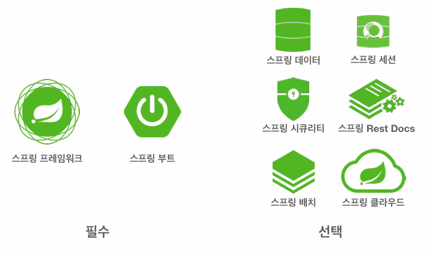

# 1. SpringBoot 소개
## 스프링 프레임워크
- DI 컨테이너, MVC, DB 접근 기술 등 수 많은 기능을 제공하고 다양한 문제 해결
- 다양한 라이브러리들을 편리하게 사용할 수 있도록 통합
- 개발자의 생산성이 높아짐, 사용범위 확대
- 자바 생태계의 사실상 표준 프레임워크

### 스프링 역사
- 2003년 스프링 프레임워크 1.0 - XML 
- 2006년 스프링 프레임워크 2.0 - XML 편의 기능 지원
- 2009년 스프링 프레임워크 3.0 - 자바 코드로 설정
- 2013년 스프링 프레임워크 4.0 - 자바8

### 스프링 프레임워크
- 핵심 기술: 스프링 DI 컨테이너, AOP, 이벤트
- 웹 기술: 스프링 MVC, 스프링 WebFlux
- 데이터 접근 기술: 트랜잭션, JDBC, ORM 지원, XML 지원 
- 기술 통합: 캐시, 이메일, 원격접근, 스케줄링
- 테스트: 스프링 기반 테스트 지원

### 스프링 프레임워크 확대
- 스프링과 그 생태계가 점점 커짐
- 스프링의 기능도 점점 많아짐
- 다양한 오픈 소스의 등장으로 수 많은 라이브러리를 함께 사용해야함
- 스프링으로 프로젝트를 시작할 때 필요한 설정이 점점 늘어남
- 스프링으로 프로젝트를 시작하는 것이 점점 어려워짐
- 시작도 하기 전에 복잡한 설정 때문에 포기

## 스프링 부트의 등장
### 스프링 부트
- BOOT, 부팅
- 최소한의 인간 개입으로 시작하고 완전히 작동하는 것을 의미
- 어떤 일을 시작하기 위해 필요한 모든 준비를 마친다는 의미
- 시작을 위한 복잡한 설정 과정은 스프링 부트가 해결
- 개발자는 새로운 스프링 애플리케이션을 쉽고 빠르게 시작
- 스프링을 편리하게 사용할 수 있도록 지원, 최근에는 기본으로 사용 
- 단독으로 실행할 수 있는 스프링 애플리케이션을 쉽게 생성
- 관례에 의한 간결한 설정

### 스프링 부트 - 핵심 기능 5가지
1. WAS: Tomcat 같은 웹 서버를 내장해서 별도의 웹 서버를 설치하지 않아도 됨
2. 라이브러리 관리
  - 손쉬운 빌드 구성을 위한 스타터 종속성 제공
  - 스프링과 외부 라이브러리의 버전을 자동으로 관리
3. 자동 구성: 프로젝트 시작에 필요한 스프링과 외부 라이브러리의 빈을 자동 등록
4. 외부 설정: 환경에 따라 달라져야 하는 외부 설정 공통화
5. 프로덕션 준비: 모니터링을 위한 메트릭, 상태 확인 기능 제공

### 스프링 역사
- 2003년 스프링 프레임워크 1.0 - XML 
- 2006년 스프링 프레임워크 2.0 - XML 편의 기능 지원
- 2009년 스프링 프레임워크 3.0 - 자바 코드로 설정
- 2013년 스프링 프레임워크 4.0 - 자바8
- 2014년 스프링 부트 1.0
- 2017년 스프링 프레임워크 5.0, 스프링 부트 2.0 - 리엑티브 프로그래밍 지원
- 2022년 스프링 프레임워크 6.0, 스프링 부트 3.0 - 자바 17, Jakarta EE

### 스프링 프레임워크와 스프링 부트
- 스프링 부트는 스프링 프레임워크를 쉽게 사용할 수 있게 도와주는 도구일 뿐이다!
- 본질은 스프링 프레임워크
- 하지만 스프링 부트가 제공하는 편의 기능이 너무 막강해서 스프링 부트 사용은 필수

### 스프링 부트를 배워야 하는 이유
- 스프링 부트는 편리하지만, 너무 많은 것을 자동화
- 최소한 스프링 부트가 어떤 원리로 작동하는지 알아두어야 함
- 그래야 문제가 발생했을 때 해결 가능
- 스프링 부트의 원리를 이해하면 문제점을 쉽게 파악
- 스프링 부트는 수 많은 편의 기능들을 제공
- 대부분의 개발자가 비슷하게 고민하는 기능을 스프링 부트는 이미 만들어서 제공
- 예를 들어서 외부 설정, 액츄에이터를 통한 모니터링 관리 기능
- 개발 시간 단축

### 스프링 단어?
- 스프링이라는 단어는 문맥에 따라 다르게 사용된다.
  - 스프링 DI 컨테이너 기술
  - 스프링 프레임워크
  - 스프링 부트, 스프링 프레임워크 등을 모두 포함한 스프링 생태계
