# 2. 웹 서버와 서블릿 컨테이너
## 웹 서버와 스프링 부트 소개
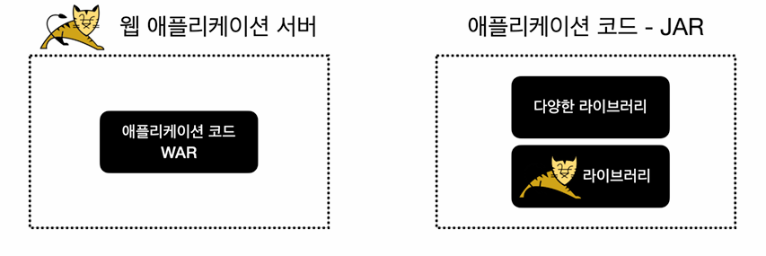

### 전통적인 방식
- 과거에 자바로 웹 애플리케이션을 개발할 때는 먼저 서버에 톰캣 같은 WAS(웹 애플리케이션 서버)를 설치했음
- 그리고 WAS에서 동작하도록 서블릿 스펙에 맞추어 코드를 작성하고 WAR 형식으로 빌드해서 war 파일을 만들었음
- 이렇게 만들어진 war 파일을 WAS에 전달해서 배포하는 방식으로 전체 개발 주기가 동작
- 이런 방식은 WAS 기반 위에서 개발하고 실행해야 함
- IDE 같은 개발 환경에서도 WAS와 연동해서 실행되도록 복잡한 추가 설정이 필요

### 최근 방식
- 최근에는 스프링 부트가 내장 톰캣을 포함
- 애플리케이션 코드 안에 톰캣 같은 WAS가 라이브러리로 내장되어 있다는 뜻
- 개발자는 코드를 작성하고 JAR로 빌드한 다음에 해당 JAR를 원하는 위치에서 실행하기만 하면 WAS도 함께 실행
- 쉽게 이야기해서 개발자는 `main()` 메서드만 실행하면 되고, WAS 설치나 IDE 같은 개발 환경에서 WAS와 연동하는 복잡한 일은 수행하지 않아도 됨

## 톰캣
### 톰캣 설치
- [톰캣](https://tomcat.apache.org/download-10.cgi)
- Download 메뉴에서 Apache Tomcat 10 버전의 톰캣 다운로드
- Core에 있는 `zip`을 선택, 다운로드 후 압축 풀기
- [다운로드 링크](https://tomcat.apache.org/download-10.cgi)

### 톰캣 실행 설정
- MAC, 리눅스 사용자
  - `톰캣폴더/bin` 폴더로 이동
  - 실행: `./startup.sh`
  - 종료: `./shutdown.sh`
  - MAC, 리눅스 사용자는 권한을 주지 않으면 `permission denied`라는 오류 발생 가능
- 윈도우 사용자
  - `톰캣폴더/bin` 폴더로 이동
  - 실행: `./startup.bat`
  - 종료: `./shutdown.bat`

### 실행 확인
- 톰캣 실행한 후 아래 URL에 접근하면 톰캣 서버가 실행된 화면 확인 가능
- [http://localhost:8080](http://localhost:8080)
- 톰캣의 실행 로그는 `톰캣폴더/logs/catalina.out` 파일로 확인 가능

## 프로젝트 설정
- Java 17 이상 설치
- IDE: IntelliJ 또는 Eclipse 설치

### `build.gradle` 확인
```java
plugins {
    id 'java'
    id 'war'
}

group = 'hello'
version = '0.0.1-SNAPSHOT'
sourceCompatibility = '17'
repositories {
    mavenCentral()
}

dependencies {
    //서블릿
    implementation 'jakarta.servlet:jakarta.servlet-api:6.0.0'
}

tasks.named('test') {
    useJUnitPlatform()
}
```
- `id 'war'`: 톰캣 같은 웹 애플리케이션 서버 (WAS) 위에서 동작하는 WAR 파일을 만들어주는 플러그인
- `jakarta.servlet-api`: 서블릿을 사용할 때 필요한 라이브러리

### 간단한 HTML 등록
- 웹 서버가 정적 리소스를 잘 전달하는지 확인하기 위해 HTML을 하나 만들기
  - `/src/main` 하위에 `webapp`이라는 폴더를 생성
  - 다음 HTML 파일을 생성
```html
<!-- /src/main/webapp/index.html -->

<html>
  <body>index html</body>
</html>
```

### 서블릿 등록
- 전체 설정이 잘 동작하는지 확인하기 위해 간단한 서블릿을 하나 만들기
- 웹 서버를 통해 이 서블릿이 실행되어야 함
```java
// TestServlet 등록

package hello.servlet;

import jakarta.servlet.ServletException;
import jakarta.servlet.annotation.WebServlet;
import jakarta.servlet.http.HttpServlet;
import jakarta.servlet.http.HttpServletRequest;
import jakarta.servlet.http.HttpServletResponse;

import java.io.IOException;

@WebServlet(urlPatterns = "/test")
public class TestServlet extends HttpServlet {
    @Override
    protected void service(HttpServletRequest req, HttpServletResponse resp) throws ServletException, IOException {
        System.out.println("TestServlet.service");
        resp.getWriter().println("test");
    }
}
```
- `/test`로 요청이 오면 이 서블릿이 실행됨
- `TestServlet.service`를 로그에 출력함
- `test`를 응답함
- 이 서블릿을 실행하려면 톰캣 같은 웹 어플리케이션 서버(WAS)에 이 코드를 배포해야 함

### WAR 빌드와 배포
- 프로젝트 폴더로 이동
- 프로젝트 빌드
  - `./gradlew build`
  - 윈도우: `gradlew build`
- WAR 파일 생성 확인
  - `build/libs/server-0.0.1-SNAPSHOT.war`

## JAR, WAR 간단 소개
### JAR 소개
- 자바는 여러 클래스와 리소스를 묶어서 `JAR`(Java Archive)라고 하는 압축 파일을 만들 수 있음
- 이 파일은 JVM 위에서 직접 실행되거나 또는 다른 곳에서 사용하는 라이브러리로 제공
- 직접 실행하는 경우 `main()` 메서드가 필요하고, `MANIFEST.MF` 파일에 실행할 메인 메서드가 있는 클래스를 지정해 두어야 함
  - 실행 예) `java -jar abc.jar`
  - Jar는 쉽게 이야기해서 클래스와 관련 리소스를 압축한 단순한 파일
  - 필요한 경우 이 파일을 직접 실행할 수도 있고, 다른 곳에서 라이브러리로 사용할 수도 있음

### WAR 소개
- WAR(Web Application Archive)라는 이름에서 알 수 있듯 WAR 파일은 웹 어플리케이션 서버 (WAS)에 배포할 때 사용하는 파일
- JAR 파일이 JVM 위에서 실행된다면, WAR은 웹 어플리케이션 서버 위에서 실행됨
- 웹 어플리케이션 서버 위에서 실행되고, HTML 같은 정적 리소스와 클래스 파일을 모두 함꼐 포함하기 때문에 JAR와 비교해서 구조가 더 복잡
- WAR 구조를 지켜야 함

### WAR 구조
- `WEB-INF`
  - `classes`: 실행 클래스 모음
  - `lib`: 라이브러리 모음
  - `web.xml`: 정적 리소스
- `index.html`: 정적 리소스

- `WEB-INF` 폴더 하위는 자바 클래스와 라이브러리, 그리고 설정 정보가 들어가는 곳
- `WEB-INF`를 제외한 나머지 영역은 HTML, CSS 같은 정적 리소스가 사용되는 영역

### WAR 배포
- 이렇게 생성된 WAR 파일을 톰캣 서버에 실제 배포
1. 톰캣 서버 종료 `./shutdown.sh`
2. `톰캣폴더/webapps` 하위를 모두 삭제
3. 빌드된 `server-0.0.1-SNAPSHOT.war`를 복사
4. `톰캣폴더/webapps` 하위에 붙여넣기
  - `톰캣폴더/webapps/server-0.0.1-SNAPSHOT.war`
5. 이름을 변경
  - `톰캣폴더/webapps/ROOT.war`
6. 톰캣 서버를 실행 `./startup.sh`

- 실행 결과 확인
  - http://localhost:8080/index.html
  - http://localhost:8080/test

### 톰캣 설정 - 인텔리J 유료 버전
- `메뉴 -> Run... -> Edit Configurations`
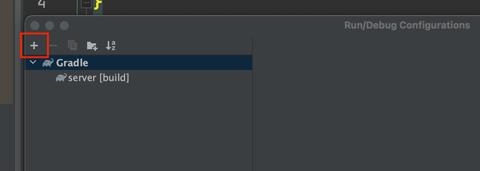
- 왼쪽 상단의 플러스 버튼을 클릭
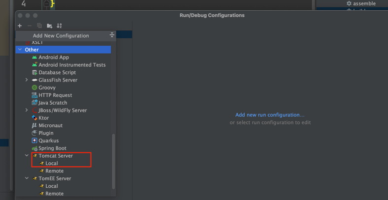
- Other 하위에 있는 Tomcat Server에 Local을 선택
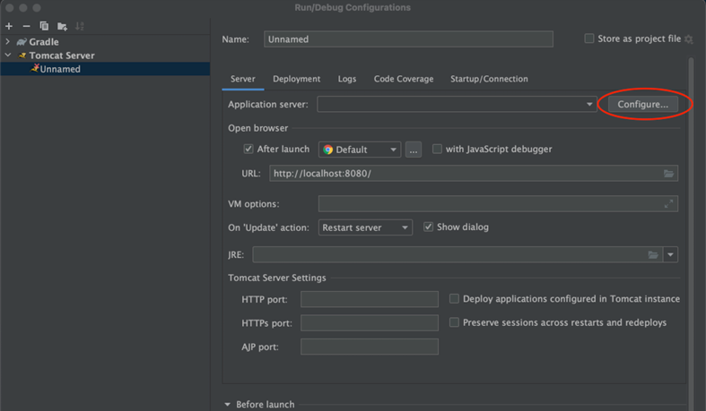
- Configure... 부분을 선택
- Tomcat Home: 부분에 설치된 톰캣 폴더를 선택
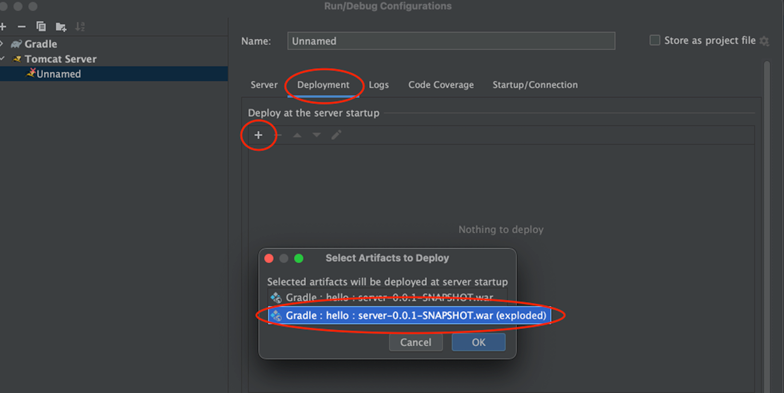
- Deployment 메뉴를 선택
- `+`버튼을 선택
- 끝에 (exploded)로 끝나는 `war`파일을 선택
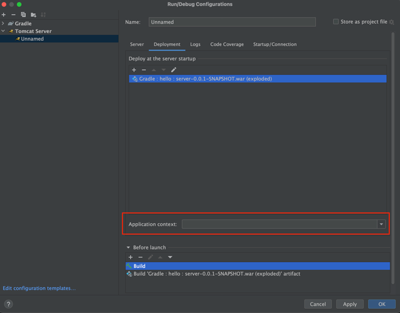
- Application context 박스 안에 있는 내용을 모두 지워줌
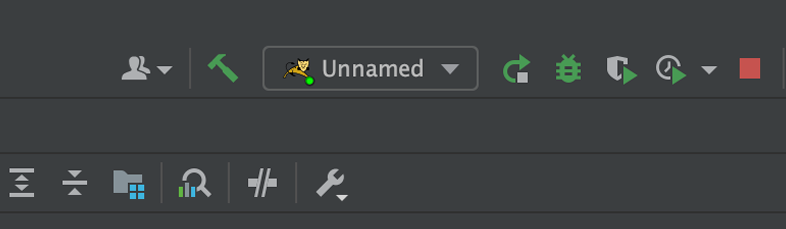
- 설정한 톰캣을 선택하고 실행

> 주의
>  `java.net.BindException: Address already in use` 오류 메시지가 로그에 보이면 앞서 실행한 톰캣 서버가 이미 8080 포트를 점유하고 있을 가능성이 높으므로 `shutdown.sh`를 실행해서 앞서 실행한 톰캣 서버를 내리기(잘 안되면 컴퓨터를 재부팅 하는 것도 방법)

- 실행
  - http://localhost:8080
  - http://localhost:8080/test

## 서블릿 컨테이너 초기화 1
- WAS를 실행하는 시점에 필요한 초기화 작업들이 있음. 서비스에 필요한 필터와 서블릿을 등록하고, 여기에 스프링을 사용한다면 스프링 컨테이너를 만들고, 서블릿과 스프링을 연결하는 디스페처 서블릿도 등록해야 함
- WAS가 제공하는 초기화 기능을 사용하면, WAS 실행 시점에 이러한 초기화 과정을 진행할 수 있음
- 과거에는 `web.xml`을 사용해서 초기화했지만, 지금은 서블릿 스펙에서 자바 코드를 사용한 초기화도 지원

### 서블릿 컨테이너와 스프링 컨테이너
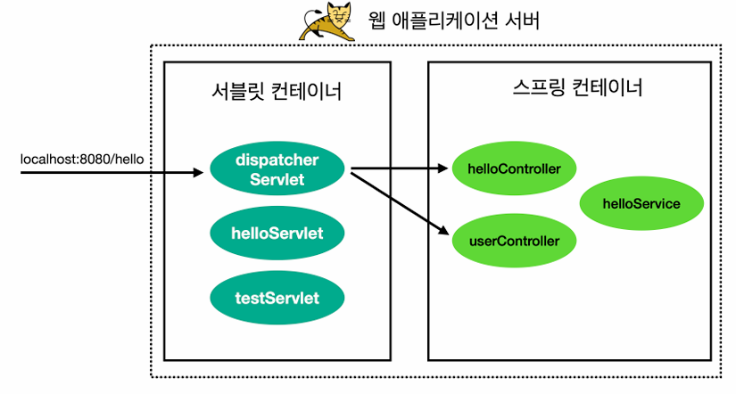

### 서블릿 컨테이어 초기화 개발
- 서블릿은 `ServletContainerInitializer`라는 초기화 인터페이스를 제공. 이름 그대로 서블릿 컨테이너를 초기화 하는 기능을 제공
- 서블릿 컨테이너는 실행 시점에 초기화 메서드인 `onStartup()`을 호출해줌. 여기서 애플리케이션에 필요한 기능들을 초기화 하거나 등록할 수 있음

```java
// ServletContainerInitializer

public interface ServletContainerInitializer {
    public void onStartup(Set<Class<?>> c, ServletContext ctx) throws 
ServletException; 
}
```
- `Set<Class<?>> c`: 조금 더 유연한 초기화 기능을 제공, `@HandlessTypes` 애노테이션과 함께 사용
- `ServletContext ctx`: 서블릿 컨테이너 자체의 기능을 제공, 이 객체를 통해 필터나 서블릿을 등록할 수 있음

```java
// hello/container/MyContainerInitV1

package hello.container;

import jakarta.servlet.ServletContainerInitializer;
import jakarta.servlet.ServletContext;
import jakarta.servlet.ServletException;

import java.util.Set;

public class MyContainerInitV1 implements ServletContainerInitializer {

    @Override
    public void onStartup(Set<Class<?>> c, ServletContext ctx) throws ServletException {
        System.out.println("MyContainerInitV1.omnStartup");
        System.out.println("MyContainerInitV1 c = " + c);
        System.out.println("MyContainerInitV1 ctx = " + ctx);
    }
}
```
- WAS에게 실행할 초기화 클래스를 알려줘야 함
```
resources/META-INF/services/jakarta.servlet.ServletContainerInitializer

hello.container/MyContainerInitV1
```
- 이 파일에 방금 만든 `MyContainerInitV1` 클래스를 패키지 경로를 포함해서 지정해주었음
- 이렇게 하면 WAS를 실행할 때 해당 클래스를 초기화 클래스로 인식하고 로딩 시점에 실행함

> 주의
> 경로와 파일 이름을 주의해서 작성해야함
> `META-INF`는 대문자
> `services`는 마지막에 s가 들어감
> 파일 이름은 `jakarta.servlet.ServletContainerInitializer`

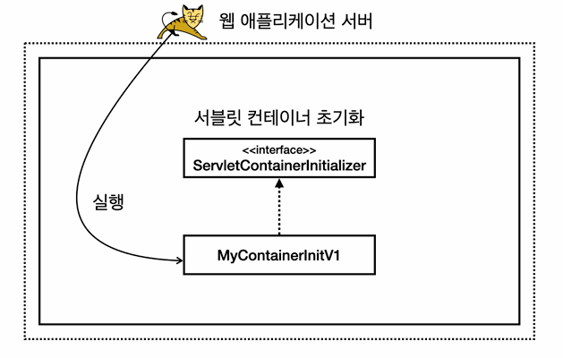

### 실행 결과 로그
```
MyContainerInitV1.onStartup
MyContainerInitV1 c = null
MyContainerInitV1 ctx =
org.apache.catalina.core.ApplicationContextFacade@65112751
```
- WAS를 실행할 때 해당 초기화 클래스가 실행된 것을 확인할 수 있음

## 서블릿 컨테이너 초기화 2
- `HelloServlet`이라는 서블릿을 서블릿 컨테이너에 초기화 시점에 프로그래밍 방식으로 직접 등록해줄 것임

### 서블릿을 등록하는 2가지 방법
- `@WebServlet` 애노테이션
- 프로그래밍 방식

```java
// HelloServlet

package hello.servlet;

import jakarta.servlet.ServletException;
import jakarta.servlet.http.HttpServlet;
import jakarta.servlet.http.HttpServletRequest;
import jakarta.servlet.http.HttpServletResponse;

import java.io.IOException;

public class HelloServlet extends HttpServlet {

    @Override
    protected void service(HttpServletRequest req, HttpServletResponse resp)
            throws ServletException, IOException {
        System.out.println("HelloServlet.service");
        resp.getWriter().println("Hello Servlet!");
    }
}
```
- 서블릿을 등록하고 실행하면 다음과 같은 결과
  - 로그: `HelloServlet.service`
  - HTTP 응답: `hello servlet!`

### 어플리케이션 초기화
- 서블릿 컨테이너는 조금 더 유연한 초기화 기능을 지원
```java
// AppInit

package hello.container;

import jakarta.servlet.ServletContext;

public interface AppInit {

    void onStartup(ServletContext servletContext);
}
```
- 애플리케이션 초기화를 진행하려면 먼저 인터페이스를 만들어야 함
- 내용과 형식은 상관없고, 인터페이스는 꼭 필요함, 예제 진행을 위해서 여기서는 `AppInit` 인터페이스를 만들기
```java
// AppInitV1Servlet

package hello.container;

import hello.servlet.HelloServlet;
import jakarta.servlet.ServletContext;
import jakarta.servlet.ServletRegistration;

public class AppInitV1Servlet implements AppInit {

    @Override
    public void onStartup(ServletContext servletContext) {
        System.out.println("AppInitV1Servlet.onStartup");

        // 순수 서블릿 코드 등록
        ServletRegistration.Dynamic helloServlet =
                servletContext.addServlet("helloServlet", new HelloServlet());
        helloServlet.addMapping("/hello-servlet");
    }
}
```
- 프로그래밍 방식으로 `HelloServlet` 서블릿을 서블릿 컨테이너에 직접 등록
- HTTP로 `/hello-servlet`을 호출하면 `HelloServlet` 서블릿이 실행됨

### 서블릿을 등록하는 2가지 방법
- `@WebServlet` 애노테이션
- 프로그래밍 방식

### 참고 - 프로그래밍 방식을 사용하는 이유
- `@WebServlet`을 사용하면 애노테이션 하나로 서블릿을 편리하게 등록할 수 있음. 하지만 애노테이션 방식을 사용하면 유연하게 변경하는 것이 어려움. 마치 하드코딩 된 것 처럼 동작.
- 아래 참고 예시를 보면 `/test` 경로를 변경하고 싶으면 코드를 직접 변경해야 바꿀 수 있음
- 반면에 프로그래밍 방식은 코딩을 더 많이 해야하고 불편하지만 무한한 유연성을 제공
  - `/hello-servlet` 경로를 상황에 따라서 바꿔 외부 설정을 읽어서 등록할 수 있음
  - 서블릿 자체도 특정 조건에 따라 `if`문으로 분기해서 등록하거나 뺄 수 있음
  - 서블릿을 내가 직접 생성하기 때문에 생성자에 필요한 정보를 넘길 수 있음
```java
// 예시

@WebServlet(urlPatterns = "/test")
public class TestServlet extends HttpServlet {}
```

```java
// MyContainerInitV2

package hello.container;

import jakarta.servlet.ServletContainerInitializer;
import jakarta.servlet.ServletContext;
import jakarta.servlet.ServletException;
import jakarta.servlet.annotation.HandlesTypes;

import java.util.Set;

@HandlesTypes(AppInit.class)
public class MyContainerInitV2 implements ServletContainerInitializer {

    @Override
    public void onStartup(Set<Class<?>> c, ServletContext ctx) throws ServletException {
        System.out.println("MyContainerInitV2.onStartup");
        System.out.println("MyContainerInitV2 c = " + c);
        System.out.println("MyContainerInitV2 container = " + ctx);

        for (Class<?> appInitClass : c) {
            try {
                // new AppInitV1Servlet과 같은 코드
                AppInit appInit = (AppInit)
                        appInitClass.getDeclaredConstructor().newInstance();
                appInit.onStartup(ctx);
            } catch (Exception e) {
                throw new RuntimeException(e);
            }
        }
    }
}
```

### 어플리케이션 초기화 과정
1. `@HandlesTypes` 애노테이션에 애플리케이션 초기화 인터페이스를 지정
  - 여기서는 앞서 만든 `AppInit.class` 인터페이스를 지정
2. 서블릿 컨테이너 초기화(`ServletContainerInitializer`)는 파라미터로 넘어오는 `Set<Class<?>> c`에 애플리케이션 초기화 인터페이스의 구현체들을 모두 찾아서 클래스 정보로 전달
  - 여기서는 `@HandlesTypes(AppInit.class)`를 지정했으므로 `AppInit.class`의 구현체인 `AppInitV1Servlet.class` 정보가 전달됨
  - 객체 인스턴스가 아니라 클래스 정보를 전달하기 때문에 실행하려면 객체를 생성해서 사용해야 함
3. `appInitClass.getDeclaredConstructor().newInstance()`
  - 리플렉션을 사용해서 객체를 생성. 이 코드는 `new AppInitV1Servlet()`과 같다 생각하면 됨
4. `appInit.onStartup(ctx)`
  - 애플리케이션 초기화 코드를 직접 실행하면서 서블릿 컨테이너 정보가 담긴 `ctx`도 함께 전달함

### MyContainerV2 등록
- `resources/META-INF/services/jakarta.servlet.ServletContainerInitializer` 파일에 설정 추가
```
resources/META-INF/services/jakarta.servlet.ServletContainerInitializer

hello.container.MyContainerInitV1
hello.container.MyContainerInitV2
```

### WAS 실행
- 실행 로그
```
MyContainerInitV1.onStartup
MyContainerInitV1 c = null
MyContainerInitV1 ctx = 
org.apache.catalina.core.ApplicationContextFacade@38dd0980
MyContainerInitV2.onStartup
MyContainerInitV2 c = [class hello.container.AppInitV1Servlet]
MyContainerInitV2 container = 
org.apache.catalina.core.ApplicationContextFacade@38dd0980
AppInitV1Servlet.onStartup
```

- 실행: http://localhost:8080/hello-servlet
- 결과: `hello servlet!`

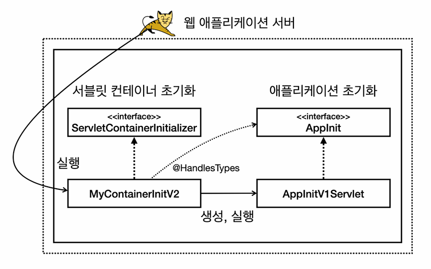

- 초기화 진행 순서
  1. 서블릿 컨테이너 초기화 실행
    - `resources/META-INF/services/jakarta.servlet.ServletContainerInitializer`
  2. 애플리케이션 초기화 실행
    - `@HandlesTypes(AppInit.class)`

> 참고
> 복잡한 애플리케이션 초기화 개념의 배경
> - 편리함
>   - 서블릿 컨테이너를 초기화하려면 `ServletContainerInitializer` 인터페이스를 구현한 코드를 만들어야 함. 추가로 `META-INF/services/jakarta.servlet.ServletContainerInitializer` 파일에 해당 코드를 직접 지정해줘야 함
>   - 애플리케이션 초기화는 특정 인터페이스만 구현하면 됨
> - 의존성
>   - 애플리케이션 초기화는 서블릿 컨테이너에 상관없이 원하는 모양으로 인터페이스를 만들 수 있음. 이를 통해 애플리케이션 초기화 코드가 서블릿 컨테이너에 대한 의존을 줄일 수 있음. 특히 `ServletContext ctx`가 필요없는 애플리케이션 초기화 코드라면 의존을 완전히 제거도 가능

## 스프링 컨테이너 등록
- 스프링 컨테이너 만들기
- 스프링 MVC 컨트롤러를 스프링 컨테이너에 빈으로 등록하기
- 스프링 MVC를 사용하는데 필요한 디스패치 서블릿을 서블릿 컨테이너 등록하기

- 서블릿 컨테이너와 스프링 컨테이너
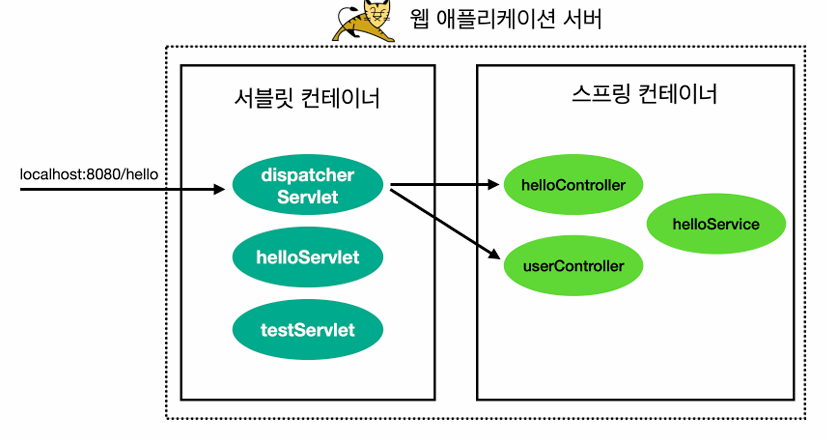

- 스프링 관련 라이브러리 추가
```java
// build.gradle

dependencies {
    //서블릿
    implementation 'jakarta.servlet:jakarta.servlet-api:6.0.0'

    // 스프링 MVC 추가
    implementation 'org.springframework:spring-webmvc:6.0.4'
}
```

```java
// HelloController

package hello.spring;

import org.springframework.web.bind.annotation.GetMapping;
import org.springframework.web.bind.annotation.RestController;

@RestController
public class HelloController {

    @GetMapping("/hello-spring")
    public String hello() {
        System.out.println("HelloController.hello");
        return "hello spring!";
    }
}
```
- 간단한 스프링 컨트롤러

```java
// HelloConfig

package hello.spring;

import org.springframework.context.annotation.Bean;
import org.springframework.context.annotation.Configuration;

@Configuration
public class HelloConfig {

    @Bean
    public HelloController helloController() {
        return new HelloController();
    }
}
```
- 컨트롤러를 스프링 빈으로 직접 등록, 지금은 컴포넌트 스캔을 사용하지 않고 빈을 직접 등록
- 애플리케이션 초기화를 사용하여 서블릿 컨테이너에 스프링 컨테이너를 생성하고 등록

```java
// AppInitV2Spring

package hello.container;

import hello.spring.HelloConfig;
import jakarta.servlet.ServletContext;
import jakarta.servlet.ServletRegistration;
import org.springframework.web.context.support.AnnotationConfigWebApplicationContext;
import org.springframework.web.servlet.DispatcherServlet;

public class AppInitV2Spring implements AppInit {

    @Override
    public void onStartup(ServletContext servletContext) {
        System.out.println("AppInitV2Spring.onStartup");

        // 스프링 컨테이너 생성
        AnnotationConfigWebApplicationContext appContext = new AnnotationConfigWebApplicationContext();
        appContext.register(HelloConfig.class);

        // 스프링 MVC 디스패처 서블릿 생성, 스프링 컨테이너 연결
        DispatcherServlet dispatcher = new DispatcherServlet(appContext);

        // 디스패쳐 서블릿을 서블릿 컨테이너에 등록 (이름 주의! dispatcherV2)
        ServletRegistration.Dynamic servlet = servletContext.addServlet("dispatcherV2", dispatcher);

        // /spring/* 요청이 디스패쳐 서블릿을 통하도록 설정
        servlet.addMapping("/spring/*");
    }
}
```
- `AppInitV2Spring`는 `AppInit`을 구현
- `AppInit`을 구현하면 애플리케이션 초기화 코드가 자동으로 실행

### 스프링 컨테이너 생성
- `AnnotationConfigWebApplicationContext`가 스프링 컨테이너
  - `AnnotationConfigWebApplicationContext` 부모를 따라가 보면 `ApplicationContext` 인터페이스를 확인할 수 있음
  - 이 구현체는 이름 그대로 애노테이션 기반 설정과 웹 기능을 지원하는 스프링 컨테이너로 이해하면 됨
- `appContext.register(HelloConfig.class)`
  - 컨테이너에 스프링 설정을 추가

### 스프링 MVC 디스패처 서블릿 생성, 스프링 컨테이너 연결
- `new DispatcherServlet(appContext)`
- 코드를 보면 스프링 MVC가 제공하는 디스패처 서블릿을 생성하고, 생성자에 앞서 만든 스프링 컨테이너를 전달하는 것을 확인할 수 있음
- 이렇게 하면 디스패처 서블릿에 스프링 컨테이너가 연결됨
- 이 디스패처 서블릿에 HTTP 요청이 오면 디스패처 서블릿은 해당 스프링 컨테이너에 들어있는 컨트롤러 빈들을 호출

### 디스패처 서블릿을 서블릿 컨테이너에 등록
- `servletContext.addServlet("dispatcherV2", dispatcher)
  - 디스패처 서블릿을 서블릿 컨테이너에 등록
- `/spring/*` 요청이 디스패처 서블릿을 통하도록 설정
  - `/spring/*` 이렇게 경로를 지정하면  `/spring`과 그 하위 요청은 모두 해당 서블릿을 통하게 됨
  - `/spring/hello-spring`
  - `/spring/hello/go`

> **주의**
> 서블릿을 등록할 때 이름은 원하는 이름을 등록하면 되지만 같은 이름으로 중복 등록하면 오류가 발생함
> 여기서는 `dispatcherV2` 이름을 사용했는데, 이후에 하나 더 등록할 예정이기에 주의

- 실행: http://localhost:8080/spring/hello-spring
- 결과: `hello spring!`

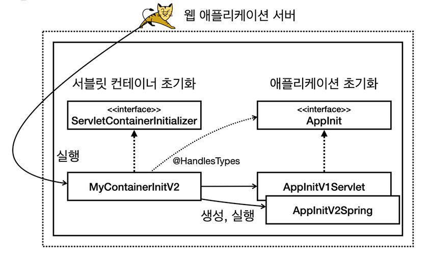


## 스프링 MVC 서블릿 컨테이너 초기화 지원
- 서블릿 컨테이너 초기화 과정은 번거롭고 반복되는 작업
- 스프링 MVC는 이러한 서블릿 컨테이너 초기화 작업을 이미 만들어두었음

```java
// WebApplicationInitializer

package org.springframework.web;

public interface WebApplicationInitializer {
    void onStartup(ServletContext servletContext) throws ServletExceptions;
}
```

```java
// AppInitV3SpringMvc

package hello.container;

import hello.spring.HelloConfig;
import jakarta.servlet.ServletContext;
import jakarta.servlet.ServletException;
import jakarta.servlet.ServletRegistration;
import org.springframework.web.WebApplicationInitializer;
import org.springframework.web.context.support.AnnotationConfigWebApplicationContext;
import org.springframework.web.servlet.DispatcherServlet;

public class AppInitV3SpringMvc implements WebApplicationInitializer {

    @Override
    public void onStartup(ServletContext servletContext) throws ServletException {
        System.out.println("AppInitV3SpringMvc.onStartup");

        // 스프링 컨테이너 생성
        AnnotationConfigWebApplicationContext appContext = new AnnotationConfigWebApplicationContext();
        appContext.register(HelloConfig.class);

        // 스프링 MVC 디스패처 서블릿 생성, 스프링 컨테이너 연결
        DispatcherServlet dispatcher = new DispatcherServlet(appContext);

        // 디스패처 서블릿을 서블릿 컨테이너에 등록 (이름 주의! dispatcherV3)
        ServletRegistration.Dynamic servlet = servletContext.addServlet("dispatcherV3", dispatcher);

        // 모든 요청이 디스패처 서블릿을 통하도록 설정
        servlet.addMapping("/");
    }
}
```
- `WebApplicationInitializer` 인터페이스를 구현한 부분을 제외하고는 이전의 `AppInitV2Spring`과 거의 같은 코드
  - `WebApplicationInitializer`는 스프링이 이미 만들어둔 애플리케이션 초기화 인터페이스
- 디스패처 서블릿을 새로 만들어 등록하였는데, 이전 코드에서와 디스패처 이름을 달리 해주었음
- `servlet.addMapping("/")` 코드를 통해 모든 요청이 해당 서블릿을 타도록 함
  - 아래와 같이 요청할 시 해당 디스패처 서블릿을 통해 `/hello-spring`이 매핑된 컨트롤러 메서드가 호출

- 실행: http://localhost:8080/hello-spring

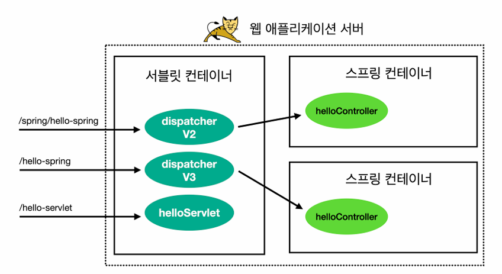
- 현재 등록된 서블릿은 다음과 같음
  - `/` = `dispatcherV3`
  - `/spring/*` = `dispatcherV2`
  - `/hello-servlet` = `helloServlet`
  - `/test` = `TestServlet`
  - 이런 경우 우선순위는 더 구체적인 것이 먼저 실행됨

> **참고**
> - 여기서는 이해를 돕기 위해 디스패처 서블릿도 2개 만들고, 스프링 컨테이너도 2개 만듬
> - 일반적으로는 스프링 컨테이너를 하나 만들고, 디스패처 서블릿도 하나만 만듬. 그리고 디스패처 서블릿의 경로 매핑도 `/`로 해서 하나의 디스패처 서블릿을 통해 모든 것을 처리하도록 함

## 스프링 MVC가 제공하는 서블릿 컨테이너 초기화 분석
- 스프링은 어떻게 `WebApplicationInitializer` 인터페이스 하나로 애플리케이션 초기화가 가능한가
- 결국 서블릿 컨테이너에서 요구하는 부분을 모두 구현해야 함
- `spring-web` 라이브러리를 열어보면 서블릿 컨테이너 초기화를 위한 등록 파일을 확인할 수 있음. 이곳에 서블릿 컨테이너 초기화 클래스가 등록되어 있음

```
/META-INF/services/jakarta.servlet.ServletContainerInitializer

org.springframework.web.SpringServletContainerInitializer
```

### `org.springframework.web.SpringServletContainerInitializer` 코드 확인
```java
// SpringServiceContainerInitializer

@HandlesTypes(WebApplicationInitializer.class)
public class SpringServletContainerInitializer implements ServletContainerInitializer {}
```
- `@HandlesTypes`의 대상이 `WebApplicationInitializer`
- 이 인터페이스의 구현체를 생성하고 실행하는 것을 확인할 수 있음

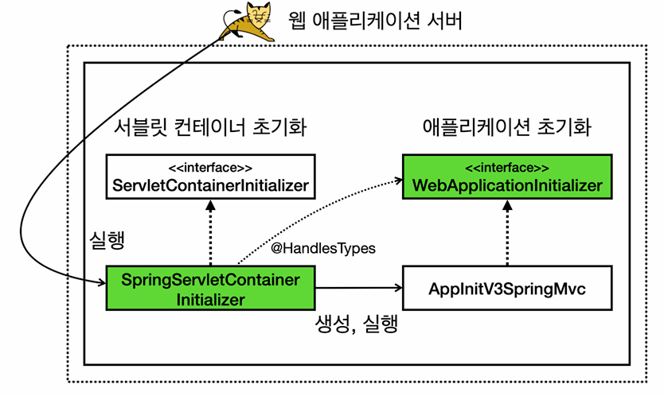
- 초록색 영역이 스프링이 만들어 제공하는 영역

## 정리
- 지금까지 서블릿 컨테이너 초기화를 사용해서 필요한 서블릿도 등록하고, 스프링 컨테이너도 생성해서 등록하고 또 스프링 MVC가 동작하도록 디스패처 서블릿도 중간에 연결해보았음
- 그리고 스프링이 제공하는 좀 더 편리한 초기화 방법도 알아보았음
- 지금까지 알아본 내용은 모두 서블릿 컨테이너 위에서 동작하는 방법
- 따라서 항상 톰캣 같은 서블릿 컨테이너에 배포를 해야만 동작하는 방식
- 과거에는 서블릿 컨테이너 위에서 모든 것이 동작했지만, 스프링 부트와 내장 톰캣을 사용하면서 이런 부분이 바뀌기 시작했음