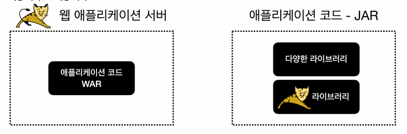

# 3. 스프링 부트와 내장 톰캣
## WAR 배포 방식의 단점
- 웹 애플리케이션을 개발하고 배포하는 과정
  - 톰캣같은 웹 애플리케이션 서버(WAS)를 별도로 설치해야 함
  - 애플리케이션 코드를 WAR로 빌드해야 함
  - 빌드한 WAR 파일을 WAS에 배포해야 함

### 단점
- 톰캣같은 WAS를 별도로 설치해야 함
- 개발 환경 설정이 복잡
  - 단순한 자바라면 별도의 설정을 고민하지 않고, `main()` 메서드만 실행하면 됨
  - 웹 애플리케이션은 WAS 실행하고 또 WAR와 연동하기 위한 복잡한 설정이 들어김
- 배포 과정이 복잡함, WAR을 만들고 이것을 또 WAS에 전달해서 배포해야 함
- 톰캣의 버전을 변경하려면 톰캣을 다시 설치해야 함

### 외장 서버 VS 내장 서버

- 왼쪽 그림은 웹 애플리케이션 서버에 WAR 파일을 배포하는 방식, WAS를 실행하여 동작
- 오른쪽 그림은 애플리케이션 JAR 안에 다양한 라이브러리들과 WAS 라이브러리가 포함되는 방식, `main()` 메서드를 실행하여 동작

## 내장 톰캣 1: 설정
### 프로젝트 설정 순서
1. `embed-start`의 폴더 이름을 `embed`로 변경
2. 프로젝트 임포트
- File -> Open -> 해당 프로젝트의 `build.gradle`을 선택
- Open as Project를 선택

```java
// build.gradle

plugins {
    id 'java'
}

group = 'hello'
version = '0.0.1-SNAPSHOT'
sourceCompatibility = '17'

repositories {
    mavenCentral()
}

dependencies {
    //스프링 MVC 추가
    implementation 'org.springframework:spring-webmvc:6.0.4'

    //내장 톰켓 추가
    implementation 'org.apache.tomcat.embed:tomcat-embed-core:10.1.5'
}

tasks.named('test') {
    useJUnitPlatform()
}

//일반 Jar 생성
task buildJar(type: Jar) {
    manifest {
        attributes 'Main-Class': 'hello.embed.EmbedTomcatSpringMain'
    }
    with jar
}

//Fat Jar 생성
task buildFatJar(type: Jar) {
    manifest {
        attributes 'Main-Class': 'hello.embed.EmbedTomcatSpringMain'
    }
    duplicatesStrategy = DuplicatesStrategy.WARN
    from { configurations.runtimeClasspath.collect { it.isDirectory() ? it : zipTree(it) } }
    with jar
}
```
- `tomcat-embed-core`: 톰캣 라이브러리, 톰캣을 라이브러리로 포함하여 톰캣 서버를 자바 코드로 실행할 수 있음
- `buildJar`, `buildFatJar` 관련 부분은 추후 기술

## 내장 톰캣 2: 서블릿
### EmbedTomcatServletMain
```java
// EmbedTomcatServletMain

package hello.embed;

import hello.servlet.HelloServlet;
import org.apache.catalina.Context;
import org.apache.catalina.LifecycleException;
import org.apache.catalina.connector.Connector;
import org.apache.catalina.startup.Tomcat;

import java.io.File;

public class EmbedTomcatServletMain {

    public static void main(String[] args) throws LifecycleException {
        System.out.println("EmbedTomcatServletMain.main");

        // 톰캣 설정
        Tomcat tomcat = new Tomcat();
        Connector connector = new Connector();
        connector.setPort(8080);
        tomcat.setConnector(connector);

        // 서블릿 등록
        Context context = tomcat.addContext("", "/");

        // 추가코드
        File docBaseFile = new File(context.getDocBase());
        if (!docBaseFile.isAbsolute()) {
            docBaseFile = new File(((org.apache.catalina.Host)
                    context.getParent()).getAppBaseFile(), docBaseFile.getPath());
        }
        docBaseFile.mkdirs();
        // 여기까지

        tomcat.addServlet("", "helloServlet", new HelloServlet());
        context.addServletMappingDecoded("/hello-servlet", "helloServlet");
        tomcat.start();
    }
}
```
- 톰캣 설정
  - 내장 톰캣을 생성하고, 톰캣이 제공하는 커넥터를 사용해서 `8080` 포트에 연결
- 서블릿 등록
  - 톰캣에 사용할 `contextPath`와 `docBase`를 지정해야 함
  - 이 부분은 크게 중요하지 않으므로 위 코드와 같이 적용
  - `tomcat.addServlet()`을 통해서 서블릿 등록
  - `context.addServletMappingDecoded()`을 통해서 등록한 서블릿의 경로를 매핑
- 톰캣 시작
  - `tomcat.start()` 코드를 사용해서 톰캣 시작

- 실행: http://localhost:8080/hello-servlet
- 결과: `hello servlet!`

> **주의**
> 실행시 특정 환경에서 아래의 오류가 발생하는 경우가 있음
> `Caused by: java.lang.IllegalArgumentException: The main resource set specified [...\tomcat\tomcat.8080\webapps] is not valid`
> 이런 경우 아래를 참고하여 코드를 추가해주면 됨
```java
...

// 서블릿 등록
Context context = tomcat.addContext("", "/");

// ==추가코드==
File docBaseFile = new File(context.getDocBase());
if (!docBaseFile.isAbsolute()) {
    docBaseFile = new File(((org.apache.catalina.Host)
context.getParent()).getAppBaseFile(), docBaseFile.getPath());
}
docBaseFile.mkdirs();
// ==여기까지==

tomcat.addServlet("", "helloServlet", new HelloServlet());
context.addServletMappingDecoded("/hello-servlet", "helloServlet");
tomcat.start();
```