# Context-aware vision-language model agent enriched with domain-specific ontology for construction site safety monitoring
## 00. Abstarct
건설 현장 안전 모니터링의 기존 접근 방식은 수동 현장 검사에 크게 의존하며, 이는 사고를 간과하기 쉽다. 기존의 컴퓨터 비전 방법은 시간이 많이 소요되는 사례별 데이터 라벨링이 필요하며, 높은 수준의 추론 능력이 부족하다. 본 논문에서는 비디오 분석에 멀티 모달 비전-언어 모델을 통합하여 인간과 유사한 가상 보조 에이전트를 개발한다. 모델 개발을 위한 이미지-텍스트 데이터를 효율적으로 생성하기 위해, 인-컨텍스트 러닝 기반의 반자동 이미지-텍스트 라벨링 파이프라인을 설계한다. 사전 훈련된 가상 에이전트를 도메인 맞춤형으로 최적화하기 위해, 도메인 특정 작업에 대한 모델 미세 조정 효과를 향상시키는 2단계 커리큘럼 학습 패러다임을 설계한다. 건설 도메인 지식을 가상 에이전트에 보다 효과적으로 주입하기 위해, 보다 도메인 맞춤형 추론 능력을 위해 건설 안전 온톨로지에 의해 구동되는 계층적 프롬프팅 프레임워크를 개발한다. 가상 에이전트는 실제 건설 현장에 실시간 비디오 분석을 위해 배포되었으며, work-at-height 작업 안전 규정 위반 식별에서 90 % 이상의 정확도를 보였다.

## 01. Introduction
건설 부문은 높은 사고 및 사상자 발생률로 인해 전 세계적으로 가장 위험한 분야 중 하나로 인식되고 있다. 2013년부터 2019년까지 홍콩의 건설 부문은 다른 14개의 주요 산업 부문과 비교하여 지속적으로 가장 높은 사망률을 기록했다. 마찬가지로, 2023년 미국에서는 업무 관련 사망의 약 20%가 건설 현장에서 발생한 것으로 보고되었다. 사상자의 상당수는 건설 안전 규칙 미준수와 관련이 있다. 건설 현장은 수많은 작업자와 기계 간의 복잡한 상호 작용으로 인해 발생하는 안전 위험을 특징으로 한다. 안전 위험과 심각한 부상을 예방하려면 작업자 간의 안전하지 않은 관행을 실시간으로 감지하고 분석하는 것이 중요하다. 여기에는 현장 작업자의 활동을 모니터링하고 안전 규칙을 준수하는지 확인하는 것이 포함될 수 있다. 기존의 현장 안전 모니터링은 주로 관리 담당자 및 안전 검사관의 정기적인 현장 안전 검사를 포함하며, 이는 노동 집약적이며 안전하지 않은 행동을 간과하기 쉽다. 최근에는 Convolutional Neural Networks(CNN) 기반의 컴퓨터 비전(CV) 기술이 안전하지 않은 작업자 행동 식별, 개인 보호 장비(Personal Protective Equipment, PPE) 준수 확인 및 중장비 작동 분석에 널리 채택되고 있다.

그러나 CNN 기반 이미지/비디오 분석은 실제 응용 분야에서 몇 가지 제한 사항이 있다.

1. 개발된 CV 모델은 탐지 작업의 작은 하위 집합에 대해서만 잘 훈련된 특수 모델이므로 지식의 좁은 도메인에 의해 제한된다. 특정 안전 규칙 분석을 위해서는 경계 상자의 크기 및 좌표를 기반으로 하는 사례별 수학적 공식화가 필요하며, 이는 Khan et al.이 CNN을 사용하여 작업자-비계 관계를 분석한 것에서 알 수 있듯이 정교한 시스템 설계와 많은 인적 노력이 필요할 수 있다.
2. CNN 기반 모델의 아키텍처는 제한된 임베디드 의미 정보(예: 객체 범주 및 위치)로 이어지는 반면, 건설 이미지에서 의미 정보(예: 건설 활동, 다른 건설 객체 간의 상호 작용)를 추출하는 것은 건설 관리에서 추가 CV 기반 응용 프로그램을 위한 필수 단계이다.

중요한 점은, 기존의 CV 모델은 여전히 의미론적 이해를 수행하기 위한 심층적인 추론 능력이 부족하며, 안전 규정 준수 확인과 같은 건설 애플리케이션은 작업자 행동 및 현장 조건에 대한 고차원적인 추론을 필요로 한다는 것이다. 컴퓨터 비전 모델을 외부 온톨로지 기반 모듈과 결합하면(예: 전문 모델의 출력을 신중하게 설계된 규칙 검사 시스템으로 내보내어) 더 높은 수준의 의미론적 추론을 얻을 수 있지만, 이 프로세스는 시간이 많이 소요되며 다양한 현장 조건에 적응할 때 지속적인 모델 또는 시스템 업데이트가 필요하다. 더 중요한 것은, 이것이 end-to-end 프로세스가 아니라는 점이다. 즉, 비전 양식에서 손실된 정보는 외부 모듈로 전송되지 않고 언어 양식으로 표현되지 않는다.

멀티모달 의미 정보를 처리하는 데 있어 기존의 CNN 기반 또는 온톨로지 기반 방법의 한계를 해결하기 위해, 보다 포괄적이고 엔드 투 엔드 방법이 고려되어야 한다. 최근에는 멀티모달 대규모 언어 모델(MLLM, multi-modal large language models)이 멀티모달 대화 기능으로 인해 널리 연구되고 있으며, 이를 기반으로 VLM은 이미지 처리와 자연어 처리(NLP)를 결합한다. 예를 들어, GPT-4V 및 GroundingDINO는 복잡한 시각적 및 언어적 특징을 모두 추출하고, 심층적인 특징 융합을 거쳐 상세한 이미지 설명을 생성하며, 이미지 캡셔닝, 시각적 근거 및 시각적 질의 응답(VQA, visual question answering)과 같은 여러 유형의 명령 추종 작업을 수행할 수 있다. 건설 애플리케이션의 경우, 텍스트 형식의 건설 안전 규칙은 안전 핸드북 또는 지침에서 추출하여 VLM에 질의로 제공하여 현장 엔지니어/안전 감독관에게 보고되는 권장 조치가 포함된 상세한 사고 설명과 같은 자연어로 된 직관적인 답변을 얻을 수 있다. VLM은 건설 안전 분야에서 인간과 유사한 cross-modal 추론 능력을 보여주며, 이미지, 지시 및 내장된 안전 규칙 입력은 보다 효율적이고 효과적인 데이터 처리와 더 높은 수준의 의미론적 이해를 위해 엔드 투 엔드 방식으로 심층 융합을 거친다. 그러나 일반적인 VLM을 건설 안전 모니터링에 적용하려고 할 때 몇 가지 중요한 과제가 남아 있다.

#### 1) 도메인 맞춤형 VLM 개발을 위한 다중 모드 데이터 부족
도메인 적응에는 방대한 양의 레이블이 지정된 고품질 다중 모드 데이터가 필요하다. 건설 산업은 AI 모델 훈련을 위한 구조화된 데이터의 양이 제한적이며, 현재 다양한 건설 안전 작업에 맞게 VLM을 효과적으로 미세 조정하기 위한 공개 데이터 세트가 부족하다. CogVLM 및 LLaVA와 같은 기존의 파운데이션 및 오픈 소스 VLM은 포괄적인 사전 훈련 또는 지도 학습 미세 조정을 위해 방대한 양의 이미지가 필요하며, 수동 주석 작업은 노동 집약적이다. 따라서 이미지-텍스트 데이터 레이블링을 위한 효율적인 방법론은 도메인 맞춤형 VLM 개발을 크게 촉진할 것이다.

#### 2) 도메인 맞춤형 VLM 개발을 위한 효율적인 미세 조정 전략 부족
CNN 기반 모델과 유사하게 VLM은 주로 인터넷 크라우드 소스 이미지에 대해 사전 훈련되는데, 이는 감시 카메라로 실제 건설 현장에서 캡처한 이미지와 현저하게 다른 이미지 품질을 갖는다. VLM을 실제 현장 다운스트림 작업에 적용하려고 할 때 상당한 데이터 분포 이동이 발생하며, 업계는 미세 조정을 위한 공개 액세스 실제 현장 데이터가 부족하다. 또한 건설 안전 도메인에서 VLM의 미세 조정은 이미지에만 의존하는 것이 아니라 도메인별 지식 학습을 위한 고품질 명령-응답 세트에도 의존하며, 이는 공개적으로 사용할 수 없으며 집중적인 주석 작업이 필요하다. 안전 모니터링에 맞게 조정된 제한적이고 불균형한 비전-텍스트 데이터를 통한 도메인 지식의 효율적인 학습은 특별한 미세 조정 전략으로 해결해야 할 중요한 연구 격차로 남아 있다.

#### 3) VLM에 건설 도메인 지식 통합 부족
기존의 AI 기반 솔루션은 주로 현장 이미지에서 객체 감지 및 분류를 수행했지만, 정확한 안전 모니터링에 중요한 도메인별 지식의 표준화된 표현이 부족했다. VLM이 잠재적인 솔루션이기는 하지만, 원래 객체 인식 및 텍스트 이해에 대한 일반적인 지식만 캡처하는 다양한 데이터로 사전 훈련되었으며, 건설 안전 컨텍스트 내에서 논리적 추론이 부족한 경우가 많다. 도메인 데이터 세트에 대한 미세 조정은 건설 도메인에서 VLM의 일반적인 능력을 이미 향상시킬 수 있지만, 컨텍스트 내 프롬프팅은 다양한 현장별 작업에 효과적으로 적용하고 현장 안전에서 추론 및 규정 준수 확인을 개선할 수 있다. 구조화된 안전 지식을 AI 추론 프로세스에 통합하기 위해 건설 안전 온톨로지가 개발되어 지식 강화된 VLM 추론을 가능하게 하는 도메인 맞춤형 프롬프팅 프레임워크에 포함되었다.

건설 안전 모니터링을 위해 VLM을 적용하는 데 있어 이러한 중요한 과제를 해결하기 위해, 우리는 문제를 해결하기 위한 전체적인 프레임워크를 개발하여 이 논문에서 달성해야 할 다음과 같은 구체적인 연구 목표를 도출한다.

#### 1) 데이터 가용성 문제를 해결하기 위한 반자동 데이터 생성 파이프라인
VLM을 건설 안전 규정 준수 모니터링에 맞추기 위한 고품질 다중 모드 명령 추종 데이터 세트를 생성하기 위한 간소화된 워크플로를 개발하여, 포괄적인 데이터 세트를 준비하는 데 필요한 시간을 크게 줄인다.

#### 2) 데이터 불균형 및 효율성 문제를 해결하기 위해 VLM을 미세 조정하기 위한 2단계 커리큘럼 학습 패러다임
훈련의 첫 번째 단계에서는 이러한 데이터를 더 쉽게 사용할 수 있고 VLM을 사전 훈련된 모델에서 건설 컨텍스트 인식 모델로 빠르게 적용할 수 있으므로 일부 설명 작업이 할당된 crowd-sourced 이미지를 주로 포함한다. 두 번째 단계에서는 현장별 명령 추종 작업과 함께 덜 사용할 수 있는 실제 현장 데이터를 통합하여 VLM의 작업별 안전 모니터링 능력을 더욱 미세 조정한다.

#### 3) 도메인 지식 문제를 해결하기 위한 건설 안전 온톨로지에 의해 구동되는 일반적인 프롬프팅 프레임워크 설계
확립된 온톨로지에서 얻은 건설 관련 지식을 VLM의 계층적 프롬프팅 프레임워크에 포함하여 효과적인 엔드 투 엔드 방식으로 모델의 객체 지역화 및 규칙 분석 기능을 더욱 향상시킬 수 있다. 이 프레임워크는 자연어로 프롬프트를 변경하여 다양한 건설 환경에 쉽게 적응할 수도 있다.

위의 목표를 기반으로 VLM을 개발한 후, 현장 테스트 및 평가를 위해 실시간 비디오 분석 시스템과 더욱 통합한다. 안전 담당자는 설계된 소프트웨어와 쉽게 상호 작용하여 자동 안전 경보 및 포괄적인 질의 응답을 수행할 수 있으므로 기존 방법에 비해 인간의 모니터링 노력을 크게 줄일 수 있다.

## 02. Literature review
연구 목표를 달성하는 VLM 및 온톨로지 기반 안전 모니터링 시스템 개발을 돕기 위해 건설 안전 분석에서 VLM, 프롬프트 엔지니어링 및 온톨로지 방법의 현재 응용 분야 및 제한 사항을 검토했다.

### 2-1. 건설 안전 분석을 위한 비전-언어 모델
현재 VLM은 주로 Vision Transformer-Linear layer-LLM 아키텍처를 기반으로 하며, 이는 언어 모델이 문장을 단어 토큰 시퀀스로 취급하는 것과 유사하게 이미지를 평면화된 패치에서 가져온 시각적 토큰 시퀀스로 취급한다. 임베딩 매핑을 위한 훈련 가능한 선형 레이어를 통한 얕은 정렬 또는 PaLI 및 Qwen-VL에서 채택한 이미지-텍스트 공동 훈련과 같은 멀티모달 특징 정렬을 위한 여러 방법이 개발되었다. 도메인 맞춤형 VLM을 개발하기 위해 일반 작업에 대해 사전 훈련된 파운데이션 모델을 미세 조정하여 다양한 특정 다운스트림 작업에 적합하게 만들 수 있다. 이는 인간이 감독하는 작업별 데이터 세트에서 훈련 프로세스를 계속함으로써 달성된다.

Fan 외 연구진은 작업자의 인체 공학적 위험을 식별하기 위해 특별히 제작된 데이터 세트로 MiniGPT-4를 fine-tuning 했다. 그러나 그들은 평가에서 hallucination 문제를 보고했는데, 이는 훈련 데이터의 양과 다양성이 제한적이기 때문일 수 있다. Jung 외 연구진은 키워드 기반 이미지 검색을 통해 일일 건설 보고서를 생성하여 관련 현장 비디오 영상을 추출하고, 비전-언어 Transformer를 사용하여 각 이미지의 현장 조건과 활동을 설명했다. 그러나 이러한 캡션은 현장에서 발생하는 상황만 설명하며, 더 높은 수준의 추론이 필요한 실제 안전 준수 점검을 수행하지는 않는다.

전통적으로 LLM의 사전 훈련에는 모델 파라미터 확대로 인해 많은 데이터와 컴퓨팅 자원이 필요하다. 다양한 downstream task에서 더 원활한 학습 과정을 보장하려면 보다 효과적인 fine-tuning 기술이 필요하다. Parameter-Efficient FineTuning (PEFT)은 소수의 모델 파라미터 또는 추가적인 소규모 어댑터만 fine-tuning하여 대규모 사전 훈련된 모델을 downstream task에 적용하는 데 항상 사용된다. 이 접근 방식은 LLM을 fine-tuning 하는데 필요한 계산 및 저장 비용을 크게 줄인다. Low-Rank Adaptation (LoRA)는 PEFT의 특정 방법으로, 훈련 가능한 파라미터 수가 훨씬 적음에도 불구하고 작업별 데이터 세트에서 fine-tuning 할 때 모델 품질에서 전체 fine-tuning 과 동등하거나 더 나은 성능을 보인다. LoRA는 사전 훈련된 모델 가중치를 고정하고 훈련 가능한 low-rank 분해 행렬을 Transformer 아키텍처의 선택된 레이어에 삽입힌다.

### 2-2. 건설 안전 분석을 위한 프롬프트 엔지니어링
프롬프트 엔지니어링은 LLM이 지도 학습 과정 없이도 새로운 작업에 적응할 수 있도록 작업별 힌트 또는 지침을 통합하는 기술이다. 다양한 프롬프트 전략에는 작업 지시 프롬프트, in-context learning, 검색 기반 프롬프트 및 chain-of-thought 프롬프트가 있다.

여러 연구에서 사전 훈련된 VLM을 건설 애플리케이션에 적용하기 위해 프롬프트 엔지니어링을 활용했다. Yong 외 연구진은 건물 결함의 zero-shot 및 few-shot 분류 및 탐지 성능을 향상시키는 데 있어 프롬프트의 효과를 조사했다. Wong 외 연구진은 in-context learning 및 majority voting 메커니즘을 기반으로 계약 조항에서 프로젝트 위험을 식별하기 위한 2단계 프롬프트 전략을 설계했다. 그러나 그들은 사전 건설 단계에서 프로젝트 위험 평가를 위해 사전 훈련된 LLM만 채택했으며, 비디오 분석이 필요한 실제 실행 시 현장 안전은 고려하지 않았다. Ho 외 연구진은 텍스트 프롬프트를 이미지 분할 모델과 함께 사용하여 거리뷰 이미지에서 층 높이를 식별했다. Chen 외 연구진은 실시간 이미지 캡셔닝, 안전 중심 VQA 및 키워드 기반 이미지-텍스트 검색을 결합한 시각적 건설 안전 쿼리 챗봇을 개발했다. Sun 외 연구진은 프롬프트 엔지니어링을 더 잘 촉진하기 위해 사전 특징 상호 작용 네트워크를 통합하여 건설 폐기물 인식을 목표로 하는 특수 VLM을 도입했다.

문헌에 있는 기존 연구에 따르면 건설 안전 모니터링을 위한 표준화된 프롬프트 프레임워크가 부족하다. 현재 VLM은 적절한 프롬프트 없이 특정 도메인에 적용할 경우 상황 인식 능력이 부족하고 복잡한 작업이나 익숙하지 않은 시나리오에서 hallucination을 겪는다. 건설 산업에서 프롬프트 엔지니어링에 대한 기존 연구는 주로 짧은 쿼리에 대한 개별적인 응답에 맞춰져 있으며, 건설 도메인 지식(예: 전체 안전 규정 목록)에 맞춘 포괄적인 프롬프트 설계가 부족하다. 지식 강화 프롬프트 프레임워크는 VLM이 안전하지 않은 작업자 행동을 보다 적응적으로 분석하고 보고하도록 안내한다.

### 2-3. 건설 안전 분석을 위한 온톨로지
온톨로지는 엔티티, 속성 및 이들 간의 관계로 구성된 지식의 구조화된 표현이며, 이를 통해 기계는 새로운 지식을 추론하고 추론할 수 있다. 온톨로지는 building information modeling, 자동화된 건물 설계 성능 최적화 및 건설 공급망 관리를 포함한 여러 토목 공학 애플리케이션에 채택되었다. 건설 안전의 경우 여러 연구에서 안전 관련 지식(예: 주요 엔티티 및 계층적 관계)을 나타내는 의미론적 온톨로지를 정의했지만 자동화된 규정 준수 점검을 위한 현장 이미지 분석과 통합하지 않았다. Shen 외 연구진은 건물의 계획된 건설 프로세스/일정을 분석하여 안전 위험을 식별하기 위한 추론 기반으로 온톨로지를 정의했다. Xing 외 연구진은 계획 단계에서 건설 프로젝트 설명에서 안전 위험을 추론하기 위한 온톨로지도 개발했다. 그러나 이러한 연구는 안전을 위한 설계에만 초점을 맞추고 실시간 현장 조건 모니터링과 통합하지 않았다.

건설 현장 모니터링의 경우 건설 안전 온톨로지는 안전 규정, 위험 및 최상의 안전 관행에 대한 도메인별 정보를 캡슐화하여 건설 안전 규정 준수 점검을 용이하게 할 수 있다. 여러 연구에서 CV 모델을 NLP 알고리즘과 통합하여 현장 안전 규정 준수 점검을 수행하고, 안전 조건에 대한 보다 구조화되고 포괄적인 분석을 위해 잘 확립된 온톨로지를 활용했다. Zhang 외 연구진은 Mask-RCNN을 사용하여 개별 객체를 탐지하고 Transformer를 사용하여 객체 쌍 간의 관계를 추론했다. 그런 다음 BERT를 키워드 매핑 메커니즘과 결합하여 규정에서 도메인 지식을 통합하여 최종적으로 위험 설명을 생성했다. 그러나 규칙 위반 분류는 범위가 제한되어 작업자가 PPE를 착용하는지 여부만 간단한 객체 탐지를 기반으로 확인했다. 행동 모니터링을 위한 보다 복잡한 작업자 움직임 분석이 필요하다. Fang 외 연구진은 작업자, PPE 및 이동 장비 간의 공간 근접성/충돌 분석을 용이하게 하기 위해 온톨로지를 정의했다. Pan 외 연구진은 비디오/이미지에서 엔터티를 추출하고 건설 활동 온톨로지를 사용하여 의미론적 매핑을 수행하기 위한 지식 추출 프레임워크를 제안했다. 그러나 이러한 연구에서는 여전히 온톨로지를 이미지 프레임에서 추출된 객체를 안전 규칙에 맞추기 위한 외부 모듈로 활용했다. 멀티 모달 데이터 상관 관계 및 특징 집계의 고유한 복잡성으로 인해 비전 및 언어 모듈을 end-to-end 모델이 아닌 별도로 처리하는 프로세스는 비효율적이고 시간이 많이 걸린다. 또한 서로 다른 modality 간에 안전 정보를 전송하는 동안 중요한 문제가 발생한다. 비전 modality에서 추출되지 않은 특징은 언어 modality로 표현될 때 손실될 수 있다. 이러한 정보 손실은 안전 조건에 대한 불완전하고 부정확하거나 심지어 왜곡된 표현으로 이어져 규정 준수 점검 프로세스의 효과를 저해할 수 있다.

위의 제한 사항을 해결하기 위해 건설 안전 온톨로지와 VLM 프롬프트 설계를 통합하면 end-to-end 방식으로 다중 모드 특징 추출을 향상시킬 수 있으며, 이는 아직 충분히 연구되지 않았다. 더욱 중요한 것은 기존 방법에 사용된 온톨로지 모델은 정교한 시스템 설계와 건설 현장의 끊임없이 변화하는 조건을 추적하기 위한 빈번한 업데이트가 필요하다는 것이다. 이러한 지속적인 업데이트 필요성은 유지 관리 비용 및 확장성 측면에서 상당한 어려움을 초래할 수 있다. 한편, VLM의 in-context learning 프롬프트는 자연어의 간단한 편집을 통해 보다 효율적으로 업데이트할 수 있다. in-context 프롬프트에 온톨로지를 통합하면 비용과 시간 모두에서 문제를 해결할 수 있다.

## 03. Proposed methodology
건설 안전 애플리케이션을 위해 VLM을 적용하는 데 있어 근본적인 문제를 해결하기 위해 데이터 부족 문제와 도메인 적용 어려움을 체계적으로 해결하기 위한 포괄적인 프레임워크가 제안된다. 전반적인 방법론은 Fig 01에 나와 있으며, 주로 다음을 포함한다.

1. 규정 준수 점검을 위한 안전 규칙 목록을 정의하기 위한 문헌 검토
2. in-context learning 파이프라인을 사용한 반자동 데이터 생성
3. 2단계 curriculum learning 패러다임을 사용한 상황 인식 VLM 개발
4. 건설 안전 온톨로지에 의해 주도되는 도메인 맞춤형 프롬프트 프레임워크 설계
5. 사고 보고 및 대화형 VQA를 통한 실시간 비디오 분석을 위해 실제 건설 현장에 배포

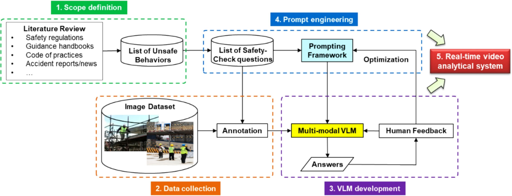

### 3-1. 반자동 이미지-텍스트 데이터 라벨링 파이프라인 
본 섹션에서는 건설 안전 규정 준수 모니터링을 위한 도메인 맞춤형 VLM 개발을 위해 고품질의 멀티모달 및 instruction-following 데이터셋을 핵심 객체 좌표와 함께 생성하는 간소화된 워크플로우를 설명한다. Fig 02에서 볼 수 있듯이, in-context learning 프레임워크에 의해 구동되는 반자동 및 자체 지도 어노테이션 파이프라인이 설계되었다.

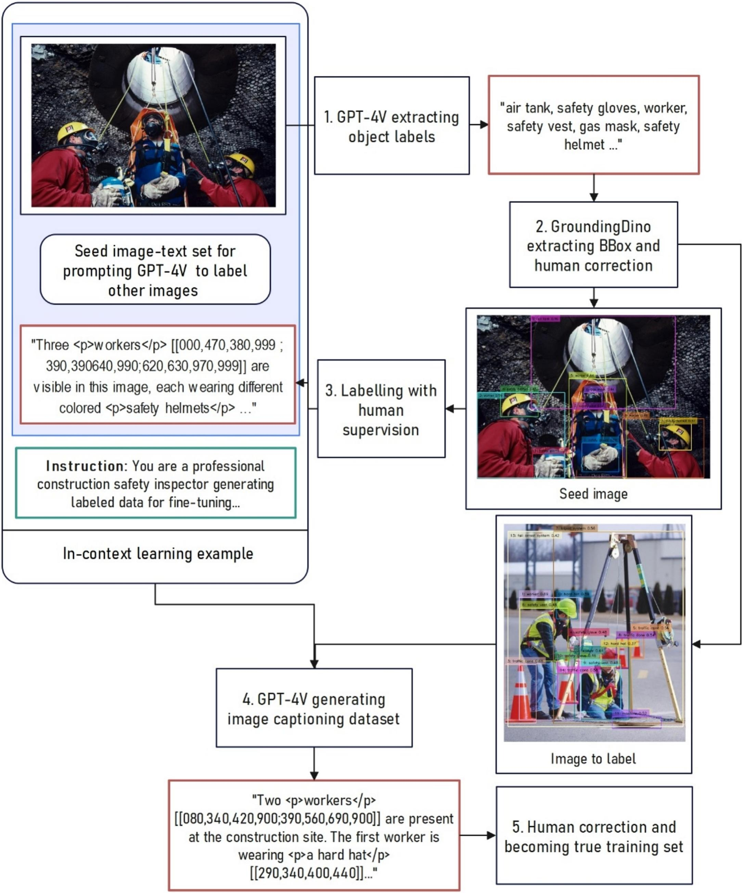

데이터 생성 파이프라인은 GPT-4V 및 GroundingDINO의 사전 훈련된 기능, 즉 GroundingDINO의 open-set 객체 인식과 GPT-4V의 멀티모달 이해 및 프롬프팅을 활용한다. 특히, 반자동 라벨링 파이프라인은 다음의 5단계를 수행한다.

#### 1) 자동 레이블 및 바운딩 박스 생성
GPT-4V를 활용하여 각 이미지의 핵심 객체 목록(pseudo labels)을 일괄적으로 생성힌다. 그런 다음 pseudo labels는 GroundingDINO에 텍스트 프롬프트로 전달되어 지정된 종류의 객체에 대한 후보 바운딩 박스를 생성한다.

#### 2) Pseudo Label 수정
사전 훈련된 GPT-4V와 GroundingDINO의 조합은 경쟁력 있는 zero-shot 이미지 처리 정확도를 보여주지만, 추론된 pseudo-labels 및 바운딩 박스의 정확성과 신뢰성을 보장하기 위해 수동으로 검사한다. 

#### 3) 시드 이미지 선택 및 수작업
각 안전 시나리오(예: 그림 3에 표시된 밀폐 공간)의 어노테이션된 이미지에서 시드 이미지를 선택하고, 검증된 바운딩 박스에 따라 grounded captioning(자세한 설명) 또는 안전 준수 분석의 질의응답으로 시드 이미지에 대한 설명을 수작업으로 작성한다. 이는 우리가 획득하고자 하는 instruction-response dataset의 예시를 구성한다. 

#### 4) 데이터 세트 생성을 위한 In-context Learning
예제 instruction-response 세트가 있는 시드 이미지를 in-context learning 프롬프트로 전달하여 GPT-4V가 나머지 이미지에 대한 후보 instruction-response 세트를 생성하도록 한다. 본 논문에서 grounded captioning을 위한 instruction-response 세트를 획득하기 위해 설계된 in-context learning 프롬프트는 아래에 요약되어 있다.

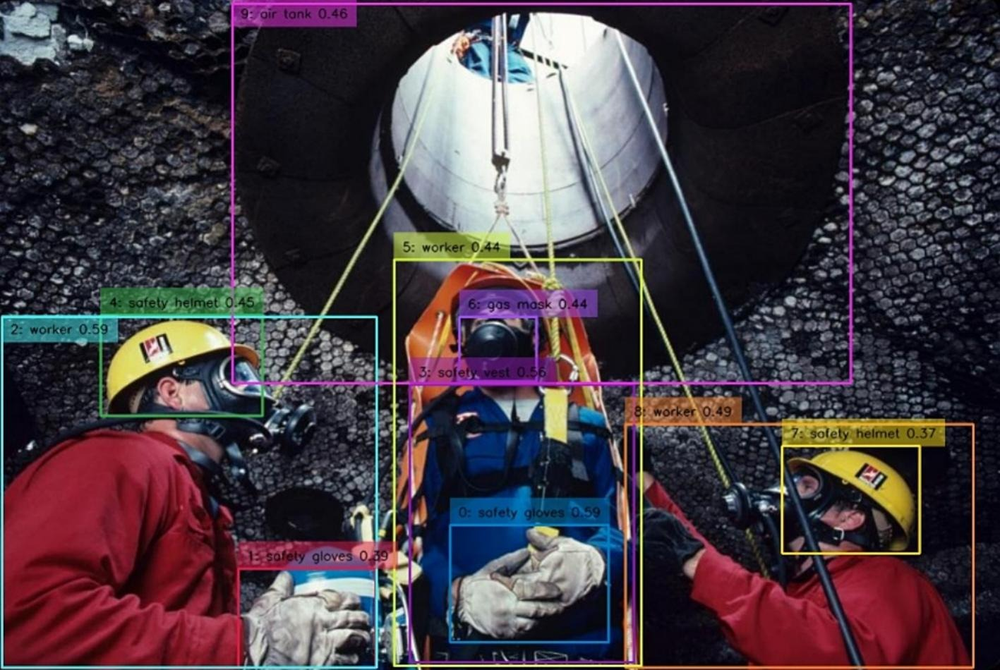

```
System Message:
  You are a professional construction safety inspector generating labeled data for fine-tuning a safety domain-specific Vision Large Language Model.

  You will be given the accurate data of bounding boxes of some workers and objects in the given annotated image. The coordinates of the BBoxes are in ‘x1,y1,x2,y2’ format with the origin at the top left corner, the x-axis to the right, and the y-axis downward, (x1,y1) and (x2,y2) as top-left and bottom-right corners of the box respectively and values in relative coordinates multiplied by 1000 (prefixed with zeros to three digits).
  
  Please help me draft an instruction for a brief description of the safety condition shown in the image and the corresponding response, and the response should include reference to the given bounding boxes of workers and objects. Please count the number of workers and give a number ID to each worker (ignore the BBox IDs of the workers and start the counting and ID numbering from 1, from left to right of the image). Also, include each worker’s BBox and any of his appearance (like vest color or helmet color) when you mention his safety condition. The given BBox data is sorted in ascending order of x1 coordinate (from left to right). Please include request for grounding with coordinates in the instruction part, and keep the response concise within 200 words, step-by-step and specific to the content of the image. Only include things that you are sure about. Now you will be given an example for reference:

Example:
  {
    Image: # An image of a construction site with a few workers and a tower crane.
    Objects: [.
      {“value”: 1, “label”: “worker”, “box”: “140,320,240,720”};
      … # List of candidate objects with corresponding label and bounding box.
      {“value”: 8, “label”: “red safety helmet”, “box”: “814,294,890,360”}.
    ]
    Instruction: Please describe the work environment and safety condition in the image, and include the worker IDs (count from left to right) and co-ordinates for crucial objects in format [object] [[x0,y0,x1,y1]].
    Response: The image depicts a construction site with a tower crane in the background and five workers visible:
      - [Worker 1] [[000,330,100,740]] is not wearing a safety helmet or vest.
      - [Worker 2] [[140,320,240,720]] has a white [safety helmet] [[164,325,202,368]], but lacks a safety vest.
      - [Worker 3] [[370,230,520,980]] is wearing a red [safety helmet] [[410,230,490,300]], yet lacks a safety vest.
      - [Worker 4] [[480,260,600,910]] is without any safety helmet or vest.
      - [Worker 5] [[800,290,970,999]] sports a red [safety helmet] [[814,294,890,360]], but lacks a safety vest.
      Immediate action is required to ensure all workers are equipped with safety helmets and high-visibility vests.
  }

You need to rephrase the instruction in a natural way. In the response, the grounded objects with BBoxes should be marked in format [object] followed by coordinates in format [[x1,y1,x2,y2]]. Use the format [[x1,y1,x2,y2;x1,y1,x2,y2;x1,y1,x2,y2;…]] (No spacing between sets of coordinates) for multiple BBoxes of the same object type. You should also pay attention to whether each worker wears sufficient PPE, especially a safety helmet and a safety vest. Now, you will be given the image and key objects for your output of the corresponding instruction and response:
  Image: #The image to be used in the dataset.
  Objects: #The key object list of the image with the IDs and coordinates.
  Output:
```

#### 5) 후보 데이터세트 개선
GPT-4V에 의해 생성된 후보 명령어-응답 세트는 데이터세트에서 더 바람직한 샘플을 만들기 위해 사람의 감독하에 더욱 최적화되며, 각각은 이미지-명령어-응답의 세 쌍을 이룬다. 샘플 출력은 VLM 관련 연구에서 채택한 대화형 형식을 따라 그림 4에 설명되어 있다. 서로 다른 이미지에 걸쳐 명령어는 텍스트 다양성을 주입하기 위해 약간씩 다르며, 이는 VLM이 입력 명령어로부터 더 강력하고 일반화 가능한 특징을 학습하도록 장려한다.

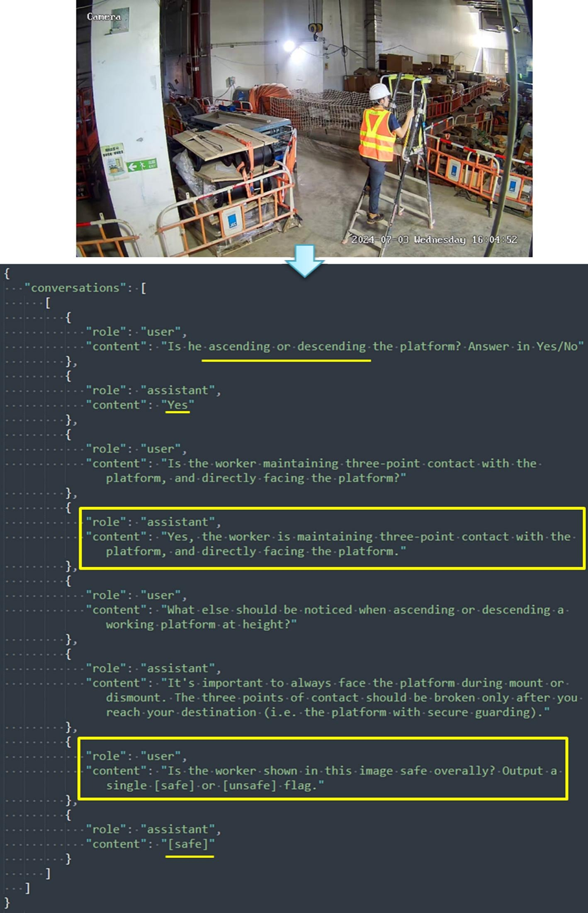

### 3-2. 컨텍스트 인식 VLM을 위한 2단계 커리큘럼 학습 패러다임
[3-1 절](#3-1-반자동-이미지-텍스트-데이터-라벨링-파이프라인)에서 생성된 이미지-명령어-응답 세 쌍 데이터세트를 사용하여, 컨텍스트 인식 VLM이 멀티 모달 데이터 간의 고수준 추론을 위해 개발된다. 이전 연구에서는 일반적인 데이터세트로 사전 훈련된 VLM이 특정 도메인에 대한 잘못 해석된 지식으로 인해 부정확한 응답, 즉 환각을 겪는다고 보고했다. 도메인 지식을 VLM에 보다 효과적으로 통합하고 앞서 언급한 데이터 불균형 문제를 해결하기 위해, 본 논문에서는 VLM 미세 조정을 향상시키기 위한 2단계 커리큘럼 학습 패러다임을 제안한다. 특히, CogAgent의 아키텍처가 Fig 05에서 볼 수 있듯이 미세 조정을 위해 추가된 LoRA 어댑터와 함께 기준 모델로 선택된다. CogAgent는 사전 훈련된 VLM, 특히 오픈 소스이자 최첨단 대규모 비전 언어 모델인 CogVLM 17B를 기반으로 구축되었다.

EVA2-CLIP-E는 저해상도 이미지 입력(490 × 490 픽셀)을 위한 인코더로 사용되며, MLP 어댑터는 시각-언어 디코더의 특징 공간에 출력을 매핑하는 데 사용된다. 시각-언어 디코더는 이미지 특징과 언어 특징 간의 효과적인 심층 융합을 위해 비전 전문가와 언어 백본으로 구성된다. 디코더는 저해상도 이미지 특징 시퀀스와 텍스트 특징 시퀀스의 결합된 입력을 처리하고 대상 텍스트를 자동 회귀적으로 출력한다. 그러나 원래 CogVLM은 비교적 낮은 해상도(예: 224 또는 490)의 이미지만 수용할 수 있으며, 이는 일반적으로 1280 × 720 픽셀 이상인 컴퓨터 또는 스마트 장치의 화면 해상도에는 충분하지 않다. 이를 해결하기 위해, CogAgent 아키텍처에는 고해상도 이미지를 통해 효율성을 유지할 뿐만 아니라 다양한 시각-언어 모델 아키텍처에 대한 유연한 적응성을 제공하는 고해상도이지만 크기 효율적인 교차 모듈이 도입되었다. 고해상도 교차 모듈은 더 높은 해상도 입력을 위한 새로운 분기 역할을 하며, 1120 × 1120 픽셀 크기의 이미지를 허용한다. 원래의 저해상도 입력 분기와 달리, 고해상도 교차 모듈은 훨씬 더 작은 사전 훈련된 비전 인코더(0.30B 파라미터의 EVA2-CLIP-L)를 채택하고, 작은 숨겨진 크기의 교차 어텐션을 사용하여 고해상도 이미지 특징을 VLM 디코더의 모든 레이어와 융합하여 계산 비용을 줄인다. 각 디코더 레이어의 어텐션 모듈 공식은 다음 방정식에 요약되어 있다.

```math
X_i' = MSA(layernorm(X_{in}')) + X_{in}' \\
X_{out}^i = MCA(layernorm(X_i'), X_{hi}) + X_i'
```

MSA와 MCA는 각각 디코더 비전 전문가의 multi-head self-attention과 고해상도 모듈과 디코더 간의 multi-head cross-attention을 나타낸다. 고해상도 이미지를 사용한 교차 어텐션은 저해상도 이미지의 특징을 보완하는 것으로 인식될 수 있으며, 따라서 이전의 저해상도 사전 훈련된 모델을 효과적으로 활용할 수 있다. CogAgent는 GroundingDINO와 견줄 만한 수준의 성능을 보이는 RefCOCO, RefCOCO+, RefCOCOg와 같은 REC(Referring Expression Comprehension)를 평가하는 벤치마크에서 뛰어난 성능을 보인다.

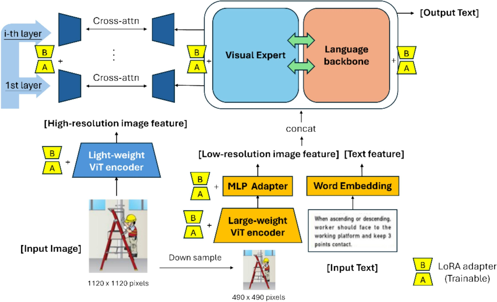

최근 연구에서는 VLM을 보다 효과적으로 훈련하기 위해 단계별 학습 방식을 채택했다. 예를 들어, MiniGPT-v2는 더 나은 시각-텍스트 특징 정렬을 위해 3단계(사전 훈련, 다중 작업 훈련 및 다중 모달 명령어 튜닝)로 훈련되었으며, 단계에 따라 데이터 양은 감소하지만 사람의 감독은 증가했다. 이러한 원리에 영감을 받아, 그림 6에 설명된 바와 같이 VLM에 도메인 지식과 여러 안전 관련 작업의 기능을 부여하기 위해 2단계 커리큘럼 학습 패러다임이 제안된다.

2단계 커리큘럼 학습 패러다임은 인간의 학습 과정을 모방하며, 더 쉬운 작업으로 시작하여 모델이 도메인 지식을 보다 효율적으로 학습할 수 있도록 더 어려운 작업으로 끝맺는다.

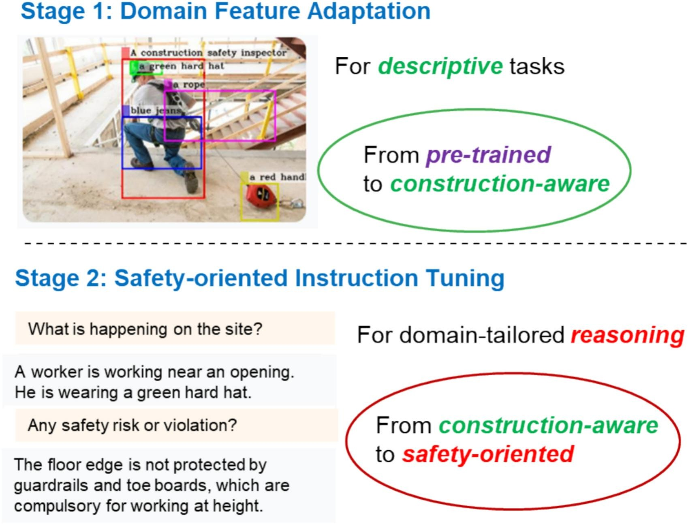

#### 1) 1단계 – 도메인 특징 적응
첫 번째 단계는 레이블, 좌표 및 상호 관계로 주석이 달린 관심 객체가 주어졌을 때 건설 관련 특정 도메인 지식을 주입하기 위해 접지된 캡셔닝을 사용하여 건설 현장 이미지 세트에 대한 VLM의 미세 조정을 포함한다. bounding box 주석은 이 학습 단계에서 관련 이미지 픽셀에 대한 모델의 주의를 높여 도메인 교차 모달 지식과 보다 효율적으로 정렬하는 데 도움이 될 수 있다. 이 단계는 사전 훈련된 VLM을 관련 설명 작업에서 뛰어난 건설 인식 VLM으로 변환하는 역할을 한다.+ 설명 작업 데이터와 크라우드 소싱된 온라인 이미지는 더 쉽게 준비하고 사용할 수 있으므로, 이 단계에서 미세 조정을 위해 주로 이러한 종류의 데이터를 포함한다.

#### 2) 2단계 – 안전 중심 Instruction Tuning
두 번째 단계는 안전 준수 검사에서 작업 특화된 성능을 얻기 위해, 도메인 작업에서 VLM의 instruction-following 메커니즘을 현장별 안전 규칙에 맞춰 조정하는 데 중점을 둔다. 이 단계는 (1단계 완료 후) 건설 인식 VLM을 상황 인식 추론 능력을 갖춘 안전 중심 가상 어시스턴트로 변환하는 역할을 한다. 샘플에서 보다 구체적인 안전 준수/위반 사례와 그 분석을 학습함으로써, 모델은 특정 안전 요구 사항에 기반한 논리적 사고를 수행하도록 장려된다. 이러한 종류의 샘플은 정교한 추론과 참조를 위한 더 많은 실제 현장 이미지에 대한 더 많은 주석을 필요로 하므로, 쉽게 구할 수 없다. 따라서 데이터 세트는 양은 적지만 이 단계에서 더 많이 지도되며, 이는 기존 VLM 미세 조정의 일반적인 패러다임에 해당하고 데이터 불균형 문제를 효과적으로 해결한다.

그림 7의 전후 분석은 미세 조정 후 VLM의 풍부해지고 도메인에 맞게 조정된 추론 능력을 보여준다. 높은 곳에서 작업하는 작업자가 있는 이미지로 프롬프트되었을 때, 사전 훈련된 VLM(제너럴리스트)은 헬멧 착용이라는 일반적인 안전 규칙만 고려하고 안전 관리자에게 유용한 권장 사항을 제공하지 않는다. 건설 도메인 지식을 주입한 후, 상황 인식 VLM(스페셜리스트)은 추락 위험이 있는 보호되지 않은 개구부와 같이 더 복잡한 시나리오를 분석하고 더 실행 가능한 권장 사항(예: 안전 난간 및 개인 추락 방지 장비)을 제안할 수 있다.

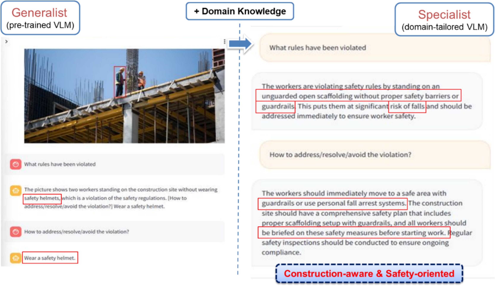

### 3-3. 건설 안전 온톨로지에 기반한 계층적 프롬프팅 프레임워크
이후, 미세 조정된 CogAgent는 다양한 고층 작업 시나리오 이미지와 함께 VQA 프로세스에 사용된다. 추론 중에 CogAgent의 VQA 성능을 더욱 향상시키기 위해 효과적인 VLM 프롬프팅 프레임워크가 개발되었다. 프롬프팅은 원하는 응답 또는 연속을 생성하기 위해 VLM에 초기 입력 또는 컨텍스트를 제공하는 것을 의미한다. 프롬프트는 질문, 문장, 코드 스니펫 또는 예제의 형태일 수 있다. 프롬프트는 응답을 생성할 때 VLM을 안내하여 원하는 컨텍스트 또는 주제와 일치하도록 보장하는 시작점 또는 특정 instruction 역할을 한다. 이는 VLM에서 출력되는 합리적이고 도메인 지향적인 답변을 보장하는 초기 컨텍스트와 제약 조건을 제공한다. 다음을 포함하여 다양한 애플리케이션에 대한 일반적인 지침으로 여러 프롬프팅 원칙이 제안된다.

- Chain-of-Thought (COT) Prompting: COT 원칙은 LLM이 다단계 중간 추론을 통해 복잡한 산술 또는 추론 작업을 해결하고 단계에서 올바른 최종 답변을 얻을 수 있도록 한다. 이 방법은 논리적 추론 또는 문제 해결 기술이 필요한 작업에 특히 유용히다.
- Least-to-Most (LTM) Prompting: LTM 원칙은 복잡한 문제를 일련의 더 간단한 하위 문제로 분해하여 해결하는 방법이다. 이 프로세스는 분해 및 하위 문제 해결의 두 단계로 구성된다. 분해 단계에서는 분해를 보여주는 instruction 또는 few-shot 예제가 프롬프트에 제공되고 분해할 특정 질문이 이어진다. 하위 문제 해결 단계에서는 하위 문제를 해결하는 방법을 보여주는 few-shot 예제를 제공한 다음 언어 모델에 순차적으로 하위 문제를 해결하여 최종 답변을 얻도록 쿼리할 수 있다. least-to-most 프롬프팅을 사용하는 LLM은 프롬프트 또는 훈련 세트에서 볼 수 있는 것보다 더 어려운 문제로 일반화할 수 있다.

추론 중에 VLM의 VQA 성능을 더욱 향상시키기 위해 효과적인 프롬프팅 프레임워크가 개발되었다. 그 동기는 프롬프트의 일부로 건설 관련 지식을 CogAgent에 내장하기 위함이다. 안전 규칙/규정/질문 목록은 요약된 다음 여러 전략에 의해 보강된다.

1. 도메인별 역할 정의: 특정 역할이 2인칭 관점에서 VLM에 대해 정의되어("전문 건설 현장 안전 감독자로서...") 더 적합한 도메인 추론을 수행하고 더 적합한 키워드(예: PPE 준수, 안전 위험 등)와 관련된 답변을 생성할 가능성을 높인다.
2. 구조화된 응답: VLM의 각 중간 응답의 형식/구조가 잘 정의되어 있다(예: 미리 정의된 키-값 쌍 목록과 함께 JSON을 출력하도록 프롬프트). 이러한 데이터 구조화는 각 단계에서 보다 결정적인 출력을 보장하여 VLM이 이전 단계의 중간 출력을 후속 단계를 수행하기 위한 기반으로 효과적으로 해석할 수 있도록 한다.
3. 프롬프트 체이닝: COT 및 LTM 기술을 결합하여 안전 준수 확인의 복잡한 문제를 더 쉬운 하위 문제로 나누어 이미지를 단계별로 분석하는 체계적인 절차를 형성한다. 

원래 안전 규칙은 VLM이 해석하고 추론을 수행하기에는 추상적/일반적인 경향이 있으므로 원래 설명은 먼저 건설 온톨로지를 기반으로 하는 VLM 엔진의 VQA 프로세스에 더 적합한 프롬프트 세트로 변환된다. Fig. 8은 건설 안전 온톨로지 생성을 위한 제안된 계층적 워크플로우를 요약한다. 온톨로지 생성 프레임워크는 4개의 레벨로 구성된다.

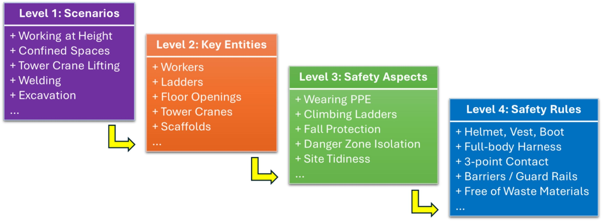

#### Level 1) 시나리오
모니터링 프로세스에 관련된 특정 건설 작업은 안전 요구 사항의 범위를 명확하게 정의하기 위해 식별되어야 한다(예: 고층 작업, 리프팅 또는 굴착).

#### Level 2) 주요 개체
정의된 안전 규칙 목록을 기반으로 안전 분석과 관련된 필수 객체/장비/기계가 식별된다(예: 고층 작업을 위한 사다리/비계, 리프팅을 위한 타워 크레인 등).

#### Level 3) 안전 측면
식별된 개체를 기반으로 가능한 안전하지 않은 행동의 범주가 식별된다(예: 작업자가 관련된 경우 개인 보호 장비(PPE)가 필요하고, 고층 작업이 포함된 경우 사다리 오르기를 모니터링해야 하며, 타워 크레인 리프팅이 필요한 경우 위험 구역을 정의해야 함).

#### Level 4) 안전 규칙
정의된 범위(시나리오, 개체 및 안전 측면)를 기반으로 특정 안전 규칙 목록이 정의되며, 이는 관련 안전 측면으로 분류되어야 한다. 이러한 그룹화는 이후 프롬프트 프레임워크 설계에 도움이 된다.

이 워크플로는 일반적이며, 다양한 현장별 안전 요구 사항에 맞게 조정될 수 있다. 본 논문에서 보다 포괄적인 설명을 위해 필수적인 고층 작업 안전 규칙 목록은 Drainage Service Department (2018)에서 제정한 안전 매뉴얼과 Development Bureau 및 Construction Industry Council of Hong Kong (2019)에서 공동 발행한 Work-at-Height Safety Handbook에서 추출되었다. 이러한 핸드북은 또한 각 안전 규칙에 대한 자세한 설명과 그래픽 삽화를 제공하여 행동을 모니터링하고 규칙 분석에 대한 추론을 위해 VLM을 미세 조정하는 방법을 이해하는 데 크게 도움이 되었다. 고층 작업 행동 목록은 다음과 같다.

```
a. Powered-Operated Elevating Working Platforms (PEWP)
  i. Wear full body safety harness with its lanyard anchored to a specified anchorage point
b. Metal Scaffolds
  i. When erecting, altering dismantling of scaffolds or it is impracticable to erect a safe working platform or provide safe access and egress, the use of full body safety harness attached to secure anchorage point or an independent lifeline is required
c. Light-Duty Working Platform/ Mobile Working Platform
  i. When ascending or descending, worker should face to the working platform and keep 3 points contact
  ii. Only three types of platforms are allowed to carry out work-at-height tasks, including hop-up platform, step platform and mobile platform
  iii. The surrounding of working platforms should be kept free from waste and miscellaneous materials
d. Floor Opening/Edge Protection
  i. Provide guard-rails and toe-boards at the floor edge
  ii. Provide secure coverings with warning signs at the floor opening.
  iii. Provide guard-rails, toe boards and warning signs at the floor opening
  iv. Whist installing, alternating or dismantling fall protection facilities at the floor edge, opening and windows, suitable fall arresting system should be provided to workers
```

위에 나열된 고층 작업 규정에 대해 정의된 범위를 통해 안전 모니터링을 위해 검사할 주요 객체 및 안전 측면에 대한 지침이 형성된다. 건설 안전 온톨로지가 해당 방식으로 생성되며, 이는 그림 9에 나와 있으며, 고층 작업과 관련된 개념/개체/행동 간의 의미론적 및 계층적 관계를 논리적으로 나타낸다. 생성된 건설 안전 온톨로지를 기반으로 도메인 맞춤형 프롬프트 프레임워크가 추가로 설계된다.

```
i. Identify the relevant scenario(s) from an image, based on specific objects/features present in the image. This forces the VLM to focus on checking against the relevant safety rules. In particular, the VLM is prompted to first detect whether each of the following objects exist. The output is a JSON with the following keys, each with a value either True/False to denote the presence of the corresponding objects.
  a. Worker
  b. Light-duty mobile platform
  c. Power-elevated working platform (PEWP)
  d. Floor opening
ii. The JSON output in Step(i) is further processed. For each of the objects marked with True, the VLM is prompted to check the compliance against those relevant safety rules associated with that object:
  a. Light-duty mobile platform
    i. Approved type of platform (step platform vs ladder)
    ii. Waste or miscellaneous materials around the platform
  b. Light-duty mobile platform & Worker
    i. Facing to the platform
    ii. Maintaining three-point contact
  c. PEWP & Worker
    i. Safety harness
    ii. Secured to anchorage point
  d. Floor opening
    i. Fully covered by safety net
    ii. Guardrails, toe boards and warning signs along the edge
iii. Report specifically the safety rules that are violated after the analysis in Step(ii), with a brief description of the violation
```

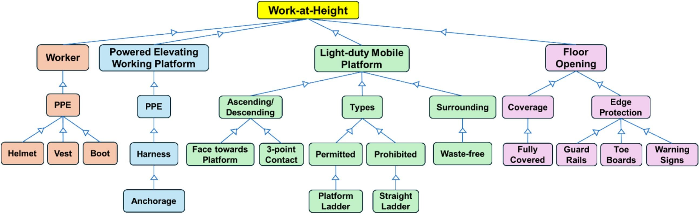

### 3-4. 실시간 비디오 분석 시스템
VLM 기반 안전 준수 모니터링 시스템은 (1) 자동 보고 모드와 (2) 대화형 챗봇 모드의 두 가지 다른 모드로 작동한다.

첫 번째 모드에서는 각 카메라의 실시간 비디오가 컴퓨터로 지속적으로 스트리밍되며, 여기서 비디오 프레임은 VLM에 추론을 위해 공급될 수 있도록 일정한 간격으로 샘플링된다(현장 시험에서 10초). 그러면 VLM은 [섹션 3-3](#3-3-건설-안전-온톨로지에-기반한-계층적-프롬프팅-프레임워크)에서 설계된 3단계 프롬프팅 프레임워크를 기반으로 이미지에 대한 적절한 답변을 자동으로 생성한다. 반면에 두 번째 모드는 간단한 버튼을 통해 언제든지 현재 프레임을 추출할 수 있도록 사용자가 트리거할 수 있습다. 프레임을 기반으로 현장 엔지니어 또는 안전 관리자는 질문을 입력하여 VLM이 개인화된 답변을 대화식으로 생성하도록 유도할 수 있다.

descriptive_alert_message_and(b)no-alert_frame_processing_output_generated_by_our_alarm_system.jpg)

안전 관리자에게 설명적인 경고 메시지를 생성하기 위해 경보 메커니즘이 개발되었다. 그림 10에서 볼 수 있듯이 안전 규칙 위반이 확인되면 해당 "Failed" 안전 준수가 현장 컴퓨터에서 경보를 통해 보고되고 안전 관리자는 실시간으로 알림을 받는다. 그런 다음 위반된 특정 안전 규칙을 간결하게 요약하는 설명적인 경고 메시지가 표시된다. 그림 10에서 볼 수 있듯이 이미지에서 위반 사항이 관찰되지 않으면 VLM에 의한 안전 준수 확인을 통과하여 경보 시스템을 트리거하지 않고 간단한 메시지 "No Safety Risk"가 출력된다.

또한 처리된 모든 이미지와 생성된 출력을 저장하기 위해 사고 기록 시스템이 개발되었다. 이러한 데이터는 적절하게 인덱싱/레이블링되어 기록 유지를 위한 잘 관리된 데이터베이스를 구성하며, 이를 통해 안전 관리자는 과거 사고를 쿼리하고 확인을 위해 관련 이미지를 검색할 수도 있다. 그림 10에서 볼 수 있듯이 처리된 각 프레임은 번호(예: "00250"은 비디오 스트림의 250번째 프레임을 나타냄)로 인덱싱되며, 이는 향후 쿼리의 키 역할을 한다. 이러한 인덱싱된 모든 프레임은 저장되며, 각 프레임에는 VLM에서 생성된 최종 출력(즉, 위반된 안전 규칙을 나타내는 텍스트)이 레이블로 지정되어 향후 쿼리의 값 역할을 한다.

## 04. Validation ad=nd discussion
개발된 VLM 시스템은 Shek Wu Hui Sewage Treatment Works (SWHSTW)의 실제 건설 현장에 배포되었다. 이 현장은 9.4 헥타르의 면적을 차지하고 상슈이 및 판링 지역의 300,000명의 인구가 배출하는 하루 81,000 m3의 하수를 처리하는 2차 하수 처리장이다.

### 4-1. 실험 설정
CogAgent 모델을 미세 조정하기 위한 데이터 세트는 임의 자르기, 수평 뒤집기 및 색 공간 교번을 포함한 증강 기술을 적용한 후 1500개의 건설 현장 이미지로 구성된다. 그런 다음 이미지는 [섹션 3-1](#3-1-반자동-이미지-텍스트-데이터-라벨링-파이프라인)에서 제안된 반자동 파이프라인으로 주석 처리되었다. 그림 11에서 볼 수 있듯이 원시 이미지는 먼저 데이터 레이블링 파이프라인에서 처리되어 다양한 텍스트 설명 및 지침 준수 샘플과 함께 정확한 경계 상자를 얻는다.

텍스트 설명은 요약된 안전 질문 목록을 기반으로 한다. 이미지의 일부 특징/객체는 특정 안전 규칙(예: 비계, 작업 플랫폼)과 매우 관련이 있으므로 해당 지식이 VLM 엔진에 통합될 수 있도록 주석에서 특별히 강조 표시된다. 통합된 예제는 또한 CogAgent에게 도메인 COT 및 LTM 프롬프팅 기술에 대해 교육하는 것을 목표로 하며, 이는 안전 분석을 단계별 질문 응답으로 분해하여 최종적인 합리적인 분석을 얻는다(즉, 먼저 이미지가 속한 안전 시나리오를 결정한 다음 해당 안전 규칙을 분석).

그런 다음 VLM은 [섹션 3-2](#3-2-컨텍스트-인식-vlm을-위한-2단계-커리큘럼-학습-패러다임)에서 제안된 2단계 커리큘럼 학습 패러다임으로 미세 조정된다. 데이터 분할은 6:4이다. 즉, 60%(900개 이미지)는 훈련 및 검증용이고 나머지 40%(600개 이미지)는 테스트용이다. 훈련 및 검증 세트 중에서 600개는 고층 작업 범위와 관련된 객체 및 장면에 대한 키워드 검색을 통해 인터넷에서 수집되었고 나머지 300개는 대상 현장에서 수집되었다. 테스트 세트의 경우 600개의 이미지가 모두 대상 현장에서 수집되었다. 미세 조정은 48 GB의 사용 가능한 VRAM을 갖춘 단일 NVIDIA A40 GPU로 수행되었다. 훈련 구성의 경우 제한된 양의 계산 리소스 및 데이터 세트로 인해 PEFT는 전체 매개변수 훈련보다 지도 학습 미세 조정에 더 적합하다. LoRA는 모든 원래 가중치가 고정된 상태에서 PEFT를 달성하기 위해 채택되었다. 각각 순위가 64이고 LoRA 알파 값이 128인 5개의 LoRA 모듈이 시각 언어 백본, 고해상도 교차 주의 계층, Vision Transformer 인코더 및 MLP 어댑터에 각각 삽입되었다. VLM은 각 단계마다 2 epochs 동안 배치 크기 2로 훈련되었으며, warmup 비율은 0.1, 초기 학습률은 3e-5, 코사인 학습률 스케줄러가 사용되었다. LoRA dropout은 0.1로 설정되었고 가중치 감쇠는 0.05로 설정되었다. 미세 조정 후 VLM은 8비트로 양자화되어 24 GB의 VRAM을 갖춘 RTX4090 GPU 1개에 배포되었다.

그런 다음 미세 조정된 VLM은 [섹션 3-3](#3-3-건설-안전-온톨로지에-기반한-계층적-프롬프팅-프레임워크)에서 설계된 온톨로지 기반 프롬프팅 프레임워크와 [섹션 3-4](#3-4-실시간-비디오-분석-시스템)에서 개발된 실시간 비디오 분석 시스템과 통합되었다. 전체 모니터링 시스템은 최종적으로 SWHSTW 건설 현장에 배포되었으며, 4대의 카메라가 산업 건물의 2개 층에 있는 주요 고층 작업 영역을 커버했다.

### 4-2. 정량적 평가
실제 현장에서 수집된 이미지는 VQA를 수행하기 위해 VLM에 입력되었다. 안전 준수 확인 성능은 표 1에 요약된 프로토콜로 평가되었다. 이 프로젝트의 안전 준수 확인 맥락에서 두 가지 가능한 결과가 정의되었다.

|Ground-truth / Output|Compliance - Failed | Compliance - Pass|
|:---:|:---:|:---:|
|Compliance - Failed|TP|FN|
|Compliance - Pass|FP|TN|

1. 준수 – 통과: 안전 규칙 위반이 없는 경우
2. 준수 – 실패: 특정 안전 규칙이 위반된 경우

- True Positive (TP)는 이미지가 위반 시나리오를 포함하고 VLM이 이를 올바르게 식별함을 의미한다. 평가는 이미지별 기준이 아닌 규칙별 기준으로 계산된다.
- False Negative (FN)는 이미지가 위반 시나리오를 포함하지만 VLM이 이를 식별할 수 없고 잘못된 출력 "Pass – No Safety Risk"를 출력함을 의미한다.
- False Positive (FP)는 이미지에 안전 위반이 없지만 VLM이 특정 안전 규칙에 대해 잘못된 출력 "Failed"를 출력함을 의미한다.
- True Negative (TN)는 이미지에 안전 위반이 없고 VLM이 올바른 출력 "Pass – No Safety Risk"를 출력함을 의미한다.

이러한 측정값은 방정식에 정의된 두 가지 주요 평가 지표인 Sensitivity 및 Specificity의 기초이다.

```math
Sensitivity (\%) = \frac{TP}{TP + FN} \\
Specificity (\%) = \frac{TN}{TN + FP}
```

- Sensitivity는 VLM(Vision Language Model)에 의해 올바르게 식별된 위반 시나리오의 백분율을 나타낸다.
- Specificity는 경고 없이 올바르게 통과된 준수 시나리오의 백분율을 나타낸다.

건설 안전 모니터링의 맥락에서 이러한 메트릭은 중요한 실제적 의미를 갖는다. Sensitivity는 PPE(개인 보호 장비) 미착용 또는 고소 작업 시 안전하지 않은 행동과 같은 실제 안전 위반을 올바르게 식별하는 시스템의 능력을 측정한다. 이 메트릭은 누락된 위반(false negative)이 심각한 사고 또는 사망으로 이어질 수 있으므로 특히 중요하다. 상보적으로, 특이도(specificity)는 오경보를 피하면서 안전한 조건을 정확하게 식별하는 시스템의 정확도를 측정한다. 높은 특이도는 운영 효율성을 유지하는 데 필수적이다. 왜냐하면 false-positive는 현장 엔지니어의 일상 업무에 불필요한 중단을 초래하여 모니터링 시스템에 대한 신뢰도를 떨어뜨릴 수 있기 때문이다.

|Variant|Strategy 1: Ontology driven prompting|Strategy 2: Two-stage curriculum learning|Sensitivity|Specificity|
|:---:|:---:|:---:|:---:|:---:|
|Baseline|X|X|76.3%|74.3%|
|Strategy 1|O|X|86.5%|85.5%|
|Strategy 2|X|O|84.7%|91.7%|
|Strategy 1, 2|O|O|90.3%|92.5%|

다양한 방법의 구현에 따른 정량적 결과는 표 2에 요약되어 있다. 특히, 본 논문에서 제안된 두 가지 주요 전략, 즉 온톨로지 기반 프롬프팅(ontology-driven prompting)과 2단계 커리큘럼 학습(two-stage curriculum learning)의 다양한 조합을 통합한 나머지 세 가지 변형과 함께, 제안된 전략이 없는 기준 변형을 포함하여 네 가지 변형을 비교했다.

기준 변형의 경우, 특별한 프롬프팅 전략 없이 미세 조정(fine-tuning)되지 않은 원래 모델이 추론에 사용된다. 모든 규칙이 한 번에 VLM에 직접 입력되어 VLM에게 위반된 규칙을 직접적인 방식으로 출력하도록 요청했다. 이러한 직접적인 프롬프팅으로 인해 기준 모델은 정보 과부하와 불충분한 추론 능력으로 인해 차선의 민감도(sensitivity)와 특이도(specificity)를 보였다. 각각 76.3%와 74.3%였다. 이러한 현상은 모델이 방대한 데이터 입력 속에서 관련된 세부 사항을 구별하는 데 어려움을 겪고 있음을 시사했다.

따라서, 우리의 온톨로지 기반 프롬프팅 전략은 고층 작업 안전 지식을 기반으로 계층적 및 논리적 사고를 활용하여 모델의 추론 프로세스를 효과적으로 구조화했다. 이 방법은 민감도를 86.5%로 크게 향상시켰다. 그리고 특이도를 85.5%로 향상시켜 관련 정보의 보다 효과적인 검색을 나타낸다. 그럼에도 불구하고, 사전 훈련된 비전 백본 모듈은 VLM이 더 미세한 도메인별 세부 사항을 식별하는 데 제한을 가했을 수 있다.

따라서, 사전 훈련된 VLM을 건설 도메인 및 고층 작업 시나리오에 효과적으로 적용하여 특이도를 91.7%로 크게 향상시킨 2단계 커리큘럼 학습 전략을 통해 추가적인 개선이 이루어졌다. 이 증가는 정확한 정보를 식별하는 보다 세련된 능력을 나타낸다. 그러나 민감도는 84.7%로 약간 감소했는데, 이는 정보 과부하의 지속적인 문제 때문일 수 있으며, 이를 해결하기 위해 프롬프트 엔지니어링이 필요했다.

가장 주목할 만한 개선은 본 논문에서 제안된 두 가지 전략(즉, 2단계 커리큘럼 학습 패러다임과 온톨로지 기반 프롬프팅 프레임워크)을 결합함으로써 달성되었으며, 이는 개별 방법의 약점을 조화롭게 해결했다. 이 이중 접근 방식은 도메인 맞춤형 모델 적응과 상황 인식 추론 프로세스의 강점을 활용했다. 그 결과 91.5%의 놀라운 민감도를 달성했다. 그리고 90.5%의 특이도는 건설 안전 모니터링을 위한 이러한 통합 접근 방식의 효능을 입증한다. 비교 분석 결과, 제안된 두 가지 방법 모두 정확도와 운영 효율성 측면에서 시스템의 성능을 효과적으로 향상시킬 수 있음을 보여준다.

### 4-3. 정성적 평가
정량적 평가 외에도 질적 평가는 도메인 강화된 VLM의 성능을 직관적으로 검사하는 방법이기도 하다. [섹션 3-3](#3-3-건설-안전-온톨로지에-기반한-계층적-프롬프팅-프레임워크)에 나열된 고층 작업 안전 규칙을 기반으로 VLM에서 생성된 출력("Pass" 및 "Failed" 준수)이 아래에 설명되어 있다.

#### 사례 1: 경량 이동식 플랫폼
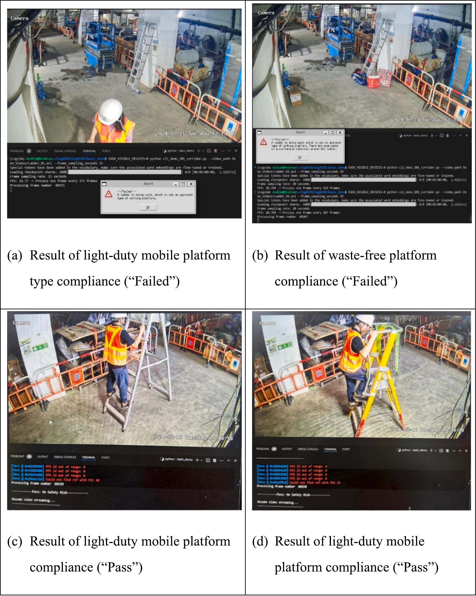

"Failed": 결과는 사다리가 승인되지 않은 유형의 이동식 플랫폼으로 올바르게 식별된 그림 12 (a)와 사다리 주변의 폐기물 또는 잡다한 재료가 성공적으로 감지된 그림 12 (b)에 나와 있다. 올바르게 식별된 두 사건 모두 위반에 대한 간략한 설명과 함께 경고 메시지를 표시하도록 경보 시스템을 트리거했다. 작업자가 사다리 주변에 있었지만 오르내리지는 않았다. 사다리와 작업자 옆에 PEWP도 있었지만 그 순간에는 사용되지 않았다. 따라서 두 가지 관련 안전 규칙(이동식 플랫폼 유형 및 주변 재료)만 확인되었으며, VLM은 추론 중에 다른 관련 없는 규칙을 필터링할 수 있다.

"Pass": 결과는 그림 12 (c)와 그림 12 (d)에 나와 있다. VLM은 사용 중인 이동식 플랫폼을 스텝 플랫폼(승인된 유형 중 하나)으로 올바르게 식별했으며, 그 주변에는 폐기물이나 잡다한 재료가 없었다. 안전 규칙을 위반하지 않는 이러한 시나리오에서는 안전 관리자가 입력 이미지에 대한 VLM의 응답을 확인할 수 있도록 화면에만 "Pass: No Safety Risk" 출력이 인쇄되었다.

#### 사례 2: 경량 이동식 플랫폼(작업자 등반)
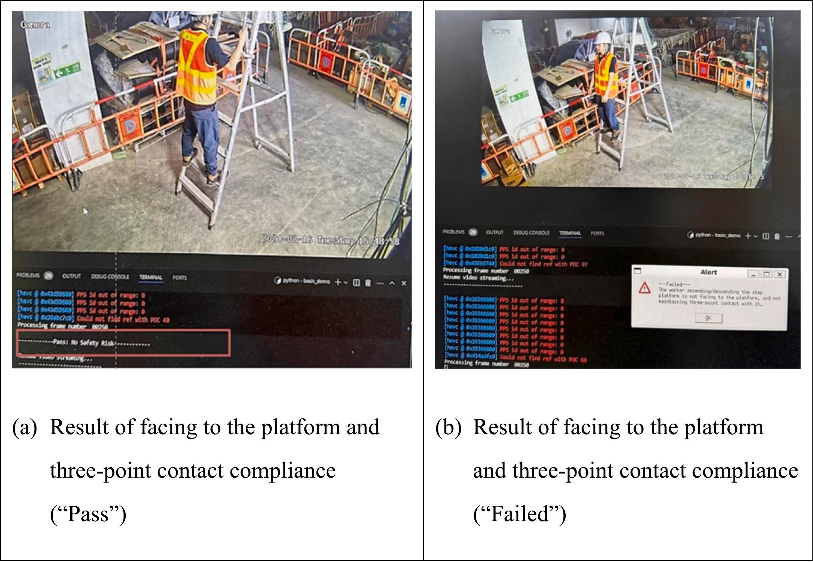

"Pass": 그림 13 (a)에 표시된 바와 같이 스텝 플랫폼을 오르내리는 작업자는 플랫폼을 직접 향하고 있으며 3점 접촉을 유지하고 있다. 따라서 안전 준수 확인 결과 "Pass"가 나왔다.

"Failed": 그림 13 (b)에 표시된 바와 같이 작업자는 스텝 플랫폼에서 등을 돌리고 있으며 손으로 스텝 플랫폼을 안전하게 잡고 있지 않다. 이 경우 위반된 안전 규칙을 명시하는 경고 메시지가 표시되어 경보 시스템이 트리거되었다.

#### 사례 3: PEWP(작업 중인 작업자)
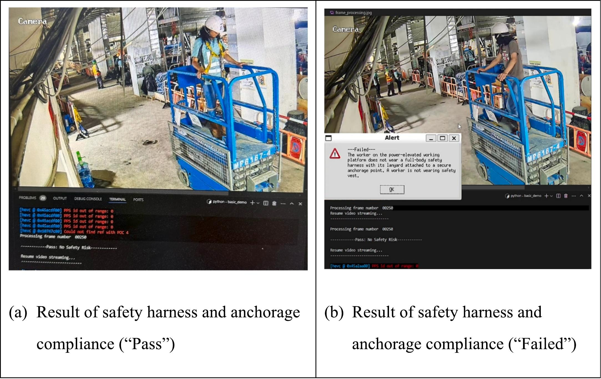

"Pass": 그림 14 (a)에 표시된 바와 같이 PEWP 상단에 서 있는 작업자는 안전 하네스를 착용하고 있으며, 그 끈은 안전한 앵커리지 지점에 부착되어 있다. VLM은 경보를 트리거하지 않고 그의 안전 준수를 확인하기 위해 화면에 "Pass: No Safety Risk"를 간단히 인쇄했다.

"Failed": 그림 14 (b)에 표시된 바와 같이 PEWP의 작업자는 안전 하네스를 착용하지 않았다. VLM은 이러한 안전 위반을 올바르게 식별하고 해당 경고 메시지를 생성했다.

#### 사례 4: 바닥 개구부/가장자리
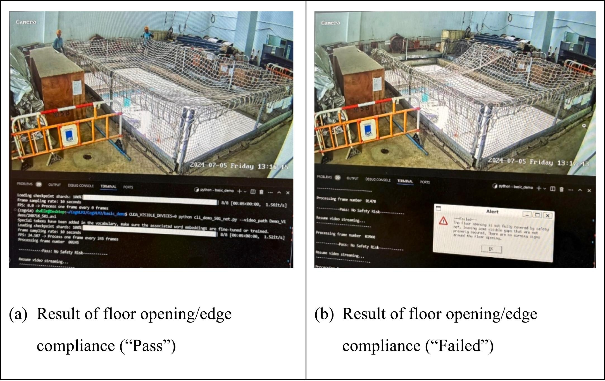

"Pass": 그림 15 (a)에 표시된 바와 같이 바닥 개구부는 안전망으로 완전히 덮여 있고, 안전 난간과 발판이 바닥 가장자리를 보호하고 있다. 경고 표지판이 이미지에 보이지 않았지만 해당 바닥 개구부에 대한 보호 조치는 이미 충분했다. 따라서 VLM은 결국 "Pass"를 출력했다.

"Failed": 그림 15 (b)에 표시된 바와 같이 바닥 개구부의 상단 부분이 안전망으로 덮여 있지 않아 추락 위험을 초래하는 눈에 띄는 간격이 있다. 또한 바닥 가장자리 주변에 경고 표지판이 없었다. 이러한 시나리오에서 VLM은 이러한 안전 위험을 올바르게 식별하고 "완전히 덮여 있지 않음" 및 "경고 표지판 없음" 경고 메시지를 생성했다.

전반적으로 VLM은 고소 작업 안전 준수 모니터링에서 경쟁력 있는 성능을 입증했다. 그러나 두 가지 사례가 특히 어려운 것으로 밝혀졌다.

1. 이동식 플랫폼과의 3점 접촉을 식별하기 위해 작업자가 이동식 플랫폼을 오를 때 작업자의 팔다리가 자주 가려진다(예: 오른쪽을 향할 때 그의 왼쪽 손과 왼쪽 다리는 각각 그의 몸과 오른쪽 다리에 가려짐).
2. 안전 하네스가 안전한 앵커리지 지점(예: PEWP)에 부착되어 있는지 확인하기 위해 로프의 얇기와 앵커의 작은 크기로 인해 객체 식별이 어렵다.

더욱 중요한 것은 앵커가 일반적으로 작업자 또는 PEWP 자체에 가려져 앵커리지 감지를 더욱 어렵게 만든다. 이러한 경우는 규정 준수 확인 정확도가 저하될 수 있는 예외적인 경우이다.

## 05. Conclusion and future work
본 논문에서는 포괄적인 프레임워크를 통해 건설 안전 모니터링을 위해 VLM(Vision Language Model)을 적용하는 데 있어 중요한 문제들을 다루었다. GPT-4V와 instruction-following 데이터 세트 생성을 위한 GroundingDINO를 결합한 당사의 반자동 self-instructed 파이프라인은 데이터 부족 문제를 성공적으로 극복한다. 2단계 커리큘럼 학습은 온라인 이미지와 실제 현장 이미지 간의 데이터 불균형 문제도 해결한다. 본 논문의 커리큘럼 학습 패러다임과 온톨로지 기반 프롬프팅 프레임워크를 통해 VLM 기반 모니터링 시스템은 도메인 지식 통합에 있어 놀라운 효과를 보여준다. 홍콩의 실제 건설 현장에 배치한 결과, 통합 시스템은 높이 작업 안전 준수 확인에서 90.3%의 민감도와 92.5%의 특이도를 달성하여 기준 방법보다 상당히 개선되었다.

이러한 연구 결과는 학계와 산업계 모두에 중요한 의미를 갖는다. 당사의 프레임워크는 제한된 데이터 가용성을 가진 특수 도메인에 VLM 기반 시스템을 적용하기 위한 확장 가능한 솔루션을 제공하며, 실제 환경에서의 성공적인 배치는 건설 안전 모니터링 자동화를 위한 실질적인 경로를 확립한다. 개발 시 상당한 데이터, 인적 노동력 및 정교한 시스템 설계를 필요로 하는 기존의 기존 CV-NLP 안전 모니터링 시스템과 비교할 때, 당사의 혁신적인 시스템은 보다 효율적으로 개발 및 설정할 수 있으며, 본 논문에서 입증된 바와 같이 심층적인 멀티모달 특징 추출과 더 높은 수준의 추론이 가능하다. 간단한 인터페이스 디자인은 안전 관리자가 현장에 있든 원격 위치에 있든 VLM과 쉽게 상호 작용할 수 있도록 하여 현장 안전 모니터링을 크게 용이하게 한다. 실제 현장 안전 준수 검사에서 달성된 높은 정확도는 건설 현장 관리에서 광범위하게 채택될 수 있는 상당한 잠재력을 시사하며, 보다 적극적이고 효율적인 안전 프로토콜을 가능하게 한다.

동시에 시각 정보 처리의 한계, 예를 들어 작은 객체 감지 및 폐색 문제로 인해 시스템의 견고성이 손상될 수 있는 일부 엣지 케이스도 존재한다. 다중 프레임 시간 상관 관계와 같은 보다 정교한 전략은 다중 프레임 데이터로 미세 조정하거나 더 포괄적인 프롬프팅을 통해 다중 이미지 프레임을 처리하기 위한 in-context learning 프레임워크를 통해 달성할 수 있다. 다중 프레임은 액션 인식 또는 폐색이 있는 장면과 같은 복잡한 시각 정보를 처리할 때 단일 프레임보다 더 신뢰할 수 있다. 작은 객체 감지의 경우, 효율성을 저해하지 않으면서 시각 정보 처리의 견고성을 향상시키기 위해 (즉, CNN 기반 모델은 VLM에 비해 계산 효율적임) 외부 CNN 기반 모듈을 작은 객체의 감지 및 위치 파악을 위해 프레임워크에 통합할 수 있다.

또 다른 제한 사항은 새로운 안전 규정 또는 현장별 변동을 수용하기 위해 온톨로지 기반 프롬프트 업데이트가 필요한 것과 같은 온톨로지 기반 접근 방식에 있다. 기존 방법과 비교했을 때, 논문의 방법은 기계어가 아닌 자연어로 편집하여 온톨로지를 보다 효율적으로 적용할 수 있다. 그럼에도 불구하고, 이 프로세스는 LLM 전문가에 의해 다양한 현장별 규정에 따른 온톨로지 추출 및 프롬프트 변환을 통해 더욱 자동화될 수 있다. LLM은 온톨로지 구축을 위해 긴 규정을 분석하고 핵심 객체와 관계를 추출하는 데 특화되어 있으므로, 온톨로지 적용을 위한 자동화된 접근 방식은 LLM 프롬프트 엔지니어링을 통해 실현될 수 있다. 향후 연구에서는 상황 인식 및 확장성을 개선하기 위해 위의 비전 처리 방법 및 온톨로지 업데이트 방법을 통해 시스템을 개선하는 데 중점을 둘 것이다. 프레임워크의 일반화 가능성은 또한 보다 다양한 안전 규칙 및 다양한 현장 조건에서 추가로 검증될 수 있으며, 보다 포괄적인 안전 모니터링 관행을 위해 보다 복잡한 작업자 또는 기계 작업 분석으로 확장될 수 있다.