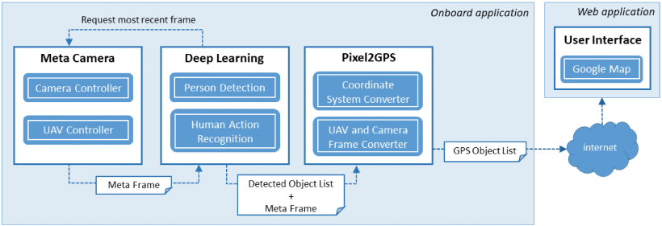
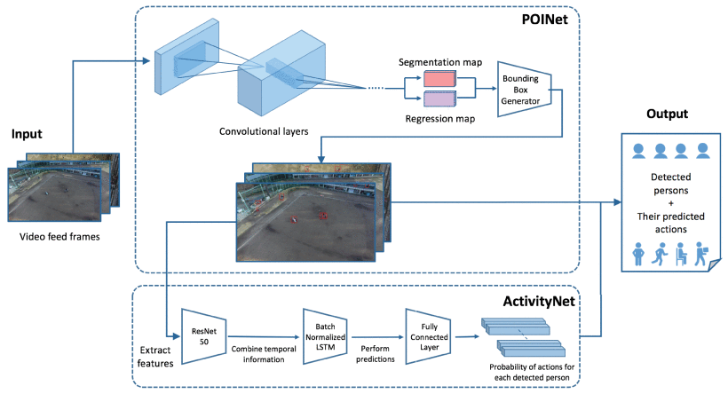

# UAV-Based Situational Awareness System Using Deep Learning
## 01. Contribution
- End to end UAV 상황 인식 파이프라인 제안 (PAL) Person Action Locator
- UAV 시점 특화 사람 검출 모델 (POINet)
- 경량 온보드 다중 행동 인식 (ActivityNet)
- 이미지 처리를 통해 사람의 GPS 위치를 추정하는 Pixel2GPS 변환기

## 02. Architecture

### Meta Camera
UAV의 텔레메트리 데이터와 함께 비디오 데이터 수집
- 텔레메트리: UAV의 GPS 위치, 지상 이륙 위치를 기준으로 한 높이, roll, pitch, yaw

### POINet: 사람 검출
Mobilenetv2를 내부 컨볼루션 계층으로 활용하여 다양한 스케일에서 여러 특징을 추출한다. 그런 다음 POINet은 멀티스케일 특징을 사용하여 원본 이미지를 기반으로 segmentation map과 regression map을 생성한다. Segmentation map은 bounding box 영역을 설정하는 마스크 역할을 하고, regression은 bounding box의 모서리 위치를 파악한다. 두 맵을 모두 사용하여 이미지의 각 사람 위에 겹쳐지는 bounding box의 좌표를 생성할 수 있다.

86%의 재현율(Recall), 85%의 정밀도(Precision) 및 84%의 F1 점수

### ActivityNet: 행동 인식
ActivityNet은 사람의 공간적 외형에만 의존하는 대신, 수정된 Long Short-Term Memory (LSTM) 네트워크를 사용하여 시간 정보를 학습한다.(LSTM: 비디오 피드와 같은 데이터 시퀀스로부터 학습하여 시간 경과에 따른 특징 변화를 기반으로 정보에 입각한 예측을 생성할 수 있는 순환 신경망) ResNet-50으로 잘린 사람의 특징을 추출하고, Batch Normalized LSTM (BNLSTM)에 출력을 전달하여 사람의 행동 시퀀스를 학습한다. ResNet-50 특징 추출기를 사용하여 경계 상자의 높이와 너비를 사용하여 시간 경과에 따른 암묵적 추적을 유도할 수 있다. BNLSTM의 출력은 이전 프레임의 정보를 통합한 특징이며, 이를 통해 모델은 시계열 행동의 특징을 학습할 수 있다.

ActivityNet을 사용하여 초당 3프레임에서 주요 행동에 대해 22.5%의 평균 정밀도(mean Average Precision, mAP) (F1 점수는 20%)와 보조 행동에 대해 11%의 mAP (F1 점수는 7%)를 달성한다. 주요 행동 감지 정확도는 80%, 보조 행동 감지 정확도는 84%

- 주요 행동 (비 상호 작용 행동): 달리기, 걷기, 눕기, 앉기, 서 있기
- 보조 행동
  - 인간 대 인간 상호 작용: 악수, 포옹
  - 인간 대 객체 상호 작용: 읽기, 마시기, 밀기/당기기, 운반하기, 전화하기

### 위치 추정 — Pixel2GPS

이미지 공간에서 픽셀 단위로 주어진 2D 포인트를 사용하여 카메라 matrix와 왜곡 파라미터를 사용하여 3D 포인트를 얻는다. 이 포인트는 카메라 레퍼런스를 기준으로 표현되며 카메라 센서 앞에 있다. 지상에서 해당 타겟 포인트를 얻기 위해 카메라 레퍼런스 원점을 통과하는 선과 이 3D 포인트를 고려하여 지면과 교차시킨다. 타겟 포인트가 카메라 레퍼런스에서 획득되면 North, East 및 Down을 가리키는 축과 UAV의 질량 중심에 원점이 있는 UAV의 NED 레퍼런스로 변환된다. 마지막으로 포인트는 GPS, 즉 위도와 경도를 도 단위로 변환된다.

평균 오류는 4.5m, 최대 오류는 12.8m

## 03. Future Work
- 열화상 카메라와 같은 다른 센서 고려
- Pixel2GPS 모듈의 지형에 따른 고도 계산 한계 보완 (디지털 고도 모델)

## 04. 팔요한 개선사항
- 온보드에서는 검출 및 추적에 대한 연산만 하고 행동 인식은 웹 애플리케이션에 띄우기 이전에 추론하는 방법으로 바꿔도 좋지 않을까
- Pixel2GPS 모듈에서 GPS로 변환하는 방법론 더 좋은 방법이 있을 것 같으나 서베이 필요
- Backbone 모델을 다른 모델들로 교체하면 성능이 오르지 않을까
