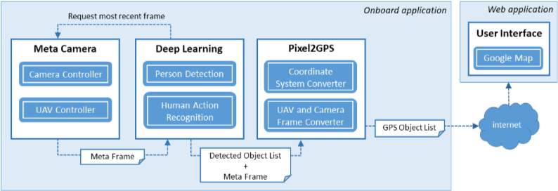
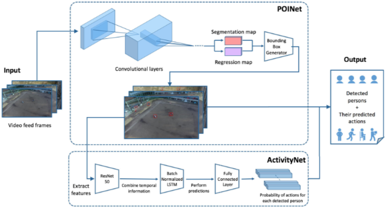
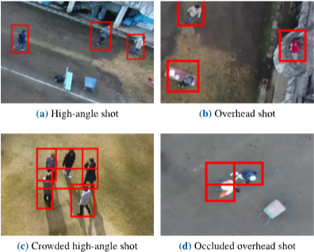
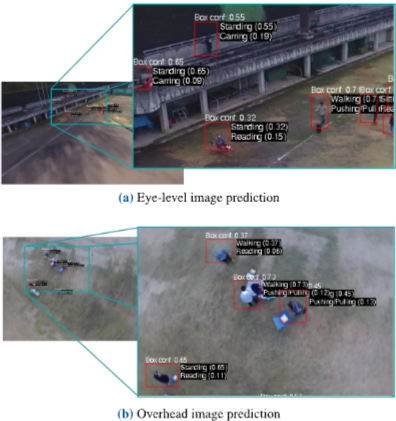
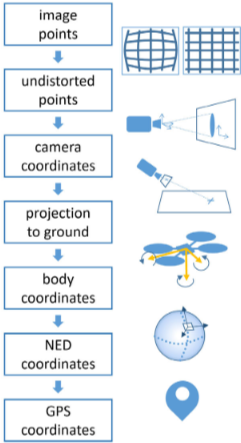
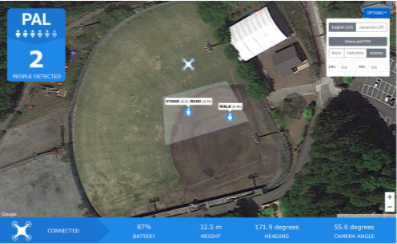

# UAV-Based Situational Awareness System Using Deep Learning
## 00. Abstract
무인 항공기(Unmanned Aerial Vehicles, UAVs)에 의한 상황 인식은 감시, 수색 및 구조, 재난 대응과 같은 많은 애플리케이션에서 중요하다. 이러한 애플리케이션에서 사람을 감지하고 위치를 파악하며 거의 실시간으로 그들의 행동을 인식하는 것은 효과적인 대응을 준비하는 데 중요한 역할을 할 수 있다. 그러나 현재 이 작업을 효율적으로 수행하는 데에는 세 가지 주요 제한 사항이 있다.

1. 제한된 대역폭으로 인해 UAV 카메라에서 실시간 비디오 피드에 액세스하는 것이 종종 불가능하다.
2. 비디오 피드를 사용할 수 있더라도 비디오를 장시간 모니터링하고 분석하는 것은 인간에게 지루한 작업이다.
3. 일반적으로 휴대폰을 통해 임의의 사람들의 위치를 파악하는 것은 불가능하다.

따라서 본 연구에서는 새로운 UAV 기반 상황 인식 시스템인 Person-Action-Locator (PAL)을 개발했다. PAL 시스템은 supercomputeron-a-module로 구동되는 UAV에 탑재된 비디오 피드를 분석하여 첫 번째 문제를 해결한다. 특히, 인간 운영자를 지원하기 위해 PAL 시스템은 Deep Learning 모델을 사용하여 사람을 자동으로 감지하고 거의 실시간으로 그들의 행동을 인식한다. 세 번째 문제를 해결하기 위해 비디오 피드에서 사람들의 위치를 추정하는 Pixel2GPS 변환기를 개발했다. 결과적으로 감지된 사람들을 나타내는 아이콘이 그들의 행동으로 레이블링되어 PAL 시스템의 지도 인터페이스에 시각화된다. Deep Learning 모델은 실험실에서 먼저 테스트되었으며 유망한 결과를 보여주었다. 완전히 통합된 PAL 시스템은 현장에서 성공적으로 테스트되었다. 또한 실험실 결과를 보완하기 위해 또 다른 감시 데이터 수집을 수행했다.

## 01. Introduction
무인 항공기(UAVs)에 의한 상황 인식은 수색 및 구조, 감시, 재난 대응 등과 같은 많은 애플리케이션에서 중요하다. 이러한 애플리케이션에서 핵심 과제는 사람, 동물 또는 물체의 위치를 파악하고 시기적절하게 대응하는 것이다. 보안 애플리케이션에서는 사람이 수행하는 행동의 유형을 이해하는 것도 유익히다.

상황 인식에서 인적 자원은 주요 관심사인데, 이는 인간의 수행 능력이 비디오 피드를 계속 시청할 때 피로와 집중력 저하로 인해 제한되기 때문이다. 여기서 자동화된 감시 접근 방식은 인간이 비디오 피드를 분석하도록 지원하고 재난이나 큰 야외 행사로 인해 영향을 받는 지역과 같이 관심 영역에서 감지된 사람들에 대해 즉시 경고할 수 있다. 이러한 협력 작업을 때로는 'human-agent collectives' 이라고 한다.

상황 인식을 개선하기 위해 UAV에 장착된 시각 카메라와 지능형 정보 처리를 사용하여 사람을 감지하고, 그들의 행동을 인식하고, PAL 인터페이스에 표시된 지도에 그들의 위치를 표시하는 PAL (Person-Action-Locator) 시스템을 개발했다. PAL 시스템의 핵심 구성 요소는 다중 사람 감지 및 다중 행동 인식을 위해 훈련된 Deep Learning 모델을 사용한다. 그런 다음 전용 변환기가 픽셀(사람)을 GPS 위치로 변환한다.

기존의 사람 감지 접근 방식과는 달리, UAV 카메라의 관점은 카메라 각도의 편차가 크고 종종 대상 물체로부터 먼 거리에서 캡처한다. 따라서 UAV의 시점에서 이미지를 분석하도록 설계된 'Position and Orientation Invariant Neural Network' (POINet)이라는 Deep Learning 모델을 개발했다. 이는 먼저 입력 이미지에 여러 관심 영역을 생성하여 바운딩 박스를 생성하며, 이는 사람의 대략적인 위치를 찾기 위한 분할 마스크 역할을 한다. 그런 다음, 관심 영역에 가장 적합한 바운딩 박스를 생성하여 박스의 모서리를 고정한다. 이러한 방식으로, 우리의 접근 방식은 다양한 카메라 각도에서 사람의 광범위한 표현을 학습하는 어려움을 극복한다. 또한, 이전 연구와 비교하여 성능을 향상시키기 위해 시간 정보를 사용하여 사람의 행동을 예측하는 'Activity Network' (ActivityNet)이라는 Deep Learning 모델을 개발했다. 그런 다음, 전용 변환기가 픽셀(사람을 나타냄)을 GPS 위치로 변환한다.

PAL 시스템은 거의 실시간에 가까운 사람 감지 및 행동 인식을 달성하는 것을 목표로 한다. 따라서 UAV에서 작동할 수 있는 경량 Deep Learning 모델을 개발해야 했다.

## 02. Related work
### 2-1. Situational awareness
상황 인식의 세 가지 주요 요소는 아래와 같다.

- 현재 상황에 대한 인식
- 해당 상황에 대한 이해
- 미래 조건의 예측

본 연구에서는 현재 상황에 대한 자동 인식이라는 첫 번째 요소에 중점을 둔다. 다음에서는 상황 인식에 대한 몇 가지 중요한 연구를 논의힌다.

#### 1) 수색 및 구조
수색 및 구조는 주로 상황 인식에 의존한다. 사람이 실종된 경우, 사람의 상태 및 행동과 관련된 상황 및 확률에 따라 특정 단계를 따라야 한다. 세 가지 주요 작업은 조사, 봉쇄, 수색이다. 실종자의 안전에 대한 위험 증가를 방지하기 위해 이러한 모든 작업은 가능한 한 빨리 수행해야 한다. 조사 작업 중에는 실종되기 전의 활동 계획을 포함하여 대상에 대한 유용한 정보가 수집된다. 이는 수사관이 해당 사람의 소재가 있을 가능성이 가장 높은 지역을 이해하는 데 도움이 된다. 봉쇄 계획은 수색 영역이 확장되는 것을 방지하는 것을 목표로 한다. 실종자를 찾기 전에 시간이 더 많이 경과할수록 수색 영역이 더 커진다. 여기서 UAV를 배치하면 수색 영역을 더 빨리 스캔하고 실종자를 더 빨리 찾을 수 있다. 또한 수색팀의 안전에 대한 위험을 줄여준다.

오늘날 UAV는 이미 수색을 돕는 데 사용되고 있다. 일부 접근 방식은 Convolutional Neural Network (CNN)와 같은 Deep Learning을 사용하여 사람을 감지할 수 있다[[5]](#5-m-b-bejiga-a-zeggada-a-nouffidj-and-f-melgani-a-convolutional-neural-network-approach-for-assisting-avalanche-search-and-rescue-operations-with-uav-imagery-remote-sens-vol-9-no-2-p-100-2017). CNN과 Deep Deterministic Policy Gradients (DDPG)를 기반으로 하는 새로운 알고리즘인 Image-Based Visual Servoing (IBVS)을 통합한 자율 수색 및 구조 시스템이 개발되었다[[6]](#6-c-sampedro-a-rodriguez-ramos-h-bavle-a-carrio-p-de-la-puente-and-p-campoy-a-fully-autonomous-aerial-robot-for-search-and-rescue-applications-in-indoor-environments-using-learning-based-techniques-j-intell-robotic-syst-vol-95-no-2-pp-601627-aug-2019). 실내 애플리케이션에 중점을 둔 이러한 접근 방식과는 달리, 당사의 시스템은 현장에서 사용할 수 있다. 다른 연구[[7]](#7-g-r-shih-p-h-tsai-and-c-l-lin-a-speed-up-approach-for-search-and-rescue-in-proc-ieee-int-conf-syst-man-smc-oct-2018-pp-41784183)에서는 수색 및 구조 상황에서 수색 영역 범위를 개선하는 방법을 제시한다.

#### 2) 감시
감시 시스템은 현재 개인에서 군사에 이르기까지 다양한 애플리케이션에서 사용되고 있다. 일부는 침입자 감지와 같은 간단한 목표를 가지고 있는 반면, 다른 일부는 더 복잡하고 잠재적인 위협을 식별해야 힌다.

개인 주택에서는 설치된 시스템이 침입자의 존재를 감지해야 한다. 침입 감지기는 대부분 자율적으로 작동할 수 있다. 이벤트 중 혼잡한 공간과 같이 안전 위험 수준이 높은 공공 장소에서는 감지만으로는 충분하지 않다. 대신, 군중 속에서 의심스러운 행동을 지속적으로 감시해야 한다. 여기서는 의심스러운 행동이 있는지 여부를 이해하는 것도 필요히다. 이벤트의 경우, 무엇이 의심스러운 행동인지 이해하는 것은 간단하지 않으며, 결정을 내리려면 인간 전문가의 전문 지식이 필요하다.

많은 감시 시스템이 이미 자율적으로 또는 반자율적으로 작동하고 있다. 그러나 이러한 시스템의 대부분은 카메라 움직임에 제한이 있는 고정 카메라에 의존한다. 참고 문헌에서는 단일 인간 운영자가 비디오 피드를 모니터링하는 것을 지원하기 위해 협력적인 다중 센서 감시를 위한 알고리즘을 제시한다. 여기서 실시간 비디오 처리는 비디오 피드를 객체 및 이벤트에 대한 설명으로 변환한다. 스마트 비디오 감시에서 다중 스케일 시공간 추적의 개념이 탐구된다. 이는 배경 제거, 객체 감지를 위한 현저한 움직임 감지, 객체 분류, 얼굴 카탈로그 작성 및 움직임 분석을 기반으로 실시간 위협 감지 및 법의학 조사에서 인간 운영자를 돕는 것을 목표로 한다. 다른 시스템은 카메라가 장착된 실내 지상 기반 로봇을 활용한다.

이러한 연구와 달리, 당사의 시스템은 이러한 감시 접근 방식을 자유로운 카메라 움직임이 가능한 실외 영역으로 확장한다. 미션 계획을 개선하는 방법, 다중 UAV 제어와 함께 감시를 위해 UAV를 사용하고 카메라 시야에서 폐색 문제를 해결하는 방법을 제시하는 기존 연구가 있다.

#### 3) 재난 대응
재난 발생 후에는 긴급 서비스가 즉각적으로 필요하다. 도움이 필요한 사람들을 찾는 것이 불가능한 경우, 실종 신고된 사람들을 찾기 위한 수색이 필요히다. 또한, UAV를 배치하여 잠재적인 미확인 피해자를 위해 피해 지역을 스캔할 수 있다.

이러한 시스템은 주로 에이전트가 데이터를 수집 및 필터링하고 조정 및 작업 할당을 지원하는 인간-에이전트 집단에 의존한다. 본 연구에서는 크라우드소싱을 활용하여 잠재적 피해자 또는 구조물 손상이 발생한 위치를 파악한 다음, 인간 운영자가 모니터링하는 UAV를 배치하여 해당 위치의 비디오 피드를 얻는다. 그러나 여러 비디오 피드를 모니터링하려면 여러 명의 인간 운영자가 "센서"로 필요하다.

따라서 일부 인간 모니터링이 중복성을 위해 유지되더라도 자동 감지가 선호된다. 실종자의 예상 위치를 파악하기 위해 휴대 전화를 감지하여 가능한 피해자를 찾는 재난 대응 시스템에 대한 계획 접근 방식이 [16]에 설명되어 있다. 그러나 휴대 전화가 고장났거나 배터리가 없거나 해당 사람이 휴대 전화를 소지하지 않은 경우와 같이 이러한 종류의 검색이 불가능한 경우가 있을 수 있다.

이러한 상황에서는 당사의 PAL 시스템과 같은 UAV 기반 시각 감시 시스템을 통한 사람 감지가 중요하고 유용한 기술이다. 더 나아가, UAV에 의한 재난 후 매핑은 재난 대응에 중요하다.

#### 4) 데이터 수집
UAV를 사용한 데이터 수집은 UAV가 비침습적인 작업을 수행하고, 접근하기 어렵거나 위험한 장소를 검사하며, 인간 작업자의 위험을 줄일 수 있기 때문에 최근 몇 년 동안 급격히 증가하고 있다. 예를 들어, 야생 동물 연구에서 UAV를 사용하면 자원 소비를 줄일 수 있을 뿐만 아니라 동물과 연구자 모두의 위험을 줄일 수 있다. UAV는 특정 사례에 대한 자동 식별 및 데이터 캡처(AIDC, Automatic Identification and Data Capture)에 이미 사용되었다. 예를 들어, [18]에서는 산림 지역의 3D 장면 재구성을 위한 솔루션을 제시하고, [19]에서는 데이터 수집, 특히 식물 측정을 목적으로 소형 UAV용 공중 다중 스펙트럼 이미징 시스템을 소개한다.

### 2-2. Human detection and action recognition
#### 1) 전통적인 컴퓨터 비전 기술
객체 및 인간 감지는 컴퓨터 비전 분야에서 광범위하게 연구되었다. 컴퓨터 비전 기술은 원시 픽셀 데이터를 컴퓨터가 유용한 정보를 추출할 수 있는 형식으로 변환하는 것을 포함한다. 인간 감지를 위한 전통적인 방법에는 객체 인식을 위한 HOG(Histograms of Oriented Gradients) 사용, 연결된 리만 다양체를 사용하여 분류기를 학습하기 위한 기하 정보 사용, 개선된 감지 및 추적을 위한 3D 표면 모델 구축을 위한 깊이 카메라 활용 등이 있다.

그러나 이러한 접근 방식은 컴퓨터 비전 전문가가 특정 응용 분야에서 유용해 보이는 특징을 직접 만들어야 한다. 더 나아가, 추출된 특징 표현은 특정 도메인 외부로 일반화하기 어렵다. 이러한 작업에서 딥러닝 접근 방식은 최근 몇 년 동안 큰 성공을 거두었으며 최첨단 접근 방식이 되었다.

#### 2) 딥러닝 객체 감지 모델
딥러닝은 신경망이 원시 픽셀에서 직접 판별적 특징을 학습할 수 있도록 데이터 기반 방법을 사용한다. 예를 들어, 이 모델은 변형 및 폐색 처리를 통해 HOG 특징을 공동으로 학습하고, 여러 부분 감지기를 사용하여 강력한 보행자 감지기로 결합하고, CNN을 사용하여 UAV 이미지에서 관심 객체를 감지할 수 있다. 이러한 방법은 전통적인 수작업 HOG 특징을 사용하여 달성하기 어려운 폐색된 객체 감지와 같은 시각적 문제에서 뛰어난 결과를 보여주었다.

객체 감지 작업은 또한 경계 상자를 조밀하게 생성하고 신경망을 사용하여 공간적으로 분리하여 회귀 문제로 구성되었다. 통합 아키텍처는 클래스 예측에서 높은 정확도를 달성한다. 그러나 상자 크기와 비율에 대한 사전 확률로 경계 상자를 생성하는 데 의존한다.

UAV에서 캡처한 비디오 피드는 일반적으로 다양한 방향의 오버헤드 샷이다. 따라서 현재 모델은 UAV에서 수집한 데이터 세트에서 성능이 저조하다. 그러나 강력한 인간 감지는 사람을 감지하고 찾는 것을 목표로 하는 당사 PAL 시스템의 필수적인 부분이다.

#### 3) 딥러닝 행동 인식 모델
행동 이해는 감지된 사람이 수행할 가능성이 있는 활동에 대한 컨텍스트를 제공하는 데 도움이 된다. 또한 캡처된 장면에 대한 컨텍스트 및 상황 정보를 제공하여 시스템이 상황에 대한 더 많은 지식을 얻고 적절하게 대처할 수 있도록 하는 상황 인식 시스템의 필수적인 측면이다.

다중 사람 행동 인식을 위한 최근 연구에서는 각 구성 요소를 분리하고 각 부분을 개별적으로 최적화하여 순차적 접근 방식을 취한다. 사람은 먼저 CNN 모델에 의해 감지되고 알고리즘으로 추적된 다음 각 사람에 대한 특징 표현이 추출되어 개별 행동에 대해 추론한다. 이 접근 방식은 감지된 각 사람에 대해 프로세스를 반복해야 하므로 많은 처리 시간이 필요하다. 따라서 UAV 시스템에서 잘 확장되지 않는다.

3D CNN은 또한 행동 인식을 위해 제안되었다. 이는 일반 CNN과 동일한 개념을 기반으로 하지만 시간 축에서도 컨볼루션을 수행한다. 상당한 계산 시간의 비용으로 행동 이해에 대한 높은 정확도를 달성한다. 따라서 현재 UAV의 계산 능력 및 배터리 전력의 제한으로 인해 이 기술을 온보드에서 추론을 수행하는 데 적용하는 데 제약이 있다. 본 연구에서는 이러한 문제점을 해결하기 위해 온보드 요구 사항을 충족하도록 설계된 딥러닝 모델을 개발한다.

## 03. Person-Action-Locator (PAL) System

Person-Action-Locator (PAL) 시스템은 사람을 자동으로 감지하고, 그들의 행동을 인식하며, UAV에 탑재된 현재 GPS 위치를 계산할 수 있다. 이 정보는 지도 사용자 인터페이스 웹 애플리케이션에 표시된다. 이 시스템의 역할은 수색 및 구조, 감시 시나리오에서 수색 프로세스를 지원하는 것이다. 본 연구의 시스템은 핵심 시스템인 온보드 애플리케이션과 웹 애플리케이션으로 구성되며, 이는 그림 1에 나와 있다. 주요 모듈은 아래과 같다.

- Meta Camera: UAV의 텔레메트리 데이터와 함께 비디오 데이터를 수집
- Deep Learning: 다중 사람 감지 및 행동 인식을 수행
- Pixel2GPS: 픽셀 좌표를 GPS 좌표로 변환
- User Interface: 사람의 위치 및 각 행동과 같이 온보드 애플리케이션의 결과를 지도에 표시

### 3-1. Meta Camera
Meta Camera는 UAV의 온보드 카메라 비디오 피드 스트림에서 이미지를 캡처하고 동시에 UAV의 텔레메트리를 검색하는 모듈이다. 검색된 텔레메트리는 UAV의 GPS 위치, 지상 이륙 위치를 기준으로 한 높이, 롤, 피치 및 요 각도로 구성된다. 이 정보는 Deep Learning 및 Pixel2GPS 모듈에 필요하다. 이미지는 먼저 Deep Learning 모듈에 공급되고 해당 텔레메트리는 Deep Learning 모듈에서 찾은 픽셀 좌표를 GPS 좌표로 변환하기 위한 참조로 Pixel2GPS 모듈에서 사용된다. Meta Camera는 이전 이미지가 시스템의 나머지 부분에 의해 완전히 처리될 때마다 가장 최근 이미지와 해당 텔레메트리를 캡처하도록 트리거된다.

### 3-2. Deep learning

본 연구의 PAL 시스템에서 Deep Learning (DL)은 다중 사람 감지 및 다중 행동 인식에 사용된다. 본 연구에서는 UAV에서 추론을 실행할 수 있는 경량 DL 모델을 목표로 한다.

Meta Camera에 요청된 가장 최신 이미지(또는 프레임)는 사람 감지 구성 요소로 전달되어 각 사람 주위에 경계 상자를 생성한다. 그런 다음 경계 상자를 사용하여 원본 이미지를 잘라내어 감지된 각 사람의 연속 상자 시퀀스를 생성한다. 상자 시퀀스는 행동 인식 구성 요소에 대한 입력으로 사용되며, 이는 사람이 행동 세트의 일부 행동을 수행할 확률을 예측한다.

그림 2는 온보드 시스템의 정보 흐름을 보여준다. UAV 카메라에서 캡처한 비디오 피드 프레임은 모델의 입력 데이터로 사용된다. 입력은 먼저 "Position and Orientation Invariant Neural Network"(POINet)라는 DL 모델로 전달되어 관심 지점을 추출하고 객체 주위에 경계 상자를 생성한다. 그런 다음 추출된 경계 상자는 "Activity Network"(ActivityNet)라는 두 번째 DL 모델로 전달되어 사람의 시간 정보를 학습하고 현재 행동을 예측한다.

본 연구의 Deep Learning 모델은 Okutama 데이터 세트에서 훈련 및 평가되었다. 이 데이터 세트는 다양한 카메라 각도와 고도(15 m, 20 m, 25 m, 30 m)에서 두 개의 다른 UAV로 캡처한 이미지의 데이터 세트이며, 아침 및 저녁 시간 동안 촬영되었다. 고도에 대한 제한은 법적 상한선인 150 m를 제외하고는 없다. 더 높은 고도에 대한 Deep Learning 모델을 훈련하려면 새로운 데이터 세트를 수집해야 한다.

현재 데이터 세트는 각 사람 주위에 레이블이 지정된 경계 상자와 해당 사람의 하나 이상의 행동으로 구성된다. 사람은 서 있거나 걷기와 같은 하나의 기본 행동과 운반하거나 당기는 것과 같은 하나의 보조 행동을 수행할 수 있다.

#### 1) 딥러닝 기반 다중 객체 검출 모델

UAV 카메라의 비디오 피드는 카메라 각도에 따라 편차가 큰 경우가 많으며, 일반적으로 높은 각도에서 오버헤드 샷에 이르기까지 다양하며, 대부분의 영상은 그림 3에서 볼 수 있듯이 대상으로부터 먼 거리에서 캡처된다.

이러한 카메라 각도의 특성으로 인해 현재 최첨단 객체 검출 모델의 적용 가능성이 제한된다. 그 이유는 현재 대부분의 모델이 지상에서 소비자 카메라로 촬영하거나 비교적 수평적인 카메라 각도에서 촬영한 이미지를 기반으로 학습하도록 설계되었기 때문이다. 일부 모델은 bounding box의 종횡비에 대한 사전 지식에 의존하기도 한다. 이러한 접근 방식은 관심 객체의 방향이 프레임 전체에서 유사한 모양을 갖는 경우에 적합하다.

따라서 입력 이미지에서 특징을 추출하기 위해 심층 컨볼루션 신경망을 활용하는 POINet을 개발했다. 컨볼루션 신경망은 이미지 내 특정 패턴의 존재 여부를 검출하는 필터 역할을 하는 일련의 계층으로 구성된다. 이는 추상적인 특징을 추출하고 이미지 공간에서 객체의 위치를 파악하는 방법을 학습할 수 있다.

POINet은 Mobilenetv2를 내부 컨볼루션 계층으로 활용하여 다양한 스케일에서 여러 특징을 추출한다. 그런 다음 POINet은 멀티스케일 특징을 사용하여 원본 이미지를 기반으로 segmentation map과 regression map을 생성한다. Segmentation map은 bounding box 영역을 설정하는 마스크 역할을 하고, regression은 bounding box의 모서리 위치를 파악한다. 두 맵을 모두 사용하여 이미지의 각 사람 위에 겹쳐지는 bounding box의 좌표를 생성할 수 있다. POINet의 출력은 그림 2의 중간에 나와 있으며, 빨간색 상자는 POINet에서 생성된 출력 bounding box이다.

이 모델은 segmentation 및 regression map을 활용하여 이미지 공간에서 직접 bounding box를 생성하므로 입력 이미지 간의 카메라 각도 변화가 큰 어려움을 극복한다. 1280 × 720 × 3 픽셀의 입력 크기에 대해 POINet의 파라미터 수는 1050만(M)이다. 이는 다른 접근 방식과 비교할 때 가벼운 디자인으로 간주될 수 있다. UAV에 대한 계산 비용이 많이 드는 사람의 광범위한 표현을 학습하기 위해 훨씬 더 심층적인 CNN을 사용하는 대신, 우리의 접근 방식은 성능에 미치는 영향을 최소화하면서 높은 정확도를 달성한다.

우리는 Okutama 데이터 세트에서 우리의 POINet 모델을 평가했다. 우리는 훈련 손실이 수렴될 때까지 100 epoch 이상 동안 우리의 모델을 훈련했다. 

우리 모델은 86%의 재현율(Recall), 85%의 정밀도(Precision) 및 84%의 F1 점수를 달성했다. Single Shot MultiBox Detector(SSD)를 사용하고 F1 점수가 72.3%인 이전 연구와 비교하여, 우리 모델은 카메라 각도의 방향에 관계없이 사람을 더 강력하게 감지할 수 있다. 

#### 2) 다중 행동 인식을 위한 딥 러닝 모델
Okutama 데이터 세트는 다음과 같은 유형의 행동을 포함한다.

- 주요 행동 (비 상호 작용 행동): 달리기, 걷기, 눕기, 앉기, 서 있기
- 보조 행동
  - 인간 대 인간 상호 작용: 악수, 포옹
  - 인간 대 객체 상호 작용: 읽기, 마시기, 밀기/당기기, 운반하기, 전화하기

ActivityNet은 감지된 사람의 특징을 캡처하기 위해 다른 접근 방식을 사용한다. ActivityNet은 사람의 공간적 외형에만 의존하는 대신, 수정된 Long Short-Term Memory (LSTM) 네트워크를 사용하여 시간 정보를 학습한다. LSTM은 비디오 피드와 같은 데이터 시퀀스로부터 학습하여 시간 경과에 따른 특징 변화를 기반으로 정보에 입각한 예측을 생성할 수 있는 순환 신경망의 한 유형이다. 우리는 ResNet-50으로 잘린 사람의 특징을 추출하고, Batch Normalized LSTM (BNLSTM)에 출력을 전달하여 사람의 행동 시퀀스를 학습한다. ResNet-50 특징 추출기를 사용하여 경계 상자의 높이와 너비를 사용하여 시간 경과에 따른 암묵적 추적을 유도할 수 있다. BNLSTM의 출력은 이전 프레임의 정보를 통합한 특징이며, 이를 통해 모델은 시계열 행동의 특징을 학습할 수 있다.

마지막으로, 완전 연결 계층이 특징을 각 감지된 사람에 대한 행동 확률을 나타내는 벡터 목록으로 변환하는 데 사용된다. 전체 딥 러닝 모델의 출력은 각 감지된 사람에 대한 경계 상자 목록과 해당 예측 행동이다. ActivityNet의 파라미터 수는 44.5M이며, 이는 다른 연구와 비교할 때 가벼운 설계를 달성한다.

ActivityNet과 달리 SSD는 여러 행동을 예측할 수 없다. ActivityNet을 사용하여 초당 3프레임에서 주요 행동에 대해 22.5%의 평균 정밀도(mean Average Precision, mAP) (F1 점수는 20%)와 보조 행동에 대해 11%의 mAP (F1 점수는 7%)를 달성한다. 주요 행동 감지 정확도는 80%이고 보조 행동 감지 정확도는 84%이다. 단일 행동 인식의 경우, 우리 모델은 40%의 mAP를 달성하여 SSD의 18.8% mAP 보다 성능이 뛰어나다.

이 모델은 두 개의 NVIDIA GTX 1080 Ti와 32 GB의 RAM을 사용하여 훈련되었다. UAV에서 우리의 목표 하드웨어에 대한 모델의 성능을 테스트하기 위해, 우리는 우리의 딥 러닝 모델과 훈련된 가중치를 256개의 CUDA 코어와 8 GB의 RAM을 가진 Pascal GPU 아키텍처를 사용하는 NVIDIA Jetson Tegra X2로 옮겼다. Jetson Tegra X2의 온보드 처리 능력은 제한되어 있으므로 모델은 높은 프레임 속도로 비디오 피드를 처리할 수 없다. 추론 프로세스는 평균적으로 1.5에서 수행할 수 있다, 즉 0.667 FPS (frames per second)이다. 우리는 테스트 데이터를 사용하고 프레임 속도를 온보드 시스템의 추론 시간과 일치하도록 변경했다. 이러한 결과를 통해 프레임 속도가 낮더라도 모델의 전체 성능에는 큰 영향을 미치지 않는다고 가정할 수 있다.

행동 인식은 "과거" 정보 (예: 사람의 과거 4프레임)를 사용한다. 따라서 UAV의 속도는 30 m의 고도와 45도의 카메라 각도에서 사람이 UAV의 시야에 있도록 하기 위해 12.5m/s 보다 높지 않아야 한다.

그림 4는 사람 감지 및 행동 인식을 위한 딥 러닝 모델의 출력의 두 가지 예를 보여준다. 각 상자 상단의 흰색 텍스트는 상자 위치에 대한 신뢰도 점수를 나타내고, 각 행동 옆의 괄호 안의 숫자는 해당 행동에 대한 해당 신뢰도를 나타낸다. 신뢰도 점수는 운영자가 결과를 더 잘 판단하고 더 나은 결정을 내리는 데 도움이 될 수 있다.

### 3-3. Pixel2GPS Converter
대부분의 UAV에는 GPS 수신기가 장착되어 있어 UAV가 사람을 감지했을 때 UAV의 위치를 아는 것은 간단하다. 그러나 사람은 일반적으로 UAV 바로 아래에 있지 않기 때문에 사람의 GPS 위치는 UAV의 위치와 동일하지 않다. Pixel2GPS 컨버터의 목적은 Deep Learning 모듈에서 제공하는 프레임(이미지) 출력에서 사람의 픽셀 위치를 해당 GPS 위치로 공간 변환하여 감지된 사람의 위치를 찾는 것이다.

저희 컨버터는 UAV의 GPS 좌표, 이륙 위치를 기준으로 한 지상 높이, UAV의 roll, pitch 및 yaw, UAV를 기준으로 한 카메라의 pitch 각도, 변환할 이미지 2D 포인트를 입력으로 사용한다. 또한 이전에 고려되지 않았던 OpenCV를 사용한 calibration을 통해 얻은 카메라의 intrinsic matrix와 렌즈 왜곡 파라미터를 사용한다.

프로세스의 주요 단계는 그림 5에 나와 있다. 이미지 공간에서 픽셀 단위로 주어진 2D 포인트를 사용하여 카메라 matrix와 왜곡 파라미터를 사용하여 3D 포인트를 얻는다. 이 포인트는 카메라 레퍼런스를 기준으로 표현되며 카메라 센서 앞에 있다. 지상에서 해당 타겟 포인트를 얻기 위해 카메라 레퍼런스 원점을 통과하는 선과 이 3D 포인트를 고려하여 지면과 교차시킨다. 타겟 포인트가 카메라 레퍼런스에서 획득되면 North, East 및 Down을 가리키는 축과 UAV의 질량 중심에 원점이 있는 UAV의 NED 레퍼런스로 변환된다.

마지막으로 포인트는 GPS, 즉 위도와 경도를 도 단위로 변환된다. 이전의 연구와 달리 Earth-centered-Earth-fixed/NED 레퍼런스 변환을 사용하지 않고 구현이 더 간단한 스케일링 팩터를 사용한다. 미터 단위의 위도와 경도 1도 길이에 대한 공식은 최대 0.01m까지 정확하다. 마지막으로 NED 포인트의 North 및 East 구성 요소는 도로 스케일링되어 UAV의 GPS 좌표에 추가된다.

Pixel2GPS 모듈을 테스트하기 위해 3명의 사람을 평평한 야구장에 세우고 DJI Phantom 4 UAV를 사용하여 UAV의 텔레메트리를 기록하면서 사진을 찍었다. 저희가 아는 한, DJI의 텔레메트리가 보고하는 높이는 기압계와 관성 측정 장치(IMU) 값을 통합한 것이다. 이로 인해 높이 측정값이 GPS 고도 측정값보다 정확도가 높아지는데, GPS 고도 측정값은 정확도가 약 30미터로 매우 낮아 Pixel2GPS에 적합하지 않다. 또한 정확도를 위해 UAV의 heading 값을 로컬 자기 편각(자북과 진북의 차이)으로 보정했다. 지상에 있는 각 사람은 GPS 위치를 기록하는 스마트폰을 가지고 있었다. 그러나 이 방법의 정확도는 매우 낮아(20미터) ground truth로 사용할 수 없었다. 대신 사진을 위성 이미지와 시각적으로 비교하여 Google Maps에서 GPS 좌표를 얻었다. 이 평가를 위해 각 사진에서 각 사람의 픽셀 위치를 사람의 발에 수동으로 태깅했다. 총 103장의 사진을 다양한 UAV 위치, 높이(15m ~ 50m) 및 카메라 각도(25도 ~ 90도)로 캡처했다.

Pixel2GPS 컨버터를 사용하여 각 사람의 GPS 위치를 계산하고 ground truth GPS와 비교했다. 저희의 오류 메트릭은 이 두 위치 간의 차이를 미터로 변환한 것이다. 103장의 사진(309개의 샘플, 그림 6 참조)을 고려했을 때 평균 오류는 4.5m, 최대 오류는 12.8m, 표준 편차는 3.17이었다. 이 테스트는 Pixel2GPS 모듈이 예상대로 작동함을 보여준다. 픽셀 위치와 UAV의 메타 데이터를 사용하여 사람의 위치를 찾을 수 있다. 이 방법은 또한 매우 빠르다. 단일 변환은 대상 하드웨어인 NVIDIA Jetson TX2에서 0.07ms가 걸린다.

현재 Pixel2GPS 모듈은 지면이 평평하다고 가정하므로 고르지 않은 지형에서는 이 방법이 잘 작동하지 않는다. 또한 타겟 영역이 이륙 장소와 동일한 고도에 있다고 가정하는데, 특히 장거리 미션에서는 사실이 아닐 수 있다. 이 모듈은 이전 연구와 유사하게 UAV가 비행하는 지형 모델로 향후 개선될 수 있다.

### 3-4. User Interface

시각화를 위해 UAV에서 실행되는 온보드 애플리케이션에서 브로드캐스트하는 정보를 실시간으로 표시하는 웹 애플리케이션(그림 7 참조)을 개발했다. 이 웹 애플리케이션은 최신 드론 텔레메트리와 최신 감지 세부 정보가 표시되는 지도 사용자 인터페이스를 제공한다.

UAV의 텔레메트리는 주로 지도에서 UAV 위치와 카메라의 시야(UAV가 '보고 있는' 위치)를 표시하는 데 사용된다. 이 시야는 Pixel2GPS를 사용하여 이미지의 네 픽셀 모서리를 변환하여 온보드에서 계산된다. 다른 텔레메트리 정보는 배터리 수준, 이륙 위치를 기준으로 한 지상 높이, 북쪽을 기준으로 한 UAV의 heading, 카메라 각도와 같은 추가 정보와 관련되어 하단 패널에 표시된다.

감지된 사람 수는 페이지 왼쪽 상단에 표시되므로, 운영자는 현재 감지되고 있는 사람 수에 대한 즉각적인 피드백을 받을 수 있다. 또한, 감지된 사람들은 지도상에 파란색 원 아이콘으로 표시되어 그들의 실제 위치를 나타낸다. 각 사람에 대해 인식된 행동은 아이콘 위에 레이블로 표시된다. 또한, 운영자가 기본 및 보조 행동을 표시하기 위한 임계값(즉, 신뢰도 수준)을 개별적으로 설정할 수 있는 옵션이 있다.

그림 7에 표시된 예는 두 사람이 UAV 카메라의 시야 투영 내에서 감지되고 그 위치가 표시되는 순간을 포착한다. 한 사람은 80% 및 55%의 신뢰도 수준으로 "서 있음(Standing)" 및 "읽기(Reading)" 동작으로 보고된다. 다른 사람은 96%의 신뢰도 수준으로 "걷기(Walking)" 동작으로 보고된다.

## 05. Conclusion
본 논문에서는 수색 및 구조 또는 감시와 같은 작업에 유용할 수 있는 UAV 기반 상황 인식 시스템인 Person-Action-Locator (PAL)을 제시한다. PAL 시스템의 주요 구성 요소:

- 사람을 자동으로 감지하고 그들의 행동을 인식하는 Deep Learning 구성 요소
- 이미지 처리를 통해 사람의 GPS 위치를 추정하는 Pixel2GPS 변환기
- 감지된 사람과 행동을 지도에 시각화하는 PAL 인터페이스

모든 구성 요소의 통합은 현장에서 성공적으로 테스트되었다. Deep Learning 모델 또한 실험실에서 엄격하게 평가되었다.

사람 감지를 위한 Deep Learning 모델(POINet)의 중요한 측면은 모델이 경계 상자의 방향 또는 가로 세로 비율에 대한 가정을 사용하지 않는다는 것이다. 행동 인식을 위한 Deep Learning 모델은 이전 프레임을 고려하여 향상된 결과를 보여주었다.

NVIDIA Jetson Tegra X2 (0.667 FPS)의 프레임 속도가 모델을 구축하는 데 사용된 프레임 속도(3 FPS)보다 낮기 때문에 UAV의 컴퓨팅 하드웨어가 Deep Learning 모델의 주요 제한 사항이 될 것으로 예상했다. 그러나 결과는 그 영향이 미미하다는 것을 시사한다.

상황 인식 시스템으로서 시각 카메라는 실제로 볼 수 있는 객체만 감지할 수 있다. 향후에는 열화상 카메라와 같은 다른 센서를 고려할 수 있다. Pixel2GPS 모듈은 관심 영역이 이륙 영역과 다른 고도에 있거나 평평하지 않은 대상 영역에 있는 경우에도 작동하도록 디지털 고도 모델로 개선할 수도 있다.

결론적으로 PersonAction-Locator (PAL) 시스템이 사람의 감지 및 위치 파악, 그리고 그들의 행동 인식과 관련된 상황 인식 작업을 위한 실용적인 솔루션임을 입증했다. UAV에 탑재된 제한된 컴퓨팅 성능으로 강력한 결과를 얻었다. 따라서 우리의 솔루션은 재난 또는 감시 상황에서 당연하게 여겨질 수 없는 강력한 통신 인프라에 의존하지 않는다.

##### [5] M. B. Bejiga, A. Zeggada, A. Nouffidj, and F. Melgani, "A convolutional neural network approach for assisting avalanche search and rescue operations with UAV imagery," Remote Sens., vol. 9, no. 2, p. 100, 2017.

##### [6] C. Sampedro, A. Rodriguez-Ramos, H. Bavle, A. Carrio, P. de la Puente, and P. Campoy, "A fully-autonomous aerial robot for search and rescue applications in indoor environments using learning-based techniques," J. Intell. Robotic Syst., vol. 95, no. 2, pp. 601–627, Aug. 2019.

##### [7] G.-R. Shih, P.-H. Tsai, and C.-L. Lin, "A speed up approach for search and rescue," in Proc. IEEE Int. Conf. Syst., Man, (SMC), Oct. 2018, pp. 4178–4183.
