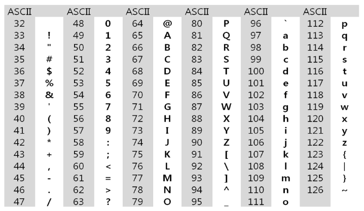
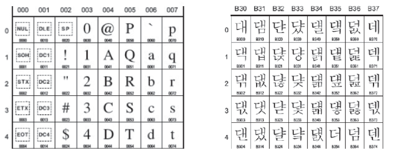
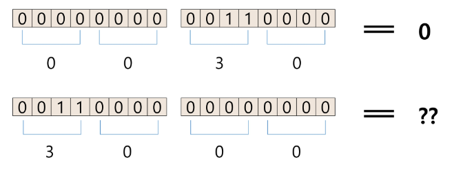
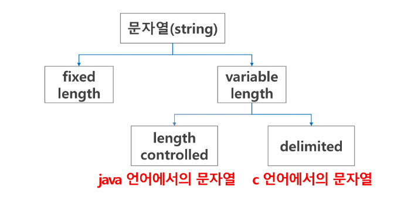

# 문자열(String)
## 문자의 표현
- 컴퓨터에서의 문자표현
    - 글자 A를 메모리에 저장하는 방법에 대해서 생각해보자
    - 물론 칼로 A라는 글자를 새기는 방식은 아닐 것임.
    - 메모리는 숫자만을 저장할 수 있기 때문에 A라는 글자의 모양 그대로 비트맵으로 저장하는 방법을 사용하지 않는 한(이 방법은 메모리 낭비가 심함) 각 문자에 대해서 대응되는 숫자를 정해 놓고 이것을 메모리에 저장하는 방법이 사용될 것임
    - 영어가 대소문자 합쳐서 52 이므로 6(64가지) 비트면 모두 표현할 수 있음
    - 이를 코드체계라고 함
- 그런데 네트워크가 발전되기 전 미국의 각 지역 별로 코드체계를 정해놓고 사용했음

### ASCII Code
- 네트워크(인터넷: 인터넷은 미국에서 발전함)이 발전하면서 서로간에 정보를 주고 받을 때 정보를 달리 해석한다는 문제가 생김
- 그래서 혼동을 피하기 위해 표준안을 만들기로 함
- 바로 이러한 목적으로 1967년, 미국에서 ASCII(American Standard Code for Information Interchange)라는 문자 인코딩 표준이 제정됨
- ASCII는 7bit 인코딩으로 128문자를 표현하며 33개의 출력 불가능한 제어 문자들과 공백을 비롯한 95개의 출력 가능한 문자들로 이루어져 있음
- 출력 가능한 ASCII 문자

- 확장 아스키는 표준 문자 이외의 악센트 문자, 도형 문자, 특수 문자, 특수 기호 등 부가적인 문자를 128개 추가할 수 있게 하는 부호임
    - 표준 아스키는 7bit를 사용하여 문자를 표현하는 데 비해 확장 아스키는 1Byte 내의 8-bit를 모두 사용함으로써 추가적인 문자를 표현할 수 있음
    - 컴퓨터 생산자와 소프트웨어 개발자가 여러가지 다양한 문자에 할당할 수 있도록 하고 있음
    - 이렇게 할당된 확장 부호는 표준 아스키와 같이 서로 다른 프로그램이나 컴퓨터 사이에 교환되지 못함
    - 그러므로 표준 아스키는 마이크로 컴퓨터 하드웨어 및 소프트웨어 사이에서 세계적으로 통용되는데 비해, 확장 아스키는 프로그램이나 컴퓨터 또는 프린터가 그것을 해독할 수 있도록 설계되어 있어야만 올바로 해독될 수 있음
- 오늘날 대부분의 컴퓨터는 문자를 읽고 쓰는데 ASCII 형식을 사용함

### UniCode
- 그런데 컴퓨터가 발전하면서 미국 뿐 아니라 각 나라에서도 컴퓨터가 발전했으며 각 국가들은 자국의 문자를 표현하기 위해 코드체계를 만들어 사용하게 되었음
    - 우리나라도 한글 코드체계를 만들어 사용했고 조합형, 완성형 두 종류를 가지고 있었음
- 인터넷이 전 세계로 발전하면서 ASCII를 만들었을 때의 문제와 같은 문제가 국가간에 정보를 주고 받을 때 발생했음
- 자국의 코드체계를 타 국가가 가지고 있지 않으면 정보를 잘못 해석 할 수 밖에 없음
- 그래서 다국어 처리를 위해 표준을 마련했고 이를 유니코드라 함
- 유니코드의 일부

- 유니코드도 다시 Character Set으로 분류됨
    - UCS-2 (Universal Character Set 2)
    - UCS-4 (Universal Character Set 4)
    - 유니코드를 저장하는 변수의 크기를 정의
    - 그러나, 바이트 순서에 대해서 표준화하지 못했음
    - 다시 말해 파일을 인식 시 이 파일이 UCS-2, UCS-4인지 인식하고 각 경우를 구분해서 모두 다르게 구현해야 하는 문제 발생
    - 그래서 유니 코드의 적당한 외부 인코딩이 필요하게 되었음
- bidg-endian, little-endian

- 유니코드 인코딩(UTF: Unicode Transformation Format)
    - UTF-8 (in web)
        - MIN: 8bit, MAX: 32bit (1 Byte * 4)
    - UTF-16 (in windows, java)
        - MIN: 16bit, MAX: 32bit (2 Byte * 2)
    - UTF-32 (in unix)
        - MIN: 32bit, MAX: 32bit (4 Byte * 1)
- Python 인코딩
    - 2.x 버전: ASCII -> #-*-coding: utf-8-*- (첫 줄에 명시)
    - 3.x 버전: 유니코드 UTF-8 -> 생략가능
    - 다른 인코딩 방식으로 처리 시 첫 줄에 작성하는 위 항목에 원하는 인코딩 방식을 지정해주면 됨

## 문자열

- java에서 String 클래스에 대한 메모리 배치 예
    - 그림에서 보이듯, java.lang.String 클래스에는 기본적인 객체 메타 데이터 외에도 네 가지 필드들이 포함되어 있는데, hash값(hash), 문자열의 길이(count), 문자열 데이터의 시작점(offset), 그리고 실제 문자열 배열에 대한 참조(value)임


### C언어에서 문자열 처리
- 문자열은 문자들의 배열 형태로 구현된 응용 자료형
- 문자 배열에 문자열을 저장할 때는 항상 마지막에 끝을 표시하는 널문자('\0')를 넣어줘야 함   
`char ary[] = {'a', 'b', 'c', '\0'}; // 또는 char ary[] = "abc"`
- 문자열 처리에 필요한 연산을 함수 형태로 제공함    
`strlen(), strcpy(), strcmp(), ...`

### 참고
- 다음 두 코드 차이 이해하기    
    `s1 = list(input()) s2 = input()`
- strlen() 함수 만들어 보기
    ```python
    def strlen(a):          # '\0'을 만나면 '\0'을 제외한 글자수를 리턴
        i = 0
        while a[i] != '\0'  # while을 써서 함수를 만들어보자
            i += 1
        return i
    a = ['a', 'b', 'c', '\0']
    print(strlen(a))
    ```

### Java(객체 지향 언어)에서의 문자열 처리
- 문자열 데이터를 저장, 처리해주는 클래스를 제공함
- String 클래스를 사용함    
`String str = "abc"; // 또는 String str = new String("abc")`
- 문자열 처리에 필요한 연산을 연산자, 메소드 형태로 제공함
    - +, length(), replace(), split(), substring(), ...
    - 보다 풍부한 연산을 제공함

### Python 에서의 문자열 처리
- char 타입 없음
- 텍스트 데이터의 취급 방법이 통일되어 있음
- 문자열 기호
    - '(홑따옴표), "(쌍따옴표), '''(홑따옴표 3개), """(쌍따옴표 3개)
    - +연결 (Concatenation)
        - 문자열 + 문자열: 이어 붙여주는 역할
    - *반복
        - 문자열 * 수: 수만큼 문자열이 반복
- 문자열은 시퀀스 자료형으로 분류되고, 시퀀스 자료형에서 사용할 수 있는 인덱싱, 슬라이싱 연산들을 사용할 수 있음
- 문자열 클래스에서 제공되는 메소드     
`replace(), split(), isalpha(), find()`
- 문자열은 튜플과 같이 요소값을 변경할 수 없음(immutable)

### C와 Java의 String 처리의 기본적인 차이점
- C는 아스키 코드로 저장함
- java는 유니코드(UTF-16, 2byte)로 저장함
- 파이썬은 유니코드(UTF-8)로 저장함

### 문자열 뒤집기
- 자기 문자열에서 뒤집는 방법이 있고 새로운 빈 문자열을 만들어 소스의 뒤에서부터 읽어서 타겟에 쓰는 방법이 있음
- 자기 문자열을 이용할 경우는 swap을 위한 임시 변수가 필요하며 반복 수행을 문자열 길이의 반만을 수행해야 함
- Python에서 문자열 뒤집기 연습문제
```python
s = 'Reverse this strings'
s = s[::-1]

s = 'abcd'
s = list(s)
s.reverse()
s = ''.join(s)
```

### 문자열 비교
- c strcmp() 함수를 제공함
- Java에서는 equals() 메소드를 제공함
    - 문자열 비교에서 == 연산은 메모리 참조가 같은지를 묻는 것
- 파이썬에서는 == 연산자와 is 연산자를 제공함
    - == 연산자는 내부적으로 특수 메서드 `__eq__()`를 호출
- s1과 나머지 문자열을 ==, is로 비교한 결과를 확인해보자
```python
s1 = 'abc'
s2 = 'abc'
s3 = 'def'
s4 = s1
s5 = s1[:2] + 'c'

print(s1 == s2)     # True
print(s1 is s2)     # True
print(s1 == s3)     # False
print(s1 is s3)     # False
print(s1 == s4)     # True
print(s1 is s4)     # True
print(s1 == s5)     # True
print(s1 is s5)     # False
```
- 다음 C코드를 참고해 문자열 비교함수를 만들어보자
    - 문자열이 같으면 0 리턴
    - str1이 str2보다 사전 순서상 앞서면 음수 혹은 -1 리턴
    - str1이 str2보다 사전 순서상 나중이면 양수 혹은 1 리턴
```C
int my_strcmp(const char *str1, const char *str2)
{
    int i = 0;
    while(str1[i] != '\0')
    {
        if(str1[i] != str2[i]) break;
        i++;
    }
    return (str1[i] - str2[i]);
}
```

### 문자열 숫자를 정수로 변환하기
- C 언어에서는 atoi() 함수를 제공함. 역함수로는 itoa()가 있음
- Java에서는 숫자 클래스의 parse 메소드를 제공함
    - 예: Integer,parseInt(String)
    - 역함수로는 toString() 메소드를 제공함
- 파이썬에서는 숫자와 문자변환 함수를 제공함
    - 예: int("123"), float("3.14"), str(123), repr(123)
- int()와 같은 atoi()함수 만들기
```python
def atoi(s):
    i = 0
    for x in s:
        i = i * 10 + ord(x) - ord('0')
    return i
s = '123'
a = atoi(s)
print(a + 1)
```